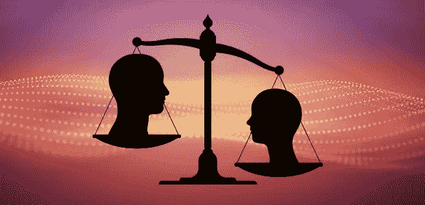
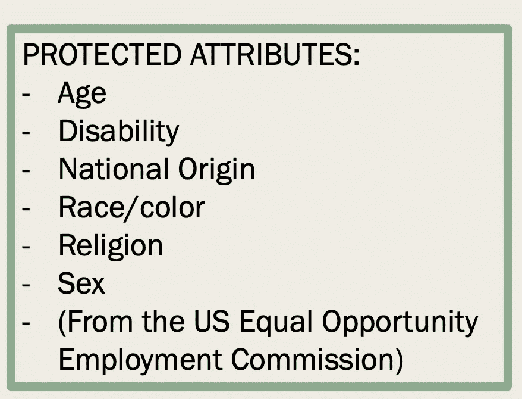
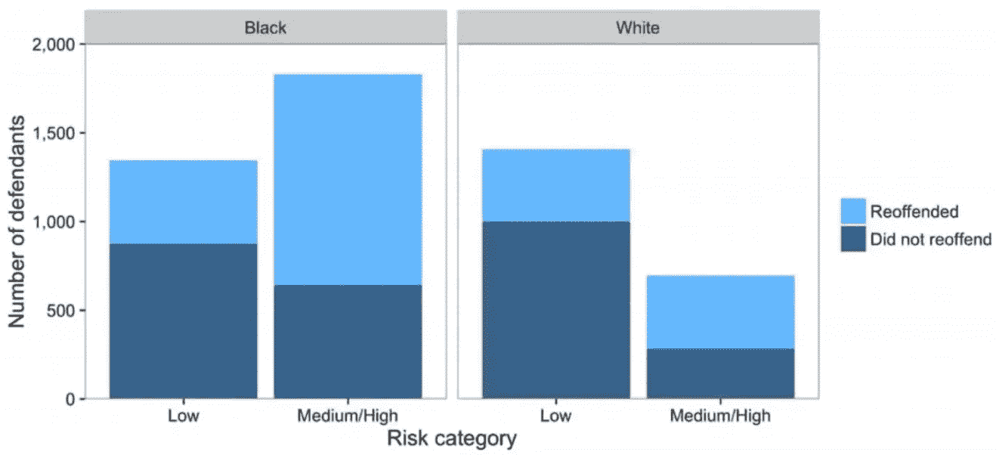

# 为机器学习处理数据中的歧视性偏差

> 原文：<https://towardsdatascience.com/machine-learning-and-discrimination-2ed1a8b01038?source=collection_archive---------6----------------------->

## 当数据告诉你是种族主义者时，你会怎么做？

“算法当然是种族主义的。它们是由人制造的。”——**斯蒂芬·布什，美国新政治家**

**机器学习中的伦理**

大多数时候，机器学习不会触及特别敏感的社会、道德或伦理问题。有人给了我们一个数据集，并要求我们根据给定的属性预测房价，将图片分为不同的类别，或者教计算机玩 PAC-MAN 的最佳方式——当我们被要求根据反歧视法预测受保护的属性时，我们该怎么办？

我们如何确保我们不会在我们的算法中嵌入种族主义、性别歧视或其他潜在的偏见，无论是明确的还是隐含的？

你可能不会感到惊讶，在美国有几起关于这个主题的重要诉讼，可能最著名的是涉及 Northpointe 有争议的 COMPAS——替代制裁的矫正罪犯管理概况——软件，该软件预测被告再次犯罪的风险。专有算法考虑了 137 项问卷调查的部分答案来预测这种风险。

2013 年 2 月，Eric Loomis 被发现驾驶一辆曾用于枪击的汽车。他被捕了，并承认躲避警察。在量刑时，法官不仅要看他的犯罪记录，还要看一个叫 COMPAS 的工具给出的分数。

COMPAS 是目前在美国使用的几种风险评估算法之一，用于预测暴力犯罪的热点，确定囚犯可能需要的监督类型，或者像 Loomis 的案件一样，提供可能对判决有用的信息。COMPAS 将他列为重新犯罪的高风险，卢米斯被判 6 年。

他对该裁决提出上诉，理由是法官在考虑一种算法的结果时，违反了正当程序，这种算法的内部工作是秘密的，不能被检查。上诉到了威斯康辛州最高法院，最高法院做出了不利于卢米斯的裁决，指出如果没有咨询过 COMPAS，判决将是一样的。然而，他们的裁决呼吁对算法的使用要谨慎和怀疑。

可以理解的是，这个案件在机器学习社区引起了轩然大波——我怀疑任何人都希望被算法评判，毕竟，你不能指责算法不道德，你能吗？

**争议愈演愈烈**

到目前为止，我们所讨论的是一个据称不公正的人，据称他受到了算法的严厉审判。然而，当我们快进到 2014 年时，这款软件背后的争议变得更加激烈。

在几个更有争议的结果被从算法中剔除并仔细检查后，它再次吸引了公众的目光。然后，美国司法部长埃里克·霍尔德警告说，风险评分可能会给法院带来偏见。他呼吁美国量刑委员会研究它们的使用。“虽然这些措施是出于最良好的意图，但我担心它们会无意中破坏我们确保个性化和平等司法的努力，”他说，并补充说，“它们可能会加剧毫无根据和不公正的差距，这些差距在我们的刑事司法系统和我们的社会中已经太常见了。”

然而，判决委员会并没有开展风险评分的研究。因此 **ProPublica** 做了，作为对算法在美国生活中强大的、很大程度上隐藏的影响的更大检查的一部分。

ProPublica 的研究得出了一些有趣的结论。该算法不仅荒谬地不准确(只有不到 20%的预测是正确的)，而且正如霍尔德所担心的那样，它还显示出明显的种族差异。在预测谁会再次犯罪时，该算法对黑人和白人被告犯错误的比率大致相同，但方式非常不同。

*   这个公式很有可能错误地将黑人被告标记为未来的罪犯，错误地将他们标记为未来罪犯的比率几乎是白人被告的两倍。
*   白人被告比黑人被告更容易被误贴上低风险的标签。

黑人被告仍有 77%的可能性被认定为未来暴力犯罪的高风险，45%的可能性被预测为未来会犯罪。

这听起来可能很糟糕，但这个故事并不像看上去那样简单。根据我们分析这一点的方式，我们可以发现该算法既是种族主义者又不是种族主义者，这取决于我们在我们的模型中定义‘平等’的方式。在本文的剩余部分，我将试图帮助我们理解这个模型实际上是以一种可接受的方式设计的，但是仍然会产生据称是种族主义的结果。

**歧视的类型**

我们首先需要定义算法中可能存在的歧视类型，以及我们在前面的例子中处理的是哪种歧视。有两种形式的歧视，我们称之为**不同的影响**和**不同的待遇**。

**不同的待遇—** 涉及以不允许的方式对某人进行分类。它涉及歧视的意图，通过明确提及群体成员资格得到证明。

**不同的影响—** 查看分类/决策对特定群体的影响。不需要意图，表面上是中性的。

不同的影响通常被称为无意的歧视，而不同的待遇是有意的。

最高法院认为，对特定群体产生不相称影响的做法，如果“基于合理的商业考虑”，就不会造成不同的影响。

当考虑以下任何受保护的属性时，可能会导致不同的处理或不同的影响。

所有这些属性都可以在我们的机器学习算法中用作特征，因此我们的算法有可能在这些属性的基础上进行区分。一些常见的例子是面部识别、惯犯(如前所述)和雇佣。我们能做些什么来帮助解决这个问题呢？

反对不同的待遇很容易。明显的歧视性偏见使得分类不太准确，所以没有很好的理由这样做。然而，当歧视被嵌入历史数据中时，情况又如何呢？或者这些属性是过去的社会不公正的结果，至今仍然存在？

**培训数据中的歧视性偏见**

当分类和决策基于不准确的信息时(例如，认为每个超过 7 英尺的人都是糟糕的保姆)，歧视会影响社会公益。这些想法经常被人类的偏见所延续，并嵌入到用于训练算法的数据中。

在这种情况下，机器学习算法不会减轻人类的偏见。事实上，它们在分类中被复制。为什么会这样？由 Northpointe 软件得出的累犯分数是基于以前的逮捕、第一次接触警察的年龄、父母的监禁记录。这些信息是由世界上的偏见(如文化价值观和民族主义)和更普遍的不公正(如种族偏见)形成的。

这种偏见也存在于侧重于文本数据的自然语言处理中。一个很好的例子是一篇题为“男人对于电脑程序员就像女人对于家庭主妇？去偏置词嵌入”，它显示了从软件的向量自动生成的类比，例如男人→计算机程序员，女人→家庭主妇。这些反映了原文中的性别歧视。

更一般地说，这些偏差来源通常来自:

*   过采样和欠采样
*   倾斜样本
*   功能选择/有限功能
*   代理/冗余编码
*   世界上的偏见和不公正

那么我们如何消除这些偏见呢？机器学习算法可以使歧视永久化，因为它们是在有偏见的数据上训练的。解决方案是识别或生成一个无偏的数据集，从中得出准确的概括。

**消除偏见**

种族、性别和社会经济阶层等特征决定了我们与某些执行任务的结果相关的其他特征。这些都是受保护的属性，但它们仍然与某些性能任务相关——而且这些性能任务是公认的社会商品。例如:

*   白人家庭的平均财富比黑人家庭的平均财富高七倍。
*   财富与你能否偿还贷款有关。
*   财富的差异是由历史和现实的不公平决定的。

机器学习本质上是历史的。为了有效打击歧视，我们需要改变这些模式。然而，机器学习强化了这些模式。因此，机器学习可能是问题的一部分。

*“即使历史是一条弯向正义的弧线，机器学习也不会弯曲。”*

那么，我们该何去何从呢？我们注定会有种族主义和性别歧视的算法吗？

即使当我们优化准确性时，机器学习算法也可能使歧视永久化，即使我们从一个无偏见的数据集工作，并且有一个考虑到社会公益的性能任务。我们还能做什么？

*   顺序学习
*   更多理论
*   因果建模
*   **优化公平性**

在所有这些方法中，为公平而优化似乎是最容易也是最好的方法。在下一节，我们将概述如何优化一个模型的公平性。

**优化公平性**

可以通过 4 种方式构建针对非歧视性进行优化的机器学习算法:

*   正式确定不歧视标准
*   人口均等
*   均等的赔率
*   校准良好的系统

我们将依次讨论这些问题。

**非歧视标准的形式化**实质上是其他 3 种方法所涉及的内容，它们是旨在将非歧视标准形式化的标准类型。然而，这个列表并不详尽，可能有更好的方法尚未被提出。

**人口统计均等**提出决策(目标变量)应该独立于受保护的属性——种族、性别等。与决定无关。

对于二元决策 Y 和受保护的属性 A:

P(Y=1 ∣ A=0) = P(Y=1∣A=1)

无论受保护的属性是(A=1)还是(A=0)，做出某些决策的概率(Y=1)应该是相同的。然而，人口统计的均等性排除了使用完美的预测值 C=Y，其中 C 是预测值，Y 是目标变量。

为了理解这种异议，请考虑下面的例子。假设我们想预测一个人是否会购买有机洗发水。某些群体的成员是否购买有机洗发水与他们是否属于该群体无关。但是，人口统计学上的均等将排除使用完美预测的可能性。所以也许这不是最好的程序，也许其他的会给我们一个更好的结果？

**均衡赔率**建议预测值和受保护属性应该是独立的，以结果为条件。对于预测值 R、结果 Y 和受保护的属性 A，其中三者都是二元变量:

P(R=1|A=0，Y=1) = P(R=1|A=1，Y=1)。

属性(无论是(A=1)还是(A=0))不应改变您对某个相关预测值(R=1)符合候选人的可能性的估计(P)。相反,(某些决策的)结果(Y=1)应该是。这种方法的一个优点是它与理想预测值 R=Y 兼容。

考虑下面这个案例，一个学生被耶鲁大学录取，假设他们是高中的毕业生代表。均等赔率假设知道学生是否是同性恋不会改变学生是否是毕业生代表的概率。

**预测 R** =你是否是高中毕业生代表(1)还是(0)

**结果 Y** =进耶鲁(1)或不进(0)

**属性 A** =同性恋(1)，异性恋(0)

P(R=1| A=0，Y=1) = P(R=1| A=1，Y=1)。

**校准良好的系统**认为结果和受保护的属性是独立的，取决于预测器。对于预测值 R、结果 Y 和受保护的属性 A，其中三者都是二元变量:

P(Y=1|A=0，R=1) = P(Y=1|A=1，R=1)

某个结果发生的概率(Y=1)应该不受某个受保护属性的影响(无论是(A=0)还是(A=1))，而是应该取决于相关的预测值(R=1)。这种表述的优势在于它没有群体意识——它让每个人都遵循同样的标准。

与我们之前的例子相比，知道学生是同性恋并不会改变学生是否被耶鲁大学录取的概率。均衡的赔率和校准良好的系统之间的区别是微妙的，但很重要。

事实上，这种差异是我们在开始时讨论的关于 COMPAS 软件的分歧的基础。

**那么康帕斯是种族主义者吗？**

均等的赔率和良好校准的系统是互不相容的标准。有时，在特定的经验环境下，我们无法让一个系统既能很好地校准，又能均衡胜算。让我们在 ProPublica 和 Northpointe 关于 COMPAS 是否对黑人被告有偏见的辩论的背景下看看这个事实。

Y =被告是否会再次犯罪

A =被告的种族

r = COMPAS 使用的累犯预测值

**Northpointe 的辩护:** COMPAS 校准良好，即，

P(Y=1|A=0，R=1) = P(Y=1|A=1，R=1)。

COMPAS 系统对被告做出大致相似的再犯预测，不管他们是什么种族。

**ProPublica 的反驳:** COMPAS 对黑人被告的假阳性率较高，对白人被告的假阴性率较高，即不满足均等赔率:

P(R=1|A=0，Y=1) ≠ P(R=1|A=1，Y=1)

Source: [Washington Post](https://www.washingtonpost.com/news/monkey-cage/wp/2016/10/17/can-an-algorithm-be-racist-ouranalysis-is-more-cautious-than-propublicas/?utm_term=.17f77de3ab45)

被告的种族对个人是否被列入低风险或中/高风险类别有影响。(A=0)或(A=1)是否对 COMPAS 已经识别出被告的一些累犯风险预测者将持有的概率(P(R=1))有影响，而不仅仅是被告是否会/不会再犯(Y=1)。

**为什么会这样？**

当某些经验事实成立时，我们拥有一个校准良好的、赔率均衡系统的能力就会崩溃。似乎产生问题的是我们之前讨论过的东西:不公正造成的背景事实。例如，由于更严格的警察审查，再次犯罪的被抓率更高。

很难弄清楚什么时候应该适用某些公平标准。如果某个标准不是以其他标准为代价的，那么当你不确定的时候，你就不会那么担心应用某个标准。但是，由于情况并非如此，我们需要理解未能满足某些标准的影响。

那么我们讨论的标准中哪一个是最好的选择呢？所有这些方法都有很好的特性，但是都有缺点。

那现在怎么办？

我们不能在一个小角落里分割公平，而不努力改变世界上的不公正和机器学习系统之外发生的歧视。这并不意味着我们不能做任何事情！我们必须在某些领域设定一些公平标准，同时努力改变基本利率。

尽管有一些争议和不受欢迎，COMPAS 软件继续使用到今天。开发算法的人不想因为不知不觉地开发了种族主义算法而被指控或监禁，但必须选择一些标准来预测 COMPAS 试图解决的情况。

它可能是一个算法，也可能不完美，但它是一个开始，一个人必须从某个地方开始。

**机器学习能帮助减少歧视吗？**

机器学习是一个非常强大的工具。随着人类开始从人文主义者的角度向数据主义者的角度转变，这一点变得越来越明显——我们开始相信算法和数据，而不是人或我们自己的想法(有些人开车进入湖泊，因为他们的 GPS 也告诉他们！).这使得我们努力使算法尽可能不偏不倚变得极其重要，这样它们就不会在不知不觉中延续历史数据中蕴含的社会不公正。然而，使用算法来建立一个更加公正和平等的社会也有巨大的潜力。一个很好的例子是在招聘过程中。

假设你正在申请你梦想中的工作，并且正处于面试的最后阶段。招聘经理有权决定你是否被录用。你想要一个公正的算法来决定你是否是这份工作的最佳人选吗？

如果你知道招聘经理是种族主义者，你还会喜欢这样吗？还是性别歧视？

也许招聘经理是一个非常中立的人，纯粹是根据优点来选择工作，然而，每个人都有自己的倾向和潜在的认知偏见，这可能使他们更有可能选择他们最喜欢的候选人，而不是最适合这份工作的人。

如果可以开发出无偏见的算法，招聘过程可能会变得更快、更便宜，他们的数据可能会让招聘人员找到更高技能的人，这些人更适合他们的公司。另一个潜在的结果是:更加多样化的工作场所。该软件依靠数据从各种各样的地方筛选候选人，并将他们的技能与工作要求相匹配，不受人为偏见的影响。

这可能不是完美的解决方案，事实上，当涉及到正义时，很少有完美的答案。然而，历史的弧线似乎倾向于正义，所以也许这将使正义向前迈进一步。

另一个很好的例子是自动贷款承销。与传统的人工承销相比，自动承销更准确地预测某人是否会拖欠贷款，其更高的准确性导致更高的借款人批准率，特别是对于服务不足的申请人。其结果是，有时机器学习算法在进行最准确的分类方面比我们做得更好，有时这可以打击招聘和信贷审批等领域的歧视。

**精神食粮**

在结束这篇又长又严肃的文章时，我给你留下了谷歌关于机器学习中歧视的一句话供你思考。

“为机会均等而优化只是可以用来改善机器学习系统的众多工具之一——而数学本身不太可能带来最佳解决方案。打击机器学习中的歧视最终需要一种谨慎的多学科方法。”——[*谷歌*](https://research.google.com/bigpicture/attacking-discrimination-in-ml/)

## 时事通讯

关于新博客文章和额外内容的更新，请注册我的时事通讯。

 [## 时事通讯订阅

### 丰富您的学术之旅，加入一个由科学家，研究人员和行业专业人士组成的社区，以获得…

mailchi.mp](https://mailchi.mp/6304809e49e7/matthew-stewart) 

# **参考文献**

[1]奥尼尔，凯茜。数学毁灭武器:大数据如何增加不平等并威胁民主。皇冠，2016。

[2]加维，克莱尔；弗兰克，乔纳森。面部识别软件可能存在种族偏见问题。大西洋，2016。

[3] [托尔加·博卢克巴斯](https://arxiv.org/search/cs?searchtype=author&query=Bolukbasi%2C+T)，[张凯威](https://arxiv.org/search/cs?searchtype=author&query=Chang%2C+K)，[詹姆斯·邹](https://arxiv.org/search/cs?searchtype=author&query=Zou%2C+J)，[文卡特什·萨利格拉玛](https://arxiv.org/search/cs?searchtype=author&query=Saligrama%2C+V)，[亚当·卡莱](https://arxiv.org/search/cs?searchtype=author&query=Kalai%2C+A)。男人对于电脑程序员就像女人对于家庭主妇一样？去偏置词嵌入。Arxiv，2016。

[4] CS181:机器学习。哈佛大学，2019。