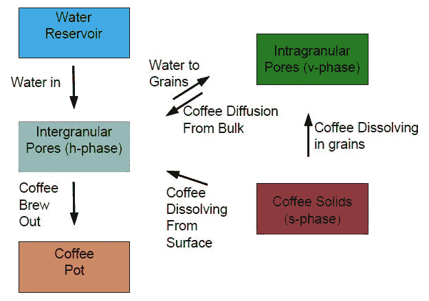
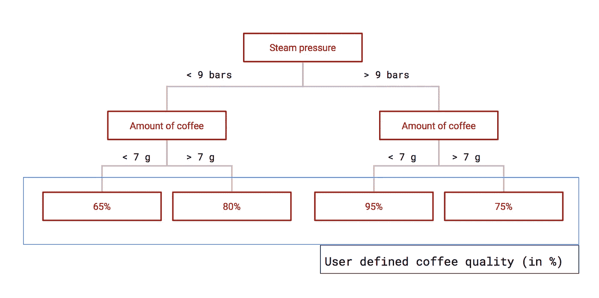
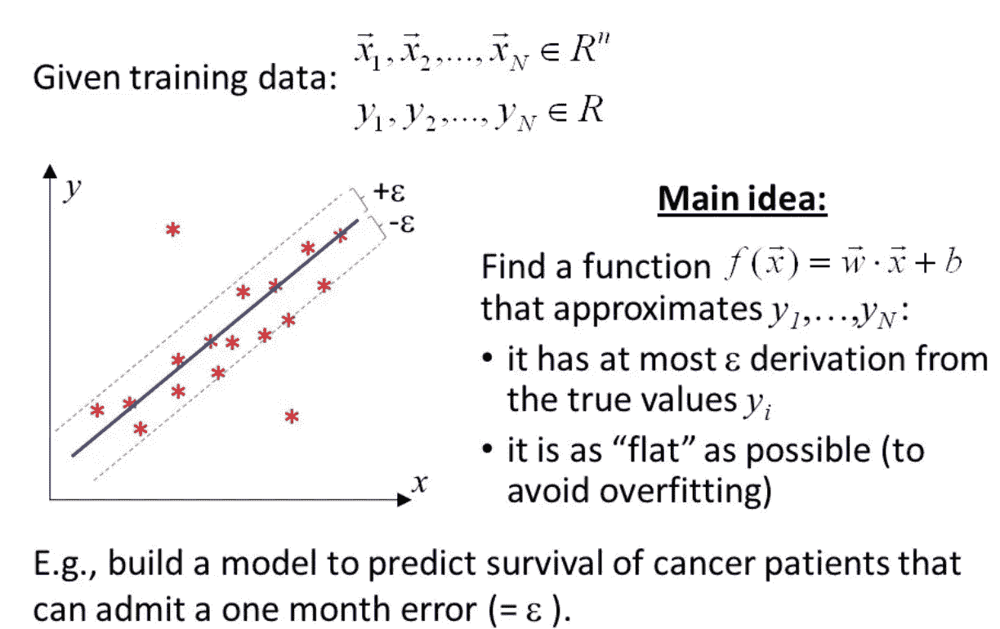
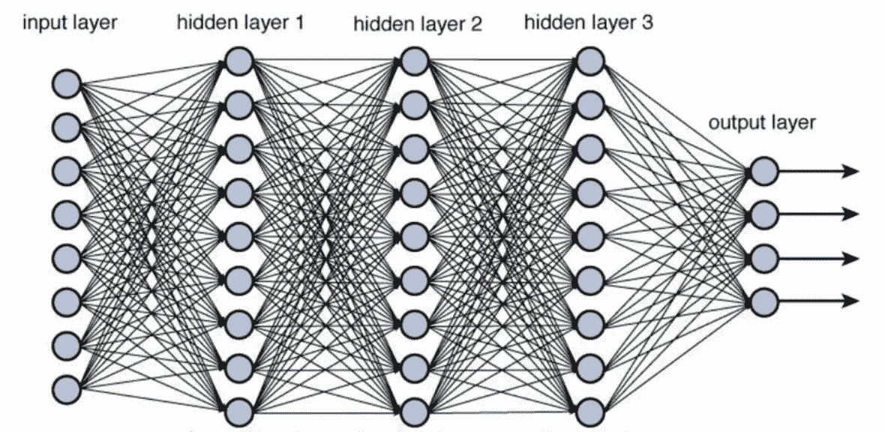

# 机器学习及其范围——核心工程师，一杯咖啡

> 原文：<https://towardsdatascience.com/machine-learning-and-its-scope-for-core-engineers-with-a-cup-of-coffee-10e7482856f9?source=collection_archive---------22----------------------->

机器学习(ML)的字面定义是机器采用的基于信息/数据的学习，以允许在特定任务中做出决策。另一方面，人工智能(AI)是基于信息/数据的智能，由机器“开发”以允许在复杂任务中做出决策。因此，人工智能是一个更广泛的术语，也包括机器学习的概念。

给定这些定义，让我们探索 ML/AI 在处理真实物理、化学或生物系统的核心工程领域中的相关性。机器学习或人工智能在这里如何应用？在当今世界，ML/AI 几乎是机器人、图像识别和自动驾驶汽车等应用的同义词。因此，这些*本质上是*基于数据的计算方法的相关性在核心行业中没有被清晰地感知。

> 因此，我的目标是在这里创建一个介绍性的阅读材料，为*传统*技术领域的专业人士描绘出这个快速发展领域的清晰画面。

Coffee brewing

为了更好地理解上下文，让我们围绕一个实际的小型物理系统来进行讨论，比如说咖啡酿造！咖啡酿造是一个受欢迎的实验系统。给定一种咖啡颗粒，不同的冲泡方式会产生不同的咖啡。例如，用浓缩咖啡机煮的咖啡味道浓郁，还带有一层“克莉玛”层。另一方面，滴滤咖啡口味更广，咖啡因含量更高。这两种冲泡方法在几个方面有所不同——从所用咖啡的研磨尺寸，到水温，提取时间和浸出咖啡所用的力的类型。因此，为了确定由动态调制系统生产的咖啡的质量，理解这些输入变量中的每一个的相关性和影响是重要的。

为了系统地计算这些变量对酿造质量的影响，首先，我们需要评估、量化和汇总最终咖啡的产出概况(基于其质地、咖啡因/酸/油/涩味含量、甜度等)。)输入变量和定义的输出变量之间的关系可以通过应用基本的热量、质量和动量平衡来导出。通过转换所得的微分方程，可以为输出变量生成解析或稳定的数值解。

虽然这看起来很简单，但是从基本原则出发全面定义模型是很有挑战性的。即使做到了这一点，也很难确定模型中各种参数的值，如质量/传热率系数等。

[Mass transfer processes involved in coffee brewing](https://phys.org/news/2016-11-mathematics-coffee-ideal-brew.html)

> 简而言之，生成一个纯粹的“白盒”模型是非常具有挑战性的，并且计算工作通常不能保证得到想要的结果。或者，可以映射输入和输出变量之间的数据驱动关系。

这就把我们带到了应用机器学习来解决同样的问题。假设建立了一组设计良好的实验，以针对各种输入变量组合(即不同的冲泡条件)生成咖啡质量数据。线性回归在捕捉潜在关系方面可能不够有效，导致模型可能存在较大偏差。这意味着它们没有用，并且会在未知/推断的酿造条件下导致不准确的预测。另一方面，机器学习提供了一套可以有效捕捉这些非线性关系的模型。例如，有决策树、随机森林、Adaboost 或梯度推进回归器、支持向量回归器等。

A map of machine learning techniques for different types of datasets

现在，机器学习算法表现更好的原因是，与传统的回归技术不同，数据不是在预定的模型结构(即，线性、多项式、指数等)上训练的。)结果，在确定非线性关系时有更大的自由度。例如，下图描述了决策树回归器如何为我们的咖啡冲泡示例工作。可以看出，咖啡质量是通过从输入变量中生成一个树形结构来回归的，每个输入变量在不同层次上起作用。

Decision tree regression

然而，这些模型通常可能过拟合，这意味着它完美地拟合/解释了训练数据，但不能预测类似容量的未知测试数据集。为了减轻过度拟合，有几种策略可用。例如，在支持向量回归(SVR)模型中，当模型回归输入和输出变量之间的关系时，允许有误差幅度(见下图)。特别地，支持向量回归机采用了一种核技巧，允许将输入特征空间转换到一个更高维的非线性空间，从而以非常少的计算需求实现非线性回归。(参见[https://towards data science . com/understanding-the-kernel-trick-e0bc 6112 ef 78](/understanding-the-kernel-trick-e0bc6112ef78))

Support Vector Regression

决策树、SVR 等机器学习算法通常用形容词“经典”来指代，因为与用神经网络构建的一套深度学习模型相比，它们在某种意义上本质上不那么黑箱化。让我们试着理解这一点。首先，神经网络可以被视为强大的数学工具，它可以通过由非线性函数转换的输入特征的线性组合的堆叠来实现分类/预测输出。模型然后学习特定任务的方式是通过损失函数的反向传播(即，真实值和模型生成的预测之间的观察差异的函数)。因此，既没有决策树中的决策规则层次，也没有 SVR 中的预先指定的核。神经网络在其操作中是真正的黑箱。此外，与经典的机器学习算法不同，深度学习模型中几个层的堆叠使得对最终输出的特征影响的洞察最小。考虑到我们的咖啡酿造示例，这意味着尽管实现了出色的预测能力，深度学习的咖啡酿造模型无法精确确定蒸汽压力对最终咖啡甜度的贡献大小——另一方面，决策树或(线性)SVR 为我们提供了这一信息。

Deep neural networks

> 然而，深度学习模型的范围是巨大的，它的应用一次又一次地在各种领域取得成功。

这种成功超出了人们会立即联想到的机器人领域。例如，深度学习模型适用于石油和天然气以及石化行业，在这些行业中，运营工厂继续定期收集大量数据储备。制药公司或生命科学实验室通常需要处理大量的实验/试验，以获得重要成果，如药物发现。在这种情况下，机器学习为从这些已经生成的数据集转移知识提供了巨大的空间。然而，另一个可以从机器学习中受益匪浅的领域是金融——在这个领域，人们不断有动力从各种数据源中挖掘越来越多的信息。制造业、农业、矿业、替代能源，可以从机器学习中受益的行业不胜枚举。

*   刘，易，等.**集成深度核学习及其在工业聚合过程质量预测中的应用***化学计量学和智能实验室系统*174(2018):15–21。
*   赵、杨、、乐安。"**一种用于原油价格预测的深度学习集成方法**"*能源经济学*66(2017):9–16。
*   Chong，Eunsuk，Chulwoo Han 和 Frank C. Park。股票市场分析和预测的深度学习网络:方法论、数据表示和案例研究*专家系统与应用*83(2017):187–205。
*   Acharya，U. Rajendra 等.**使用 ECG 信号自动检测心肌梗死的深度卷积神经网络应用***信息科学*415(2017):190–198。

总而言之，任何一种技术专长通常都是通过观察、学习和经验获得的。在许多方面，这类似于 ML/AI 模型从显示给它的数据中获得的学习。因此，在这个先进计算资源的时代，在数据丰富的环境中茁壮成长的专业人士有必要认识到机器学习的潜力，并将其识别为一系列可以帮助他们业务的复杂技术。

> 正如他们所说，数据是新的石油！如果经过适当的训练，机器学习模型的发展潜力是无限的！