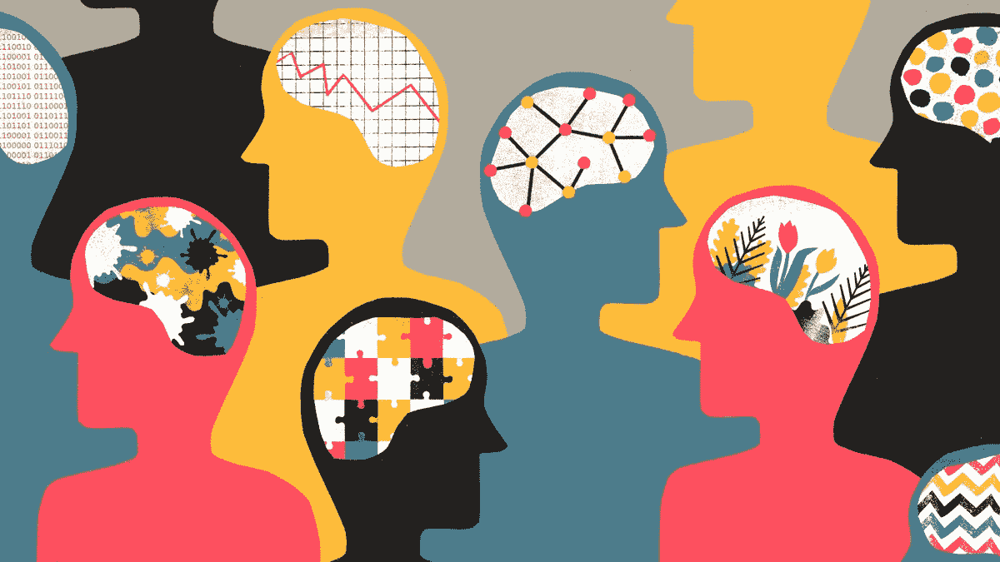
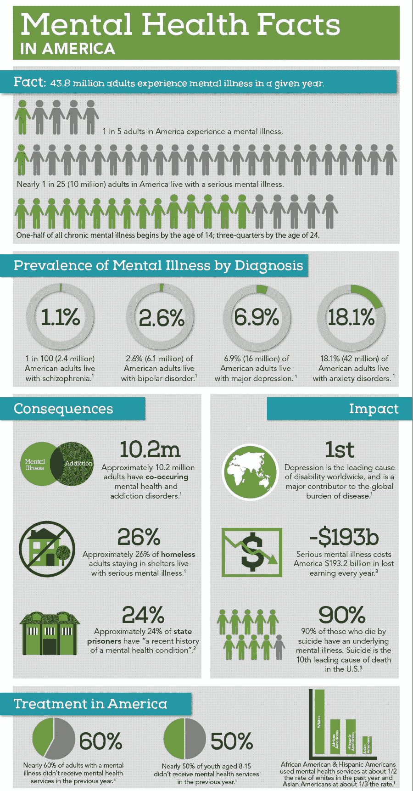

# 机器学习和心理健康

> 原文：<https://towardsdatascience.com/machine-learning-and-mental-health-7981a6001bd5?source=collection_archive---------8----------------------->

## 大数据能否帮助心理健康领域？

[Canadian Mental Health Association](https://cariboo.cmha.bc.ca/your-mental-health/)

> “根据美国焦虑和抑郁协会的数据，焦虑症是美国最常见的精神疾病。它们每年影响**4000 万成年人**，占总人口的 18.1%。此外，焦虑症影响着 25.1%的 13 至 18 岁儿童，使他们面临更高的风险，在学校表现不佳，滥用药物，并错过重要的社会经历。尽管这种疾病是高度可治疗的，**只有 36.9%的患者接受治疗**，很可能是由于一种可感知的**社会污名**，男性寻求治疗的可能性远低于女性**。**

我一生中做的最好的决定之一是在我大学的最后一年决定去看心理健康专家。那是一段充满压力的时光，也是我人生中重大转变的时刻。过渡期和巨大变化的时刻是我们许多人可能会发现自己在应对焦虑和压力的时候。当我看到许多朋友正在经历类似的人生转变时，我鼓励他们也这样做。

话虽如此，我认为重要的是要强调，心理健康维护的整个范围不仅仅是*看心理健康专业人士的要求，而是 ***创造一个自我检查的例行程序******正确维护我们的心理状态*** 。(但是看心理健康专家仍然是一种有益健康的体验，不需要被诊断出特定的状况。我还是强烈推荐。)*

作为一名对心理健康领域充满热情的数据科学学生，看到这两个领域的交叉让我兴奋不已。改变心理健康领域的一个非常酷的概念是机器学习。

# 机器学习和心理健康

[Harvard Business Review](https://hbr.org/2018/10/ais-potential-to-diagnose-and-treat-mental-illness)

世界各地的神经科学家和临床医生正在使用**机器学习**来为患者制定**治疗计划** ，并在开始之前识别一些精神健康障碍的关键标志*。其中一个好处是，机器学习有助于临床医生预测谁可能面临特定疾病的风险。*

有这么多可用的数据，我们现在能够为心理健康专业人员汇编数据，以便他们可以更好地完成工作。让机器学习在今天如此有用的是，在过去，对诊断的理解是基于**组平均值**和**对人口**的统计。机器学习让临床医生有机会**个性化**。

> “机器学习确实满足了我们在精神病学中的一种特定需求，这就是个性化的 T2 需求，”他说。“几十年来，我们一直在研究适用于可能患有相同诊断的人群的群体平均值和统计数据，但这些数据并不能很好地应用于个体患者。**机器学习让我们能够以一种前所未有的方式进行个体预测。**”—大卫·本里莫，医学博士，医学博士，麦吉尔大学[的精神病学住院医师](https://www.mcgill.ca/)

机器学习正在以两种关键方式帮助改变心理健康的面貌:

1.  **识别生物标志物/制定治疗计划**
2.  **预测危机**

## 识别生物标记和制定治疗计划

今天，当患者被诊断为精神疾病时，有一个**试错过程**来实现正确的药物剂量和采用正确的治疗方案。这种反复试验的过程是不应该发生的，但事实是，每一个精神健康疾病如抑郁症患者的症状都是不一样的。**一个患者的症状会与下一个患者不同。**

生物标记的一个例子是作为冠心病生物标记的血液胆固醇。就像人体有**身体生物标记一样，**它也有**行为生物标记**对**抑郁和焦虑等状况。**

机器学习算法可以帮助确定关键的行为生物标记，以帮助心理健康专业人员决定患者是否有患特定心理健康疾病的风险。此外，该算法可以帮助跟踪治疗计划的有效性。

> Benrimoh 说:“这些算法可以识别出一些模式，这些模式可以帮助我们在我们目前所做的事情之外，根据标记对患者进行聚类——根据严重程度或特定症状进行聚类。”。通过观察这些不同的模式，以及谁对什么样的治疗有反应，我们可以更好地确定不同疾病的相关亚型，以及哪种治疗方法对它们最有效

归根结底，每个病人对压力和抑郁等情况都有自己的生理、触发因素和反应。精神健康障碍的许多症状是重叠的，尽管精神健康障碍的一些关键指标是已知的，但试错治疗计划是不可接受的。机器学习算法为精神病学家和心理健康专业人士提供了一个成熟的机会，来识别不同疾病的子类型，并制定更适合的治疗计划和药物剂量。

## 预测危机

让我们暂时把所有的科学和数据收集放在一边。重要的是要明白，患有某些疾病的人更容易出现恐慌症、精神病、躁狂状态、偏头痛等危机。

对于已经被诊断患有精神健康疾病的患者，他们的状况受到监测，以帮助他们过日常生活。但是某些疾病，如精神分裂症和双相情感障碍，发生危机的风险更高。心理健康专家负责将患者的危机风险降至最低。

**我们如何帮助心理健康专家预测危机？**

机器学习算法可以结合自己提供的数据以及来自智能手机/社交媒体的被动数据，来确定患者是否即将发病。有一些关键的指标可以表明一个事件是否即将发生。如果我们能够发现压力、孤立或暴露于触发因素的模式，这些危机是可以预测的。

事实上，我自己最近也经历了一次偏头痛。我睡得很少，不知道发生了什么。在我意识到之前，我失去了平衡，倒在了地铁站台的地板上，试图喘口气，明白发生了什么。我以前从未患过偏头痛，所以当发作时，我感到困惑和害怕。当我和一位医生谈到这一事件以及我生活中发生的事情时，我清楚地意识到，我最近经历的压力和不健康的模式已经在身体上体现在这一事件中。

这个故事的要点是，有明确的迹象表明，一场危机或事件即将发生。这适用于任何人，无论是否有诊断结果。我们都有特定的诱因和应对机制。危机将不可避免地发生。我们能做些什么来帮助精神卫生领域预防这些危机？我相信分析病人模式的治疗计划，在疾病发作前帮助他们，会非常有效。

# 人工智能

在我的研究中，我发现人工智能是如何被用来解决美国目前的精神健康危机的。现实是，许多人在与精神病医生或治疗师交谈时感到尴尬和不舒服，因为他们不知道自己的弱点。有一些团队和公司正在致力于开发人工智能，这些人工智能可以为那些可能正在处理成瘾、心理健康状况或生活中任何压力/触发事件的个人提供服务并与之互动。

尽管人工智能正在“取代”心理健康领域的专业人士，这看起来有些不寻常或可怕，但结果是显而易见的。

Woebot

心理健康专家使用的关键技术之一是认知行为疗法，通过几次谈话来改变病人的消极思维模式。2017 年，斯坦福大学的临床心理学家开发了一款名为 Woebot 的聊天机器人，使用与 40 年前治疗师使用的技术相同的数字版本来治疗学生的抑郁和焦虑:认知行为治疗。

> 在一项针对患有抑郁症的大学生的研究中，根据 PHQ-9 分数——一种常见的抑郁症衡量标准——那些使用 Woebot 的人在短短两周内经历了近 20%的改善。Woebot 在研究小组中取得成功的一个原因是参与者的高度参与。在每月 39 美元的低廉费用下，**大多数人几乎每天都与机器人交谈——这种参与程度是面对面咨询所无法达到的。**

人工智能被用来直接治疗精神健康状况是一个相对较新的应用，我认为需要更多的研究来确定它的应用范围有多广。

如果你有兴趣更多地了解一些在精神健康领域使用[机器学习和人工智能取得进展的公司](https://www.nanalyze.com/2019/03/artificial-intelligence-mental-health/)，这里有一些。单击嵌入链接了解更多信息。

# 就个人而言

在美国和全球都有心理健康流行病。尽管存在流行病，心理健康仍然是许多社区的禁忌话题。最重要的是，可能由于精神卫生保健的禁忌性质，没有足够的途径获得精神卫生资源。

亨利·j·凯泽家族基金会提供了美国医疗专业人员短缺地区的信息。

> 近 40%的美国人生活在联邦政府指定的精神健康专业人员短缺的地区；超过 60%的美国县没有一个精神病医生。那些足够幸运地生活在有足够的心理健康服务的地区的人通常负担不起，因为许多治疗师不接受保险。

此外，除了获得精神卫生保健已经存在的困难之外，代表性不足的社区和少数群体社区获得这种服务更加困难。这与经济限制和缺乏关于心理健康重要性的教育有关，也是这个话题最大的禁忌。

数据科学/机器学习是一个很好的工具，可以帮助现有的临床医生、精神病医生和治疗师帮助他们的患者。有人试图通过技术进步来应对这种流行病，这很好。但老实说，这还不够。我们应该像讨论身体健康一样，坦然地谈论心理健康。现在比以往任何时候都更重要的是，我们在使这种讨论正常化方面取得进展。

> 近五分之一的美国成年人[患有某种精神疾病。自杀率创历史新高，每天有 115 人死于阿片类药物滥用，八分之一的 12 岁以上的美国人每天服用抗抑郁药。仅抑郁症一项的经济负担就估计每年至少有 2100 亿美元…](https://www.nimh.nih.gov/health/statistics/mental-illness.shtml)

**National Alliance on Mental Health**

# 来源

[https://www . managedhealthcareexecutive . com/mental-health/how-machine-learning-changing-mental-health](https://www.managedhealthcareexecutive.com/mental-health/how-machine-learning-changing-mental-health)

 [## 精神健康中的机器学习:方法和应用的范围审查。

### 背景:本文旨在综合文献的机器学习(ML)和大数据应用的心理…

www.ncbi.nlm.nih.gov](https://www.ncbi.nlm.nih.gov/pubmed/30744717)  [## 顶级心理健康科技初创公司——波士顿医疗科技公司

### 根据美国焦虑和抑郁协会，焦虑症是最常见的精神疾病…

medtechboston.medstro.com](https://medtechboston.medstro.com/blog/2018/05/14/the-top-mental-health-tech-startups/)  [## 利用数据科学帮助解决心理健康问题

### 相对于医学的其他领域，数据科学在精神健康领域的应用是有限的，但是…

www.discoverdatascience.org](https://www.discoverdatascience.org/social-good/mental-health/)  [## 精神卫生保健专业人员短缺地区

### 凯泽家庭基金会网站提供了关于关键健康政策问题的深入信息，包括医疗补助…

www.kff.org](https://www.kff.org/other/state-indicator/mental-health-care-health-professional-shortage-areas-hpsas/?currentTimeframe=0&sortModel=%7B%22colId%22:%22Location%22,%22sort%22:%22asc%22%7D)  [## 人工智能诊断和治疗精神疾病的潜力

### 美国面临着精神健康流行病。近五分之一的美国成年人患有…

hbr.org](https://hbr.org/2018/10/ais-potential-to-diagnose-and-treat-mental-illness)  [## 人工智能在精神健康领域的惊人应用

### 由于缺乏心理健康专业人员，由于缺乏途径或费用高昂而不寻求治疗的个人…

www.forbes.com](https://www.forbes.com/sites/bernardmarr/2019/05/03/the-incredible-ways-artificial-intelligence-is-now-used-in-mental-health/#5c8bb690d02e)