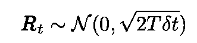
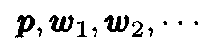

# 机器学习和液体中的粒子运动:一个优雅的链接

> 原文：<https://towardsdatascience.com/machine-learning-and-particle-motion-in-liquids-an-elegant-link-4e7c1611c945?source=collection_archive---------13----------------------->


Image by [rony michaud](https://pixabay.com/fr/users/ronymichaud-647623/?utm_source=link-attribution&utm_medium=referral&utm_campaign=image&utm_content=578897) from [Pixabay](https://pixabay.com/fr/?utm_source=link-attribution&utm_medium=referral&utm_campaign=image&utm_content=578897).

## 作为全局最小化算法的朗之万方程

[梯度下降算法](https://en.wikipedia.org/wiki/Gradient_descent)是机器学习中最流行的优化技术之一。它有三种风格:批量或“普通”梯度下降(GD)、随机梯度下降(SGD)和小批量梯度下降[不同之处在于用于计算每次迭代损失函数梯度的数据量](https://arxiv.org/pdf/1609.04747.pdf)。

本文的目标是描述基于[朗之万动力学](https://en.wikipedia.org/wiki/Langevin_dynamics) (LD)的全局优化器的研究进展，朗之万动力学是一种分子运动的建模方法，它起源于[阿尔伯特·爱因斯坦](https://en.wikipedia.org/wiki/Albert_Einstein)和[保罗·朗之万](https://en.wikipedia.org/wiki/Paul_Langevin)在 20 世纪早期关于统计力学的工作。

我将从[理论物理](https://books.google.com.br/books/about/Nonequilibrium_Statistical_Mechanics.html?id=4cI5136OdoMC&redir_esc=y)的角度提供一个[优雅的解释](https://core.ac.uk/download/pdf/4380833.pdf)，解释为什么梯度下降的变体是高效的全局优化器。

# 奇迹之年

没有迹象表明一场革命即将发生。1904 年，如果阿尔伯特·爱因斯坦放弃了物理学，他的科学家同事们可能都不会注意到。幸运的是，这并没有发生。1905 年，这位年轻的专利办事员发表了四篇革新科学的论文。

[](https://en.wikipedia.org/wiki/Annus_Mirabilis_papers)

Albert Einstein circa 1905, his miracle year ([source](https://en.wikipedia.org/wiki/Annus_Mirabilis_papers)).

# 流体中的随机运动

在其中一篇论文中[，爱因斯坦推导出了所谓的](https://en.wikipedia.org/wiki/%C3%9Cber_die_von_der_molekularkinetischen_Theorie_der_W%C3%A4rme_geforderte_Bewegung_von_in_ruhenden_Fl%C3%BCssigkeiten_suspendierten_Teilchen)[布朗运动](https://en.wikipedia.org/wiki/Brownian_motion)的模型，这是液体中悬浮粒子与更小、快速移动的分子(例如在水中移动的[花粉粒)碰撞引起的随机运动。](https://en.wikipedia.org/wiki/Robert_Brown_(botanist,_born_1773))

[](https://en.wikipedia.org/wiki/Brownian_motion)

Brownian motion: dust particle colliding with gas molecules ([source](https://en.wikipedia.org/wiki/Brownian_motion)).

在这篇论文中，他单枪匹马地证实了原子和分子的存在，从而诞生了一个名为[分子动力学](https://en.wikipedia.org/wiki/Molecular_dynamics)的物理学新分支，并创建了一个名为[随机微积分](https://en.wikipedia.org/wiki/Stochastic_calculus)的全新应用数学领域。

# 朗之万动力学

1908 年，在爱因斯坦发表他的里程碑式的论文三年后，法国物理学家保罗·朗之万发表了另一篇开创性的文章，他在文章中推广了爱因斯坦的理论并发展了一个描述布朗运动的新的微分方程，今天被称为朗之万方程


其中 ***x*** 是运动粒子的位置， *m* 是其质量， ***R*** 代表与流体中更小的快速运动分子碰撞产生的(随机)力(见上面的动画)，而 ***F*** 代表任何其他外力。随机力 ***R*** 是增量相关平稳[高斯过程](https://en.wikipedia.org/wiki/Langevin_dynamics)，其均值和方差如下:



**R** is a normal process.

术语“增量相关”意味着在两个不同时间的力具有零相关性。LE 是第一个描述热力学不平衡的数学方程。

[](https://en.wikipedia.org/wiki/Paul_Langevin)

The French physicist Paul Langevin ([source](https://en.wikipedia.org/wiki/Paul_Langevin)).

如果粒子的质量足够小，我们可以把左边设为零。此外，我们可以将一个([保守](https://en.wikipedia.org/wiki/Conservative_force))力表示为某个势能的导数。我们获得:


Langevin equation for small masses.

现在，写作


其中 *δt* 是一个小的时间间隔，移动项，我们得到小质量粒子的离散化的[朗之万方程](https://en.wikipedia.org/wiki/Langevin_equation):


Discretized Langevin equation for particles with small inertia.

用这种方式表达，朗之万方程描述了布朗运动中粒子的位移增量。

## 一小段插曲:布朗运动的 Python 代码

布朗运动的 Python 实现可以在[这里](https://cyrille.rossant.net/ipython-cookbook-second-edition/)找到。为了模拟 2D 离散布朗过程，使用了两个 1D 过程。代码的步骤是:

*   首先，选择时间步长的数量`steps`。
*   坐标`x`和`y`是随机跳跃的累积和(函数`np.cumsum()`用于计算它们)
*   使用`np.interp()`通过插值计算中间点`X`和`Y`
*   然后使用`plot()`功能绘制运动

代码是:

```
import numpy as np
import matplotlib.pyplot as plt
%matplotlib inlinesteps = 5000
random.seed(42)
x,y = np.cumsum(np.random.randn(steps)), np.cumsum(np.random.randn(steps))points = 10
ip = lambda x, steps, points: np.interp(np.arange(steps*points), 
                                        np.arange(steps)*points, 
                                        x)
X, Y = ip(x, steps, points), ip(y, steps, points)fig, ax = plt.subplots(1, 1, figsize=(10, 10))
ax.set_title('Brownian Motion')
ax.set_xlabel('x')
ax.set_ylabel('y')
ax.plot(X, Y, color='blue',
        marker='o',  markersize=1)
```


Illustration of Brownian motion ([source](https://github.com/ipython-books/cookbook-2nd/blob/master/chapter13_stochastic/03_brownian.md)).

## 朗之万动力学和全局极小值

朗之万动力学的一个[重要性质](https://pdfs.semanticscholar.org/e86f/414f860a1a70e16d9718c887f4eb59a51f62.pdf)是随机过程*【其中***x*****的扩散分布*p*(***x***)服从上面给出的朗之万方程***

**[](https://en.wikipedia.org/wiki/Boltzmann_distribution)

Boltzmann distribution.** 

**其集中在势能 *E* ( ***x*** )的**全局最小值**(从其泛函形式中我们不难看出，BD 峰值在势能*E*(***x***)的全局最小值上)。更准确地说是*、*如 [Hajek](https://stuff.mit.edu/afs/athena/course/6/6.435/www/Hajek88.pdf) 等所示，如果温度按照离散步骤缓慢降至零:**

****

**然后*p*(***x***)会收敛到 *n* 的大值的玻尔兹曼分布(而 ***x*** 会收敛到*E*(***x***)的全局最小值)。与时间相关的温度的朗之万方程通常被解释为描述亚稳态物理状态衰变为系统的基态(这是能量的全局最小值)。因此，人们可以使用朗之万动力学来设计算法，这些算法是全局最小化器**，甚至是潜在非凸函数**。**

**该原理是[模拟退火技术](https://en.wikipedia.org/wiki/Simulated_annealing)的基础，用于获得函数的近似全局最优。**

****

**Application of simulated annealing to search for maxima ([source](https://en.wikipedia.org/wiki/Simulated_annealing)).**

# **梯度下降算法**

**我现在将转向机器学习优化算法。**

**梯度下降是一种简单的迭代优化算法，用于最小化(或最大化)函数。在机器学习的背景下，这些函数是损失函数(或成本函数)。具体来说，考虑一个多元损失函数*L*(***w***)定义为围绕某个固定点***w***p 的所有点。GD 算法基于一个简单的性质，即从任意点 ***p*** 开始，函数 L( ***w*** )在其负梯度方向上下降最快:**

****

**Negative gradient of the loss function.**

**首先猜测(未知)最小值的初始值，然后计算序列**

****

**在迭代过程之后**

****

**Gradient descent recursion.**

**其中 *γ* 是*学习率，*允许在每次迭代中改变 *n* 。如果损失函数 *L* 及其梯度具有[某些特性](https://en.wikipedia.org/wiki/Gradient_descent)并且学习率变化是按照[某些协议](https://en.wikipedia.org/wiki/Line_search)选择的，则**局部**收敛是有保证的(只有当 *L* 是凸的时，收敛到**全局最小值**才是有保证的，因为对于凸函数，任何局部最小值也是全局最小值)。**

# **随机梯度下降(SGD)和小批量梯度下降**

**与基本 GD 算法不同，基本 GD 算法在每次迭代时扫描整个数据集， [SGD](https://en.wikipedia.org/wiki/Stochastic_gradient_descent) 和小批量 GD 只使用训练数据的一个子集。SGD 使用训练数据的单个样本来更新每次迭代中的梯度，即当它扫过训练数据时，它对每个训练示例执行上述的 ***w*** 的更新。小批量 GD 使用小批量训练样本执行参数更新。**

**让我们用数学术语来描述它。对于一般的训练集**

****

**Training set with n samples.**

**损失函数具有一般形式:**

****

**General loss function.**

**在小批量梯度下降的情况下，总和仅超过批量内的训练样本。特别是 SGD，只使用一个样本。与普通 GD 相比，这些过程有两个主要优势:它们更快，可以处理更大的数据集(因为它们使用一个或几个样本)。**

**定义 ***G*** 和 ***g*** 如下所示，我们在这种情况下有:**

****

**Gradient in the mini-batch algorithm.**

**在亚历克·拉德福德的[精彩动画](https://imgur.com/s25RsOr)中，SGD 收敛与其他方法一起展示(本文中没有提到的[这些其他方法](http://ruder.io/optimizing-gradient-descent/index.html#stochasticgradientdescent)，是 SGD 最近的改进)。**

****

**[Great animation](https://imgur.com/s25RsOr) below by Alec Radford comparing optimization methods ([source](https://imgur.com/s25RsOr)).**

# **机器学习和物理学:作为朗之万过程的梯度下降**

**下一步(也是最后一步)对论证至关重要。我省略了一些更严谨的方面，以便让主要思想能够被理解。**

**我们可以将小批量梯度写成全梯度和正态分布的 ***η:*** 之和**

****

**现在将这个表达式代入 GD 迭代表达式，我们得到:**

****

**Mini-batch gradient descent iteration step.**

# **一个优雅的链接**

**将小批量梯度下降迭代的表达式与朗之万方程进行比较，我们可以立即注意到它们的相似性。更准确地说，它们通过以下对应关系变得相同:**

****

**在第二个表达式中用 *γ* 代替 *δt* 我们发现**

****

**因此，SGD 或小批量梯度下降算法在形式上类似于 Langevin 过程，这就解释了为什么如果学习速率按照前面提到的协议变化，它们有很高的概率选择全局最小值。**

**这个结果并不新鲜。事实上[有许多证据](https://ieeexplore.ieee.org/document/4048402)表明，在通常的梯度下降递归中加入噪声项会使算法收敛到全局最小值。必须强调的是，正是学习率的“冷却协议”提供了至关重要的“额外”随机化，使得算法能够逃离局部最小值并收敛到全局最小值。**

# **结论**

**在这篇文章中，我表明，通过将随机或小批量梯度下降视为朗之万随机过程(用损失函数标识能量)，并通过学习率包括额外的随机化水平，我们可以理解为什么这些算法可以作为全局优化器工作得如此之好。这是一个优雅的结果，表明从多个角度审视一个问题通常是非常有用的。**

**感谢阅读！**

**我的 [Github](https://github.com/marcotav) 和我的个人网站 [www.marcotavora.me](https://marcotavora.me/) (希望)有一些关于数据科学和物理学的其他有趣的东西。**

**一如既往，欢迎建设性的批评和反馈！**