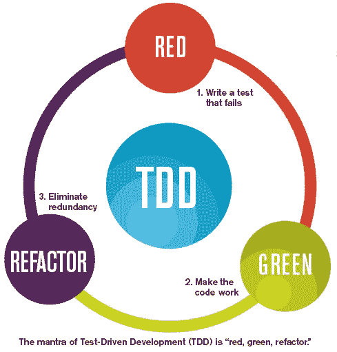

# 机器学习和测试驱动的开发

> 原文：<https://towardsdatascience.com/machine-learning-and-test-driven-development-6b5d793b1783?source=collection_archive---------19----------------------->

## 两者都可以被认为是示例编程。

Source: [https://www.nascenia.com/tdd-in-net-an-overview-of-red-green-refactor/](https://www.nascenia.com/tdd-in-net-an-overview-of-red-green-refactor/)

当我在 21 世纪初开始使用敏捷的前身极限编程(XP)时，我很快了解到 XP 的核心实践之一是测试驱动开发(TDD)。我想提醒你的是，与人们现在所认为的相反，XP 不是作为对瀑布过程的反应而产生的，而是 Kent Beck 所说的“编码并修复”方法，这与瀑布正好相反，因为它的特点是编写难以维护的代码，修改起来非常困难且昂贵，错过最后期限，缺乏计划以及周末工作。瀑布被视为通过引入大设计先行(BDUF)来解决这一问题的尝试。另一方面，XP 通过引入训练有素的软件开发实践，特别是 TDD 和重构，提出了一种不同的解决软件开发混乱的方法。想法是以一种可以在以后运行的方式编写单元测试，以证明代码仍然在工作。这将允许重构代码，而不用担心它会破坏系统。

忠于它的名字，XP 提出通过一直运行测试套件来将这种实践发挥到极致。但是当 XP 实践者在写代码之前就开始写测试时，这变得更加极端。单元测试被视为可执行的规范，而 TDD——被视为通过实例编程。事实上，您在一系列测试示例中编码新需求，然后编写代码以满足所有示例，然后进行重构，确保所有测试仍然通过。这就是著名的 Reg-Green-Refactor 循环，敏捷实践者对此非常熟悉。

我在听 Cassie Kozyrkov 的采访时想起了这一点，她说机器学习是通过例子编程。事实上，早在 2000 年，我就在想，如果代码是基于我写的测试自动编写的，会不会很酷？所以我意识到机器学习是我梦想的实现。不是我不知道，而是 TDD 和 ML 之间的联系直到那时才变得清晰。

当然，在这一点上，机器学习不能完全取代程序员，因为它不是编写程序，而是学习大量的模型参数，需要多次迭代才能正确。由于例子的数量是有限的，模型很可能会过度适应这些例子(这对人类程序员来说也是一种危险！)但人们可能希望在未来算法变得足够强大，能够完成这一点，并确实基于测试示例生成正确工作的程序。