# Spark MLlib Python 示例-大规模机器学习

> 原文：<https://towardsdatascience.com/machine-learning-at-scale-with-apache-spark-mllib-python-example-b32a9c74c610?source=collection_archive---------5----------------------->

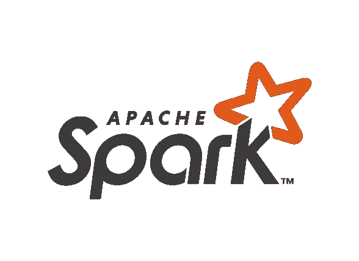

在其历史的大部分时间里，计算机处理器每年都变得更快。不幸的是，这种硬件趋势在 2005 年左右停止了。由于散热方面的限制，硬件开发人员不再提高单个处理器的时钟频率，而是选择并行 CPU 内核。这对于在台式电脑上玩视频游戏来说很好。然而，当涉及到处理数 Pb 的数据时，我们必须更进一步，将多台计算机的处理能力集中在一起，以便在任何合理的时间内完成任务。对水平扩展的需求催生了 Apache Hadoop 项目。Apache Hadoop 提供了一种方法来分解给定的任务，在一个集群内的多个节点上并发执行该任务，并聚合结果。

Apache Spark 始于 2009 年的加州大学伯克利分校 AMPlab。当时，Hadoop MapReduce 是集群的主流并行编程引擎。AMPlab 创建了 Apache Spark 来解决使用 Apache Hadoop 的一些缺点。Apache Hadoop 最显著的局限性之一是它将中间结果写入磁盘。相比之下，Spark 将所有内容都保存在内存中，因此速度更快。2013 年，该项目得到了广泛应用，有来自加州大学伯克利分校以外 30 多个组织的 100 多名贡献者。AMPlab 为 Apache 软件基金会贡献了 Spark。早期的 AMPlab 团队还成立了一家名为 Databricks 的公司来改进这个项目。

尽管像 scikit-learn 这样的 Python 库对于 Kaggle 竞赛之类的比赛来说很棒，但是它们很少被大规模使用。根据我个人的经验，我遇到过只能加载一部分数据的情况，因为否则它会完全填满我的计算机的内存并使程序崩溃。Spark 有能力通过一个名为 MLlib 的内置库来大规模执行机器学习。MLlib API 虽然不如 scikit-learn 包容，但可以用于分类、回归和聚类问题。在前面的文章中，我们将使用传统的 scikit-learn/pandas 堆栈训练一个机器学习模型，然后使用 Spark 重复这个过程。

# Jupyter 笔记本

```
import pandas as pd
```

在前面的例子中，我们将尝试根据人口普查数据预测一个成年人的收入是否超过 5 万美元/年。数据可以从 [UC Irvine 机器学习库](http://archive.ics.uci.edu/ml/datasets/Adult)下载。

我们正在处理的数据集包含 14 个要素和 1 个标注。默认情况下，csv 文件中不包含标题，因此，我们必须自己定义列名。

```
column_names = [
    'age',
    'workclass',
    'fnlwgt',
    'education',
    'education-num',
    'marital-status',
    'occupation',
    'relationship',
    'race',
    'sex',
    'capital-gain',
    'capital-loss',
    'hours-per-week',
    'native-country',
    'salary'
]train_df = pd.read_csv('adult.data', names=column_names)test_df = pd.read_csv('adult.test', names=column_names)
```

您会注意到每个特性都由逗号和空格分隔。虽然熊猫可以在引擎盖下处理这些，但 Spark 不能。因此，我们删除了空格。此外，我们从我们的训练集中删除了任何一行本国为`Holand-Neitherlands`的行，因为在我们的测试集中没有任何实例，这将在我们对分类变量进行编码时引起问题。我们将生成的数据帧保存到一个 csv 文件中，这样我们可以在以后使用它。

```
train_df = train_df.apply(lambda x: x.str.strip() if x.dtype == 'object' else x)train_df_cp = train_df.copy()train_df_cp = train_df_cp.loc[train_df_cp['native-country'] != 'Holand-Netherlands']train_df_cp.to_csv('train.csv', index=False, header=False)test_df = test_df.apply(lambda x: x.str.strip() if x.dtype == 'object' else x)test_df.to_csv('test.csv', index=False, header=False)
```

接下来，让我们来看看我们在做什么。训练集包含 3 万多行。

```
print('Training data shape: ', train_df.shape)
train_df.head()
```

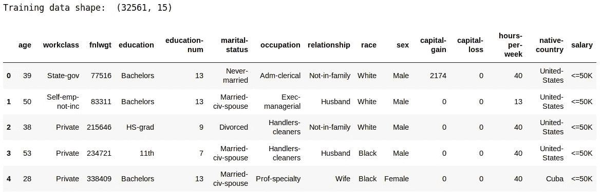

另一方面，测试集包含 15000 多行。

```
print('Testing data shape: ', test_df.shape)
test_df.head()
```

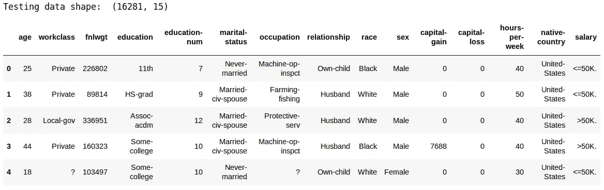

很多时候，我们必须在训练模型之前处理缺失的数据。以下行将返回每个要素的缺失值的数量。幸运的是，数据集是完整的。

```
train_df.isnull().sum()
```

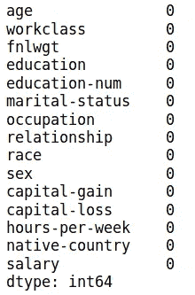

分类变量的类型为`object`。分类变量必须进行编码，以便由机器学习模型(而不是决策树)进行解释。

```
train_df.dtypes.value_counts()
```

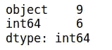

以下代码打印每个分类变量的不同类别数。

```
train_df.select_dtypes('object').apply(pd.Series.nunique, axis=0)
```

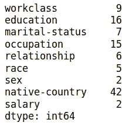

```
test_df.select_dtypes('object').apply(pd.Series.nunique, axis=0)
```

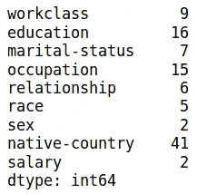

我们手动编码 salary，以避免在执行一个热编码时创建两列。在转换我们的数据之后，每个字符串都被替换为一个由*1*和*0*组成的数组，其中 *1* 的位置对应于一个给定的类别。

```
train_df['salary'] = train_df['salary'].apply(lambda x: 0 if x == ' <=50K' else 1)
test_df['salary'] = test_df['salary'].apply(lambda x: 0 if x == ' <=50K' else 1)train_df = pd.get_dummies(train_df)
test_df = pd.get_dummies(test_df)print('Training Features shape: ', train_df.shape)
print('Testing Features shape: ', test_df.shape)
```

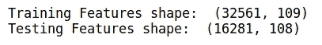

测试集和训练集中`native-country`类别的不同数量之间存在差异(测试集没有一个人的祖国是荷兰)。结果，当我们应用一个热编码时，我们得到了不同数量的特性。在使用逻辑回归之前，我们必须确保训练集和测试集中的特征数量相匹配。我们可以通过执行内部连接来做到这一点。

```
# Align the training and testing data, keep only columns present in both dataframes
train_df, test_df = train_df.align(test_df, join = 'inner', axis = 1)print('Training Features shape: ', train_df.shape)
print('Testing Features shape: ', test_df.shape)
```

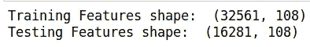

```
train_df.head()
```

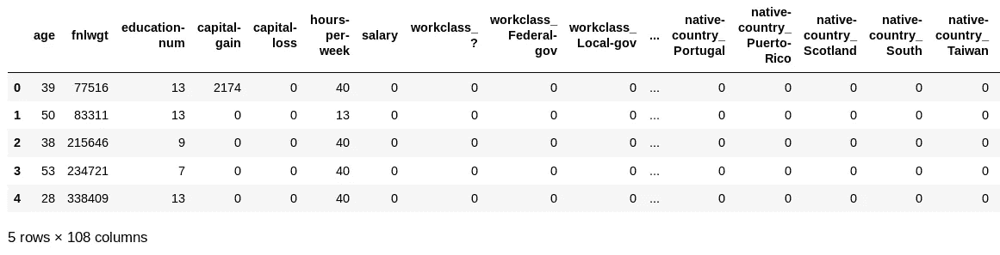

接下来，我们将数据帧分解成因变量和自变量。

```
X_train = train_df.drop('salary', axis=1)
y_train = train_df['salary']X_test = test_df.drop('salary', axis=1)
y_test = test_df['salary']
```

只要我们在解释系数时牢记单位，我们就不需要为正态逻辑回归调整变量。然而，默认情况下，逻辑回归的 scikit-learn 实现使用 L2 正则化。L2 正则化同等地惩罚所有参数的大值。因此，以米为单位的高度特征将比以毫米为单位的另一个特征受到更多的惩罚。因此，在通过我们的模型发送数据之前，我们对数据进行缩放。

```
from sklearn.preprocessing import MinMaxScalerscaler = MinMaxScaler(feature_range = (0, 1))scaler.fit(X_train)
X_train = scaler.transform(X_train)
X_test = scaler.transform(X_test)
```

最后，我们可以训练我们的模型，并在测试集上测量它的性能。

```
from sklearn.linear_model import LogisticRegressionlr = LogisticRegression()lr.fit(X_train, y_train)lr_pred = lr.predict(X_test)from sklearn.metrics import accuracy_scoreaccuracy_score(y_test, lr_pred)
```

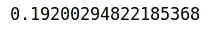

# Pyspark

让我们看看如何使用 Spark 来完成同样的事情。根据您的喜好，您可以用 Java、Scala 或 Python 编写 Spark 代码。鉴于大多数数据科学家习惯于使用 Python，我们将使用它。

前面部分中的所有代码都将在我们的本地机器上运行。然而，如果我们要建立一个具有多个节点的 Spark 集群，这些操作将在集群中的每台计算机上并发运行，而无需对代码进行任何修改。

开始使用 Spark 最简单的方法是使用 Jupyter 提供的 Docker 容器。为了简单起见，我们创建一个包含以下内容的`docker-compose.yml`文件。确保修改路径以匹配包含从 UCI 机器学习资源库下载的数据的目录。

```
version: '2'
services:
  spark:
    image: jupyter/pyspark-notebook:latest
    ports:
      - 8888:8888
    volumes:
      - /home/cory/kaggle/adult:/home/jovyan/work
```

然后，运行前面的命令。

```
docker-compose up
```

要访问 Jupyter 笔记本，请打开浏览器并进入`localhost:8888`。

继续导入下列库。

```
from pyspark import SparkConf, SparkContext
from pyspark.sql import SparkSession
from pyspark.ml.classification import LogisticRegression
from pyspark.ml.feature import OneHotEncoderEstimator, StringIndexer, VectorAssembler
from pyspark.ml import Pipeline
from pyspark.sql.types import StructType, StructField, IntegerType, StringType
```

在做任何事情之前，我们需要初始化一个 Spark 会话。

```
spark = SparkSession.builder.appName("Predict Adult Salary").getOrCreate()
```

就像之前一样，我们定义了在读取数据时要使用的列名。

```
schema = StructType([
    StructField("age", IntegerType(), True),
    StructField("workclass", StringType(), True),
    StructField("fnlwgt", IntegerType(), True),
    StructField("education", StringType(), True),
    StructField("education-num", IntegerType(), True),
    StructField("marital-status", StringType(), True),
    StructField("occupation", StringType(), True),
    StructField("relationship", StringType(), True),
    StructField("race", StringType(), True),
    StructField("sex", StringType(), True),
    StructField("capital-gain", IntegerType(), True),
    StructField("capital-loss", IntegerType(), True),
    StructField("hours-per-week", IntegerType(), True),
    StructField("native-country", StringType(), True),
    StructField("salary", StringType(), True)
])
```

像 Pandas 一样，Spark 提供了一个 API，用于将 csv 文件的内容加载到我们的程序中。我们使用开始时创建的文件。

```
train_df = spark.read.csv('train.csv', header=False, schema=schema)test_df = spark.read.csv('test.csv', header=False, schema=schema)
```

我们可以运行下面一行来查看前 5 行。

```
train_df.head(5)
```

不管出于什么原因，如果你想把 Spark 数据帧转换成 Pandas 数据帧，你可以这样做。就我个人而言，我觉得输出更清晰，更容易阅读。

```
train_df.limit(5).toPandas()
```

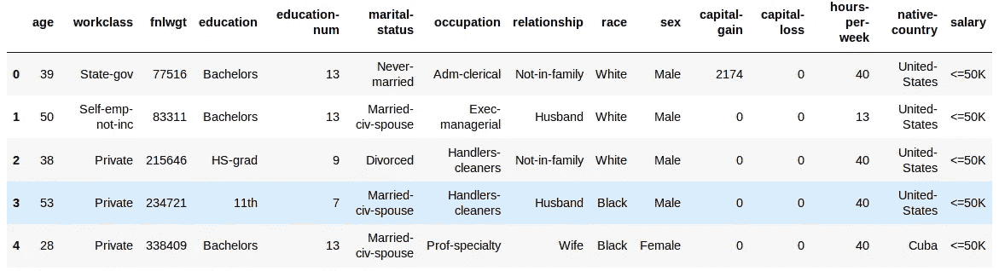

在继续前进之前，必须了解 Spark 和 Scikit-learn/Pandas 之间的几个重要区别。

*   Spark 数据帧是不可变的。因此，每当我们想要应用转换时，我们必须通过创建新的列来实现。
*   MLlib 希望所有功能都包含在一列中。

在前面的代码块中，我们对分类变量进行了所有必要的转换。

`StringIndexer`类执行标签编码，必须在`OneHotEncoderEstimator`执行一次热编码之前应用。`VectorAssembler`类接受多个列作为输入，输出一个列，其内容是一个数组，包含所有输入列的值。

```
categorical_variables = ['workclass', 'education', 'marital-status', 'occupation', 'relationship', 'race', 'sex', 'native-country']indexers = [StringIndexer(inputCol=column, outputCol=column+"-index") for column in categorical_variables]encoder = OneHotEncoderEstimator(
    inputCols=[indexer.getOutputCol() for indexer in indexers],
    outputCols=["{0}-encoded".format(indexer.getOutputCol()) for indexer in indexers]
)assembler = VectorAssembler(
    inputCols=encoder.getOutputCols(),
    outputCol="categorical-features"
)pipeline = Pipeline(stages=indexers + [encoder, assembler])train_df = pipeline.fit(train_df).transform(train_df)test_df = pipeline.fit(test_df).transform(test_df)
```

让我们查看在上一步中创建的所有不同的列。

```
train_df.printSchema()
```

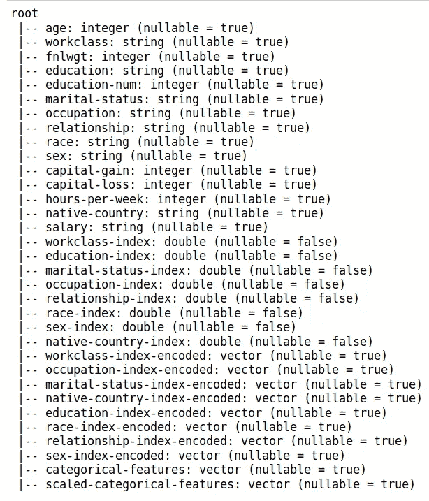

在应用转换之后，我们得到了一个包含每个编码分类变量的数组的单个列。

```
df = train_df.limit(5).toPandas()
df['scaled-categorical-features'][1]
```

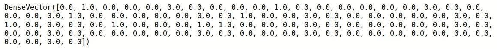

我们将连续变量和分类变量合并成一列。

```
continuous_variables = ['age', 'fnlwgt', 'education-num', 'capital-gain', 'capital-loss', 'hours-per-week']assembler = VectorAssembler(
    inputCols=['categorical-features', *continuous_variables],
    outputCol='features'
)train_df = assembler.transform(train_df)test_df = assembler.transform(test_df)
```

让我们看看最后一列，我们将使用它来训练我们的模型。如您所见，它输出了一个 SparseVector。为了节省空间，稀疏向量不包含来自一个热编码的***0***。

```
train_df.limit(5).toPandas()['features'][0]
```

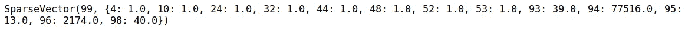

最后，我们对目标标签进行编码。

```
indexer = StringIndexer(inputCol='salary', outputCol='label')train_df = indexer.fit(train_df).transform(train_df)test_df = indexer.fit(test_df).transform(test_df)train_df.limit(10).toPandas()['label']
```

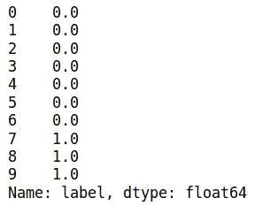

我们适合并训练我们的模型。

```
lr = LogisticRegression(featuresCol='features', labelCol='label')model = lr.fit(train_df)
```

`transform`方法用于对测试集进行预测。

```
pred = model.transform(test_df)pred.limit(10).toPandas()[['label', 'prediction']]
```

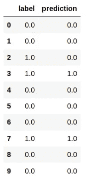

# 最后的想法

Spark 是一个分布式计算平台，可用于在数据帧上执行操作，并大规模训练机器学习模型。