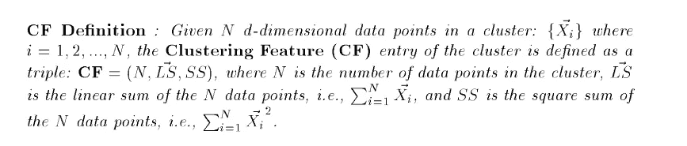
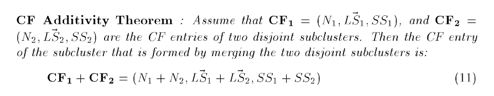
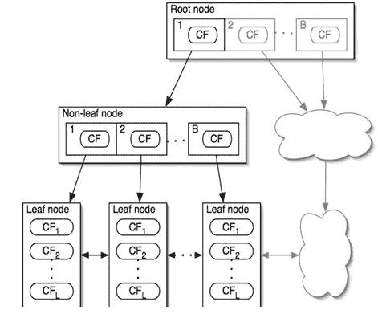
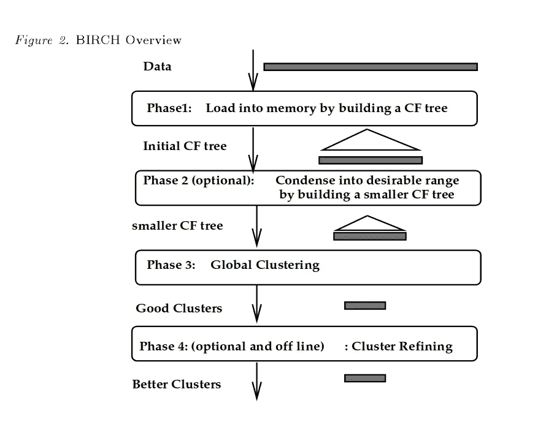
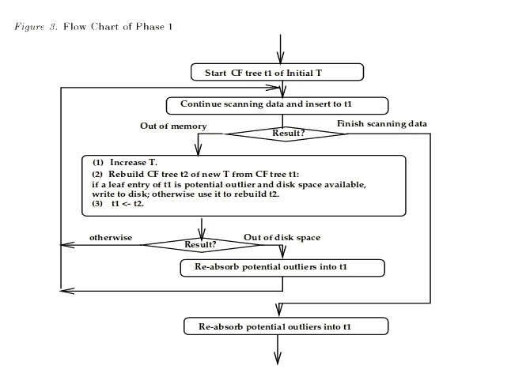
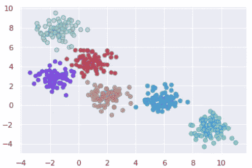

# Python 中的 BIRCH 聚类算法示例

> 原文：<https://towardsdatascience.com/machine-learning-birch-clustering-algorithm-clearly-explained-fb9838cbeed9?source=collection_archive---------9----------------------->


[https://www.pexels.com/photo/boy-in-beige-hoodie-solving-a-math-problem-6256102/](https://www.pexels.com/photo/boy-in-beige-hoodie-solving-a-math-problem-6256102/)

现有的数据聚类方法不能充分解决用有限数量的资源(即，存储器和 cpu 周期)处理大数据集的问题。因此，随着数据集大小的增加，它们在运行时间和结果质量方面的伸缩性很差。在高层次上，**使用层次结构**的平衡迭代减少和聚类，或简称为 **BIRCH** ，通过首先生成一个更紧凑的摘要来处理大型数据集，该摘要保留尽可能多的分布信息，然后对数据摘要而不是原始数据集进行聚类。BIRCH 实际上是对其他聚类算法的补充，因为不同的聚类算法可以应用于 BIRCH 生成的摘要。BIRCH 只能处理度量属性(类似于 KMEANS 可以处理的那种特性)。度量属性的值可以用欧几里得空间中的显式坐标来表示(没有分类变量)。

# 聚类特征(CF)

BIRCH 试图通过将密集区域中包含的信息汇总为聚类特征(CF)条目来最小化大型数据集的内存需求。



[http://www.cs.uvm.edu/~xwu/kdd/BIRCH.pdf](http://www.cs.uvm.edu/~xwu/kdd/BIRCH.pdf)

正如我们将要看到的，CFs 有可能由其他 CFs 组成。在这种情况下，子集群等于 CFs 的总和。



[http://www.cs.uvm.edu/~xwu/kdd/BIRCH.pdf](http://www.cs.uvm.edu/~xwu/kdd/BIRCH.pdf)

# CF 树

CF-tree 是数据集的一种非常紧凑的表示，因为叶节点中的每个条目不是单个数据点，而是一个子簇。每个非叶节点最多包含 ***B*** 个条目。在这种情况下，单个条目包含指向子节点的指针和由子节点中的 CF 的总和构成的 CF(子集群的子集群)。另一方面，一个叶节点最多包含 ***L*** 个条目，每个条目是一个 CF(数据点的子簇)。叶节点中的所有条目必须满足阈值要求。也就是说，每个叶子条目的直径必须小于 ***阈值*** 。此外，每个叶节点都有两个指针， *prev* 和 *next* ，用于将所有叶节点链接在一起，以便高效扫描。



[http://www.cs.uvm.edu/~xwu/kdd/BIRCH.pdf](http://www.cs.uvm.edu/~xwu/kdd/BIRCH.pdf)

# 插入算法

让我们描述一下如何将一个 CF 条目(单个数据点或子集群)插入到 CF-tree 中。

1.  **识别适当的叶子:**从根开始，通过根据所选择的距离度量(即欧几里德距离)选择最近的子节点，递归地下降 DF 树。
2.  **修改叶子:**到达一个叶子节点后，找到最近的条目，测试是否能够*吸收*CF 条目而不违反阈值条件。如果可以，更新 CF 条目，否则，向叶子添加新的 CF 条目。如果叶子上没有足够的空间来容纳这个新条目，那么我们必须分割叶子节点。通过选择相距最远的两个条目作为种子并基于距离重新分配剩余条目来完成节点分裂。
3.  **修改到叶子的路径:**回忆一下每个非叶子节点本身是如何由它的所有子节点的 CF 组成的 CF。因此，在将一个 CF 条目插入到一个叶子中之后，我们为到叶子的路径上的每个非叶子条目更新 CF 信息。在分裂的情况下，我们必须在父节点中插入一个新的非叶子条目，并让它指向新形成的叶子。如果根据 ***B*** ，父节点没有足够的空间，那么我们也必须拆分父节点，以此类推直到根节点。

# 聚类算法

现在，我们已经介绍了 BIRCH 的一些基本概念，让我们来看看算法是如何工作的。



[http://www.cs.uvm.edu/~xwu/kdd/BIRCH.pdf](http://www.cs.uvm.edu/~xwu/kdd/BIRCH.pdf)

## 第一相

该算法从初始阈值开始，扫描数据，并将点插入树中。如果它在扫描完数据之前耗尽了内存，它会增加阈值，并通过将旧 CF 树的叶条目重新插入新 CF 树来重建一个新的更小的 CF 树。在所有旧的叶子条目被重新插入之后，数据的扫描和插入到新的 CF-树中从它被中断的点重新开始。

阈值的良好选择可以大大减少重建次数。然而，如果初始阈值太高，我们将获得比可用存储器可行的更不详细的 CF-树。



[http://www.cs.uvm.edu/~xwu/kdd/BIRCH.pdf](http://www.cs.uvm.edu/~xwu/kdd/BIRCH.pdf)

可选地，我们可以分配固定数量的磁盘空间来处理异常值。离群值是低密度的叶条目，被判断为相对于整个聚类模式不重要。当我们通过重新插入旧的叶子条目来重建 CF-树时，新的 CF-树的大小以两种方式减小。首先，我们增加阈值，从而允许每个叶子条目吸收更多的点。其次，我们将一些叶条目视为潜在的离群值，并将它们写到磁盘上。如果旧叶条目的数据点远少于平均值，则它被认为是潜在的异常值。响应于新数据的阈值的增加或分布的改变很可能意味着潜在的异常值不再有资格作为异常值。因此，扫描潜在的离群值，以检查它们是否可以被树重新吸收，而不会导致树的大小增长。

## 第二相

假设当对象的数量在一定范围内时，某些聚类算法表现最佳，我们可以将拥挤的子聚类分组为更大的子聚类，从而产生整体更小的 CF-tree。

## 第三阶段

几乎任何聚类算法都可以用来对聚类特征而不是数据点进行分类。例如，我们可以使用 KMEANS 对我们的数据进行分类，同时从 BIRCH 中获得好处(即最大限度地减少 I/O 操作)。

## 第四阶段

到目前为止，尽管树可能已经被重建了多次，但是原始数据只被扫描了一次。阶段 4 涉及对数据的额外传递，以校正由于聚类算法被应用于数据的粗略汇总这一事实而导致的不准确性。阶段 4 还为我们提供了丢弃异常值的选项。

# 密码

接下来，我们将在 Python 中实现 BIRCH。

```
import numpy as np
from matplotlib import pyplot as plt
import seaborn as sns
sns.set()
from sklearn.datasets.samples_generator import make_blobs
from sklearn.cluster import Birch
```

我们使用`scikit-learn`来生成具有良好定义的集群的数据。

```
X, clusters = make_blobs(n_samples=450, centers=6, cluster_std=0.70, random_state=0)
plt.scatter(X[:,0], X[:,1], alpha=0.7, edgecolors='b')
```


接下来，我们使用以下参数初始化并训练我们的模型:

*   **阈值:**新样本和最近的子聚类合并得到的子聚类的半径应该小于阈值。
*   **branch _ factor:**每个节点中 CF 子簇的最大数量
*   **n_clusters:** 最终聚类步骤后的聚类数，该步骤将来自叶子的亚聚类视为新样本。如果设置为`None`，则不执行最后的聚类步骤，子聚类按原样返回。

```
brc = Birch(branching_factor=50, n_clusters=None, threshold=1.5)brc.fit(X)
```

我们使用`predict`方法来获得一系列的点和它们各自的集群。

```
labels = brc.predict(X)
```

最后，我们用不同的颜色绘制每个聚类的数据点。

```
plt.scatter(X[:,0], X[:,1], c=labels, cmap='rainbow', alpha=0.7, edgecolors='b')
```



# 最后的想法

BIRCH 为非常大的数据集提供了一种聚类方法。它通过集中在密集占用的区域，并创建一个紧凑的摘要，使一个大的聚类问题看似合理。BIRCH 可以使用任何给定数量的内存，I/O 复杂性比一次数据扫描多一点。其他聚类算法可以应用于 BIRCH 产生的子聚类。