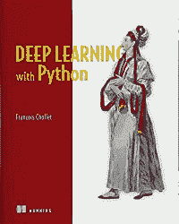
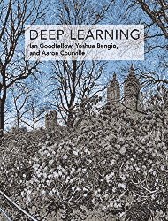

# 2020 年你应该读的机器学习书籍

> 原文：<https://towardsdatascience.com/machine-learning-books-you-should-read-in-2020-344b44d9a11e?source=collection_archive---------0----------------------->

## 现在最好的机器学习书籍是什么

机器学习成为计算机科学最热门的领域之一。每个更大的公司要么应用机器学习，要么考虑尽快这样做，以解决他们的问题，了解他们的数据集。这意味着是时候学习机器学习了，尤其是如果你正在寻找新的计算机科学挑战。一个很好的方法就是读几本书。在这篇文章中，我将回顾 2020 年最好的机器学习书籍。

Machine Learning Books

# 入门水平

如果你刚刚开始学习机器，一定要读这本书:

[Python 机器学习入门](https://www.amazon.com/gp/product/1449369413/ref=as_li_tl?ie=UTF8&camp=1789&creative=9325&creativeASIN=1449369413&linkCode=as2&tag=petacrunch-20&linkId=8669cacfe298d25c2832d9062642dd44)是机器学习的温和入门。它没有假设任何关于 Python 的知识，它介绍了机器学习的基本概念和应用，通过例子讨论了各种方法。这是我见过的入门级机器学习工程师的最佳书籍。

# 中间能级

如果你已经为自己完成了一系列机器学习项目，并习惯了使用机器学习模型，下面这些书将带你走得更远:

[Python 机器学习](https://www.amazon.com/gp/product/1789955750/ref=as_li_tl?ie=UTF8&camp=1789&creative=9325&creativeASIN=1789955750&linkCode=as2&tag=petacrunch-20&linkId=cc65892b0564ce32cee20536fb70b29c)是一本很棒的实用书籍，里面有很多实际的代码示例。它从温和开始，然后进入机器学习和深度学习的最新进展。它非常容易阅读，将吸引任何水平的人，因为第二版甚至涵盖了甘斯。

[用 Scikit-Learn 和 TensorFlow 进行机器学习](https://amzn.to/3d3tpE7)(第二版已经推出！)是中级惊人的参考。它涵盖了所有的基础知识(分类方法、降维)，然后进入神经网络和深度学习。

[模式识别和机器学习](https://www.amazon.com/gp/product/0387310738/ref=as_li_tl?ie=UTF8&camp=1789&creative=9325&creativeASIN=0387310738&linkCode=as2&tag=petacrunch-20&linkId=11e0911952bfc7a8adf52b3eae0f461c)从一个好的统计修正开始，遍历所有的基本算法。它主要关注机器学习的理论方面，是其他更实用书籍的绝佳伴侣。

# 专家

在专家水平上，阅读科学论文通常比阅读书籍好得多，因为在我们说话的时候，知识正在更新。机器学习真的是活在当下。然而，手里有一堆书籍参考资料来完全进入深度学习也是很棒的:

[用 Python 进行深度学习](https://www.amazon.com/gp/product/1617294438/ref=as_li_tl?ie=UTF8&camp=1789&creative=9325&creativeASIN=1617294438&linkCode=as2&tag=petacrunch-20&linkId=fa7304c5324df649a4ba536bd74927d2)是由 Keras 的一个创建者编写的，Keras 是 Python 中最流行的机器学习库之一。这本书从温和开始，非常实用，给出了你可以马上使用的代码，并且总的来说有许多关于使用深度学习的有用提示。深度学习的必读书目。

[深度学习](https://www.amazon.com/gp/product/0262035618/ref=as_li_tl?ie=UTF8&camp=1789&creative=9325&creativeASIN=0262035618&linkCode=as2&tag=petacrunch-20&linkId=00701393c949f16bfd3a89d9c3240b35)是深度学习算法的惊人参考。它包含的代码不多，但对如何处理机器学习问题有很好的见解:由深度学习的先驱编写。它涵盖了几乎所有目前使用的技术。

如果你更注重数学，那么你会喜欢[机器学习:概率视角](https://www.amazon.com/gp/product/0262018020/ref=as_li_tl?ie=UTF8&camp=1789&creative=9325&creativeASIN=0262018020&linkCode=as2&tag=petacrunch-20&linkId=a52c63d00ba9f01f29e1db95d6b4c171)。这是所有机器学习方法背后的数学杰作。你很可能一下子读不出来，但是作为机器学习研究中的参考非常有用。

Data Science Job

最后，如果你想了解成为一名数据科学家意味着什么，那么看看我的书[数据科学工作:如何成为一名数据科学家](https://amzn.to/3aQVTjs)，它将指导你完成这个过程。

仅此而已！祝你在机器学习的旅途中一切顺利！

如果你正在寻找你的第一份入门级数据科学工作，并且不知道从哪里开始，请在这里 报名参加我的 [**数据科学工作课程。我解释你应该做什么，并在几周内学会成为一名初级数据科学家或初级机器学习工程师。**](https://datasciencerush.thinkific.com/courses/data-science-job)

如果您正在查找其他书籍列表，请参阅:

*   [2020 年你应该读的数据科学书籍](http://www.datasciencerush.com)
*   [2020 年你应该读的人工智能书籍](/artificial-intelligence-books-you-should-read-in-2020-4d3cecd21efa)
*   [2020 年你应该读的创业书籍](https://medium.com/swlh/startup-books-you-should-read-in-2020-ba8684000128)

 [## 加入我的机器学习时事通讯

### 请继续关注更多有用的材料](https://creative-producer-9423.ck.page/c3b56f080d)