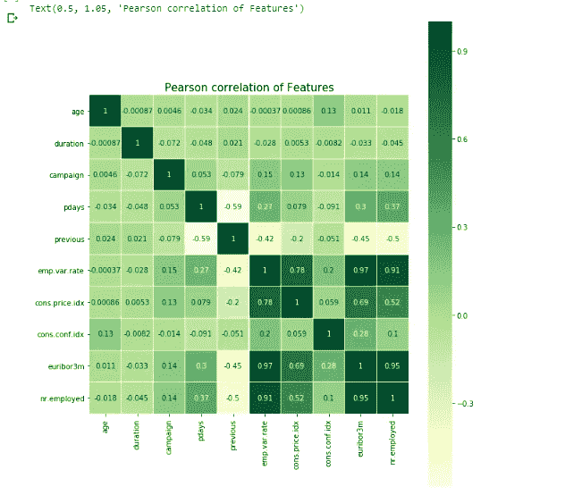

# 机器学习案例研究:预测银行电话营销成功的数据驱动方法

> 原文：<https://towardsdatascience.com/machine-learning-case-study-a-data-driven-approach-to-predict-the-success-of-bank-telemarketing-20e37d46c31c?source=collection_archive---------1----------------------->

## 给定客户关系数据，预测客户是否会认购定期存款


Photo by [Franki Chamaki](https://unsplash.com/@franki?utm_source=medium&utm_medium=referral) on [Unsplash](https://unsplash.com?utm_source=medium&utm_medium=referral)

当今世界，数据为王。以有效的方式使用它，它可以对你的业务产生巨大的影响，不要利用它，你会很快被这个快节奏的世界抛在后面。组织提高其市场绩效的方法之一是以有效的方式获取和分析客户数据，以改善客户体验。

最近机器学习进步改变最大的行业之一是金融业。无论是预测股票价格，还是在我们的案例中预测客户是否会订阅定期存款，机器学习都是一种非常有用的工具，可以提供更好的盈利能力。有了这个，让我们直接进入我们的案例研究。

# **关于问题:**

我们获得了一家葡萄牙银行机构的直接营销活动(电话)数据。分类的目标是预测客户是否会认购定期存款(目标变量 y)。本案例研究受到了[这篇](https://github.com/sukanta-27/Predicting-Success-of-Bank-Telemarketing/blob/master/Relevent%20Paper/targeted_marketing.pdf)研究论文的启发，研究人员使用了一个非常相似的数据集，我们将在整个案例研究中使用该数据集来确定银行电话营销的成功与否。研究人员在他们的论文中提到，他们得到的最好结果是 AUC 分数为 0.8，ALIFT 为 0.7。因此，作为一个目标，我们将尝试在我们的案例研究中产生类似的结果。

# 关于数据集:

如上所述，数据集由银行机构的直接营销活动数据组成。数据集选自 [UCI 机器学习库](https://archive.ics.uci.edu/ml/datasets/Bank+Marketing#)，这是一个公开可用数据集的惊人来源。数据集有四个变量，我们从中选择了“bank-additional-full.csv ”,它由 41188 个数据点和 20 个独立变量组成，其中 10 个是数字特征，10 个是分类特征。我们可用的功能列表如下:

**银行客户数据:**

1.  年龄(数字)
2.  作业:作业类型(分类:“管理。”、'蓝领'、'企业家'、'女佣'、'管理'、'退休'、'自雇'、'服务'、'学生'、'技术员'、'失业'、'未知')
3.  婚姻:婚姻状况(分类:“离婚”、“已婚”、“单身”、“未知”)；注意:“离婚”是指离婚或丧偶)
4.  教育(分类:'基础. 4y '，'基础. 6y '，'基础. 9y '，'高中'，'文盲'，'专业.课程'，'大学.学位'，'未知')
5.  违约:有信用违约？(分类:“否”、“是”、“未知”)
6.  住房:有住房贷款吗？(分类:“否”、“是”、“未知”)
7.  贷款:有个人贷款？(分类:“否”、“是”、“未知”)

**与当前战役的最后一个联系人相关:**
8。联系人:联系人通信类型(分类:“手机”、“电话”)

9.月份:一年中的最后一个联系月份(分类:'一月'，'二月'，'三月'，…，'十一月'，'十二月')

10.星期几:一周的最后一个联系日(分类:“星期一”、“星期二”、“星期三”、“星期四”、“星期五”)

11.duration:上次联系持续时间，以秒为单位(数字)。重要注意事项:该属性对输出目标有很大影响(例如，如果 duration=0，则 y='no ')。然而，在执行呼叫之前，持续时间是未知的。还有，结束通话后 y 显然是已知的。因此，该输入应仅用于基准测试目的，如果目的是获得现实的预测模型，则应丢弃。

**其他属性:**
12。活动:在此活动期间为此客户执行的联系次数(数字，包括最后一次联系)

13.pdays:从上一个活动中最后一次联系客户后经过的天数(数字；999 表示之前没有联系过客户)

14.上一次:在此活动之前为此客户执行的联系次数(数字)

15.poutcome:之前营销活动的结果(分类:“失败”、“不存在”、“成功”)

**社会经济背景属性**
16。员工变动率:员工变动率-季度指标(数字)

17.cons.price.idx:消费者价格指数—月度指标(数字)

18.cons.conf.idx:消费者信心指数——月度指标(数字)

19.euribor3m: euribor 3 个月利率—每日指标(数字)

20.受雇人数:雇员人数—季度指标(数字)

# 机器学习问题的类型:

现在您可能已经猜到了，这是一个二元分类问题。我们的两个类别是“是”表示客户订阅了定期存款，“否”表示客户没有订阅。

# 使用的绩效指标:

本案例研究使用的性能指标是 AUC ROC 得分，也称为[AUROC](/understanding-auc-roc-curve-68b2303cc9c5)(**接收器操作特性**下的**区域)。**

**为什么使用 AUC？** 我们选择 AUC 而不是准确性的原因是，
正如我们将在探索性数据分析中看到的，我们正在处理的数据集是一个不平衡的数据集，其中类“否”是大多数类。如果我们使用准确性作为我们的度量，任何随机模型都可以给我们一个非常好的准确性。但最终，它将是一个随机模型。AUC 通过调查真阳性率(TPR)和假阳性率(FPR)来解决这个问题。只有当 TPR 和 FPR 都远高于 ROC 曲线中的随机线时，我们才能获得良好的 AUC。准确性并不能保证这一点。

# 探索性数据分析:

在对问题一无所知的情况下就开始建模并不是一个好主意。因此，作为开始，我们将进行一些 EDA，以更多地了解我们正在处理的是什么类型的数据，以及这些数据是否有任何模式。我们将进行一些单变量分析，以找出哪些特征可以帮助我们完成分类任务，哪些变量并不那么重要。现在，如果我们在这里对所有 20 个特征逐一进行单变量分析，这将是一个非常冗长的博客，我们将只研究这个博客中的一些关键方面。如果你想浏览我的整个案例研究，你可以在这个[资源库](https://github.com/sukanta-27/Predicting-Success-of-Bank-Telemarketing)中找到。

**类别变量的分布** :
首先我们将研究类别分布，看看它是否是一个平衡的数据。


Class distribution

从上面的图中我们可以看到，数据集是不平衡的，其中负类的数量接近正类数量的 8 倍。

现在，我们将进行一些单变量分析，即一次获取一个特征，并检查它在两个类别之间的区分程度。例如，我们数据集中的一个特征是客户的“工作”。我们将查看分布情况，以确定是否有任何特定类别的功能比其他类别订阅定期存款更多。

# 分类变量的单变量分析:

我们将研究每个特性的计数图，找出每个特性的类别分布。首先，让我们定义一个绘制计数图的函数，这将有助于我们继续进行案例研究。

**工作:**客户的工作类型。让我们调用前面定义的计数图函数来绘制作业特征的计数图。


从上面的图中，我们可以看到，有管理工作的客户认购定期存款的比率最高，但他们不认购的比率也最高。这仅仅是因为我们有比其他职业更多的客户从事管理工作。

让我们看看更多的功能。

**婚姻:**这只是表示客户的婚姻状况。


大多数顾客都结婚了。其次是单身，离异，不知名。

**违约**:表示客户是否有信用违约。类别包括是、否和未知。


**住房**:表示客户是否有住房贷款。三个类别是“否”、“是”、“未知”。


从上面的图中我们可以看出，大多数客户都有住房贷款。

poutcome:该特征表示先前营销活动的结果。


对于大多数客户来说，先前的营销活动结果并不存在。说明大部分客户都是之前没有接触过的新客户。这里还需要注意的一点是，对于那些在之前的活动中取得成功的客户，大多数客户**选择了**定期存款。因为它的等级分布为正等级 2.2%，负等级 1.2%。由此，我们可以假设，该特征在预测目标变量时可能具有一些价值。特别 poutcome_success 类别。

让我们来看看一些在分析中似乎没有太大帮助的特性。

**星期几**:该特性表示一周的最后一个联系日(分类:“周一”、“周二”、“周三”、“周四”、“周五”)


从上面的图中我们可以清楚地看到，这两个类的所有天数都有相似的分布。任何一天都有 17-18%的客户拒绝认购定期存款，2.1-2.5%的客户同意认购。由此我们可以推断出，该特征在预测目标变量时不会有很大帮助。

有了这个，让我们看看一些数字特征。

# 数字特征的单变量分析:

我们将研究箱形图和所有数字特征的分布。

**年龄:**


从上面的箱线图中，我们知道订购或未订购定期存款的客户的中值年龄约为 38-40 岁。这两个类别的箱线图有很多重叠，这意味着年龄不一定是哪个客户会订阅哪个客户不会订阅的好指标。


**持续时间:**这个特性在我们的案例研究中非常有趣。它表示最后一次联系的持续时间，以秒为单位。在数据集的来源中提到:

> **重要提示:**该属性对输出目标有很大影响(例如，如果 duration=0，则 y='no ')。然而，在执行呼叫之前，持续时间是未知的。还有，在调用结束后，目标变量 y 显然是已知的。因此，该输入应仅用于基准测试目的，如果目的是获得现实的预测模型，则应丢弃。

所以有了这个我们就知道这个特性会很有意思 xD。我们也知道，我们将无法在最终模型中包含此功能，因为很明显，我们希望创建一个可供业务使用的现实预测模型。但是，我们肯定会实现一个具有持续时间特性的基本模型，来看看这个特性会产生多大的影响。因此，让我们看看这个功能的方框图和 pdf。


从上图可以清楚地看出，客户的持续时间(上次联系持续时间)对于预测目标变量非常有用。这是意料之中的，因为在数据概述中已经提到，该字段高度影响目标变量，并且应该仅用于基准目的。

**就业变动率**:就业变动率，季度指标。尽管这一特征和其他一些特征(如“先前的”等)是数字特征，但是它们具有有限数量的重复出现的唯一值。这是 emp.var.rate 特性的值计数。


value counts for the feature


## euribor3m:

euribor 3 个月利率，每日指标。euribor 表示欧盟银行间市场上银行间借贷的基本利率，也用作设定其他贷款利率的参考。


从上面的图中，我们可以清楚地看到两个类的中位数的差异。这表明该特性对我们的案例研究非常有用。但是我们只能通过应用模型和提取特征重要性来验证这个假设。


## 数字特征的相关矩阵:

相关矩阵的想法来自这个[博客](https://medium.com/datadriveninvestor/introduction-to-exploratory-data-analysis-682eb64063ff)。**相关性**是一种**统计**度量，表示两个或更多变量一起波动的程度。正**相关性**表明这些变量平行增加或减少的程度；**负相关**表示一个变量增加而另一个变量减少的程度。这是一个非常有用的工具，可以快速检查哪些要素更相关，哪些要素对不相关。



emp.var.rate、cons.price.idx、euribor3m 和 nr.employed 特征具有非常高的相关性。其中 euribor3m 和 nr.employed 的相关性最高，为 0.95！

完成基本的 EDA 之后，让我们进入下一步，即数据预处理。如果你想浏览所有特性的 EDA，你可以查看这个[库](https://github.com/sukanta-27/Predicting-Success-of-Bank-Telemarketing)。

# 数据预处理:

由于我们的数据集有 10 个分类特征，我们需要将这些特征编码成数字表示，以应用机器学习模型。在本案例研究中，我们将研究两种编码方案，并在案例研究结束时比较两种编码方案的结果。这两种编码方案是:
1。**一种热门编码**:这是处理分类特征最流行的编码方案之一。对于每个唯一的类别，它创建一个具有二进制值(0 或 1)的单独列。在这些新列的每一列中，如果相应的类别出现在该行中，则值为 1，否则为 0。
2。**响应编码**:作为该技术的一部分，我们表示数据点属于给定类别的特定类别的概率。因此，对于 K 类分类问题，我们得到 K 个新特征，这些新特征基于分类数据的值嵌入属于每个类的数据点的概率。从数学上来说，我们计算—

**P(class = X | category = A)= P(category = A∩class = X)/P(category = A)**

但是在对分类特征进行编码之前，让我们首先进行一些基本的检查，看看是否有任何丢失的值或重复的行等，因为它们会影响最终的模型性能。

## 处理缺失值:

谢天谢地，在我们的数据集中没有丢失值。如果有任何缺失值，我们要么删除行(如果缺失值的数量比我们拥有的数据量少)，要么使用插补来处理缺失值。


## 处理重复值:


There are 12 duplicate rows

正如我们可以看到的，在我们的数据集中有一些重复的行，我们将在继续之前删除重复的行。


删除重复行后，总共有 41176 行。

## 分离自变量和类变量:


## 拆分数据:

现在，在应用任何编码方案之前，将数据集分成训练、测试和 CV 数据集是非常重要的。否则我们会有数据泄露的问题。因此，在对分类变量进行编码之前，让我们先对数据进行分割。我们将对训练、cv 和测试数据集分别应用 64%、16%和 20%。


## 一个热点编码分类变量:

One hot encoding the categorical variables

为了对分类变量进行编码，我们使用 CountVectorizer，它通常用于将文本特征编码到单词包(BoW)表示中。由于测试数据集中丢失维度的问题，我们使用 countVectorizer 而不是任何其他函数进行一次热编码。这是一个问题，你会面临，如果你说使用熊猫获取 _ 假人功能。出现问题的原因是，当您将数据分割为训练时，测试可能会有一些类别的一些特征会在训练中，但不在测试数据集中。如果你使用 pd.get_dummies，你将在训练和测试中得到不同的维度。为了解决这个问题，我们在训练数据集上使用 CountVectorizer 和 fit_transform，并在 cv 和测试数据集上进行转换，正如您在上面的嵌入式代码中看到的那样。

## 使用 T-SNE 图可视化数据集:

因为我们已经可以对我们的数据集进行编码，所以不在它上面应用 t-sne 来可视化 2D 的高维数据是非常不公平的，不是吗？所以我们就这么做吧。


Tsne on train dataset


Tsne on CV dataset


TSNE on test dataset

正如我们所看到的，尽管数据中似乎有很多重叠，但这两个类别之间似乎有一些区别。

## 分类变量的响应编码:

现在让我们对分类特征使用响应编码。在我们完成响应编码之后，我们将进入建模部分，在这里我们将比较使用两种编码方案的模型的结果，以查看编码方案是否会产生影响。以下是使用响应编码对分类特征进行编码的伪代码:

```
*# alpha is for laplace smoothing* *1\. Consider all unique values and the number of occurrences of given feature in train data frame**2\. Build a vector (1*2) [As this is a binary classification problem].**3\. The first element = (number of times it occured in class1 + 10*alpha / number of time it occurred in total data+20*alpha)**4\. Create a dict (say feat_dict) that will store every categorical data as key and store a (1*2) representation of response coded vector as the value*5\. Create a list (say res_fea) that will store the final response coded features*5\. for a value of feature in df:*
       *if it is in train data:*
          *we add the vector that was stored in 'feat_dict' look up          table to 'res_fea'*

       *if it is not there in train data:*
           *we add [1/2, 1/2] to 'res_fea' to indicate equal probability of both classes.**return 'res_fea'*
```

# 预测目标变量:

现在是我们一直在等待的部分，我们将数据应用到机器学习模型来预测目标变量。让我们从这个开始。

## 应用具有和不具有“持续时间”特征的逻辑回归:

现在正如我所承诺的，在开始创建一个可以使用的真实模型之前，我们将首先看看持续时间特性是如何影响输出的。为此，我们将只应用简单的逻辑回归模型，没有任何超参数调整，有和没有持续时间列，并比较结果。之后，我们将从数据集中一劳永逸地移除该特征，并应用各种模型。

## 应用逻辑回归:

现在，我们将对 One hot 编码数据集和 Response 编码数据集应用逻辑回归，并比较结果。

***对一个热点数据进行编码:***

从上面的要点中我们可以看出，我们通过用一种热编码方案对数据集应用逻辑回归得到的最佳 AUC 是 0.798。无论如何，这非常接近研究人员得到的 0.8。让我们看看逻辑回归如何在响应编码数据集上工作。

**上*应答编码数据:*上**

对于反应编码，逻辑回归的效果不如热编码，给出的 AUC 为 0.77。

同样，我们将应用一些其他模型，看看哪种算法效果最好，可以让我们的 AUC 达到或超过 0.8。

## 应用线性 SVM:

***对一个热点数据进行编码:***

**上*应答编码数据:*上**

## 应用随机林:

***关于一个热编码数据:***

***关于响应编码数据:***

在随机森林的情况下，我们可以看到，即使在超参数调整之后，模型仍然过度拟合，训练 AUC 为 0.99，测试 AUC 为 0.77。这并不奇怪，因为随机森林在某些情况下确实有过度适应的趋势。

现在让我们尝试我最喜欢的算法之一，XGBoost，看看它是否能胜过所有其他模型，给我们一个超过 0.8 的测试 AUC 分数！

## 应用 XGBoost:

***关于一个热编码数据:***

***对应答编码数据:***

从上面两个 gists 可以看出，XGBoost 在响应编码数据上给出了 0.803 的测试 AUC 分数。我们还可以在 gists 的末尾看到两种编码方案中每个特性的特性重要性。事实证明，最重要的特征是数字特征:在最后的结论中有更多的内容。

# 总结:

因此，在应用了所有模型后(我还应用了 KNN 和径向基函数 SVM 核函数，我在这里没有包括它们),这是所有训练和测试 AUC 分数的最终表格。


Final Report

## 最重要的关键特性:

帮助预测类变量的前 3 个关键特征或属性是:
1。受雇人数
2。euribor3m
3。员工变动率

除了这三个缺点，price.idx 和分类特征 month 和 poutcome 在我们的案例研究中也非常重要

## 达到 0.803 AUC 的步骤如下:

因此，让我们快速回顾一下我们在本案例研究中所做的工作，以实现我们所期望的性能。

1.  本案例研究的目的是，在给定客户数据的情况下，预测客户是否会认购定期存款。
2.  有许多分类变量和一些数字变量，它们捕获了有关客户和银行-客户关系的各种信息。
3.  首先，我们做了 EDA，发现数据没有空值，并且数据是不平衡的，其中“否”是大多数类。
4.  在对进行单变量分析后，我们发现星期几在预测目标变量时帮助不大。但是另一方面，一些数字特征倾向于更好地预测目标变量。
5.  使用 T-SNE 进行数据可视化后，很明显，数据在类之间没有很好的分离，因为即使在尝试不同的参数后，两个类也高度重叠。
6.  在基本的数据预处理之后，我将分类数据编码成一个热编码方法和一个响应编码方法。
7.  在实现了所有的模型之后，我们看到给出最佳性能的模型是 XGBoost with RandomizedSearchCV，并且测试 AUC 是 0.803，这与研究人员在相关研究论文中得到的结果相似。

# 注意:

如果您想浏览完整的案例研究，您可以查看这个库。

# 关于我:


嗨，我叫 Sukanta Roy，我是一名软件开发人员和一名有抱负的机器学习工程师，前谷歌 2018 年代码之夏的学生，也是一名巨大的心理学爱好者。如果你对这些感兴趣，你可以通过 medium 和 [LinkedIn](https://www.linkedin.com/in/sukanta-roy-448a5856/) 与我联系。