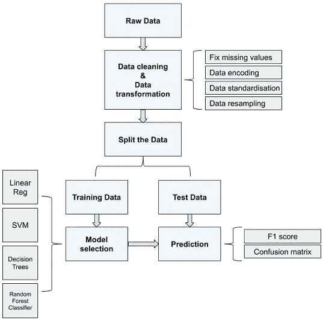
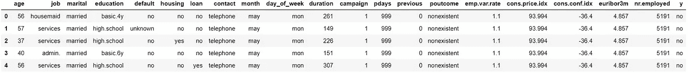
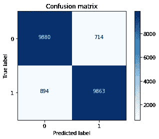

# 面向直接营销的 Python 机器学习分类

> 原文：<https://towardsdatascience.com/machine-learning-classification-with-python-for-direct-marketing-2da27906ddac?source=collection_archive---------6----------------------->


你如何提高业务的时间效率、削减成本并提高销售额？这个问题是永恒的，但不是修辞性的。在接下来的几分钟阅读时间里，我将应用一些分类算法来演示数据分析方法的使用如何有助于实现这一目标。我们将一起创建一个预测模型，帮助我们定制交给电话营销团队的客户数据集，以便他们可以首先将资源集中在更有前景的客户上。

在此过程中，我们将对数据集执行一些操作。首先，我们将对数据进行清理、编码、标准化和重新采样。一旦数据准备就绪，我们将在训练子集上尝试四种不同的分类器，进行预测并用混淆矩阵可视化它们，并计算 F1 分数以选出最佳模型。这些步骤已经放在模式中:



Project’s schema

我们将在这里使用的数据集对这个城镇来说并不陌生，您可能以前就遇到过。41，118 条记录的数据样本由一家葡萄牙银行在 2008 年至 2013 年间收集，包含电话营销活动的结果，包括客户对银行提供的存款合同的回应(二元目标变量“y”)。这种反应正是我们要用模型预测的。数据集[可从加州大学欧文分校的](https://archive.ics.uci.edu/ml/datasets/bank+marketing)机器学习仓库获得。所以让我们开始吧！

结果:



## 数据清理、特征选择、特征转换

“我喜欢把事情一笔勾销”，弗里德里希·尼采说。这是数据清理部分！

使用`df.isnull().sum()`查询，我们确保数据集中没有丢失的值(如果有的话，`df.dropna(subset = ['feature_name'], inplace=True)`会将它们从相关的列中删除)。

在本例中，我使用 Tableau Prep Builder 数据清理工具来跟踪和删除异常值，以确保数字特征中的值不是字符串，重命名一些列并删除一些不相关的列，例如`'contact', 'month', 'day_of_week', 'duration', 'campaign', 'pdays', 'previous' and 'poutcome'`(这些列描述了一个已经发生的电话呼叫，因此不应在我们的预测模型中使用)。

接下来，我们将把分类变量的非数字标签转换成数字标签，并把它们转换成整数。我们这样做:

运行`df.dtypes`查询只是为了确保标签已经变成整数，这是有意义的。然后，我们应用`sklearn.preprocessing`工具箱中的`StandardScaler`来标准化我们期望在模型中使用的其他特征的数值。该方法通过移除平均值并缩放至单位方差来标准化特征:

现在，让我们使用递归特征消除(RFE)方法和随机森林分类器算法作为估计器对数据集的特征进行排序:

输出:

```
Num Features: 6
Selected Features: [ True  True False  True False False  True False  True  True]
Feature Ranking: [1 1 3 1 2 5 1 4 1 1]
```

在稍后的阶段，当我们将建立一个预测模型时，我们将利用这个特性排名。我们将使用该模型，试图找到排名最高的特征的最佳组合，该组合将做出具有令人满意的 F1 分数的预测。展望未来，最佳组合将是:

例如，随着欺诈性信用卡交易或在线活动的结果等分类案例的出现，往往会出现类别失衡的问题。在执行`df['y'].value_counts()`查询后，我们看到变量‘y’的两个类在我们的数据集中也没有被平等地表示。数据清理后，目标变量“y”中有 35584 条属于类“0”的记录，只有 4517 条属于类“1”的记录。在将数据分成训练样本和测试样本之前，我们应该考虑对数据进行过采样或欠采样。

为了对数据进行重新采样，让我们从`imblearn.over_sampling`工具箱中应用`SMOTE`方法进行过采样(对于此步骤，您可能需要先安装带有 Pip 或 Conda 的`imblearn`包):

就这么简单。现在，数据与每个类中的 35584 个条目保持平衡:

输出:

```
[35584] [35584]
```

## 构建预测模型

既然数据已经准备好了，我们就可以训练我们的模型并进行预测了。让我们首先将数据分成训练集和测试集:

我们将尝试四种分类算法，即逻辑回归、支持向量机、决策树和随机森林，然后使用用户定义的`scorer`函数计算它们的 F1 得分，以选择得分最高的分类器:

输出:

```
LogisticRegression F1 score = 0.71245481432799659
SVC F1 score = 0.753674137005029
DecisionTreeClassifier F1 score = 0.7013983920155255
RandomForestClassifier F1 score = 0.923286257213907
```

F1 得分是准确率和召回率的加权平均值。你可以在我的帖子[这里](/accuracy-precision-recall-5c8b8f0abde1)阅读如何解读精度和召回分数。

现在，让我们打印一份完整的分类报告，其中包含随机森林算法的精确度和召回率，该算法已经证明了最高的 F1 分数:

输出:

```
 precision    recall  f1-score   support

           0       0.91      0.93      0.92     10594
           1       0.93      0.91      0.92     10757

   micro avg       0.92      0.92      0.92     21351
   macro avg       0.92      0.92      0.92     21351
weighted avg       0.92      0.92      0.92     21351
```

最后，我们可以用混淆矩阵将结果可视化:

结果:



太好了！我们已经清理并转换了数据，选择了最相关的特征，选出了最佳模型，并做出了一个得分不错的预测。现在，我们有了一个模型，可以帮助我们定制交给电话营销团队的客户数据库，这样他们就可以将精力集中在那些更有条件首先对活动做出肯定反应的人身上。

感谢您的阅读！！