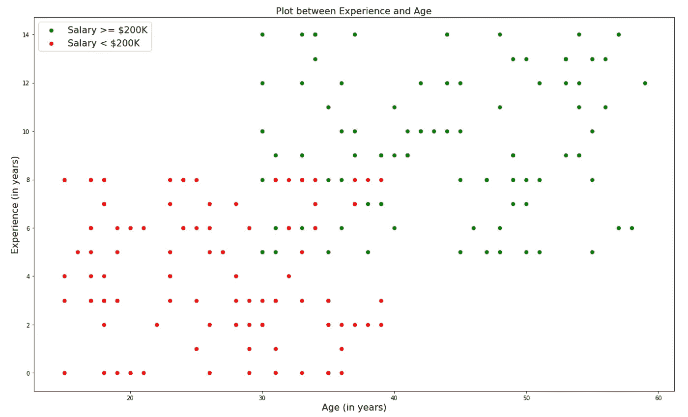
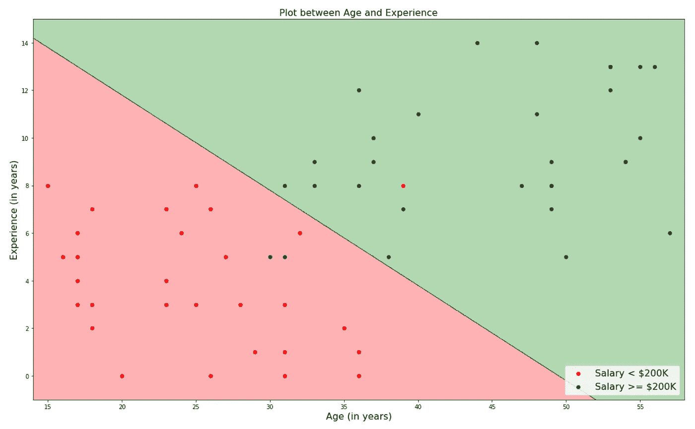
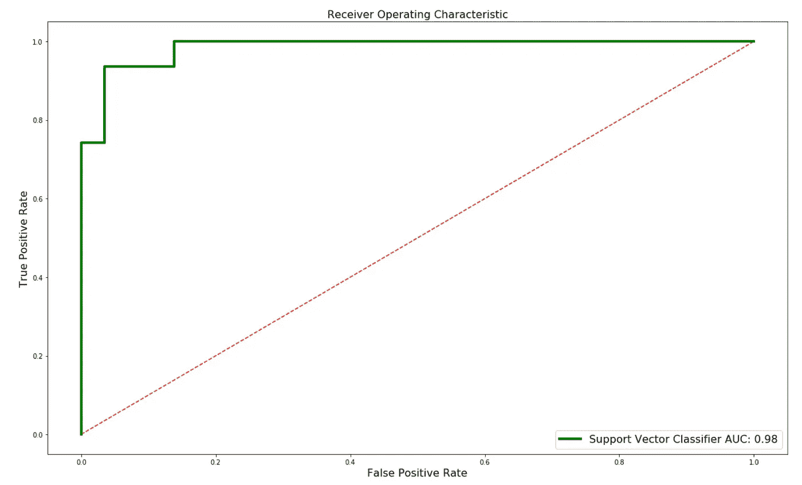
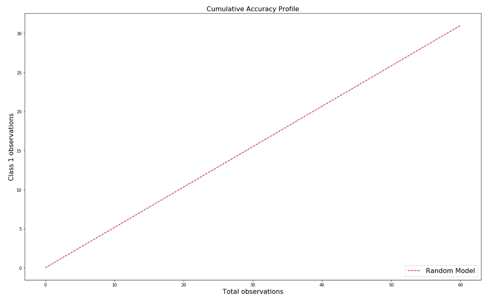
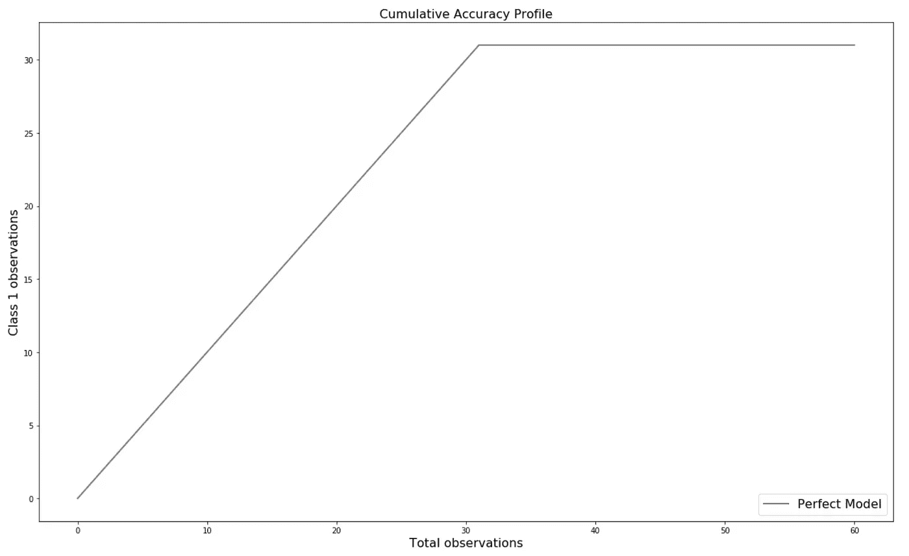
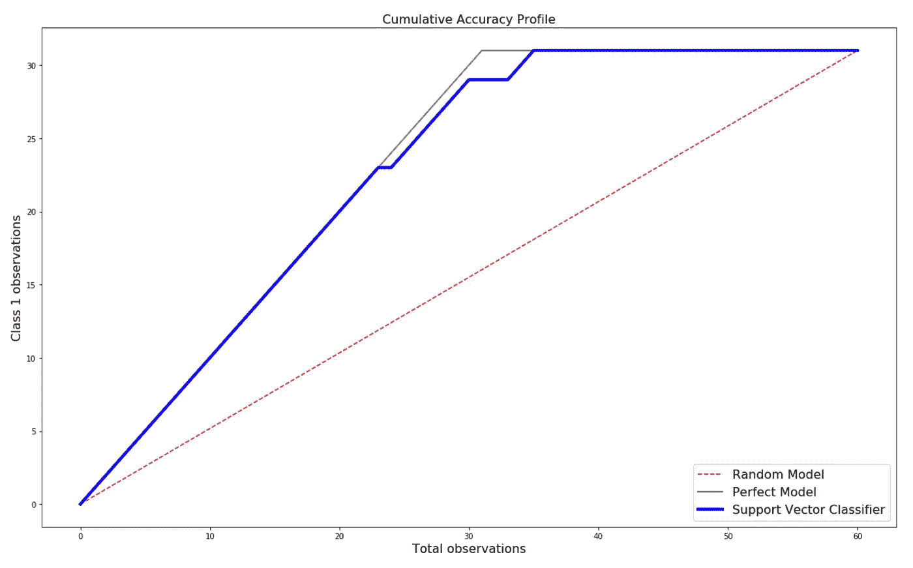
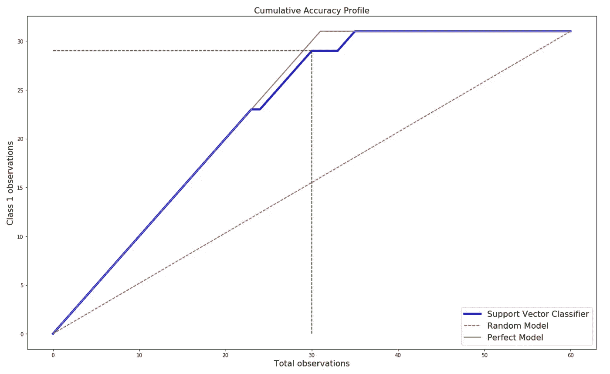

# 使用 ROC 和 CAP 曲线的机器学习分类器评估

> 原文：<https://towardsdatascience.com/machine-learning-classifier-evaluation-using-roc-and-cap-curves-7db60fe6b716?source=collection_archive---------2----------------------->

Photo by [Isaac Smith](https://unsplash.com/@isaacmsmith?utm_source=medium&utm_medium=referral) on [Unsplash](https://unsplash.com?utm_source=medium&utm_medium=referral)

虽然有几个度量标准，如准确性和召回率，来衡量机器学习模型的性能，但 ROC 曲线和 CAP 曲线非常适合分类问题。在本文中，我将探讨什么是 ROC 和 CAP，以及我们如何使用 Python 和虚拟数据集来创建这些曲线。

> *即使在探索了许多关于 CAP Curve 的文章后，我也找不到一篇详细解释如何创建它们的文章，这就是我写这篇文章的原因。*

完整的代码被上传到下面的 GitHub 库。

 [## kb22/ML-性能评估

### 在这个知识库中，我讨论了各种机器学习模型的性能评估指标。…

github.com](https://github.com/kb22/ML-Performance-Evaluation) 

# 资料组

我创建了自己的数据集。有两个特性，`age`和`experience`。基于这两个特征，输出标签为`0.0`表示工资低于 20 万美元，而`1.0`表示工资高于或等于 20 万美元。

Complete dataset

`GREEN`点数代表超过或等于 20 万美元的薪资，而`RED`点数代表低于 20 万美元的薪资。我还确保了这两个类之间有一些重叠，所以数据更真实一些，不容易分离。

# 分类

首先，我将数据分成两组，70%的训练数据和 30%的测试数据。我用`Support Vector Classifier`和`linear kernel`对训练数据进行训练，然后在测试数据上测试模型。该模型取得了 95% 的**评分。**

Classification on Test data

# 性能赋值

## 受试者工作特性曲线

接收器操作特性曲线，更好地称为 **ROC 曲线，**是测量分类模型性能的极好方法。针对分类器预测的概率，将**真阳性率(TPR)** 与**假阳性率(FPR)** 作图。然后，计算地块下的面积。

> 曲线下的面积越大，模型区分类别的能力就越强。

**导入文件并创建基线** 首先，我从`sklearn.metrics`导入`roc_curve`和`auc`，这样我可以创建 ROC 曲线并计算曲线下的面积。我还将图形大小定义为 20x12，并创建一条从`(0,0)`到`(1,1)`的基线。

值`r--`表示线条颜色为红色，是一条虚线(`— — — — — — — — — — — — —`)。

**计算概率并确定 TPR 和 FPR** 接下来，使用`predict_proba`我计算预测的概率并将其存储在`probs`中。它由两列组成，第一列包括第一类的概率(薪金< $20 万)，第二列包括第二类的概率(薪金≥ $20 万)。所以，我用`probs[:, 1]`选择第二类的概率。

`roc_curve`生成 roc 曲线并返回`fpr`、`tpr`和`thresholds`。最后，使用`fpr`和`tpr`作为`auc`中的输入，我计算出该模型曲线下的面积，并将其保存在`roc_auc`中。`roc_auc`现在有了我们的支持向量分类器生成的曲线下的面积。

**绘制 ROC 曲线** 我使用`fpr`作为 x 值和`tpr`作为 y 值绘制曲线，颜色为绿色，线宽为 4。这条曲线的标签包括曲线下的区域。x 轴标签设置为`False Positive Rate`，y 轴标签设置为`True Positive Rate`。标题为`Receiver Operating Characteristic`，图例出现在图的右下角。文本大小设置为 16。

ROC Curve

曲线下面积为 0.98，这真是令人惊讶，提供了我们的模型表现良好的信息。

## 累积精度曲线

CAP 曲线试图分析如何使用最少的尝试次数有效地识别给定类别的所有数据点。在这个数据集中，我试图确定`Support Vector Classifier`能够多快地识别出所有工资高于或等于 20 万美元的个人。

**计算每个类的计数** 首先，我在测试数据(60)中找到总的数据点，并保存在变量`total`中。测试标签要么是`0.0`要么是`1.0`，所以如果我把所有的值加起来，我将得到类`1.0` (31)的计数，我可以把它保存在`class_1_count`中。从`total`中减去这个数将得到`class_0_count` (29)。

我还将图形尺寸设置为 20x12，使其比正常尺寸大。

**随机模型** 首先，我们绘制一个随机模型，该随机模型基于类别`1.0`的正确检测将线性增长的事实。

颜色为`red`，样式为使用`--`定义的`dashed`。我已经将标签设置为`Random Model`。

Random Model

**完美模型**
接下来，我绘制完美模型。一个完美的模型将在与类别`1.0`数据点相同的尝试次数中检测所有类别`1.0`数据点。完美模型需要 31 次尝试来识别 31 类`1.0`数据点。

我把这块地涂成灰色。标签设置为`Perfect Model`。

Perfect Model

**经过训练的模型(支持向量分类器)**
最后，我绘制出`Support Vector Classifier`的结果。首先，像在 ROC 曲线中一样，我提取变量`probs`中类`1.0`的概率。

我把`probs`和`y_test`拉上拉链。然后，我按照概率的逆序对这个 zip 文件进行排序，最大概率排在最前面，然后是较小的概率。我只提取数组中的`y_test`值，并将其存储在`model_y`中。

`np.cumsum()`创建一个值数组，同时将数组中所有以前的值累加到当前值中。例如，如果我们有一个数组`[1, 1, 1, 1, 1]`。应用`cumsum`将导致`[1, 2, 3, 4, 5]`。我用它来计算 y 值。此外，我们需要在数组前面追加`0`作为起始点`(0,0)`。x 值的范围从`0`到`total + 1`。我添加一个，因为`np.arange()`不包括终点，我希望终点是`total`。

然后我用蓝色标出结果，并标上`Support Vector Classifier`。我还将另外两个模型包含在情节中。

Support Vector Classifier

**使用曲线下面积
的 CAP 分析**分析 CAP 曲线的第一种方法是使用**曲线下面积**。让我们考虑随机模型下的面积为`a`。我们使用以下步骤计算准确率:

1.  计算完美模型(`aP`)到随机模型(`a`)下的面积
2.  计算预测模型(`aR`)到随机模型(`a`)下的面积
3.  计算准确率(`AR` ) = aR / aP

准确率越接近 1，模型越好。

使用`auc`，我计算了所有面积，然后使用这些值计算了准确率。该比率约为 0.97，非常接近于 1，表明我们的模型非常有效。

**使用图进行 CAP 分析** 另一种分析 CAP 曲线的方法是读取我们上面生成的图。相同的步骤如下:

1.  从 x 轴的 50%处画一条垂直线，直到它穿过`Support Vector Classifier`图。
2.  在垂直线与训练模型相交的点上，画一条水平线，使其与 y 轴相交。
3.  计算 1 类标签占 1 类标签总数的百分比。

一旦我们知道了百分比，我们就可以用下面的括号来分析它。低于 60%:垃圾型号
2。60% — 70%:差模
3。70% — 80%:好型号
4。80% — 90%:非常好的型号
5。超过 90%:好得难以置信
请注意，如果该值超过 90%，测试过度拟合是一个很好的做法。

首先，我通过计算总测试数据的 50%的 int 值来找到索引。我用它来画一条从这个点到训练好的模型的垂直虚线(`— — —`)。接下来，我画出从这个交点到 y 轴的直线。我通过将目前观察到的类`1.0`值除以总的类`1.0`数据点并乘以 100 来确定百分比。我得到的值为 **93.55%** 。

CAP Curve Analysis

尽管百分比是 93.55%，大于 90%，但结果是预期的。正如我们在开始时看到的数据集和分类，该模型在拆分数据方面非常有效。虽然我对测试数据使用了 CAP 分析，但我们也可以对训练数据使用同样的方法，并分析我们的模型对训练数据的了解程度。

# 结论

本文总结了如何用 Python 计算 ROC 曲线和 CAP 曲线，以及如何对它们进行分析。

请随时分享你的想法和想法。与 ROC 和 CAP 一起工作对我来说也是全新的，所以请分享我可能错过的任何信息。感谢阅读！