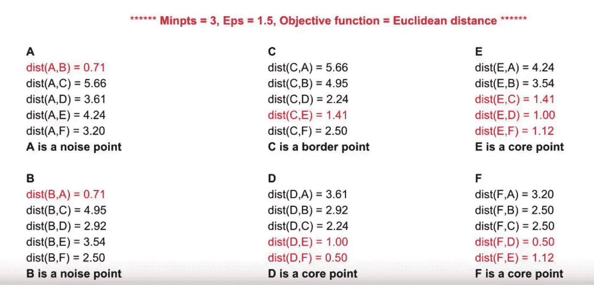
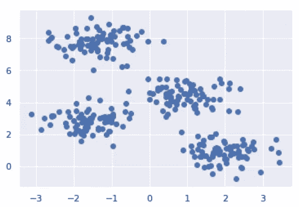
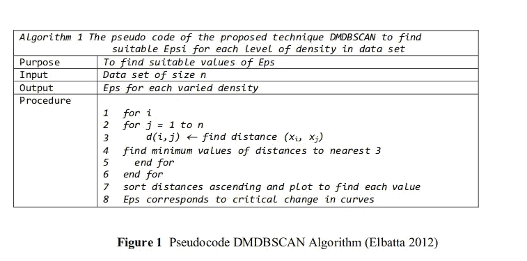
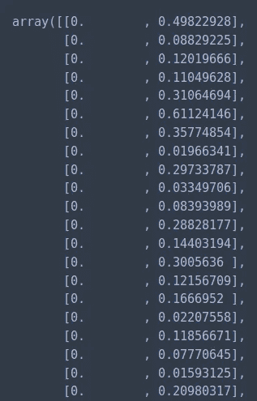
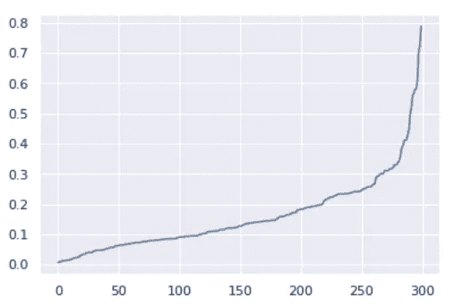
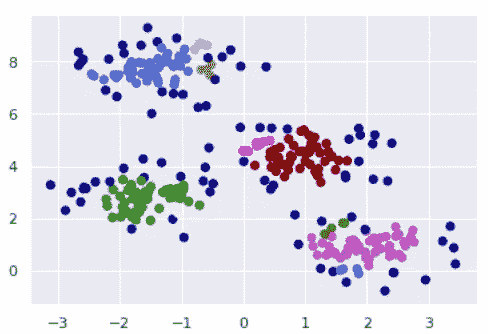

# DBSCAN Python 示例:Epsilon (EPS)的最佳值

> 原文：<https://towardsdatascience.com/machine-learning-clustering-dbscan-determine-the-optimal-value-for-epsilon-eps-python-example-3100091cfbc?source=collection_archive---------1----------------------->


[https://www.pexels.com/photo/a-boy-holding-a-chalk-5212334/](https://www.pexels.com/photo/a-boy-holding-a-chalk-5212334/)

DBSCAN，即基于密度的带噪声应用空间聚类，是一种无监督的机器学习算法。无监督的机器学习算法用于分类未标记的数据。换句话说，用于训练我们的模型的样本没有预定义的类别。与其他聚类算法相比，DBSCAN 特别适用于需要以下条件的问题:

1.  确定输入参数的最少领域知识(即 k-means 中的 **K** 和层次聚类中的 **Dmin**
2.  发现任意形状的团簇
3.  大型数据库的良好效率

如果你对阅读 DBSCAN 感兴趣，可以在[这里](http://www2.cs.uh.edu/~ceick/7363/Papers/dbscan.pdf)找到原文。

# 算法

与大多数机器学习算法一样，模型的行为由几个参数决定。在接下来的文章中，我们将触及三个问题。

*   **eps** :如果两点之间的距离低于阈值ε，则认为这两点是相邻的。
*   **min_samples** :一个给定点为了被分类为核心点而应该拥有的最小邻居数量。**需要注意的是，点本身包含在最小样本数中。**
*   **度量**:计算特征数组中实例间距离时使用的度量(即欧几里德距离)。

该算法通过计算每个点和所有其他点之间的距离来工作。然后，我们将这些点分为三类。

核心点:至少有 ***个 min_samples*** 个点的点，这些点相对于该点的距离低于由ε定义的阈值。

边界点:至少与 ***min_samples*** 点不接近，但与一个或多个核心点足够接近的点。边界点包含在最近核心点的群集中。

噪声点:离核心点不够近的点被认为是边界点。噪声点被忽略。也就是说，它们不属于任何集群。



# 密码

让我们看看如何用 python 实现 DBSCAN。若要开始，请导入以下库。

```
import numpy as np
from sklearn.datasets.samples_generator import make_blobs
from sklearn.neighbors import NearestNeighbors
from sklearn.cluster import DBSCAN
from matplotlib import pyplot as plt
import seaborn as sns
sns.set()
```

与导入数据相反，我们可以使用`scikit-learn`来生成定义良好的集群。

```
X, y = make_blobs(n_samples=300, centers=4, cluster_std=0.60, random_state=0)
plt.scatter(X[:,0], X[:,1])
```



如前所述，我们必须为ε提供一个值，它定义了两点之间的最大距离。下面的文章描述了一种自动确定 Eps 最佳值的方法。

[https://IOP science . IOP . org/article/10.1088/1755-1315/31/1/012012/pdf](https://iopscience.iop.org/article/10.1088/1755-1315/31/1/012012/pdf)

通俗地说，我们通过计算每个点到最近的 ***n*** 点的距离，对结果进行排序和作图，从而为ε找到一个合适的值。然后我们观察变化最明显的地方(想想你的手臂和前臂之间的角度),并选择它作为ε。



我们可以使用`NearestNeighbors`来计算每个点到最近邻点的距离。点本身包含在`n_neighbors`中。`kneighbors`方法返回两个数组，一个包含到最近的`n_neighbors`点的距离，另一个包含这些点的索引。

```
neigh = NearestNeighbors(n_neighbors=2)nbrs = neigh.fit(X)distances, indices = nbrs.kneighbors(X)
```



接下来，我们对结果进行排序和绘图。

```
distances = np.sort(distances, axis=0)distances = distances[:,1]plt.plot(distances)
```

ε的最佳值将在最大曲率点找到。



我们训练我们的模型，选择`0.3`为`eps`，设置`min_samples`为`5.`

```
m = DBSCAN(eps=0.3, min_samples=5)m.fit(X)
```

`labels_`属性包含集群列表和它们各自的点。

```
clusters = m.labels_
```

然后，我们将每个单独的聚类映射到一种颜色。

```
colors = ['royalblue', 'maroon', 'forestgreen', 'mediumorchid', 'tan', 'deeppink', 'olive', 'goldenrod', 'lightcyan', 'navy']vectorizer = np.vectorize(lambda x: colors[x % len(colors)])
```

该模型对人口密集区进行了分类。正如我们所见，所有深蓝色的点都被归类为噪声。

```
plt.scatter(X[:,0], X[:,1], c=vectorizer(clusters))
```



# 最后的想法

与 k-means 不同，DBSCAN 会计算出聚类数。DBSCAN 的工作原理是确定最小数量的点是否彼此足够接近以被视为单个聚类的一部分。DBSCAN 对比例非常敏感，因为ε是两点之间最大距离的固定值。