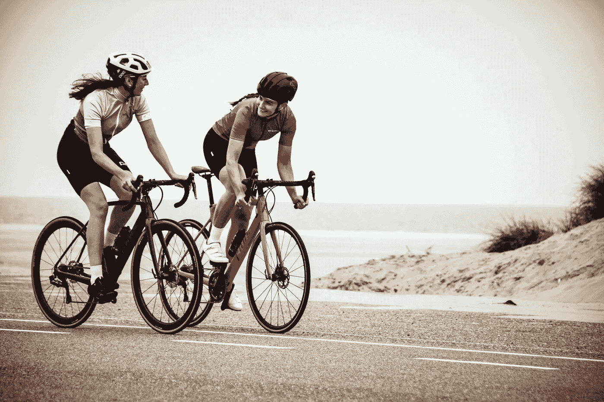
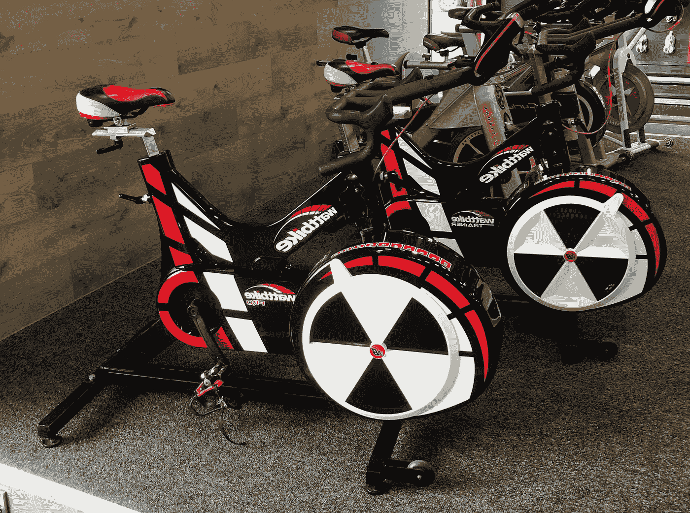
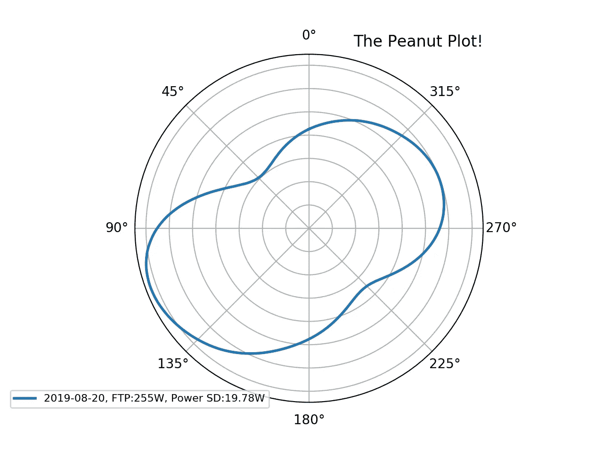
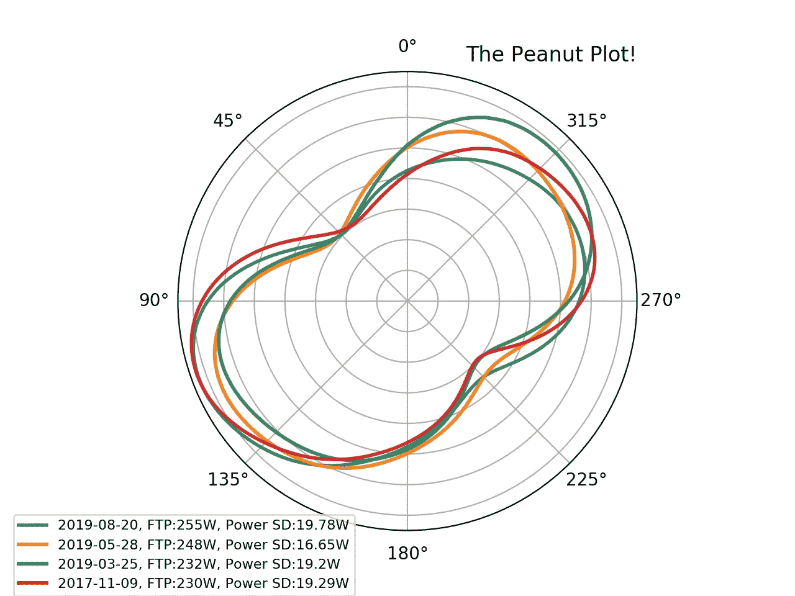
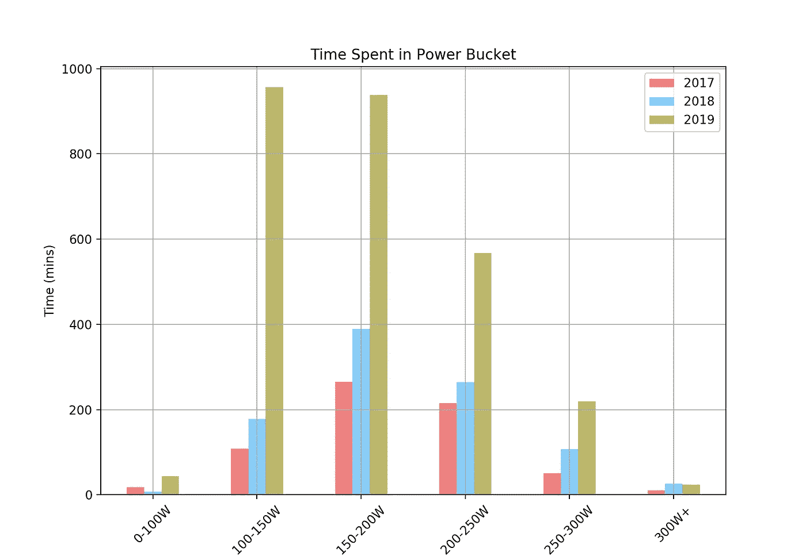
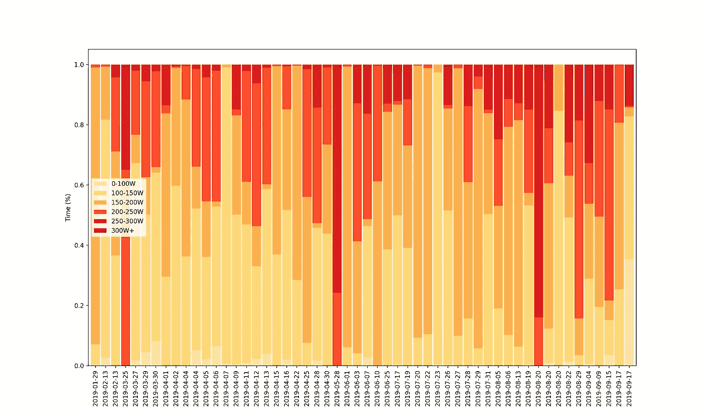
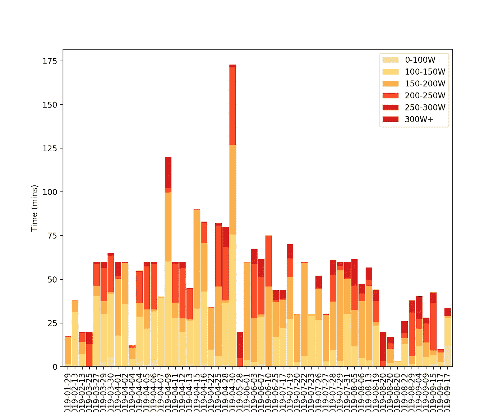
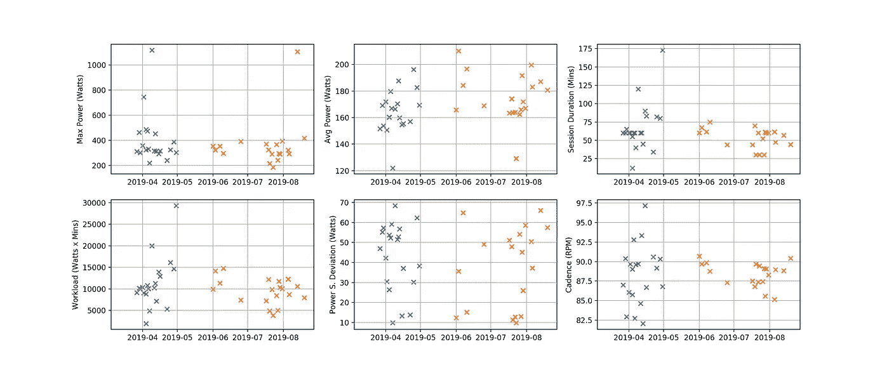

# 机器学习、骑自行车和 300W FTP(第一部分)

> 原文：<https://towardsdatascience.com/machine-learning-cycling-300w-ftp-part-1-2abb04b30036?source=collection_archive---------13----------------------->

## 寻找更好的体育锻炼方法

Credit: Coen Van Den Broek

我不时地骑自行车。我说的是公路自行车。我不是职业选手，我也不想成为——但是我喜欢竞争，我喜欢比赛，我喜欢挑战。

原来骑自行车是一项与数据纠缠不清的运动。从功率计到心率监测器，追踪这项运动变得很容易。

A Wattbike Trainer

使用我自己的 106 次 Wattbike(室内教练)旋转训练的数据集，这一系列文章的目的是了解我的表现的重要特征。我希望能够利用这些信息来实现我的目标:300 瓦的 FTP。

我会尽可能多的把工作喂给 ***野兽*** (ML)。

所有代码都在 [GitHub](https://github.com/93tilinfinity/wattbike-analysis) 上。

# **F***警察？！**

不，不完全是。**功能阈值功率(FTP)** 代表骑手可以维持一小时的功率，以瓦特为单位，通常计算为 20 分钟全力测试平均功率的 95%。

基于 20 分钟会话的计算似乎是任意的，但这是为了易于复制和方便起见。 **FTP** 与大多数骑自行车的人相关，是评估你短期和长期努力的基础。

如果你想了解更多，请点击这里查看 BikeRadar 的文章。

# **从 255 瓦开始**

Figure 1: Session Average Distribution of Power over a Revolution

截至 2019 年 8 月 20 日，我记录了一个 255 瓦的 FTP，重 87 公斤。也就是说，我在 Wattbike 上 20 分钟内平均输出 268 瓦(其中 95%是我的 FTP 读数)。鉴于我的体重，我猜这可能是平均水平。

# 我以为这是关于权力的，你为什么要谈论花生？

你可能想知道如何推动踏板转化为权力。在任何物理系统中，功率都表示为力和速度的乘积。在自行车运动中，这个等式告诉我们:

**力量=蹬力 x 腿速**

**步频**，以每分钟转数(rpm)衡量，代表腿部速度，对于单次 360 度腿部旋转，上面的花生状**极坐标图**显示了在会话中每次旋转平均的每个角度的**切向力**。

Zwatt 团队和 Wattbike 团队都有关于主题[这里](https://teamzwatt.com/training/best-way-to-visualize-cycling-dynamics/)和[这里](https://support.wattbike.com/hc/en-gb/articles/115001848609-A-Beginner-s-Guide-To-Perfect-Pedalling)的作品(分别)。

# **好吧，那有什么变化呢？**

Figure 2: Polar plots for 4 different 20 Minute Tests

每条线代表完成的 20 分钟最大努力测试，首先在 2017 年，然后在 2019 年再进行三次测试。虽然极坐标图确实显示了变化，但现在，我对 FTP 的变化感兴趣。

1)**+2W**2017 年 11 月 9 日至 2019 年 3 月 25 日改进。

2)**+16W**2019 年 3 月 25 日至 2019 年 5 月 28 日改进。

3)**+7W**2019 . 5 . 28-2019 . 8 . 20 改善。

2019 年 3 月至 8 月是行动的开始。

反思期，没有一个训练目标。然而，我确实试图坚持训练，并且每次都或多或少地使用预定义的 Wattbike 应用程序会话。该应用程序跟踪一系列变量，包括训练过程中的距离、节奏和力量。数据集说明了什么？

# **2019，低强度训练年**

Figure 3: Distribution of Time Spent in Bucketed Power Zones

嗯，今年我确实找到了更多的时间去骑车。

根据图 3 中的分布图，相对于其他类别，我已经在**100–150 w**类别中花费了更多的时间。尽管骑自行车的时间更多，但与 2018 年相比，今年到目前为止，我花在测试我的功率极限( **300W+** 类别)上的时间更少。我没想到会这样。

Figure 4: Proportion of Ride Duration in each Power Zone.

添加一个日期维度，只观察今年记录的时段，上面的堆积条形图显示了每个动力区类别花费的每次乘坐时间比例。红色大竖条与之前在花生地里进行的 20 分钟 FTP 测试相吻合。

# **+16W vs+7W——我做了哪些不同的事情？**

通过 3 个 FTP 测试分离情节，我们剩下两个时期，创造性地，我将它们称为**时期 1** 和**时期 2** 。

**第一阶段:**9 周内 19 次会议(3 月 25 日-5 月 28 日)。

**第二阶段:**12 周内 20 次会议(5 月 28 日—8 月 20 日)。

该图说明了在**周期 1** 中的会话的特点是花费在**200-250 w**和**100-150 w**区域中的时间比例较大，并且几乎没有时间测试我的功率极限的上限。

换句话说，黄色的**多，深红色的 *少。***

****

**Figure 5: Absolute Ride Duration split by Power Zone.**

**在**绝对时间**而不是**相对时间**中绘制图 4 揭示了更多好东西。看看上面，有什么让你印象深刻的？**

**a) **更长的乘坐持续时间**在**周期 1 中展现。****

**b)在**周期 1** 中，计时超过 200 w15 分钟的更多会话**。****

**c)在**100-150 w**区域内，大多数**周期 1** 时段计时 **25 分钟以上**。**

# ****持续时间、工作量&节奏****

****

**Figure 6: Max Power, Average Power, Session Duration, Workload, Power Standard Dev & Cadence Scatterplots (top left to bottom right, period 1 = blue, period 2 = orange).**

**在图 6 中，我们绘制了周期之间的六个进一步的指标(周期 1 =蓝色，周期 2 =橙色),并揭示了以下内容:**

**1)**

****2) ***平均功率*** —没有明显差异，但是在周期 2 会话中可能维持稍高的平均功率。****

****3) ***会话持续时间*** — **获胜者** —在周期 1 中会话长度的变化更大，更短和更长的会话都是如此。****

****4) ***工作量*** — **赢家** —第 1 期利用了更多的工作量变化。我将工作负载定义为平均功率乘以会话持续时间，代表会话的总强度。****

****5) ***功率标准差*** —这是为了区分持续努力(低标准 dev)和间歇会话(高标准 dev)。两个时期都显示混合会议。嗯，没有明显的区别。****

****6) ***节奏*** — **优胜者** —第一期以更大范围的节奏训练。****

****对 Wattbike 课程的一些探索性数据分析已经突出显示了(获胜者)一些有趣的途径，可以探索有关训练**强度、节奏**和**持续时间**的内容。****

> ****要达到 300 瓦的 FTP，我至少要接受多少专业训练？****

****我们还没喂 ***野兽*** (do ML) 但是回到目标，还是有那么多要回答的。****

> ****什么时候训练时间变得无关紧要了？我的饮食是什么样的？睡眠模式如何影响训练？精神状态和压力起什么作用？****

****还有很多生活方式的因素在起作用——我认识到，我仅凭权力得出的结论是不确定的。****

# ****接下来呢？****

****在把数据扔给 ML 之前，我想深入挖掘一下我的**心率**和**睡眠**数据集。如果我能够将这些数据集以菊花链的方式连接在一起，并与我已经拥有的电力数据保持一致，那就更好了。****

****我不知道他们会透露什么，但我迫不及待地想知道——我将在第 2 部分记录我的发现。请随意提出任何建议或您自己的结果。****

# ******问题不在于我训练了多少时间，而在于我在这段时间里做了什么。******

****这部作品的驱动者是 ***个性化*** 。****

****我们每个人对身体压力的反应不同，需要不同的恢复程度，有自己的伤害，活动水平，饮食和生活方式——所以我们真的应该期待关注甚至不了解我们的网站会有好的结果吗？****

*******个性化结果怎么样？*******

****研究对于分享知识来说是很棒的，但是我不想要一个 100 人的样本的结果，他们不是我的年龄，不是我的种族，不分享我的生活方式，也没有我的伤害。****

****最初纯粹是一个物理目标，现在变成了一个练习，学习是什么让一个人成功，了解优势和针对弱点。在此过程中利用尽可能多的数据。****

****更重要的是，**这个原理是运动不可知的**。对我来说是骑自行车，但对你来说可能是抱石，对他来说可能是减肥，对她来说可能是橄榄球。****

****欢迎来到自我意识的时代。****

*****导出并可视化代码:* [*github*](https://github.com/93tilinfinity/wattbike-analysis)****