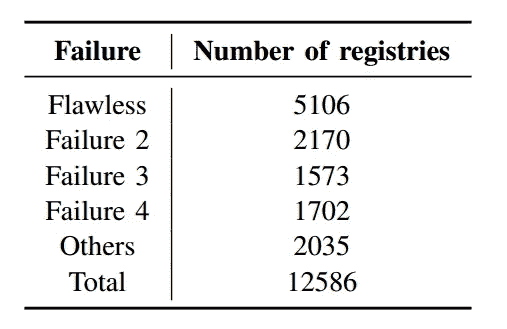
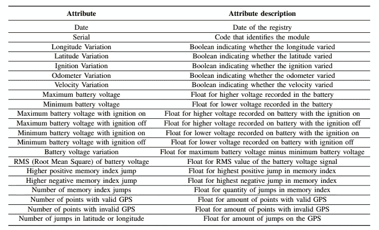
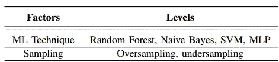
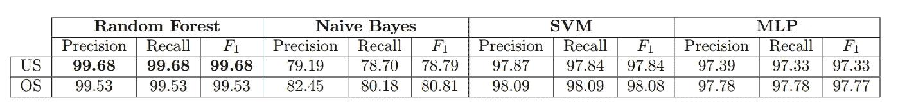
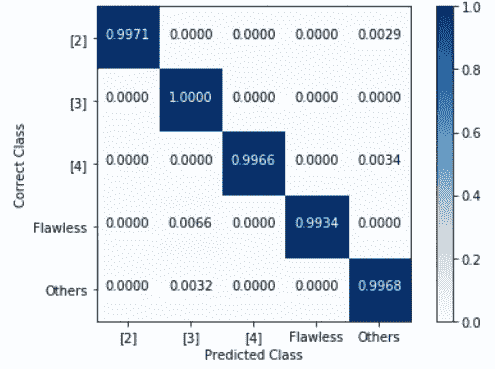

# 机器学习——诊断车队跟踪器的故障

> 原文：<https://towardsdatascience.com/machine-learning-diagnosing-faults-on-vehicle-fleet-trackers-56b123d77cf5?source=collection_archive---------19----------------------->

## 本文提出了一种数据驱动的解决方案来诊断车队跟踪模块的故障。

Figure 1: [https://www.shortlandinsurance.com/module_resources/page_management/36/Fotolia_37500680_L.jpg](https://www.shortlandinsurance.com/module_resources/page_management/36/Fotolia_37500680_L.jpg)

# 介绍

许多运输和物流公司使用模块来跟踪他们的车辆，一些模块不能按预期工作并不罕见。例如，可能需要丢弃追踪器，可能会收集到车辆的错误数据，或者可能会将技术支持人员派到很远的地方去分析问题。因此，有必要对这些模块进行远程故障诊断，因为当它们出现故障时，可能会造成经济损失。

由于这些模块不断地向数据库发送数据，本研究的目的是使用这些数据来诊断模块上的故障。有必要开发一种方法来预处理由车辆模块发送的收集数据。在此之后，机器学习技术被应用于创建模型，模型被分析和比较。但是，错在哪里呢？

故障是系统的至少一个属性或特征参数的不允许的偏差[1]。诊断故障有三个步骤，即:

1.  **故障检测**:是故障诊断最基本的任务，用于检查系统中的故障或失效，并确定故障发生的时间；
2.  **故障隔离**:隔离的作用是检测故障的位置或者是哪个部件有缺陷；
3.  **故障标识**:该标识用于确定故障的类型、形式和大小。

通常，故障识别过程只包括故障检测和隔离(FDI)。这并没有否定故障识别的效用。然而，如果不涉及重新配置动作，这个过程可能不是必需的[2]。

# 发展

首先，要执行任何机器学习解决方案，都需要数据。在本案例研究中，一家巴西物流公司提供了许多追踪器发送的一些数据，**因此所有使用的数据都是真实的。**

## 问题描述

安装在车辆中的模块在整个运行期间发送数据。该公司提供了 12586 个注册表。该公司提供了 12586 个注册表。注册表由一个模块在一天内传输的所有数据组成。平均每个模块每天发 1116.67 分。每个点有八个属性:

*   **电池电压**:车载电池电压的浮动值；
*   **经度**:车辆经度的浮点值；
*   **纬度**:车辆纬度的浮点值；
*   **点火**:表示点火
    是否打开的布尔值；
*   **里程表**:车辆里程表的浮点值；
*   **GPS 信号**:表示 GPS 信号
    是否有效的布尔值；
*   **速度**:车速的浮点值；
*   **内存索引**:模块中
    点保存的内存位置的整数值。

因为模块根据每个模块以不同的频率定期发送数据，所以每个注册表具有不同的大小。这样，每个注册表的大小就是发送的点数乘以 8(属性的数量)。

目的是识别注册中心可能存在的错误或其是否正常工作。这样，这是一个多类分类问题，这里有八类；一类为无故障的注册表，七种可能的故障，如下所列:

*   **故障 1** :脉冲设置错误；
*   **故障二**:里程表锁定；
*   **故障三** : GPS 锁定；
*   **故障 4** :点火线释放；
*   **故障 5** :加速计故障；
*   **故障 6** :模块缓冲有问题；
*   **故障 7** : GPS 出现位置跳变；

这些故障中的一些有几次出现得太低。不足 3%的瑕疵都被贴上了“其他”的标签。每个故障的数据量可以在左边看到。

## 数据预处理

因为特征提取过程是一项大规模的工作，会显著影响最终结果[3]。这种方法使用来自系统的知识来执行数据转换，以显著降低数据维度。

初始属性是时间序列(电池电压、纬度等。)，从它们中，我创建了 21 个新属性，如下表所示。此后，数据转换将原始数据从二维转换为一维。这些新属性中的大多数都可以很容易地计算出来，因此没有复杂的公式或算法。

New Attributes description table.

大多数属性都是二进制的，所以不需要规范化。然而，诸如点数、关于电池电压的数据和存储器索引中的跳跃之类的属性可以被标准化。由于没有对异常值进行分析，传统的归一化会导致数据被一些高值所抑制，因此使用 RobustScaler。此缩放器使用第一个和第三个四分位数作为约束，而不是最大值和最小值，因此这种归一化更健壮，并保留了异常值。

由于某些属性可能与其他属性高度相关，因此计算了所有可能的相关性。经度和纬度变化具有 0.996315 的皮尔逊相关性，这在大多数 ML 项目中建议我们应该丢弃这些属性中的一个。然而，由于模型的目标是诊断模块的 GPS 中的故障，尽管相关性很高，但这两个属性都是有用的。

而且，点数和 GPS 无效的点数有很高的相关性，0.962769。这是因为点数是有效 GPS 点数与无效 GPS 点数之和。因此，由于这种线性组合，属性“点数”被丢弃。最后，日期和序列字段也被丢弃，因为它们用于识别车辆和模块，并且不提供关于模块操作的任何信息。

# 训练 ML 模型

为了运行算法，数据集被分成训练集和测试集。对于每个实验，20%的注册表用于测试，80%用于训练。

我想找出哪种传统算法更适合这种数据，所以我测试了过采样和欠采样的每种算法。

考虑到最大似然技术，所有的随机森林都使用 100 个估计器，所有的最大似然都使用架构(5，10，5)，lr = 0:001 和 200 次最大迭代。

获得的指标可以在下表中看到:

通过过采样，随机森林的归一化混淆矩阵如下所示:

除了最大似然技术的评价指标，还计算了模型的训练和评价时间。在最坏的情况下，这个时间是 0.37 *ms* ，在这个案例研究中，这个时间可以被认为是应用程序
的实时响应。

# 结论

正如所提出的，这些模型可以检测和识别具有高性能指标的车队跟踪模块上的故障。然而，有广泛的功能工程，可以由 LSTM 或 CNN 自动执行。我也，做了一些 CNN 的模型来做这个故障诊断，也许我会在下一篇文章中详细介绍。

所采用的方法的局限性包括模型不能发现未被映射的故障，因此任何未被学习的故障将被错误地分类为已知故障之一。

和文章中一样，这里没有任何代码，你可以在我的 GitHub 库中随意查看。

 [## lmeazzini/Tracker-故障诊断

### 故障诊断模型检测和识别车队跟踪模块上的故障。…

github.com](https://github.com/lmeazzini/Tracker-fault-diagnosis) 

# 参考

[1] D. van Schrick，“关于
监督、故障检测和诊断领域术语的说明”，IFAC 会议录
卷，第 30 卷，第 18 期，第 959-964 页，1997 年。

[2] D. Wang 和 W. T. Peter，“基于移动平均磨损退化指数
和一般
顺序蒙特卡罗方法的泥浆泵预测”，机械系统和
信号处理，第 56 卷，第 213–229 页，2015 年。

[3] L. Wen，X. Li，L. Gao，Y. Zhang，“一种新的基于卷积
神经网络的数据驱动故障诊断方法”，
IEEE Transactions on Industrial Electronics，vol. 65，no. 7，
PP . 5990–5998，2018，