# 机器学习——不要仅仅依赖你的大学

> 原文：<https://towardsdatascience.com/machine-learning-dont-just-rely-on-your-university-bce2571dead1?source=collection_archive---------31----------------------->

## 正式课程和网络课程之间的巨大差异

Photo by [Andrew Neel](https://unsplash.com/@andrewtneel?utm_source=medium&utm_medium=referral) on [Unsplash](https://unsplash.com?utm_source=medium&utm_medium=referral)

# 在大学学习的问题是

将机器学习整合到预测分析中一直是高需求的，这为企业提供了竞争优势。这个热门话题受到了全世界大学生的高度关注。然而，在大学中正式介绍机器学习的概念和技术可能会证明对普通本科生来说极其令人生畏。

在麦吉尔大学的本科冬季交流期间，我报名参加了他们的 [***应用机器学习***](https://cs.mcgill.ca/~wlh/comp551/) 课程。是的，我报名参加研究生水平的课程是愚蠢的！它始于线性回归的引入，因为它是最基本的机器学习算法。导师做了很好的工作，试图解释算法背后的直觉。

但在介绍了算法背后的大量数学之后，最后一击是“哦，顺便说一下，作业 1 已经完成了，10 天后到期，鼓励你用 Python 来完成它，下节课见。”

我怎么可能在 10 天内学会 L2 正则化和用随机梯度下降拟合回归模型的概念！我甚至不知道如何用 Python 编码！

我已经被第二次演讲淹没了，我立即退出。在那门课程中，**需要扎实的统计学、微积分、线性代数和编程背景知识**。果然，在第一次介绍性讲座中，这四个要素立即被引入。

我是许多学生中的一员，通过寒暑假学习并忘记了大部分的数学概念，这一点也没有帮助。

# 在线课程的发现

我不允许一点小挫折摧毁我对数据科学的兴趣，我开始在网上搜索对“足够感兴趣”的公众足够友好的教授机器学习的资源。有很多很棒的在线课程，有些是免费的，有些是付费的，有些是正式认证的。我选择付费课程是因为我从提供付费课程的老师那里找到了真正的激情。

我报名参加的在线课程是基里尔·叶列缅科的 [***机器学习 A-Z:数据科学中的动手 Python&R***](https://www.udemy.com/course/machinelearning/)。

Kirill 在课程中介绍的所有算法中提供了易于理解的直觉，即使是高中生也能理解，这方面做得非常出色。所有介绍的算法都辅以实际操作的编码会话，使用接近真实生活的数据，帮助我可视化并理解其意义。

受到激励，我重新注册了我家乡大学的另一门机器学习课程，并发现随着我直觉基础的建立，这门课程变得容易多了。

在接下来的部分中，我想提供一些我在大学里所学和所学之间的对比。我希望这篇文章能够激励那些正在考虑将他们的学习延伸到大学之外的人，或者在机器学习领域寻求进一步知识的工作专业人员。

**免责声明:**以下比较仅限于 2 个来源提供的学习资料:我的大学和 Kirill 的机器学习课程。从今以后，我为下面这篇文章中的偏颇观点道歉，这不应该被视为所有正式学习和在线学习中的普遍现象。

# 那么有什么不同呢？

为了说明正式学习和在线课程之间的区别，让我们看看几个常见的机器学习概念，并看看它在我的大学中是如何解释的，与 Kirill 的课程是如何处理的。以下列表是我在大学时发现很难理解的东西的快照，但在我观看 Kirill 的视频时完全被揭穿了。

## 线性回归

这就是我的大学试图在他们的演讲幻灯片中解释线性回归的方式:

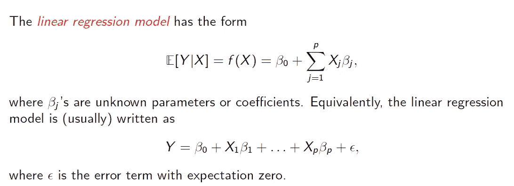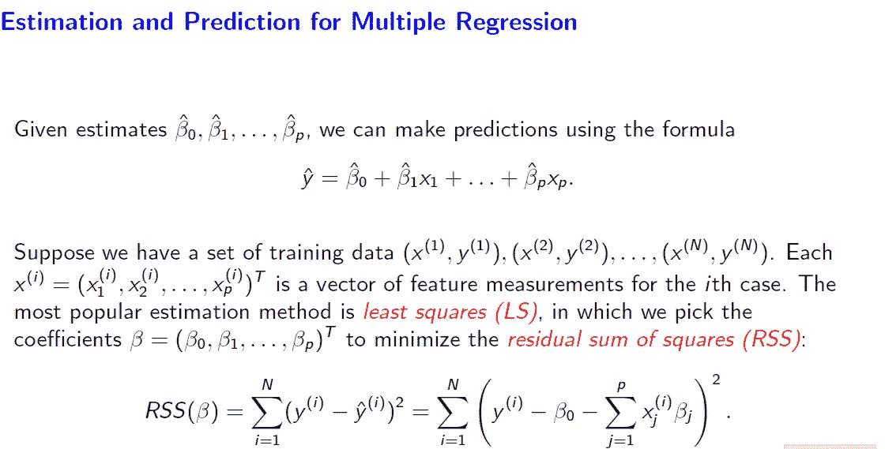

Throwing in mathematical notations as a general introduction to linear regression makes it difficult to understand (Credits: Pun Chi Seng Patrick)

对有经验的人来说，这是小事一桩。但是对于任何一个刚刚开始学习统计学和微积分的人来说，消化这些信息需要相当长的时间，尤其是在缺乏好的视觉效果的情况下。

另一方面，在线课程通过一步一步的动画解释直接切入业务问题:

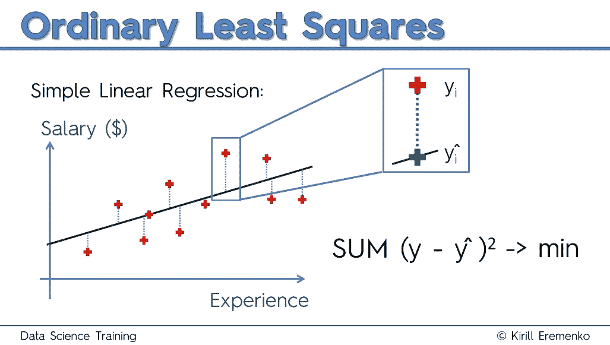

Explaining the relationship of working experience and salary makes the intuitive understanding of simple linear regression so much easier (Credits: Kirill Eremenko)

一个简单的 3 分钟视频解释了普通最小二乘法背后的直觉，足以让任何人明白它的意义。

## 使用 R 平方统计评估线性回归模型

R 平方统计，也称为拟合优度，广泛用于评估线性回归模型。下面红色的**句子完美地总结了 R 平方统计的使用:**

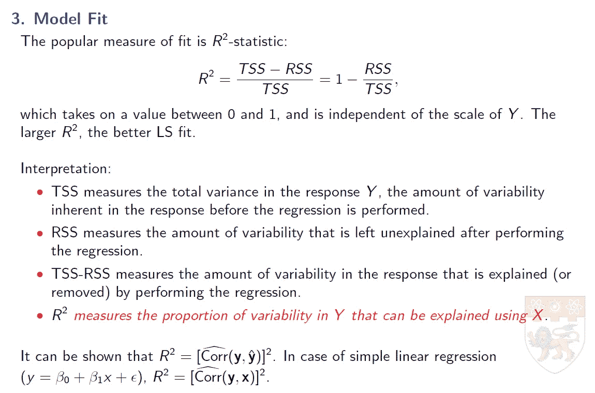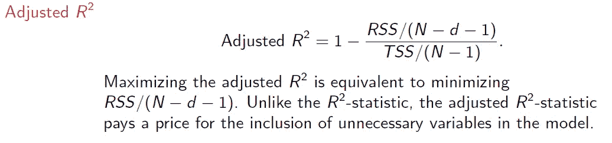

Explaining the use of R-squared statistics to evaluate generalized linear regression models ((Credits: Pun Chi Seng Patrick)

然而，我发现从 Kirill 的课程中呈现的视觉效果来理解要容易得多:

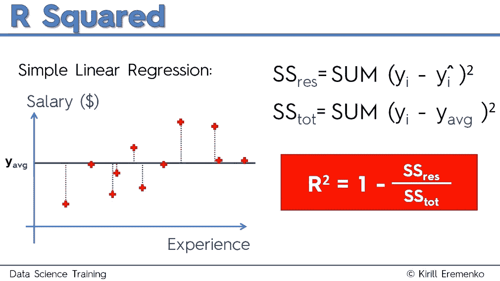

A visual representation of R-squared statistics presented by Kirill (Credits: Kirill Eremenko)

通俗地说，R 平方统计就是将最佳拟合线与“最差拟合线”进行比较，后者是数据的恒定平均值。残差平方和越低，R 平方值越高。调整后的 R 平方增加了与模型无关的额外预测因子的惩罚，适用于多元线性回归模型。

## 支持向量最大间隔分类器

在我大学的机器学习课程中，理解支持向量机的概念显然是最难的任务。沉重的数学的轰炸，让我们似乎不可能耐着性子一口气理解概念。请看下面关于最大间隔分类器的摘录信息:

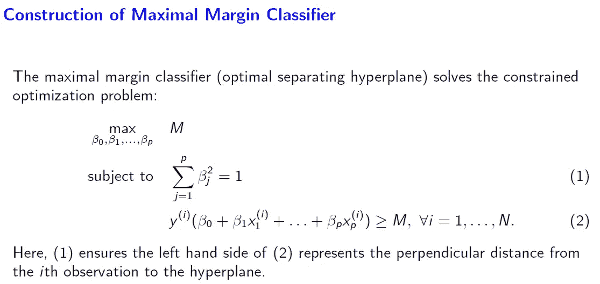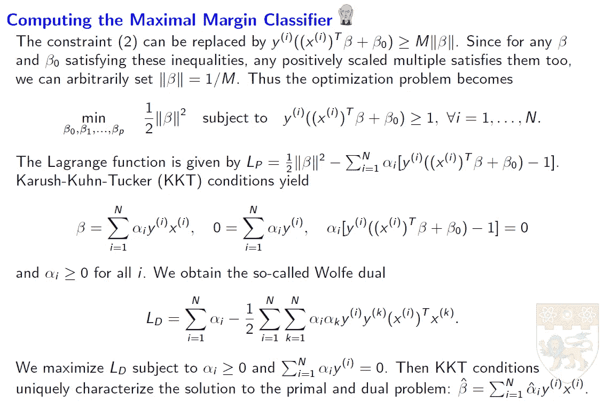

The heavy math behind the computation of a maximal margin classifier (Credits: Pun Chi Seng Patrick)

现在，相比之下，我们看到了基里尔的一个简单插图是如何抓住最大间隔分类器的直觉的妙处:

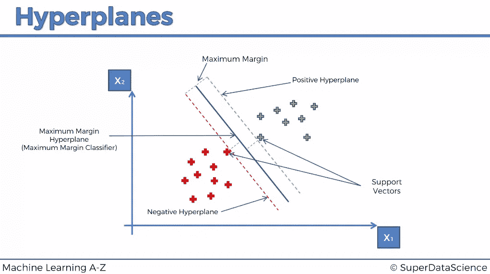

Credits: Kirill Eremenko

好吧，你明白了，我还可以做很多比较，但是我会让你不无聊的！到现在为止，你可能认为你从网上学习中会比在大学里接受正规教育受益更多。但就个人而言，我觉得完成大学的机器学习课程比仅仅完成 Kirill 的课程更有就业价值。

# 但是正规学习也没那么差吧？

没有最终项目，机器学习课程是不完整的。Kirill 的课程用 Python 和 R 语言提供了易于理解的直觉和示例代码，供学习和遵循。完成他的教程让我很满意，我可以用一系列机器学习算法进行预测。

但这还不够。

## 期末专题评分的重要性

正式学习和网上学习的区别在于一个分等级的期末项目。我们的任务是从公开可用的数据集设计一个机器学习问题。下面的流程图强调了处理与真实世界应用非常相似的良好机器学习项目的过程:

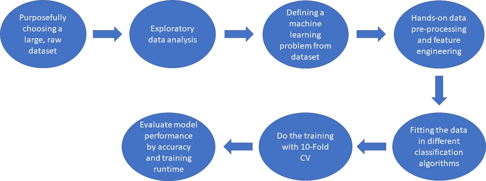

我们在公共数据集建模方面的实践经验得到了来自教授和助教的项目咨询和支持的补充，以个性化的方式丰富了我们的学习。在项目期间，我很高兴我有一个来自 Kirill 课程的机器学习脚本集，可以用于数据预处理和建模。

## 习惯重数学的重要性

> 从统计推断到超参数调优，高性能模型的神奇之处在于对背后复杂数学的深刻理解。

诸如:“**我的 ANN 模型**的最佳学习速率和权重衰减是多少？”以及“**一个好的随机森林回归模型在不过度拟合的情况下所需的最优树数是多少？**“只有具备足够的数学知识才能回答。

# 简单地

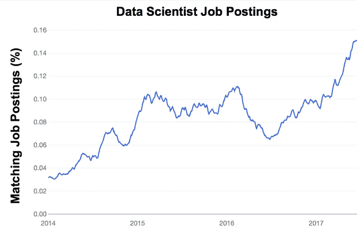

The demand of data scientist to provide business and product intelligence is on the rise (Source: [PredictiveAnalyticsWorld](https://www.predictiveanalyticsworld.com/patimes/theres-no-such-thing-as-a-data-scientist/9507/medium-graphic-2/))

无论是建立推荐系统，还是在人工智能产品和服务中实现计算机视觉，机器学习算法的实施都在不断增加。有利可图的人工智能行业激起了大学的兴趣，提供数据科学专业学位的大学开始涌现。以我大学的 [***最近提供的数据科学学位***](https://scse.ntu.edu.sg/Programmes/CurrentStudents/Undergraduate/Pages/DSAI.aspx) 为例。

随着人们越来越意识到它的需求，他们开始冒险进入未知领域。没有意识到数学和计算机科学完美融合背后的技术细节，普通大学生很自然地会在这门课程中苦苦挣扎。

机器学习技术应用的简单性可以被许多可用的在线课程所揭穿。不幸的是，严酷的事实是，几乎没有雇主在乎你是否有一个勉强被认可的在线课程认证。你的正式资格永远是人力资源主管优先考虑的。尤其是如果人力资源主管没有技术倾向的话。

另一个严峻的事实是，大多数数据科学职位要求高等教育才能被考虑。对许多人来说，完成一门涉及机器学习的本科课程已经被证明是一个挑战。但是我希望这篇文章可以激励读者减少对正规教育的依赖，并知道有大量非常有用的资源可以补充你在数据科学和机器学习方面的学习。

如果你有兴趣了解如何成为一名优秀的数据分析师，我认为大学需要更加重视这一点，你可以看看我在这里写的另一篇文章:

 [## 大学需要教授的关于数据科学/分析的 4 件重要事情

### 从数据收集、预处理、转换到非技术交流，这些都是非常重要的…

towardsdatascience.com](/4-important-things-universities-need-to-teach-about-data-science-analytics-6ab5988639ca) 

感谢您的时间，我希望这篇文章在某种程度上让读者受益，如果您有任何问题，请随时联系我！