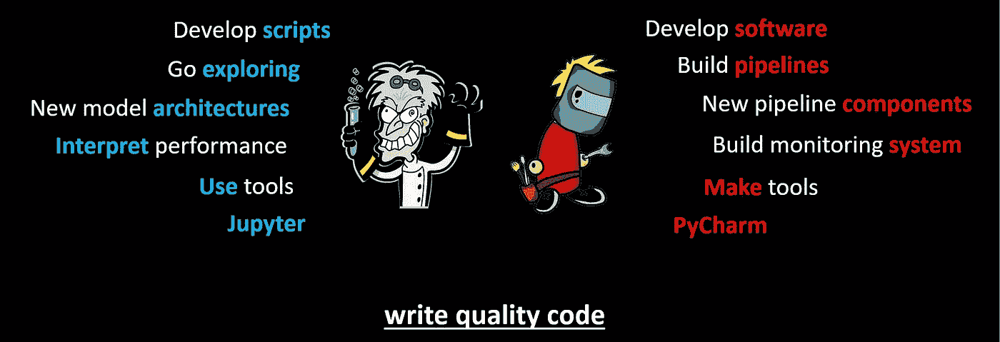

# 机器学习工程师、数据科学家以及他们各自的角色。

> 原文：<https://towardsdatascience.com/machine-learning-engineers-data-scientists-and-their-respective-roles-fea3c06ad48?source=collection_archive---------17----------------------->

在过去的十年里，诸如“数据科学”、“大数据”、“数据湖”、“机器学习”、“人工智能”等术语已经上升到日常词汇的最前沿(有时又回落)，用于最广泛的各种行业。然而，不管它们的广泛使用(或者正因为如此！)对于其中许多术语的含义，似乎没有什么共识。我不希望在一致的术语上进行长时间的争论，但是有两个经常使用的术语让我特别感兴趣:“数据科学家”和“机器学习工程师”。

在最广泛的意义上，这两个术语都可以理解为指“构建机器学习解决方案的技术熟练的人”。“数据科学家”是一个术语，多年来，它已经成为一种多面手数学家或统计学家，他们也可以编写一些代码，并知道如何解释和可视化数据。最近,“机器学习工程师”这个术语已经和软件开发人员联系在一起了，他们已经学会了一些数学。

虽然这些解释确实有些道理，但我觉得它们都不是特别有用。因此，冒着增加困惑的风险，我想通过两个勇敢的冒险故事来说明我对这些角色的理解——一个是科学家，另一个是工程师——他们前往一个未知的、可能是无尽的沙漠，寻找石油…

根据他们的任务，工程师和科学家有不同的装备。

这位科学家轻装旅行。他有一个背包、一个指南针、一把铲子和一些简单但精确的测量设备。他对沙漠进行了几次突袭，虽然不是很深入，但是足够深入到可以评估哪个方向看起来最有希望。在进行测量并用铁锹挖了几个洞后的几天内，他想到了可能有石油的地方。

另一方面，工程师带着笨重而精密的机器。目前，他并不关心哪里能找到石油。然而，一旦找到了，他将不得不运输它，所以他花了几天时间设计管道的蓝图。

**合作让两个探索者结合他们的优势，变得更有效率。**

几天后，探险者们进行了商议，科学家宣布他将在接下来的几天里进行更深入的探索，因为他现在更加确定在哪里可以找到石油。当科学家出发时，工程师启动他的机器，跟随科学家的脚步，开始建造第一段管道。最终他追上了科学家，他发现了一口小井！

他们一起在该位置安装了一个钻机，并将其与管道连接起来。这条管道使科学家的工作更加高效，尽管他们还没有找到真正的主井，但这口小井已经可以带来一些利润，工程师可以用它来测试他的管道。

**经过几个月的顺利合作，两位探索者都准备好了第一次重大突破。**

为了准备下一阶段的探险，工程师建造了一个轻型石油钻机，并指导科学家如何使用。有了这种专门的钻头，科学家现在可以在没有工程师在场的情况下开井了。有一段时间，科学家继续寻找新井，而工程师继续将它们连接到管道上。

接下来，工程师现在还设计了轻型管道，科学家可以在没有工程师帮助的情况下将其连接到管道上。这使得科学家大大加快了他的探索速度，同时也让工程师有时间重新设计管道的大部件，从而使管道更加稳定和高效，

同样，科学家为工程师设计了一套新的标准化测量方法，并将其嵌入到主轮毂的测量协议中，这样科学家就不再需要前往钻井现场监控其性能。

经过几个月的艰苦工作，他们到达了寻找的大油井。他们一起将油井连接到管道上，并安装复杂的测量设备。到现在为止，例行公事已经很好地解决了。测量，钻孔，连接，泵送，测量。完成了。很快，大油井开始喷涌。

**过了一段时间，他们分道扬镳——工程师留在现场，而科学家在场外为项目做贡献。**

不久之后，科学家打包回家。现场不再需要他，但他仍然可以分析油井产生的测量结果。

工程师多呆一会儿。他对整个系统运行良好还不满意。一组操作员来了，他们一起解决了所有剩余的问题。然后，工程师将系统交给操作员，然后回家，并承诺如果出现问题会回来。

科学家和工程师的重聚。

我们的两个探险者很快又见面了。他们回忆起他们小小的沙漠冒险，并开始为他们的下一次冒险制定计划——显然，北极可能有石油，他们准备去发现！

**数据科学家和机器学习工程师的角色不同。**

也许你能够从上面的故事中认识到成功的机器学习项目的一些要素。

我选择了两个探险家的这个小寓言，因为我相信机器学习——尽管它在过去的五到十年里取得了巨大的进步——仍然是一个很大程度上需要探索未知领域的领域。我相信探索精神(快速原型)和五年前一样重要，但是在项目开始时就开始为生产系统(快速扩展)打基础也变得越来越重要。

对于我的两个探索者，我选择了一名(数据)科学家和一名(机器学习)工程师来说明他们合作实现快速有效的价值交付的重要性。

毫无疑问，这两个角色有许多不同的定义，但对我来说，关键的定义特征是，数据科学家会问:“解决这个问题的最佳算法是什么？”并试图通过快速测试各种假设(寻找油井)来回答这个问题。另一方面，机器学习工程师会问:“帮助我们解决问题的最佳系统是什么？”并试图通过构建一个自动化的过程(构建一条输油管道)来回答这个问题，这个过程可以用来加速假设的测试。

尽管数据科学家和机器学习工程师的角色不同，但他们的合作对机器学习项目至关重要。

无论这两个定义是否 100%准确，重要的是当两个有才华的专业人士以这种心态走到一起时，随之而来的合作。在我的例子中，数据科学家寻找新的模型架构来尝试；衡量业绩的新方法；要包括的新数据源等。，而机器学习工程师则在寻找将数据科学家的工作整合到可扩展系统中的方法。随着系统的扩展，数据科学家变得更加*高效*，因为他有更好的工具可以使用。机器学习工程师变得更加*有效*，因为他构建的工具被用来交付越来越多有价值的结果。

**机器学习工程师写软件，数据科学家写脚本。**

这两种职业之间的差异也可以从他们写的代码中看出。当然，*两个*演员都得是优秀的程序员。不仅仅是机器学习工程师必须能够编写高质量的代码。当然，数据科学家不一定要能够构建复杂的软件系统，但他或她必须能够构建结构清晰、文档完善且易于维护的代码！

也就是说，对于数据科学家来说，重点将是看到快速的结果，而不是构建可持续的软件。因此，数据科学家的首选工具——因为整个事情通常在 Python 世界中进行——将是广泛使用 Jupyter 笔记本，它积极支持探索性的工作方式；这种工作的最终产品通常是原型*脚本*。

然而，机器学习工程师编写了*软件*。我怎么强调这一点都不为过。(如果你在机器学习方面非常优秀，并且正在构建结构清晰、文档完善且易于维护的*脚本*，那么你就是我们在 Alexander Thamm 的项目中能够找到的最好的数据科学家[——而不是机器学习工程师！).机器学习工程师专注于构建可以快速扩展的软件。Python 世界中也会出现很多这种情况，这意味着作为首选工具，通常会使用像 PyCharm 这样的 ide。(然而，它确实超越了 Python，因为伸缩还意味着知道如何使用工具来编排用于模型训练的资源，以及将训练好的模型提供给最终用户系统，但这是另一个时间的讨论)。](https://www.alexanderthamm.com/en/)

**项目的不同阶段需要机器学习工程师和数据科学家的不同参与。**

最后要谈的是项目的阶段和谁在什么时候参与。如果我们考虑一个经历“假设”阶段的项目进展；“概念证明”；“原型”；“生产”——那么很容易说前两个是数据科学家的领域，而后两个是机器学习工程师的领域。我只是部分同意。

科学家和工程师站在沙漠边缘，凝视着远方，想知道那里是否有石油:这是“假设”阶段。科学家在沙漠中跑来跑去，用铁锹挖许多小洞，以观察石油的最初迹象，而工程师则为他的管道绘制蓝图，这就是我所说的“概念证明”。一条成熟的管道正在建设，第一口正在开采的小井就是我所说的“原型”。以及由一个我认为是“生产”的操作员团队维护的大规模、完全精炼和高效的系统。

**机器学习工程师和数据科学家在整个项目中至关重要。**

因此，也许看待这个问题的正确方式是认识到每个阶段都需要来自两个角色的输入，但是这些输入看起来会发生变化。特别是在开始时，机器学习工程师将非常依赖于数据科学家所做的探索，后来数据科学家将非常依赖于机器学习工程师构建的工具。但是每一个都将始终保持相关性——事实上至关重要。

在最后，两人都将继续下一件事，这可能是又一次探索之旅——这次是去北极？