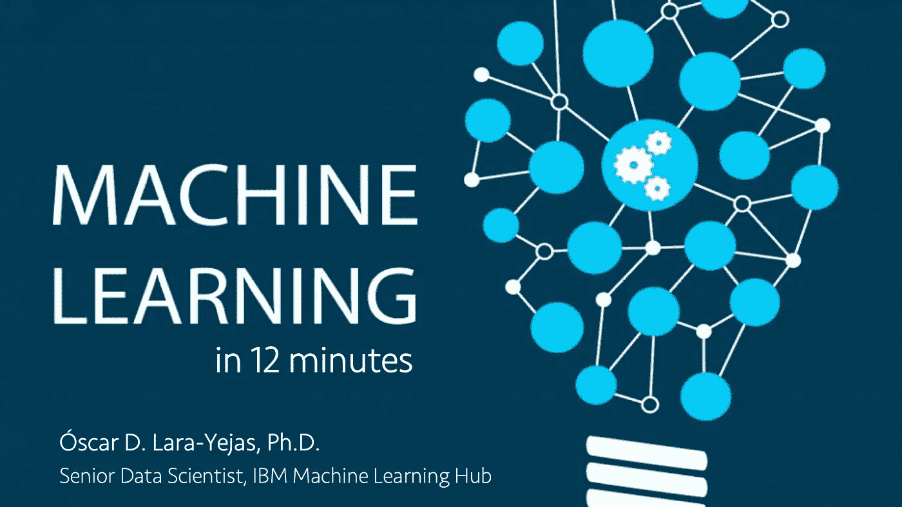

# 12 分钟解释机器学习

> 原文：<https://towardsdatascience.com/machine-learning-explained-in-12-minutes-db34860383c4?source=collection_archive---------27----------------------->

在过去的两年里，我接触了许多不同行业的客户，包括医疗保健、政府、金融、制造、电信、非营利等。，我被问到的第一个问题仍然是:我如何开始机器学习和人工智能？

这是我将制作的机器学习基础系列的第一集。不需要技术/数学/统计背景。

视频中提到的一些问题包括:

*   什么是机器学习？
*   为什么机器学习对企业如此重要？
*   机器学习是如何工作的？
*   在机器学习算法的引擎盖下会发生什么？

**关于作者**

> scar D. Lara Yejas 是高级数据科学家，也是 IBM 机器学习中心的创始成员之一。他与世界上一些最大的企业密切合作，将 ML 应用于他们的特定用例，包括医疗保健、金融、制造、政府和零售。他还为 IBM 大数据产品组合做出了贡献，特别是在大规模机器学习领域，是 Apache Spark 和 Apache SystemML 的贡献者。
> 
> scar 拥有南佛罗里达大学的计算机科学和工程博士学位。他是《人类活动识别:使用可穿戴传感器和智能手机》一书的作者，并发表了大量关于大数据、机器学习、以人为中心的传感和组合优化的研究/技术论文。