# 用于异常检测和状态监控的机器学习

> 原文：<https://towardsdatascience.com/machine-learning-for-anomaly-detection-and-condition-monitoring-d4614e7de770?source=collection_archive---------1----------------------->


## 从数据导入到模型输出的分步教程

我上一篇关于异常检测和条件监控的文章收到了很多反馈。我收到的许多问题涉及技术方面以及如何建立模型等。由于这个原因，我决定写一篇后续文章，详细介绍所有必要的步骤，从预处理数据到构建模型和可视化结果。

对于异常检测和状态监控的介绍，我建议首先阅读我关于这个主题的原始文章。这为如何利用机器学习和数据驱动分析从传感器数据中提取有价值的信息提供了必要的背景信息。

当前的文章主要集中在技术方面，包括建立基于多元统计分析和自动编码器神经网络的异常检测模型所需的所有代码。

## 下载数据集:

为了复制原始文章中的结果，首先需要从 NASA 声学和振动数据库下载[数据集。有关实验和可用数据的更多信息，请参见下载的 IMS 轴承数据自述文件。](http://data-acoustics.com/measurements/bearing-faults/bearing-4/)

每个数据集由单独的文件组成，这些文件是以特定间隔记录的 1 秒振动信号快照。每个文件由 20.480 个点组成，采样率设置为 20 kHz。文件名表示收集数据的时间。数据文件中的每条记录(行)都是一个数据点。较大的时间戳间隔(显示在文件名中)表示在下一个工作日恢复实验。

## 导入包和库:

第一步是为分析导入一些有用的包和库:

```
*# Common imports*
**import** **os**
**import** **pandas** **as** **pd**
**import** **numpy** **as** **np**
**from** **sklearn** **import** preprocessing
**import** **seaborn** **as** **sns**
sns.set(color_codes=**True**)
**import** **matplotlib.pyplot** **as** **plt**
%**matplotlib** inline

**from** **numpy.random** **import** seed
**from** **tensorflow** **import** set_random_seed

**from** **keras.layers** **import** Input, Dropout
**from** **keras.layers.core** **import** Dense 
**from** **keras.models** **import** Model, Sequential, load_model
**from** **keras** **import** regularizers
**from** **keras.models** **import** model_from_json
```

## 数据加载和预处理:

假设随着时间推移，齿轮逐渐退化，所以在下面的分析中，我们每 10 分钟使用一个数据点。通过使用每个文件中 20.480 个数据点的振动记录的平均绝对值，汇总每个 10 分钟的数据点。然后，我们将所有内容合并到一个数据帧中。

在下面的例子中，我使用了来自第二档齿轮故障测试的数据(参见 readme 文档以获得关于该实验的更多信息)。

```
data_dir = '2nd_test'
merged_data = pd.DataFrame()

**for** filename **in** os.listdir(data_dir):
    print(filename)
    dataset=pd.read_csv(os.path.join(data_dir, filename), sep='**\t**')
    dataset_mean_abs = np.array(dataset.abs().mean())
    dataset_mean_abs = pd.DataFrame(dataset_mean_abs.reshape(1,4))
    dataset_mean_abs.index = [filename]
    merged_data = merged_data.append(dataset_mean_abs)

merged_data.columns = ['Bearing 1','Bearing 2','Bearing 3','Bearing 4']
```

加载振动数据后，我们将索引转换为日期时间格式(使用遵循惯例的[，然后在将合并的数据集保存为. csv 文件之前，按时间顺序按索引对数据进行排序](https://docs.python.org/3.4/library/datetime.html)

```
merged_data.index = pd.to_datetime(merged_data.index, format='%Y.%m.**%d**.%H.%M.%S')merged_data = merged_data.sort_index()
merged_data.to_csv('merged_dataset_BearingTest_2.csv')
merged_data.head()
```

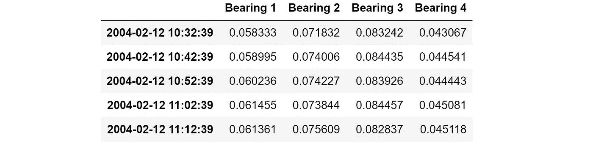

Resulting dataframe: “merged_data”

## 定义训练/测试数据:

在建立模型之前，我们需要定义训练/测试数据。为此，我们执行一个简单的分割，在数据集的第一部分(应该代表正常运行条件)上进行训练，并在导致轴承故障的数据集的其余部分上进行测试。

```
dataset_train = merged_data['2004-02-12 11:02:39':'2004-02-13 23:52:39']
dataset_test = merged_data['2004-02-13 23:52:39':]dataset_train.plot(figsize = (12,6))
```

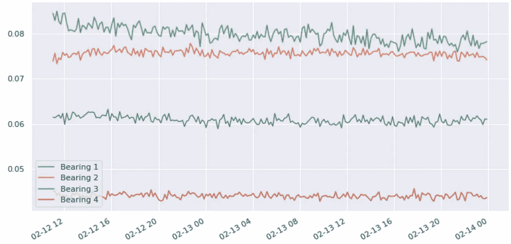

Training data: Normal operating conditions

## 标准化数据:

然后我使用 Scikit-learn 的预处理工具[来缩放模型的输入变量。“最小最大缩放器”只是将数据重新缩放到范围[0，1]内。](https://scikit-learn.org/stable/modules/generated/sklearn.preprocessing.MinMaxScaler.html)

```
scaler = preprocessing.MinMaxScaler()

X_train = pd.DataFrame(scaler.fit_transform(dataset_train), 
                              columns=dataset_train.columns, 
                              index=dataset_train.index)*# Random shuffle training data*
X_train.sample(frac=1)

X_test = pd.DataFrame(scaler.transform(dataset_test), 
                             columns=dataset_test.columns, 
                             index=dataset_test.index)
```

# 异常检测的 PCA 型模型；

由于处理高维传感器数据通常具有挑战性，因此有几种技术可以减少变量的数量([降维](https://en.wikipedia.org/wiki/Dimensionality_reduction))。主要技术之一是[主成分分析](https://en.wikipedia.org/wiki/Principal_component_analysis) (PCA)。关于更详细的介绍，我参考了我关于这个主题的原始文章。

作为初步尝试，让我们将传感器读数压缩到两个主要分量。

```
**from** **sklearn.decomposition** **import** PCApca = PCA(n_components=2, svd_solver= 'full')X_train_PCA = pca.fit_transform(X_train)
X_train_PCA = pd.DataFrame(X_train_PCA)
X_train_PCA.index = X_train.index

X_test_PCA = pca.transform(X_test)
X_test_PCA = pd.DataFrame(X_test_PCA)
X_test_PCA.index = X_test.index
```

## 马哈拉诺比斯距离度量:

[马氏距离](https://en.wikipedia.org/wiki/Mahalanobis_distance)广泛用于聚类分析和分类技术。为了使用 Mahalanobis 距离将测试点分类为属于 N 个类别之一，首先估计每个类别的协方差矩阵，通常基于已知属于每个类别的样本。在我们的例子中，由于我们只对“正常”与“异常”的分类感兴趣，我们使用只包含正常操作条件的训练数据来计算协方差矩阵。然后，给定一个测试样本，我们计算到“正常”类的 Mahalanobis 距离，如果距离超过某个阈值，则将测试点分类为“异常”。

关于这些技术方面的更详细的介绍，你可以看看[我以前的文章](/how-to-use-machine-learning-for-anomaly-detection-and-condition-monitoring-6742f82900d7)，它更详细地涵盖了这些主题。

## 定义 PCA 模型中使用的函数:

计算协方差矩阵:

```
**def** cov_matrix(data, verbose=**False**):
    covariance_matrix = np.cov(data, rowvar=**False**)
    **if** is_pos_def(covariance_matrix):
        inv_covariance_matrix = np.linalg.inv(covariance_matrix)
        **if** is_pos_def(inv_covariance_matrix):
            **return** covariance_matrix, inv_covariance_matrix
        **else**:
            print("Error: Inverse of Covariance Matrix is not positive definite!")
    **else**:
        print("Error: Covariance Matrix is not positive definite!")
```

计算马哈拉诺比斯距离:

```
**def** MahalanobisDist(inv_cov_matrix, mean_distr, data, verbose=**False**):
    inv_covariance_matrix = inv_cov_matrix
    vars_mean = mean_distr
    diff = data - vars_mean
    md = []
    **for** i **in** range(len(diff)):
        md.append(np.sqrt(diff[i].dot(inv_covariance_matrix).dot(diff[i])))
    **return** md
```

检测异常值:

```
**def** MD_detectOutliers(dist, extreme=**False**, verbose=**False**):
    k = 3\. **if** extreme **else** 2.
    threshold = np.mean(dist) * k
    outliers = []
    **for** i **in** range(len(dist)):
        **if** dist[i] >= threshold:
            outliers.append(i)  *# index of the outlier*
    **return** np.array(outliers)
```

计算将数据点分类为异常的阈值:

```
**def** MD_threshold(dist, extreme=**False**, verbose=**False**):
    k = 3\. **if** extreme **else** 2.
    threshold = np.mean(dist) * k
    **return** threshold
```

检查矩阵是否正定:

```
**def** is_pos_def(A):
    **if** np.allclose(A, A.T):
        **try**:
            np.linalg.cholesky(A)
            **return** **True**
        **except** np.linalg.LinAlgError:
            **return** **False**
    **else**:
        **return** **False**
```

## 设置 PCA 模型:

从两个主要部分定义训练/测试集:

```
data_train = np.array(X_train_PCA.values)
data_test = np.array(X_test_PCA.values)
```

根据训练集中的数据计算协方差矩阵及其逆矩阵:

```
cov_matrix, inv_cov_matrix  = cov_matrix(data_train)
```

我们还计算训练集中输入变量的平均值，因为这在以后用于计算测试集中数据点的 Mahalanobis 距离

```
mean_distr = data_train.mean(axis=0)
```

使用协方差矩阵及其逆矩阵，我们可以计算定义“正常条件”的训练数据的 Mahalanobis 距离，并找到阈值以将数据点标记为异常。然后可以计算测试集中数据点的 Mahalanobis 距离，并将其与异常阈值进行比较。

```
dist_test = MahalanobisDist(inv_cov_matrix, mean_distr, data_test, verbose=**False**)
dist_train = MahalanobisDist(inv_cov_matrix, mean_distr, data_train, verbose=**False**)
threshold = MD_threshold(dist_train, extreme = **True**)
```

## 标记异常的阈值:

如果满足正态分布输入变量的假设，到分布质心的马氏距离的平方应遵循χ2 分布。这也是上述用于标记异常的“阈值”计算背后的假设。由于这种假设在我们的情况下不一定成立，因此可视化 Mahalanobis 距离的分布以设置标记异常的良好阈值是有益的。再次，我参考[我的前一篇文章](/how-to-use-machine-learning-for-anomaly-detection-and-condition-monitoring-6742f82900d7)，获得关于这些技术方面的更详细的介绍。

我们首先想象马哈拉诺比斯距离的平方，它应该理想地遵循χ2 分布。

```
plt.figure()
sns.distplot(np.square(dist_train),
             bins = 10, 
             kde= **False**);
plt.xlim([0.0,15])
```

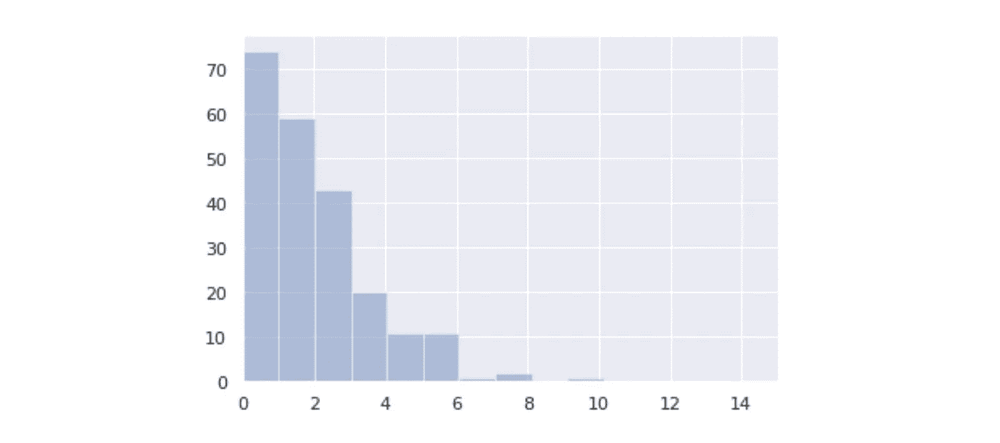

Square of the Mahalanobis distance

然后想象马哈拉诺比斯距离本身:

```
plt.figure()
sns.distplot(dist_train,
             bins = 10, 
             kde= **True**, 
            color = 'green');
plt.xlim([0.0,5])
plt.xlabel('Mahalanobis dist')
```

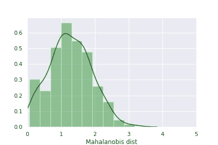

从上述分布来看，计算出的用于标记异常的阈值 3.8 似乎是合理的(定义为距分布中心的 3 个标准偏差)

然后，我们可以保存 Mahalanobis 距离，以及数据帧中训练和测试数据的阈值和“异常标志”变量:

```
anomaly_train = pd.DataFrame()
anomaly_train['Mob dist']= dist_train
anomaly_train['Thresh'] = threshold
*# If Mob dist above threshold: Flag as anomaly*
anomaly_train['Anomaly'] = anomaly_train['Mob dist'] > anomaly_train['Thresh']
anomaly_train.index = X_train_PCA.indexanomaly = pd.DataFrame()
anomaly['Mob dist']= dist_test
anomaly['Thresh'] = threshold
*# If Mob dist above threshold: Flag as anomaly*
anomaly['Anomaly'] = anomaly['Mob dist'] > anomaly['Thresh']
anomaly.index = X_test_PCA.index
anomaly.head()
```

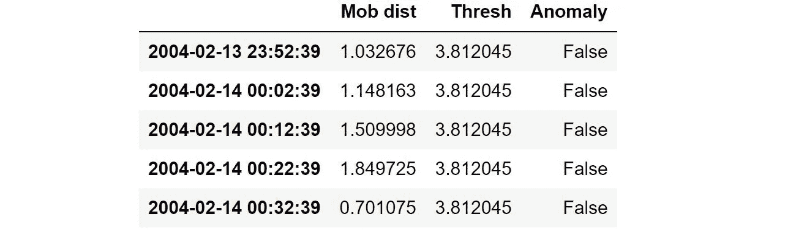

Resulting dataframe for the test data

基于计算的统计数据，任何高于阈值的距离都将被标记为异常。

我们现在可以将数据合并到单个数据帧中，并将其保存为. csv 文件:

```
anomaly_alldata = pd.concat([anomaly_train, anomaly])
anomaly_alldata.to_csv('Anomaly_distance.csv')
```

## 在测试数据上验证 PCA 模型:

我们现在可以绘制计算的异常度量(Mob dist)，并检查它何时超过异常阈值(注意对数 y 轴)。

```
anomaly_alldata.plot(logy=**True**, figsize = (10,6), ylim = [1e-1,1e3], color = ['green','red'])
```

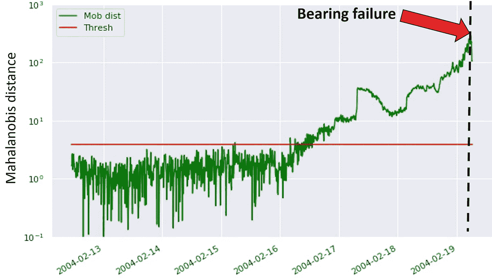

从上图中，我们看到模型能够在实际轴承故障前大约 3 天检测到异常。

# 其他方法:用于异常检测的自动编码器模型

这里的基本思想是使用自动编码器神经网络将传感器读数“压缩”为低维表示，这捕捉了各种变量之间的相关性和相互作用。(基本上与 PCA 模型的原理相同，但是这里我们也允许输入变量之间的非线性)。

关于自动编码器的更详细的介绍，你可以看看[我以前的文章](/how-to-use-machine-learning-for-anomaly-detection-and-condition-monitoring-6742f82900d7)，它更详细地涵盖了这个主题。

## 定义自动编码器网络:

我们使用一个 3 层神经网络:第一层有 10 个节点，中间层有 2 个节点，第三层有 10 个节点。我们使用均方误差作为损失函数，并使用[“Adam”优化器训练模型。](https://keras.io/optimizers/)

```
seed(10)
set_random_seed(10)
act_func = 'elu'

*# Input layer:*
model=Sequential()
*# First hidden layer, connected to input vector X.* 
model.add(Dense(10,activation=act_func,
                kernel_initializer='glorot_uniform',
                kernel_regularizer=regularizers.l2(0.0),
                input_shape=(X_train.shape[1],)
               )
         )

model.add(Dense(2,activation=act_func,
                kernel_initializer='glorot_uniform'))

model.add(Dense(10,activation=act_func,
                kernel_initializer='glorot_uniform'))

model.add(Dense(X_train.shape[1],
                kernel_initializer='glorot_uniform'))

model.compile(loss='mse',optimizer='adam')

*# Train model for 100 epochs, batch size of 10:* 
NUM_EPOCHS=100
BATCH_SIZE=10
```

## 拟合模型:

为了跟踪训练期间的准确性，我们在每个时期后使用 5%的训练数据进行验证(validation_split = 0.05)

```
history=model.fit(np.array(X_train),np.array(X_train),
                  batch_size=BATCH_SIZE, 
                  epochs=NUM_EPOCHS,
                  validation_split=0.05,
                  verbose = 1)
```

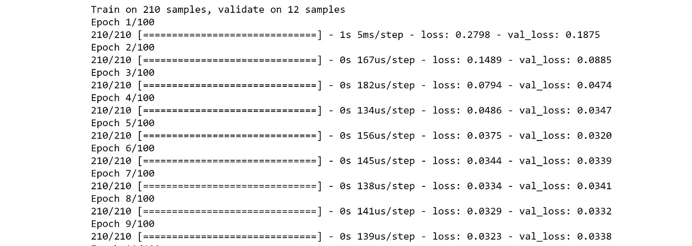

Training process

## 可视化培训/验证损失:

```
plt.plot(history.history['loss'],
         'b',
         label='Training loss')
plt.plot(history.history['val_loss'],
         'r',
         label='Validation loss')
plt.legend(loc='upper right')
plt.xlabel('Epochs')
plt.ylabel('Loss, [mse]')
plt.ylim([0,.1])
plt.show()
```

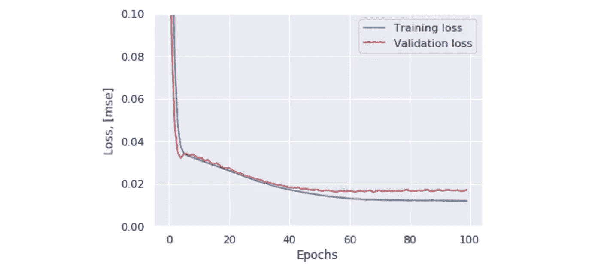

Train/validation loss

## 训练集中损失函数的分布:

通过在训练集中绘制计算损失的分布，可以使用它来识别用于识别异常的合适阈值。在这样做时，可以确保该阈值被设置在“噪声水平”之上，并且任何被标记的异常应该在噪声背景之上具有统计显著性。

```
X_pred = model.predict(np.array(X_train))
X_pred = pd.DataFrame(X_pred, 
                      columns=X_train.columns)
X_pred.index = X_train.index

scored = pd.DataFrame(index=X_train.index)
scored['Loss_mae'] = np.mean(np.abs(X_pred-X_train), axis = 1)plt.figure()
sns.distplot(scored['Loss_mae'],
             bins = 10, 
             kde= **True**,
            color = 'blue');
plt.xlim([0.0,.5])
```

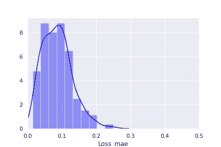

Loss distribution, training set

根据上面的损失分布，让我们尝试使用阈值 0.3 来标记异常。然后，我们可以计算测试集中的损失，以检查输出何时超过异常阈值。

```
X_pred = model.predict(np.array(X_test))
X_pred = pd.DataFrame(X_pred, 
                      columns=X_test.columns)
X_pred.index = X_test.index

scored = pd.DataFrame(index=X_test.index)
scored['Loss_mae'] = np.mean(np.abs(X_pred-X_test), axis = 1)
scored['Threshold'] = 0.3
scored['Anomaly'] = scored['Loss_mae'] > scored['Threshold']
scored.head()
```

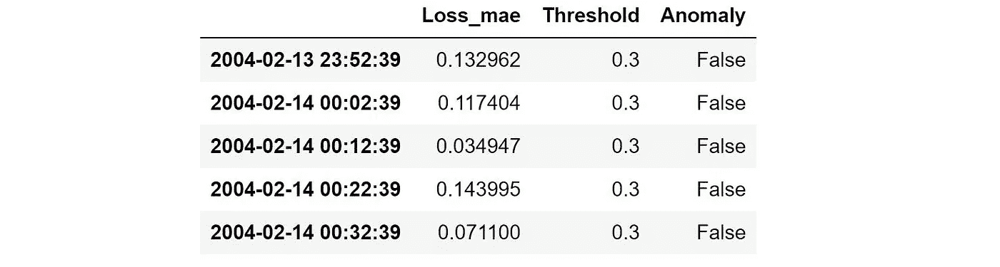

然后，我们也为训练集计算相同的指标，并将所有数据合并到单个数据帧中:

```
X_pred_train = model.predict(np.array(X_train))
X_pred_train = pd.DataFrame(X_pred_train, 
                      columns=X_train.columns)
X_pred_train.index = X_train.index

scored_train = pd.DataFrame(index=X_train.index)
scored_train['Loss_mae'] = np.mean(np.abs(X_pred_train-X_train), axis = 1)
scored_train['Threshold'] = 0.3
scored_train['Anomaly'] = scored_train['Loss_mae'] > scored_train['Threshold']scored = pd.concat([scored_train, scored])
```

## 自动编码器模型的结果:

计算了损耗分布和异常阈值后，我们可以将轴承故障前的模型输出可视化:

```
scored.plot(logy=**True**,  figsize = (10,6), ylim = [1e-2,1e2], color = ['blue','red'])
```

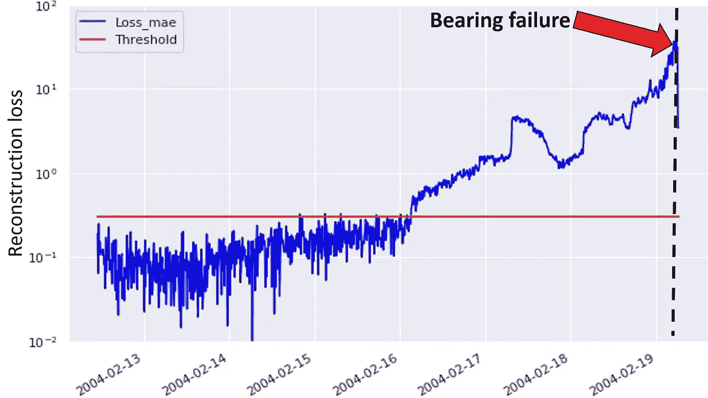

# 总结:

两种建模方法给出了相似的结果，它们能够在实际故障之前很好地标记即将发生的轴承故障。主要的区别本质上是如何为标记异常定义合适的阈值，以避免在正常操作条件下出现许多假阳性。

我希望这篇教程能给你启发，让你自己尝试这些异常检测模型。一旦你成功地建立了模型，是时候开始试验模型参数了。并在新的数据集上测试同样的方法。如果你遇到一些有趣的用例，请在下面的评论中告诉我。

玩得开心！

如果你有兴趣了解更多与人工智能/机器学习和数据科学相关的主题，你也可以看看我写的其他一些文章。你会发现他们都列在我的中型作者简介，[，你可以在这里找到。](https://medium.com/@vflovik)

而且，如果你想成为一个媒体会员，免费访问平台上的所有资料，你也可以使用下面我的推荐链接。(注意:如果您使用此链接注册，我也会收到一部分会员费)

[](https://medium.com/@vflovik/membership) [## 通过我的推荐链接加入媒体- Vegard Flovik

### 作为一个媒体会员，你的会员费的一部分会给你阅读的作家，你可以完全接触到每一个故事…

medium.com](https://medium.com/@vflovik/membership) 

# 更多来自 Vegard Flovik 媒体:

1.  [蒙特卡洛方法简介](/a-gentle-introduction-to-monte-carlo-methods-98451674018d)
2.  [从物理学到数据科学的转变](/q-a-with-a-data-scientist-1f872518315f)
3.  [什么是图论，你为什么要关心它？](https://builtin.com/machine-learning/graph-theory)
4.  [用于图像分类的深度迁移学习](/deep-transfer-learning-for-image-classification-f3c7e0ec1a14)
5.  [建造一个能读懂你思想的人工智能](https://www.linkedin.com/pulse/building-ai-can-read-your-mind-vegard-flovik-phd/)
6.  [机器学习:从炒作到现实应用](/machine-learning-from-hype-to-real-world-applications-69de7afb56b6)
7.  [人工智能和大数据隐藏的风险](/the-hidden-risk-of-ai-and-big-data-3332d77dfa6)
8.  [如何使用机器学习进行异常检测和状态监控](/how-to-use-machine-learning-for-anomaly-detection-and-condition-monitoring-6742f82900d7)
9.  [用于供应链管理的人工智能:预测分析和需求预测](/artificial-intelligence-in-supply-chain-management-predictive-analytics-for-demand-forecasting-80d2d512f155)
10.  [如何(不)使用机器学习进行时间序列预测:避免陷阱](/how-not-to-use-machine-learning-for-time-series-forecasting-avoiding-the-pitfalls-19f9d7adf424)
11.  [如何利用机器学习进行生产优化:利用数据提高绩效](/machine-learning-for-production-optimization-e460a0b82237)
12.  你如何向人工智能系统教授物理学？
13.  我们能使用纳米级磁铁建立人工大脑网络吗？

## 人工智能研讨会——从宣传到现实应用