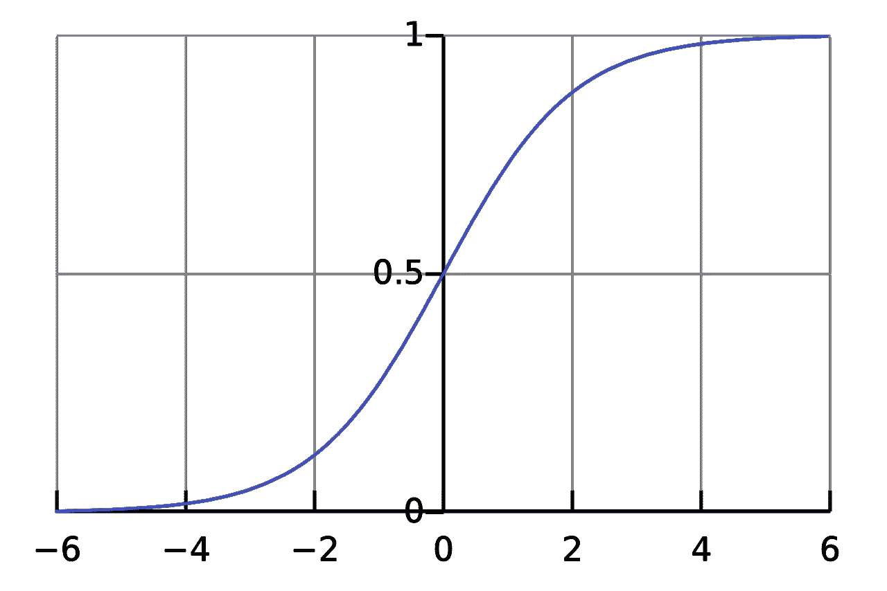
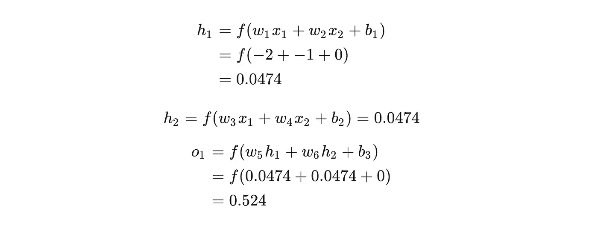

# 初学者的机器学习:神经网络导论

> 原文：<https://towardsdatascience.com/machine-learning-for-beginners-an-introduction-to-neural-networks-d49f22d238f9?source=collection_archive---------1----------------------->

## 简单解释它们如何工作，以及如何用 Python 从头实现一个。

这里有些东西可能会让你吃惊:**神经网络并没有那么复杂！**术语“神经网络”经常被用作时髦词汇，但实际上它们往往比人们想象的要简单得多。

**这篇文章是为完全的初学者而写的，假设你没有机器学习的知识**。我们将理解神经网络是如何工作的，同时用 Python 从头实现一个神经网络。

我们开始吧！

> 注意:我推荐阅读 victorzhou.com[的这篇文章——这篇文章的大部分格式在那里看起来更好。](https://victorzhou.com/blog/intro-to-neural-networks/)

# 1.构建模块:神经元

首先，我们必须谈谈神经元，它是神经网络的基本单位。一个神经元接受输入，用它们做一些数学运算，然后产生一个输出。这是一个双输入神经元的样子:

这里发生了三件事。首先，每个输入乘以一个权重:

接下来，所有加权输入与偏差 b 相加:

最后，总和通过一个激活函数传递:

激活函数用于将一个无界的输入转换成一个具有良好的、可预测的形式的输出。一个常用的激活功能是 [sigmoid](https://en.wikipedia.org/wiki/Sigmoid_function) 功能:

sigmoid 函数只输出(0，1)范围内的数字。你可以把它想成是把(∞，+∞)压缩到(0，1)——大负数变成~0，大正数变成~1。

# 简单的例子

> 提醒:这篇文章的大部分格式在 victorzhou.com[上的原帖中看起来更好。](https://victorzhou.com/blog/intro-to-neural-networks/)

假设我们有一个 2 输入神经元，它使用 sigmoid 激活函数并具有以下参数:

*w* =[0，1]只是向量形式的 *w* 1 =0， *w* 2 =1 的一种写法。现在，让我们给神经元一个*x*=【2，3】的输入。我们将使用[点积](https://simple.wikipedia.org/wiki/Dot_product)来更简洁地写东西:

给定输入*x*=【2，3】，神经元输出 0.999。就是这样！这个向前传递输入以获得输出的过程被称为**前馈**。

# 编码一个神经元

是时候实现一个神经元了！我们将使用 [NumPy](http://www.numpy.org/) ，一个流行且强大的 Python 计算库，来帮助我们做数学:

认得这些号码吗？这就是我们刚才做的例子！我们得到同样的答案 0.999。

# 2.将神经元组合成神经网络

神经网络只不过是一堆连接在一起的神经元。下面是一个简单的神经网络可能的样子:

这个网络有两个输入，一个隐层有两个神经元( *h* 1 和 *h* 2)，一个输出层有一个神经元( *o* 1)。请注意， 1 的*输入是来自 *h* 1 和 *h* 2 的输出——这就是网络的构成。*

> 隐藏层是输入(第一个)层和输出(最后一个)层之间的任何层。可以有多个隐藏层！

# 一个例子:前馈

让我们使用上图所示的网络，并假设所有神经元都具有相同的权重 *w* =[0，1】，相同的偏差 *b* =0，以及相同的 sigmoid 激活函数。设 *h* 1、 *h* 2、 *o* 1 表示它们所代表的神经元的*输出*。

如果我们传入输入 *x* =[2，3]会发生什么？

输入 *x* =[2，3]的神经网络输出为 0.7216。很简单，对吧？

一个神经网络可以有**任意数量的层**，在这些层中有**任意数量的神经元**。基本思想保持不变:通过网络中的神经元将输入前馈，最终得到输出。为了简单起见，我们将在本文的剩余部分继续使用上图所示的网络。

# 神经网络编码:前馈

让我们为我们的神经网络实现前馈。这里的网络形象再次供参考:

我们又得了 0.7216！看起来很有效。

# 3.训练神经网络，第 1 部分

假设我们有以下测量值:

让我们训练我们的网络，根据某人的体重和身高来预测他们的性别:

我们将用 0 表示男性，用 1 表示女性，我们还将移动数据以使其更易于使用:

# 失败

在我们训练我们的网络之前，我们首先需要一种方法来量化它做得有多“好”，以便它可以尝试做得“更好”。这就是**损失**的原因。

我们将使用**均方误差** (MSE)损失:

让我们来分解一下:

*   *n* 为样本数，为 4(爱丽丝、鲍勃、查理、戴安娜)。
*   *y* 代表被预测的变量，是性别。
*   *y_true* 是变量的 *true* 值(“正确答案”)。例如，爱丽丝的 *y_true* 将为 1(女性)。
*   *y_pred* 是变量的*预测值*。它是我们网络输出的任何东西。

(*y _ true*-*y _ pred*)被称为**平方误差**。我们的损失函数只是取所有平方误差的平均值(因此名字*表示*平方误差)。我们的预测越准确，我们的损失就越低！

更好的预测=更低的损失。

**训练一个网络=尽量减少它的损失。**

# 损失计算示例

假设我们的网络总是输出 00——换句话说，它确信所有人类都是男性🤔。我们会有什么损失？

## 代码:MSE 损失

下面是一些为我们计算损失的代码:

If you don’t understand why this code works, read the NumPy [quickstart](https://docs.scipy.org/doc/numpy/user/quickstart.html#basic-operations) on array operations.

很好。向前！

> 喜欢这个帖子吗？我写了很多初学者友好的 ML 文章。[订阅我的简讯](https://victorzhou.com/subscribe/?src=intro-to-nn-medium)让它们进入你的收件箱！

# 4.训练神经网络，第 2 部分

我们现在有一个明确的目标:**最小化神经网络的损失**。我们知道我们可以改变网络的权重和偏差来影响它的预测，但是我们怎样才能减少损失呢？

> 本节使用了一点多变量微积分。如果你对微积分感到不舒服，可以跳过数学部分。

为了简单起见，让我们假设我们的数据集中只有 Alice:

那么均方误差损失就是爱丽丝的平方误差:

另一种思考损失的方式是作为权重和偏差的函数。让我们给网络中的每个权重和偏差贴上标签:

然后，我们可以将损失写成一个多变量函数:

假设我们想要调整 *w* 1。如果我们改变 *w* 1，损失 *L* 会如何变化？这个问题[偏导数](https://simple.wikipedia.org/wiki/Partial_derivative)可以回答。我们怎么算？

> 这就是数学开始变得更加复杂的地方。不要气馁！我建议带上纸和笔——这会帮助你理解。
> 
> 如果你读这个有困难:下面的数学格式在 victorzhou.com 的原始帖子里看起来更好。

首先，让我们用∂*y _ pred/*∂*w*1 来重写偏导数:

This works because of the [Chain Rule](https://en.wikipedia.org/wiki/Chain_rule).

我们可以计算∂ *L/* ∂ *y_pred* ，因为我们在上面计算了 l =(1-t34)y _ pred:

现在，让我们弄清楚如何处理∂*y _ pred/*∂*w*1。就像之前一样，设 *h* 1、 *h* 2、 *o* 1 为它们所代表的神经元的输出。然后

f is the sigmoid activation function, remember?

由于 *w* 1 只影响 *h* 1(而不是 *h* 2)，我们可以写

More Chain Rule.

我们为∂做同样的事情:

You guessed it, Chain Rule.

*x* 1 这里是体重， *x* 2 是身高。这是我们现在第二次看到*f*'(*x*)(sigmoid 函数的导数)了！我们来推导一下:

稍后我们将使用这个漂亮的形式来表示*f*'(*x*)。

我们完了！我们已经设法将∂1 分解成我们可以计算的几个部分:

这种通过逆向计算偏导数的系统被称为**反向传播**，或“反向传播”。

唷。这是一大堆符号——如果你还是有点困惑，没关系。让我们做一个例子来看看这是怎么回事！

# 示例:计算偏导数

我们将继续假设只有 Alice 在我们的数据集中:

让我们将所有权重初始化为 1，将所有偏差初始化为 0。如果我们通过网络进行前馈，我们得到:

网络输出 *y_pred* =0.524，不强烈偏向男性(0)或女性(1)。我们来计算一下∂ *L/* ∂ *w* 1:

> 提醒:我们在前面为我们的乙状结肠激活函数推导了 f*'(*x*)=*f*(*x*)∫(1-f*(*x*)*。*

我们做到了！这告诉我们，如果我们要增加 *w* 1， *L* 结果会增加一个*t iiny*位。

# 训练:随机梯度下降

我们现在已经拥有了训练神经网络所需的所有工具！我们将使用一种叫做[随机梯度下降](https://en.wikipedia.org/wiki/Stochastic_gradient_descent) (SGD)的优化算法，告诉我们如何改变我们的权重和偏差，以最小化损失。基本上就是这个更新方程式:

*η* 是一个叫做**学习率**的常数，它控制着我们训练的速度。我们所做的就是从 *w* 1 中减去*η*∂*w*1/∂*l*:

*   如果∂ *L/* ∂ *w* 1 为正， *w* 1 将减少，这使得 *L* 减少。
*   如果∂ *L/* ∂ *w* 1 为负， *w* 1 将增加，这使得 *L* 减少。

如果我们对网络中的每一个权重和偏差都这样做，那么损耗会慢慢减少，我们的网络也会改善。

我们的培训过程将是这样的:

1.  从我们的数据集中选择一个样本。这就是随机梯度下降的原因——我们一次只对一个样本进行操作。
2.  计算损失相对于权重或偏差的所有偏导数(例如∂ *L/* ∂ *w* 1，∂ *L* /∂ *w* 2 等)。
3.  使用更新等式来更新每个权重和偏差。
4.  回到步骤 1。

让我们看看它的实际效果吧！

# 代码:一个完整的神经网络

终于到了*实现完整神经网络的*时刻:

> 你可以[自己运行/玩这个代码](https://repl.it/@vzhou842/An-Introduction-to-Neural-Networks)。在 [Github](https://github.com/vzhou842/neural-network-from-scratch) 上也有。

我们的损失稳步下降，因为网络了解到:

我们现在可以利用网络来预测性别:

# 现在怎么办？

你成功了！快速回顾一下我们的工作:

*   介绍了**神经元**，神经网络的构建模块。
*   在我们的神经元中使用了**乙状窦激活功能**。
*   我发现神经网络只是连接在一起的神经元。
*   创建了一个数据集，将体重和身高作为输入(或**特征**)，将性别作为输出(或**标签**)。
*   了解了**损失函数**和**均方误差** (MSE)损失。
*   意识到训练一个网络只是最小化它的损失。
*   使用**反向传播**计算偏导数。
*   使用**随机梯度下降** (SGD)来训练我们的网络。

还有很多事情要做:

*   使用适当的机器学习库，如 [Tensorflow](https://www.tensorflow.org/) 、 [Keras](https://keras.io/) 和 [PyTorch](https://pytorch.org/) ，尝试更大/更好的神经网络。
*   [用 Keras](https://victorzhou.com/blog/keras-neural-network-tutorial/) 建立你的第一个神经网络。
*   在你的浏览器中修补神经网络。
*   发现除了 sigmoid 之外的其他激活功能，如 [Softmax](https://victorzhou.com/blog/softmax/) 。
*   发现除了 SGD 之外的其他优化器。
*   看我的[卷积神经网络介绍](https://victorzhou.com/blog/intro-to-cnns-part-1/)(CNN)。CNN 彻底改变了[计算机视觉](https://victorzhou.com/tag/computer-vision/)的领域，并且非常强大。
*   看我的[介绍递归神经网络](https://victorzhou.com/blog/intro-to-rnns/) (RNNs)，经常用于[自然语言处理](https://victorzhou.com/tag/natural-language-processing/) (NLP)。

我将来可能会写这些话题或类似的话题，所以如果你想得到新帖子的通知，请订阅[。](https://victorzhou.com/subscribe/?src=intro-to-nn-medium)

感谢阅读！

*原贴于*[*victorzhou.com*](https://victorzhou.com/blog/intro-to-neural-networks/)*。*