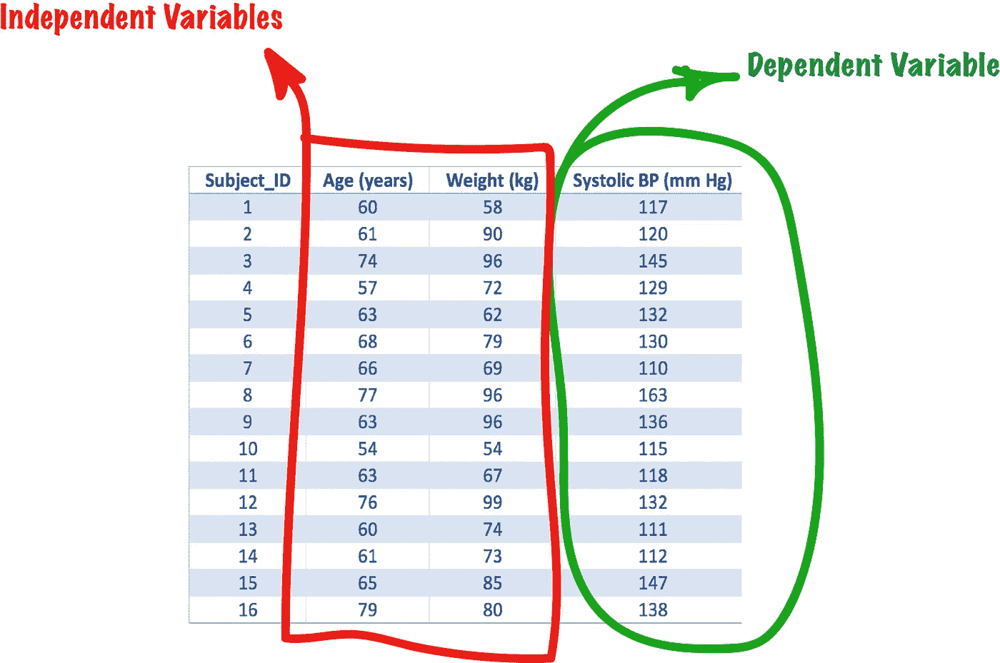
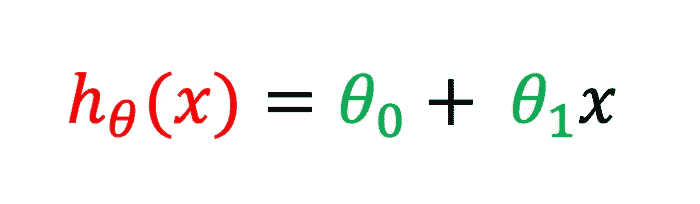
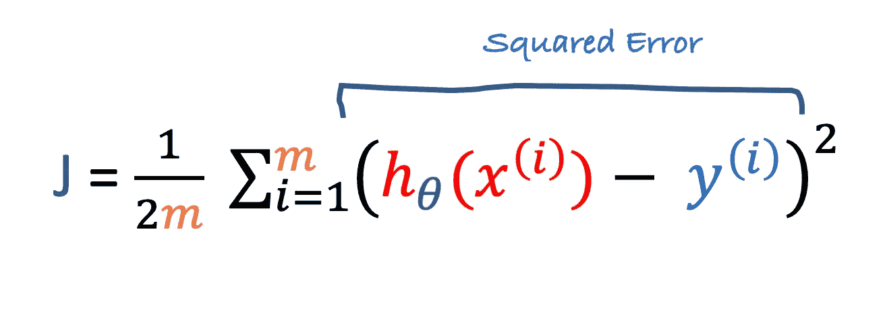

# 一个或多个变量的线性回归

> 原文：<https://towardsdatascience.com/machine-learning-for-biomedical-data-linear-regression-7d43461cdfa9?source=collection_archive---------5----------------------->

## [生物医学数据的机器学习](https://towardsdatascience.com/tagged/ml-for-bio-data)

## 如何在医学中使用线性回归进行结果预测

# **简介**

线性回归是一种用于机器学习的统计模型，属于“监督学习”类算法，适用于生物医学数据的分析。我们使用它来预测连续值输出，这与逻辑回归不同，逻辑回归用于预测离散值输出(即分类)。

在开始之前，我建议读者先去 Coursera 上学习 Andrew NG 教授的有趣的机器学习课程。本课程对这篇文章中讨论的所有论点提供了一个很好的解释。

让我们从我们的例子开始:我们有一个检查收缩压(SBP)并监测年龄和体重的患者数据集，我们想预测一个新患者的 SBP。我们假设体重和年龄等因素会影响 SBP。对于我们的数据集，我们将从[2]中获取一个表的值



*Table 1: Dataset*

要说明的变量(SBP)称为 ***因变量*** ，或 ***响应变量*** ，它与我们的 ***输出*** 变量或 ***目标向量*** 相匹配。而是将解释 ***输入*** (年龄和体重)的变量称为 ***自变量*** 或 ***预测变量*** ，或 ***特征*** 。如果因变量和自变量是连续的，如 *SBP、*和*体重*的情况，那么可以计算出一个**相关系数**作为它们之间关系强度的度量。[3]

我们说**线性回归**代表了**相关性**的进化。两者的区别在于:相关性是指两个或多个变量之间关系的强弱。相反，回归指的是描述两个或多个变量之间关系的统计技术和算法的集合[2]。

线性回归假设一个或多个输入要素与相对目标矢量(输出)之间的关系近似呈线性。[4]，它能够识别和表征这种关系。这种假设的结果是，在线性回归模型中，输入特征对目标向量(输出)有“影响”，并且这种影响是恒定的。

“影响”通常被确定为“系数”、“权重”或“参数”，更简单地说，我们说线性回归计算输入特征的加权和，加上一个称为“偏差项”或截距的常数[5]。

为了简化，让我们从应用一个变量的线性回归开始。

# **一元线性回归**

如果我们想彻底理解线性回归是如何工作的，从一个变量开始是一个基本步骤。我们将使用表 1 中的数据集，只外推特征“年龄”并使用“SBP”列作为输出。

本文中的所有代码都是用 Python 2.7 编写的，对于移植到许多其他语言来说，它也是不言自明的。对于实现环境，我建议使用 [Jupyter 笔记本](https://jupyter.org/)。

将主要使用线性代数计算，因为它在尽可能避免“while”和“for”循环方面具有内在优势。为了实现这个目标，我们将使用 [NumPy](https://numpy.org/) ，这是一个强大的数学函数库，用于使用 Python 进行科学计算。

在开始描述线性回归模型之前，有必要看一下我们的数据，并尝试了解线性回归是否适用于这些数据。目标是基于患者年龄预测例如收缩压值。

# **第一步:导入 Python 库**

首先，我们导入本帖将要讨论的 Python 代码所需的所有包: **NumPy** 、 **Pandas** 和 **matplot** 。这些软件包属于 SciPy.org，这是一个基于 Python 的数学、科学和工程开源软件生态系统。

Numpy 对于线性代数计算是必要的。

Pandas 是一个开源库，为 Python 提供高性能、数据结构和数据分析工具。pandas 数据帧是一个二维大小可变的、潜在异构的表格数据结构。它由三个主要部分组成，数据、行和列，带有标记的轴(行和列)。点击这个[链接到 GeeksForGeeks 门户网站](https://www.geeksforgeeks.org/python-pandas-dataframe/)，获取关于熊猫数据框架使用的详细信息。

Matplotlib 是创建所有绘图的基础。

*Code 1: import Python libraries*

# **第二步:创建数据集**

在这一步中，我们将使用我们的值创建一个数据集。带有标题的逗号分隔值格式的示例如下:

**年龄体重 SBP**
60，58，117
61，90，120
74，96，145
57，72，129
63，62，132
68，79，130
66，69，110
77，96，163
63，96，136
50

复制并粘贴文件中的值，并将其保存为“SBP.csv”

# **第三步:打开数据集**

一旦我们创建了 SBP.csv 数据集，上传它并使用 Pandas *pd* 对象创建一个 DataFrame。数据集上传的 Python 代码如下:

*Code 2: upload data and create a pandas DataFrame*

在 Jupyter 单元格中键入“df ”,将显示如下数据帧内容:


Table 2: Visualizing a pandas DataFrame

# **步骤 4:上传数据集**

SBP 数据集由 3 列组成(年龄、体重和 SBP)，但我们将上传第一列和最后一列(年龄和 SBP)；我们的模型将决定年龄和 SBP 之间关系的强度。Pandas 使访问 DataFrame 变量变得容易，这些变量将被复制到一个包含输入的 *X* 向量和一个用于输出的 *y* 向量中。

*Code 3: Uploading the dataset*

# **第五步:特征缩放和归一化**

在继续之前，此处报告的 SBP 数据集必须进行重新缩放和归一化。在机器学习中，需要缩放和归一化，尤其是当特征和输出之间出现数量级差异时。如简介中所述，我们将在矩阵上使用线性代数，以尽可能避免*而*和 *for* 在变量上循环。此外，编程线性代数将导致代码的良好可读性。

为此，在 Python 中，我们可以利用 NumPy。如前所述，NumPy 是一个用于科学计算和线性代数的数学函数库。所有的操作都可以简化，创建一个 NumPy 对象，并使用一些相关的方法。我们之所以要使用 NumPy，是因为尽管矩阵上的许多操作可以使用常规操作符(+、-、*、/)来完成，但 NumPy 保证了对操作的更好控制，尤其是在矩阵很大的情况下。例如，使用 NumPy，我们可以逐元素地乘以参数，如特征矩阵 *X* 和输出向量 *y* :

*Code 4: Multiply arguments element-wise*

关于 NumPy 使用的深入讨论超出了本文的范围。为了实现特性的*缩放和规范化*，我们需要以下代码:

*Code 5: The FeatureScalingNormalization() function.*

*代码 5* 实现了一个名为 *FeatureScalingNormalization()的 Python 函数。*该函数将特征向量 *X* 作为参数，返回 3 个参数:1)同一个 *X* 向量，但经过缩放和归一化( ***X_norm*** )，2) ***mu*** ，即训练集中 *X* 的平均值，3) ***sigma*** ，即标准差。此外，我们将存储 *mu* 和 *sigma* ，因为这些参数在后面会很重要。复制以下代码并将其粘贴到新的 Jupyter 笔记本单元格中:

*Code 6: Run the FeatureScalingNormalization function.*

在笔记本单元格中键入“X”将显示新的 *X* 值:

```
array([-0.73189052, -0.59728997,  1.15251726, -1.13569219, -0.32808885, 0.34491392,  0.07571281,  1.55631892, -0.32808885, -1.53949386, -0.32808885,  1.42171837, -0.73189052, -0.59728997, -0.05888774, 1.82552004])
```

包含*年龄*值的 X 向量现在被归一化。

# **第六步:给 X 向量添加一列 1**

现在我们将把一列 1 添加到向量 *X* 中。

*Code 7: Add a column of ones to the X vector.*

这是 X 的新结构:

```
array([[ 1\.        , -0.73189052],
       [ 1\.        , -0.59728997],
       [ 1\.        ,  1.15251726],
       [ 1\.        , -1.13569219],
       [ 1\.        , -0.32808885],
       [ 1\.        ,  0.34491392],
       [ 1\.        ,  0.07571281],
       [ 1\.        ,  1.55631892],
       [ 1\.        , -0.32808885],
       [ 1\.        , -1.53949386],
       [ 1\.        , -0.32808885],
       [ 1\.        ,  1.42171837],
       [ 1\.        , -0.73189052],
       [ 1\.        , -0.59728997],
       [ 1\.        , -0.05888774],
       [ 1\.        ,  1.82552004]])
```

# **第七步:绘制数据集**

当我们想知道数据是如何分布的时候，绘制数据图是一种有用的做法。使用 matplotlib 散点图方法绘制数据:

*Code 8: Plot data*


*Figure 1: Plot Age-SBP*

将数据可视化一目了然，我们可以注意到*年龄*和 *SBP* 之间增加关系的模式。这是我们所期望的，因为收缩压在生理上与年龄增长有关。

# **第八步:假设(线性回归模型)**

线性回归的基本思想由基于输入特征 *X* 预测输出 *y* 的函数来表示。



*Equation 1: Linear Regression Model*

预测输出是 **h = θ * X** 项，它等于一个称为“偏差项”或“截距项”或 **θ_0** 的常数加上输入特征 X **、**的加权和，其中 **θ_1** 代表*X*的权重。我们将这个函数称为“假设”，我们将使用它从 *X* (年龄)到 *y* (SBP)进行“映射”。

由于我们使用线性代数，对于所有计算，我们可以将假设模型写成矢量化形式:


*Equation 2: Linear Regression Model in vectorized form*

其中**θ*_*0***和 **θ *_* 1** 表示为向量**θ=【θ_ 0，*θ*_*1】****，假设等于 **θX** 。**

**预测 *y* 的最佳性能包括找到预测的 *y* 值和实际的 *y* 值之间的距离更接近最小值的θ 值。**

**让我们试试随机选择的两个参数，对于向量θ，例如:θ *=* [140.0，5.0]，看看会发生什么:**

***Code 9: Plot the Hypothesis with θ = [140.0, 5.0]***

****

***Figure 2:* θ *= [140.0; 5.0]***

**图 2 中用红线表示的假设模型应该预测*y*(SBP)。对于*θ=*【140.0，5.0】的值，它表示我们在预测 *y* 时的 *h=θX* 向量。但是这个模型显然不符合我们的数据。正如用红线连接圆点的蓝线所突出显示的，假设“触及”了一些 *y* 值，但是剩余的 *h* 向量远不是最小值。所以我们很想猜测当设置不同的值时，哪个 *θ* 可以预测 *y* 。我们可以“通过试错法”选择 *θ* 来最小化*假设*和*y*之间的所有距离。为了实现这个目标，我们可以为我们的模型计算 ***成本函数*** 。**

# ****第九步:计算成本函数****

*****成本函数*** 可以记录我们离假设模型的最小值有多远，并可以帮助我们找到最佳θ *。*描述成本函数的等式如下:**

****

***Equation 3: Linear Regression Cost Function***

**其中 ***m*** 是 *X* 向量的长度(在我们的例子中= 16)，而 *i* 是分配给数据集中每一项的索引。该等式由三部分组成:**

1.  **假设( *h=θX* )**
2.  **平方误差即= ( *h-y* ) ^2**
3.  **成本函数 J 计算如下:J = 1/2m * Sum(平方误差)**

**由于我们使用线性代数，等式 3 的矢量化实现如下:**

****

***Equation 4: Linear Regression Cost Function (vectorized form)***

****直觉一.****

**为了简化解释，让我们尝试手动计算仅由 SBP 数据集的前 3 个值组成的较小数据集的*成本函数*，以及θ = [120.0，10.0]的*。*目前，这些参数是随机选择的，因为我们现在不需要设置最佳的*θ**。*我们将分割 *X* 和 *y* ，产生数组 *X_1* 和 *y_1* :**

***Code 10: Make a vector X_1 and y_1 with the first 3 values of X, and y.***

**同样，我们必须设置 *m=3* ，因为我们现在有三个样本。让我们将数据和假设绘制如下:**

***Code 11: Plot data and Hypothesis***

****

***Figure 4: Plot of the first 3 values of the dataset; θ = [120.0; 10.0]***

**SBP 前三个值(蓝点)对应的矢量 *y* 为:**

***y = [117.0，120.0，145.0]***

**由于我们的 *θ* 为=【120，10.0】， *h =* *θ** X_1 的乘积将由以下向量表示，(红线上的点高亮显示):**

***h = θ*X_1 = [112.7，114.0，131.5]***

**蓝色虚线突出显示了实际 *y_1* 值和预测值之间的距离。现在，我们有了所有我们需要的，来计算成本函数 *J* 。我们将应用解决方案 1 中描述的*成本函数*:**

****

***Solution I*: Calculating the Cost Function**

**…成本函数(J)是= 39.3**

****Python 中的代价函数。****

**以下 Python 代码实现了*成本函数*:**

***Code 12: The code for calculating the Cost Function***

**该代码逐步实现*等式 4 中描述的成本函数(矢量化)。*让我们再重复一遍:**

1.  **假设( *h=θX* )**
2.  **平方误差即= (h-y) ^2)**
3.  **成本函数 *J* 即= 1/2m * Sum(平方误差)**

**既然我们已经理解了*成本函数*计算的机制，让我们回到完整的 SBP 数据集(16 名患者)。如果我们想计算整个 SBP 数据集的成本函数，使用*θ=【140.0；5.0]，*我们将键入:**

***Code 13: Running calcCostFunction***

**该函数将返回 J = 138.04，这是为*θ=【140.0】计算的*代价函数*；5.0]* 。这个 *J* 不是我们能找到的最小 *J* ，因为我们已经手动设置了 *θ，*不知道如何最小化它。下面的直觉 II 可以帮助我们更好地理解我们手工方法的局限性。**

***直觉二。***

*以下代码随机生成 10 个 *θ* 向量，并将它们传递给 *calcCostFunction* ，生成一个相对成本函数表( *J* ):*

**Code 14: Try random θ and calculate the Cost Function**

*产生的输出是:*

```
***[Th0 Th1] J**
[38\. 55.] 5100.4688623710845
[71\. 47.] 2352.6631642080174
[28\. 76.] 7148.466632549135
[73\. 75.] 3579.826857778751
[79\. 47.] 1925.1631642080174
[12\. 42.] 7320.026790356101
[68\. 25.] 1992.2131192595837
[25\. 92.] 8565.015528875269
[51\. 46.] 3667.1483894376343
[13\. 62.] 7992.509785763768*
```

*“带回家的信息”是试图手工最小化 *J* 不是正确的方法。在随机选择的 *θ的*上运行 10 次之后， *J* 的行为是不可预测的。而且，没有办法根据 *θ来猜测 *J* 。*那么问题来了:我们如何选择 *θ，*求最小 J？我们需要一个能为我们最小化 *J* 的算法，这个算法就是下一步的论证。*

# ***步骤 10:梯度下降***

*我们感兴趣的是使用 ***【梯度下降】*****找到*成本函数*的最小值，这是一种可以使这种搜索自动化的算法。梯度下降计算*代价函数*的导数，通过参数 *α、*更新向量 *θ* ，即学习率。从现在开始，我们将把 SBP 数据集称为**训练集。**这种澄清是必要的，因为*梯度下降*将使用数据集的实际矢量 *y* 和 *h* 矢量预测之间的差异来“学习”如何找到最小值 *J* 。该算法将重复，直到它将收敛。 *θ* 更新必须同时进行。***

****

***Equation 4: Gradient Descent implementation***

**由于我们使用线性代数，矢量化实现如下:**

****

***Equation 5: Gradient Descent (vectorized form)***

**注意，这里我们必须转置 *X* ，因为 *X* 是一个[16，2]矩阵，而*错误*是一个[16，1]向量。**

****梯度下降实现。****

**以下 Python 代码实现了梯度下降。我们将使用*方程 5* 的矢量化形式:**

***Code 15: The Gradient Descent function***

**要运行*梯度下降*，我们必须初始化 *θ* 、*迭代、*和 *α、*，它们与 *X* 和 *y* 一起是*梯度下降*函数的参数:**

***Code 16: Running the Gradient Descent***

**结果收集在“结果”列表中。该列表由找到的 *θ、*加上包含 *θ* 和 *J* 历史的两个列表组成。经过 2000 次迭代后，*梯度下降*找到了*θ=【128.4，9.9】*和 *J = 59.7* ，这是 J 的最小值。我们将使用这两个列表来绘制*梯度下降*活动。以下代码将绘制训练集和 *h* 。**

***Code 17: Plot dataset and h for θ = [128.4, 9.9].* J = 59.7 is the minimum**

****

***Figure 5: Plot of dataset and h; θ = [128.4; 9.9]; J = 59.7***

***假设 h* 现在符合我们的数据！**

**我们来绘制一下 *θ历史:***

***Code 18: Plot the θ history***

***θ* 历史曲线如图*图 6* 所示。红色曲线代表 *θ* _0，绿色曲线代表 *θ* _1。2000 次迭代后， *θ* 为*=【128.4；9.9]***

****

***Figure 6: The θ history plot. The red curve represents θ0; the green curve represents θ1***

**现在我们来绘制一下 *J* 的历史:**

***Code 19: Plot the J history***

****

***Figure 7: The J history plot***

**在大约 200 次迭代之后，成本函数下降，在 1500 次迭代之后稳定在 59.7 左右。 *J* 曲线取决于我们设置为 0.01 的 *α、*。**

# ****第 11 步:预测****

**现在我们已经找到了最佳的 *θ，*我们可以预测一个 75 岁老人的收缩压。该查询是一个向量，由两个数字[1，75]组成。第一个数字对应于特征 *x_0* 。为了运行预测，我们必须使用我们在*步骤 5:特征缩放和归一化*中计算的*μ*和*σ*参数来缩放和归一化查询向量。查询向量将是[1，1.29]。然后，我们要将*查询*乘以 *θ* 向量(*θ*=【128.4，9.95】)。下面的代码实现了预测。**

***Code 20: Predicting SBP***

**75 岁老人的 SBP 是:141.2**

# ****步骤 12:关于学习常数** *α* 的直觉**

**让我们用学习率 *α* 做一些实验。改变 *α* 会影响 *J* 的动态。如果 *α* 过小，*梯度下降*会收敛缓慢，我们需要用更多的迭代来训练它，以找到 *J* 的最小值。相反，如果 *α* 太大，则*梯度下降*有永不收敛的风险。有趣的是，对于大约 1.9 的 *α* 值，*梯度下降*收敛，但是对于最初的 40 次迭代， *θ* 的行为是紊乱的，以便连续达到稳定。(图 8)**

****

**Figure 8: Experiments with α. Panel **A** shows *h*, *J* and *θ*, with α = 0.001\. If α is too little, 2000 iterations are not sufficient; Gradient Descent will be slow in converging, and it will require ~ 10000 iterations for finding the minimum J (data not shown). Panel **B** shows the opposite situation. With α = 1.9, Gradient Descent converges, but initially,the searching of *θ* shows turbulence. After 40 iterations *θ* reaches stability, and finally, the algorithm converges.**

# ****步骤 13:J 和** *θ* 的等高线图**

**我们可以创建一个等高线图，它是一个包含许多同心轨迹的图形。对于每条轨道，有多对与恒定值 *J* 相关联的 *θ* 。最小值 *J* 对应的 *θ* 位于中心(红点)。其他同心线对应 *J* 的所有不同值。距离中心越远，成本函数值 *J* 越高。**

***Code 21: Drawing a Contout Plot of J and θ***

***代码 20* 产生以下图形:**

****

**Figure 9: The contour plot of J and theta**

**注意*θ**=【128.4；9.9]* 对应的最小值 *J* (59.7)，就是图形中心的红点。蓝点跟踪*梯度下降*收敛到最小值的路径。**

# ****步骤 14:如何修改多变量代码****

**我们已经解释了具有一个变量的*线性回归的统计机制:SBP 数据集中的*特征*年龄*。这里提出的代码的主要部分也适用于多个变量。SBP 数据集由两个特征(*年龄*和*体重*)和一个输出: *SBP* 。在这一步中，我们将更新代码，使其能够适应多个变量。唯一需要调整的是:**

1.  ***数据集上传***
2.  ***特征缩放和归一化功能***
3.  **向向量 *X* 添加一列“1”的代码**
4.  ***预测查询*。**

*****数据集上传*****

**必须修改上传数据集的代码，以生成新的 *X* 向量，其中包含每位患者的*年龄*和*体重*:**

***Code 22: The code for uploading the dataset for multiple variables***

**用于产生新 X 向量的 numpy 方法是*。因为我们现在想要一个具有两组不同特征的 X 向量。***

*****特征缩放和归一化功能*****

**在矢量 *mu* 和 *sigma 中修改关于*特征缩放和归一化*的代码。现在这两个向量将各接受两个参数。***

**Code 23: The FeatureScalingNormalization function for Linear Regression with Multiple Variables.**

***向向量 *X*** 添加一列“1”*

*向 *X* 向量添加“1”的行修改如下:*

**Code 24: Adding a column of “ones” to the vector X.**

****预测查询****

*预测的查询和归一化的代码修改如下:*

**Code 25: The Query in Linear Regression with Multiple Variables**

*在这种情况下，预测结果是 SBP =143.47*

*有了这些变化，Python 代码就可以进行多变量线性回归了。每次从训练集中添加新功能时，您都必须更新代码！*

*希望这篇帖子对你有用！*

# ***参考文献***

1.  *Andrew NG，机器学习| Coursera。*
2.  *约翰·佩祖罗，假人生物统计学，威利，ISBN-13:9781185585*
3.  *施耐德，A；Hommel，G；Blettner，m .科学出版物评价系列的线性回归分析第 14 部分，Dtsch Arztebl Int 2010107(44): 776–82;DOI: 10.3238*
4.  *Chris Albon,《Python 机器学习指南》, O'Really，ISBN-13:978–1491989388。*
5.  *Aurélien Géron，使用 Scikit-Learn 和 TensorFlow 进行机器学习:构建智能系统的概念、工具和技术，O'Reilly，ISBN-13:978–1491962299。*