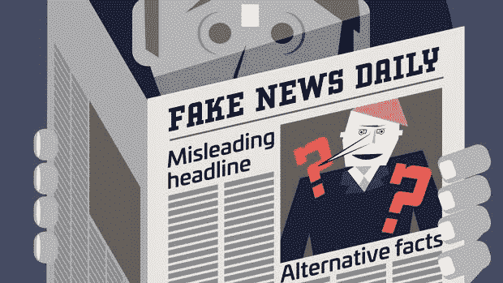
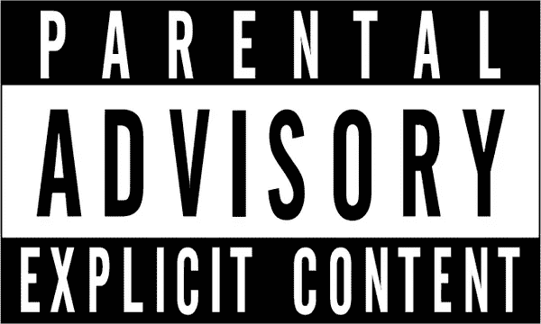
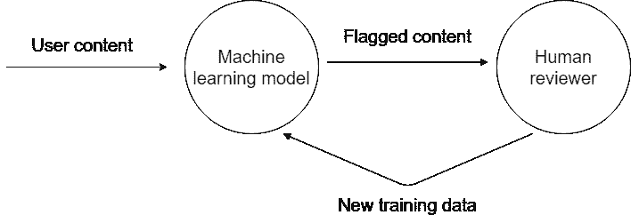

# 用于内容审核的机器学习—简介

> 原文：<https://towardsdatascience.com/machine-learning-for-content-moderation-introduction-4e9353c47ae5?source=collection_archive---------22----------------------->

## 用于在线内容审核的机器学习系统综述

[https://digital.wf.com/treasuryinsights/portfolio-items/tm13050/](https://digital.wf.com/treasuryinsights/portfolio-items/tm13050/)

# 概观

随着互联网的社交平台，如脸书和推特，越来越受欢迎，访问量越来越大，提交给它们的内容也越来越多。虽然这些平台的发展带来了许多好处，使人们能够保持相互联系，并在世界各地集体组织起来，但它也带来了一些问题，如假新闻的传播，以及网络欺凌等在线滥用。随着围绕这些互动空间的法律和社会环境的成熟，这些公司监管其平台的负担越来越重。他们对平台的维护和质量越来越负责。

然而，这些平台上有数十亿用户和数百万条消息和照片，这些公司不可能人工检查每一个。相反，他们通常利用机器学习系统来自动解析上传到他们网站的内容。被标记为违反规则的提交内容随后被提交给人工审查人员，他们将对该内容是否应该被允许出现在网站上做出最终判断。

# 什么内容得到审核？

首先，了解一些内容审核系统通常针对的内容示例非常重要。内容通常通过以下两种方法中的一种来处理，要么在提交可疑的滥用内容之前先发制人地发出警告，要么在事后删除和/或惩罚。

## 滥用内容

第一类涉及旨在在线骚扰或虐待某人或一群人的内容。这包括各种类型的行为，如:网络攻击、网络欺凌、仇恨言论和 doxxing。虽然这些社会现象中一些有点难以定义，但是公司仍然努力自动检测它们。在发生了几起不幸导致自残和自杀的网络欺凌事件后，脸书和 Instagram 等公司面临着越来越大的压力，要求它们增加报告选项，并加强监管。大多数滥用内容检测方法混合使用自然语言处理、图像处理和社交网络分析。

[https://www.metroparent.com/daily/parenting/parenting-issues-tips/michigan-anti-cyberbullying-law-what-it-means-for-kids-and-families/](https://www.metroparent.com/daily/parenting/parenting-issues-tips/michigan-anti-cyberbullying-law-what-it-means-for-kids-and-families/)

## 虚假/误导性内容

下一类涉及虚假或误导的内容，旨在利用社交网络加速虚假信息的传播，通常以新闻文章的形式出现。最常见的是，我们在带有政治色彩的短语“假新闻”下听到这些内容。检测假新闻是一个开放的研究领域，存在许多挑战，因为不可能手动检查每篇文章。当前的方法使用各种方法，例如结合大的一般/常识知识库、自然语言处理，以及通过社交网络分析和内容的风格元素结合各种基于声誉的因素。

[https://www.independent.ie/world-news/and-finally/7-reasons-why-fake-news-goes-viral-according-to-experts-36283450.html](https://www.independent.ie/world-news/and-finally/7-reasons-why-fake-news-goes-viral-according-to-experts-36283450.html)

## 裸露/露骨的内容

下一类涉及裸体和露骨的性内容。这通常通过图像处理方法来检测。不同的平台对此有不同的立场——例如，Instagram 根本不允许，而 Reddit 允许所有(合法)情况下的这种行为。最值得注意的是，Tumblr 最近决定改变他们对露骨内容的政策，并禁止色情和大多数裸体案例。

## 诈骗/网络钓鱼/黑客攻击

最后，我们有针对平台上用户的诈骗、网络钓鱼或黑客内容。这种类型的内容通常会试图让用户离开平台，使用另一个网站。在这个外部网站上，用户通常会被诱骗提交个人信息，或者向非预期方汇款。这通常是通过模仿原始网站上的 URL(通常通过[同形异义](https://en.wikipedia.org/wiki/Homoglyph)攻击)或者通过使用外部网站向用户承诺更好的购买交易来实现的。这种内容通常通过自然语言处理、已知网络钓鱼链接的集合以及通过社交网络分析和账户因素的基于声誉的因素来检测。

[https://www.pcmag.com/article/364947/how-to-avoid-phishing-scams](https://www.pcmag.com/article/364947/how-to-avoid-phishing-scams)

# 适度是如何发生的？

现在，我们已经了解了常见的审核内容类型，我们可以了解一下大多数自动内容审核系统是如何工作的。这通常发生在两个主要阶段。

## 自动标记

首先，当然，内容是由用户创建和提交的。

如果基于一些基本检查，该用户被认为是违规者或者内容非常明显地违反了规则，则该用户可能会被[屏蔽](https://en.wikipedia.org/wiki/Shadow_banning)，并且内容可能会自动隐藏，而他们并不知道。

否则，计算特征以输入到内容审核机器学习模型中。如果这些特征不是内容本身的函数(例如用户特征)，则这些特征中的一些可能已经通过预定的批处理系统进行了计算，而如果这些特征是从提交的内容中直接导出的(例如涉及文本或图像的特征)，则这些特征中的另一些可能是即时计算的。此外，提交后，如果内容被其他用户手动标记，它可能会被重新处理。

基于这些特征，机器学习模型输出可以被解释为概率的分数。如果这个分数高于某个阈值，该内容就会被标记为人工审查，因为它被怀疑违反了平台的规则。自然，由于这些企业的目标是优化其支出，因此通常会严格选择该阈值，以便优化某种衡量标准，平衡违规成本和人工标记成本。

## 人类评论

一旦内容被标记，它就会被传递给人工审阅者进行人工检查。他们通常会接受少量培训，以识别违规内容。这些人工审阅者操作非常快，可能只花几秒钟来审阅每一条内容。[由于他们每天必须查看的内容类型，这些员工的工作条件被认为是有问题的](https://www.cnbc.com/2019/02/25/facebook-content-moderators-describe-a-stressful-work-environment.html)。

在审查内容之后，审查者然后对内容是否违反任何规则做出最终判断。通常，每份提交的材料将被分配给几个评审员(~5 个)，以便有希望消除由标签错误或不同解释引起的不一致的结果。

一旦有了最终的标签，如果内容违反了任何规则，就会被处理。这通常意味着内容被删除。用户的账户也可能被处罚或删除。

最后，这段内容随后被存储在其给定的标签旁边。内容标记机器学习模型的未来迭代将最有可能在其训练集中使用这一新数据。通过这一过程，没有数据被浪费，模型能够不断地被重新训练，并能够适应用户提交的变化模式。