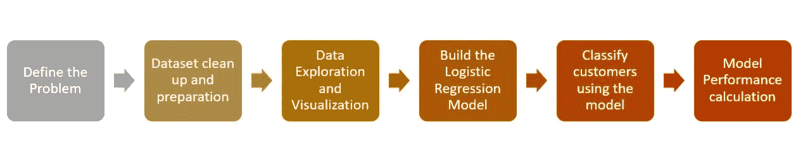
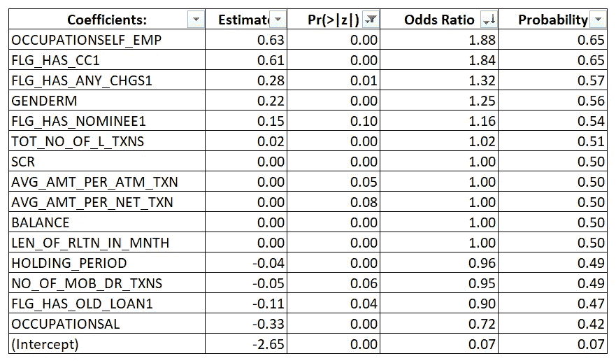

# 用于客户分析的机器学习— 1

> 原文：<https://towardsdatascience.com/machine-learning-for-customer-analytics-1-478eeab7345f?source=collection_archive---------1----------------------->

## 使用逻辑回归预测顾客反应


Photo by [Ibrahim Rifath](https://unsplash.com/@photoripey?utm_source=medium&utm_medium=referral) on [Unsplash](https://unsplash.com?utm_source=medium&utm_medium=referral)

## 语境

个人贷款是银行的主要收入来源，所有银行都主动接触潜在客户，为他们的贷款产品进行宣传。这些营销活动大多针对随机的客户数据库，因此最终会变成烦人的电话营销，而不是有效的线索转化手段。

在这篇文章中，我们将看到如何利用机器学习的力量将活动瞄准正确的客户群，从而增加转化倾向。我们将使用已响应和未响应个人贷款活动的客户的人口统计、银行详细信息和交易模式的过去可用数据，作为预测客户是否会响应活动的概率的训练数据。

在机器学习术语中，这是一个分类问题，有几种分类算法可用于构建预测模型，我们将使用逻辑回归。

# 关于逻辑回归

逻辑回归是一种流行且强大的监督机器学习技术，用于建立将独立预测因子(x 变量)与本质上是分类的响应变量(y)相关联的模型。在已知类的情况下，根据数据集中的预测变量，它可以帮助找到区分不同类中记录的因素。

当结果变量只有两类时(例如:通过/失败；欺诈/非欺诈；默认/无默认)如果我们有两个以上的类别(例如:买入/卖出/持有)，则应用二项式逻辑回归和多项式逻辑回归。

逻辑回归是一种统计技术，它根据预测变量的统计显著性以及每个预测变量如何影响 Y 变量类别的概率来提供详细的统计摘要。这些独特的品质使该算法与银行和金融领域高度相关，以提供预测变量的详细和数字解释。

# 资料组

我们有一个数据集，它提供了一家银行执行的“个人贷款”活动的详细信息。向 20，000 名客户提供 14%利率的个人贷款，其中 2512 名客户积极响应。数据集和数据字典可以从[这里](https://github.com/vivekv73/LogReg)下载。

# 高级方法

下面的流程图描述了我们使用逻辑回归寻找分类问题解决方案的高级方法，从定义问题陈述开始，到计算新客户分类模型的准确性。



High Level Approach

# 问题定义

我们将使用逻辑回归建立一个模型，预测客户对个人贷款活动的反应倾向(概率)。模型中的概率将用于对结果进行分类，并确定影响反应的变量。目标是建立一个模型，确定在未来的个人贷款活动中最有可能接受贷款的客户。

# 数据清理和准备

作为第一步，我们设置工作目录并将 csv 格式的数据集读入 R:

```
## Setting working directory and reading the csv file**setwd("F:/DataScience/BLOG/LogRegproject1")****loanorg <- read.csv("PLXSELL.csv")**
```

接下来，我们使用 R 中的基本命令查看数据集，以了解列及其数据类型，以及存在的记录数量。

```
## View the dataset using View, str, names in R**View(loanorg)** *(output not shown here)***dim(loanorg)** [1] 20000    40**names(loanorg)** ##  [1] "CUST_ID"                  "TARGET"                  
 ##  [3] "AGE"                      "GENDER"                  
 ##  [5] "BALANCE"                  "OCCUPATION"              
 ##  [7] "AGE_BKT"                  "SCR"                     
 ##  [9] "HOLDING_PERIOD"           "ACC_TYPE"                
 ## [11] "ACC_OP_DATE"              "LEN_OF_RLTN_IN_MNTH"     
 ## [13] "NO_OF_L_CR_TXNS"          "NO_OF_L_DR_TXNS"         
 ## [15] "TOT_NO_OF_L_TXNS"         "NO_OF_BR_CSH_WDL_DR_TXNS"
 ## [17] "NO_OF_ATM_DR_TXNS"        "NO_OF_NET_DR_TXNS"       
 ## [19] "NO_OF_MOB_DR_TXNS"        "NO_OF_CHQ_DR_TXNS"       
 ## [21] "FLG_HAS_CC"               "AMT_ATM_DR"              
 ## [23] "AMT_BR_CSH_WDL_DR"        "AMT_CHQ_DR"              
 ## [25] "AMT_NET_DR"               "AMT_MOB_DR"              
 ## [27] "AMT_L_DR"                 "FLG_HAS_ANY_CHGS"        
 ## [29] "AMT_OTH_BK_ATM_USG_CHGS"  "AMT_MIN_BAL_NMC_CHGS"    
 ## [31] "NO_OF_IW_CHQ_BNC_TXNS"    "NO_OF_OW_CHQ_BNC_TXNS"   
 ## [33] "AVG_AMT_PER_ATM_TXN"      "AVG_AMT_PER_CSH_WDL_TXN" 
 ## [35] "AVG_AMT_PER_CHQ_TXN"      "AVG_AMT_PER_NET_TXN"     
 ## [37] "AVG_AMT_PER_MOB_TXN"      "FLG_HAS_NOMINEE"         
 ## [39] "FLG_HAS_OLD_LOAN"         "random"
```

在查看和研究数据集后，我们推断:

1.  有 20，000 个观察值和 40 个变量。
2.  我们混合了整数、数字和因子变量。
3.  分类响应变量表示客户是否对活动做出响应，该变量称为“目标”。[0 -未回应/ 1 -已回应]

根据数据探索，我们还注意到需要以下操作来准备数据集以供进一步分析:

*   列 CUST_ID 和“随机”不是必需的，因为这些列是用于用一些 ID 表示调查参与者的(它们既不是 x 变量也不是 y 变量)。

```
##remove unwanted columns CUST_ID and random**loancamp <- loanorg[,-c(1,40)]**
```

*   有些变量的相同数据由数据集中的其他变量表示。分别是 AGE_BKT(用 AGE 表示)和 ACC_OP_DATE(用' LEN_OF_RLTN_IN_MNTH '表示)。因此，年龄 _BKT 和 ACC_OP_DATE 可以从数据集中删除。

```
## remove columns AGE_BKT and ACC_OP_DATE**loancamp$AGE_BKT <- NULL
loancamp$ACC_OP_DATE <- NULL**
```

*   分类变量 TARGET，OLD _ 哈斯 _CC，OLD _ 哈斯 _ANY_CHGS，OLD _ 哈斯 _NOMINEE，OLD _ 哈斯 _OLD_LOAN 表示为整数数据类型。这些在 r 中被转换成范畴类型。

```
## Convert variables into correct datatypes (FLG_HAS_CC, FLG_HAS_ANY_CHGS, FLG_HAS_NOMINEE, FLG_HAS_OLD_LOAN, TARGET should be categorical)**loancamp$TARGET <- as.factor(loancamp$TARGET)
loancamp$FLG_HAS_CC <- as.factor(loancamp$FLG_HAS_CC)
loancamp$FLG_HAS_ANY_CHGS <- as.factor(loancamp$FLG_HAS_ANY_CHGS)
loancamp$FLG_HAS_NOMINEE <- as.factor(loancamp$FLG_HAS_NOMINEE)
loancamp$FLG_HAS_OLD_LOAN <- as.factor(loancamp$FLG_HAS_OLD_LOAN)****str(loancamp)**
```

四个不需要的列已被删除，上面列出的五个变量的数据类型已被更正。

让我们检查数据集中是否有缺失的值:

```
## Check for missing values in any of the columns**colSums(is.na(loancamp))**
```

数据集中没有缺失值。

既然数据集已准备好进行建模，让我们检查数据集中观察结果的基准客户响应率:

```
##Calculate baseline conversion rate**respons_rate <- round(prop.table(table(loancamp$TARGET)),2)
respons_rate**0    1 
0.87 0.13
```

我们可以看到数据集明显不平衡—只有 13%的客户记录有响应(类别 1)，而其余 87%的记录没有响应(类别 0)。这将对模型性能度量产生影响，我们将在本分析的后面部分详细了解这一点。

# 探索性数据分析

在本节中，我将使用 r 中的 ggplot2 以数据可视化的形式进一步探索数据集。这将有助于初步了解数值变量的分布以及影响响应变量的重要特征。

## 单变量分析

**重要独立数值变量的直方图**

```
## EDA - histogram plot for important numeric variables**library(ggplot2)
library(cowplot)****ggp1 = ggplot(data = loancamp, aes(x = AGE))+
      geom_histogram(fill = "lightblue", binwidth = 5, colour = "black")+
      geom_vline(aes(xintercept = median(AGE)), linetype = "dashed")**
```


Histogram of Numeric Variables

从直方图中我们可以看出

*   年龄的频率分布显示，26-30 岁年龄组的目标客户最多。
*   持有期(在账户中持有资金的能力)和与银行的关系长度或多或少是平均分布的。
*   这些客户的大部分信用交易在 0-15 英镑之间，而借贷交易少于 10 英镑。

**重要独立数值变量的箱线图**


Box plot of Numeric Variables

从箱线图中，我们可以直观地推断出:

*   箱线图显示了数字变量的以下中值:年龄约为 38 岁，持有期即在账户中持有资金的能力为 15 个月，与银行的关系长度为 125 个月，信贷交易次数为 10，借贷交易次数为 5。
*   对于变量信贷交易数量和借贷交易数量，存在许多异常值。

**重要分类变量的柱状图**


Bar plot of Categorical Variables

我们可以从柱状图中推断出

*   在贷款活动中，近四分之三的目标客户是男性。
*   工薪阶层和专业阶层构成了大部分目标客户。
*   四分之一的顾客有信用卡
*   数据集中有相同比例的客户有旧贷款或没有贷款。

## 双变量分析

**数值变量与目标( *y* 变量)**的箱线图

```
#bivariate analysis of AGE, LEN_OF_RLTN_IN_MNTH,HOLDING_PERIOD against TARGET**ggbi1 = ggplot(data = loancamp, aes(x = TARGET, y = AGE, fill = TARGET))+geom_boxplot()
ggbi2 = ggplot(data = loancamp, aes(x = TARGET, y = LEN_OF_RLTN_IN_MNTH, fill = TARGET))+geom_boxplot()
ggbi3 = ggplot(data = loancamp, aes(x = TARGET, y = HOLDING_PERIOD, fill = TARGET))+geom_boxplot()
plot_grid(ggbi1, ggbi2, ggbi3, labels = "AUTO")**
```


**Box plot for numeric variables vs TARGET**

当我们根据分类目标变量查看数值变量的双变量分析的数据可视化时，我们获得了以下见解:

**年龄与目标**(目标:响应贷款活动= 1；未响应贷款活动= 0)

对活动做出回应的客户的年龄中位数略高于未做出回应的客户。尽管这两个阶层在年龄上没有太大区别，我们也从**与银行关系的月数与目标阶层**的时间长度中得出这一推论。

对个人贷款活动做出响应的客户中，平均持有期**(在账户中持有资金的能力)较短，约为 10 个月。**

**分类 x 变量与目标( *y* 变量)**的堆积条形图


**Stacked Bar plot for Categorical x variables vs TARGET**

使用堆积条形图对分类 x 变量和目标 y 变量进行双变量分析有助于我们直观地了解以下情况:

*   我们发现，与女性客户相比，更多的男性客户(约 25%)对该活动做出了回应(相比之下，“其他”类别下的客户总数非常少)。
*   与工薪阶层的顾客相比，个体经营的顾客对利用个人贷款更感兴趣。
*   17%在银行有往来账户并被联系贷款的客户表示有兴趣，相比之下，有储蓄账户的客户有 11%表示有兴趣。
*   客户有未决的费用要支付给银行或没有未决的费用，似乎对响应或不响应活动没有任何影响。我们看到在银行有旧贷款的客户也有类似的模式。
*   与没有信用卡的顾客相比，持有信用卡的顾客对贷款更感兴趣。

# 将数据集分为开发(定型)集和维持(验证或测试)集

接下来，我们将把数据集分成训练数据集和测试数据集。我们将基于训练数据集构建模型，并使用测试数据集测试模型性能。

```
## split the dataset into training and test samples at 70:30 ratio**library(caTools)****set.seed(123)****split = sample.split(loancamp$TARGET, SplitRatio = 0.7)
devdata = subset(loancamp, split == TRUE)
holddata = subset(loancamp, split == FALSE)**## Check if distribution of partition data is correct for the development dataset**prop.table(table(devdata$TARGET))
prop.table(table(holddata$TARGET))** 
```

上面的 prop.table 输出证实了我们在原始数据集中看到的不平衡数据集特征在开发和保留样本中保持相同的比例。

现在，训练数据集已准备好构建模型。

# 建立基于逻辑回归的预测模型

**逻辑回归的步骤**


## 步骤 1:对训练数据运行逻辑回归

在 R 中使用广义线性模型命令 glm 来使用逻辑回归建立模型。

```
**library(glmnet)

logreg = glm(TARGET ~., data=devdata, family="binomial")**
```

## 步骤 1a:可变膨胀系数检查

让我们根据生成的模型，通过可变通货膨胀系数(VIF)检查来检查 x 变量之间的多重共线性。

```
**library(car)****vif(logreg)**
```

VIF 值大于 4 的要素(x)变量表示高度多重共线性。

从下表中，我们注意到以下变量具有大于 4 的 VIF 值:远程登录数量、远程登录数量、远程登录数量、远程登录数量、远程登录数量、远程登录数量、远程登录数量、AVG 远程登录数量、远程登录数量、远程登录数量。


VIF output showing variables with VIF value above 4

我们从训练和测试数据集中删除这些具有高度多重共线性的 x 变量，并重新运行模型。这将有助于确定明显影响响应变量(TARGET-y 变量)的变量，并建立一个可以更准确地对记录进行分类的模型。

重复这个过程，直到我们得到值低于 4 的干净的 VIF 输出。

## 步骤 2:模型的总体意义

```
**library(lmtest**) **lrtest(logreg1)**
```


我们可以看到，低 p 值表明模型非常重要，即客户对活动(目标)做出反应的可能性取决于数据集中的独立 x 变量。

**第三步:麦克法登或伪 R 解读**

```
**library(pscl)****pR2(logreg1)**
```


基于麦克法登 R 的值，我们可以得出结论，仅截距模型的 8.7%的不确定性是由完整模型(当前 x 变量)解释的。该值表示拟合优度低。这可能表明需要添加更多的 x 变量来解释响应(y)变量的变化。

**第四步:个别系数的意义和解释**

```
**summary(logreg1)**
```

从生成的模型的总结中，我们推断有一些 x 变量基于它们的 p 值是显著的。这些是影响客户对活动做出回应的 x 变量，如下表所示。

每个 x 变量的比值比和概率是基于公式计算的，

优势比= exp(系数估计值)

概率=优势比/ (1 +优势比)



Summary of Logistic Regression Model with Odds Ratio and Probability

**逻辑回归总结的推论:**

*   如果客户是个体户，他回应的几率是不回应的 1.88 倍。换句话说，他响应竞选的概率是 65%。
*   如果他有一张信用卡，那么响应竞选的几率是 1.84。
*   如果客户有旧贷款或属于工薪阶层，那么他们响应活动的概率会下降到 50%以下，即他们不太可能响应。

# 预测验证数据

使用我们刚刚构建的模型，让我们尝试预测验证样本中记录的倾向和类别。请注意，我们已经知道了这些记录的类，并将使用该输入来比较和发现新模型在分类新记录时有多好。

```
**holddata1.predict.score=predict(logreg1,newdata = holddata1, type="response")**
```

该模型具有验证集中各个记录的输出倾向。

为了确定基于概率对记录进行分类的临界值，我们查看预测概率的分布。


如果我们看一下分布，大多数记录的概率值都在 10%以下。因此，我们使用临界值 0.1 来预测记录的类别。

```
## Assgining 0 / 1 class based on cutoff value of 0.1
**holddata1$Class = ifelse(holddata1.predict.score>0.1,1,0)**
```

模型已经预测了每条记录的类别(目标值 0 或 1)。让我们创建混淆矩阵，看看模型根据验证集中这些记录的已知目标值对记录进行分类的效果如何。

# 模型性能—混淆矩阵

混淆矩阵提供了模型准确性的清晰快照。

```
## Creating the confusion matrix
**tabtest=with(holddata1, table(TARGET,Class))****tabtest**
```


Confusion Matrix of Test Data

在这里，敏感性比准确性更重要，因为我们更感兴趣的是了解客户会对新活动做出反应的所有记录，而不是客户可能根本不会做出反应的记录。由于模型分类(敏感性)不正确，联系潜在客户(该客户将获得贷款并因此向银行支付利息)的机会成本损失比由于分类不正确(特异性)而收到邮件或电话的潜在无响应客户更为严重。

当我们比较训练数据和测试数据之间的模型性能度量时(见下表)，模型对测试数据保持良好，而性能度量没有显著下降。这表明模型中没有过度拟合。

为了使用该模型预测类别，我们有意识地在准确性上做出妥协，以获得更好的敏感性，即不会失去对贷款活动做出反应的潜在客户。


# 可行的见解

基于上述模型，我们可以向银行提出以下建议:

*   不要给随机的一组客户打电话，而是瞄准具有以下一种或多种特征的客户——男性客户、个体户、持有信用卡、在银行有过或曾经有过一些费用。
*   避免联系已经贷款和/或工薪阶层的客户。

# 结论

在这里，我们使用了二项式逻辑回归技术，不仅预测了响应贷款活动的客户类别，还获得了影响客户对活动响应的统计显著性独立变量列表。我们还能够根据模型摘要预测客户响应或不响应的概率。这些提供了强有力的见解，将有助于提高客户的回应率，从而转化为银行贷款。

## 资源

*R 中的原始数据集、数据字典、完整代码在这里*[](https://github.com/vivekv73/LogReg)**。**