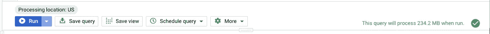

# 面向数据分析师的机器学习— BigQuery ML

> 原文：<https://towardsdatascience.com/machine-learning-for-data-analysts-bigquery-ml-b60ef05e43c2?source=collection_archive---------18----------------------->

## BigQuery 中使用 SQL 的机器学习介绍


Photo by [imgix](https://unsplash.com/@imgix?utm_source=medium&utm_medium=referral) on [Unsplash](https://unsplash.com?utm_source=medium&utm_medium=referral)

数据分析包括分析原始数据，以提取有价值的见解。这些见解经常被用作未来决策的辅助手段。

被分析的数据通常以一种或多种格式存储。这些可以是平面文件或文本文件(逗号分隔，制表符分隔)，电子表格(Excel，Google Sheets)，数据库和其他格式。

我第一次使用结构化查询语言(SQL)是在 2000 年左右的 MySql 早期版本。当时，我不得不访问该网站下载安装程序(我使用的是 Windows)和文档。正是从那里，我了解了 DML 和 DDL。那时，我必须下载并安装软件，并决定我想要运行什么引擎，如果我想要复制，我必须自己设置它。我不得不关注性能调优，当我的负载增加时进行扩展，并想出如果我的存储空间用完了该怎么办。

多年来，我一直在使用其他数据库，包括来自微软、甲骨文和 IBM 的产品。

虽然许多数据库供应商已经转而提供托管服务，但有一家供应商让我印象深刻。这是谷歌的 BigQuery。Google 云平台是一个很棒的产品，但是现在让我们只关注 BigQuery。

BigQuery 是谷歌提供的无服务器服务。这意味着，您不需要调配或管理它。您不需要指定打算使用多少存储空间，也不需要指定希望将哪种处理器连接到数据库服务器。相反，它会扩展以适应您的工作需求。

它能够存储大量的数据。然而，它是为数据分析工作负载而设计的，这意味着它不希望您存储的数据频繁更改。如果你来自旧数据库的世界，它是为 OLAP 设计的，而不是 OLTP。

BigQuery 将在没有任何准备的情况下存储数千万亿字节的数据。您可以通过实现分区策略来帮助您的情况，这将大大加快您的数据检索。我还需要提一下，数据检索已经很快了，你不用做任何事情。

您可以通过查看它们托管的公开可用的数据集来开始使用 BigQuery。你可以在这里找到那些。

将您自己的数据导入 BigQuery 非常容易。从 BigQuery 控制台，您可以单击项目名称并创建数据集。一旦有了数据集，就可以继续创建表或将数据导入表中。


BigQuery Console

查询要求您指定项目、数据集以及表名。下面是一个查询示例。

```
#standardSQL 
SELECT  
  weight_pounds, 
  state, 
  year, 
  gestation_weeks 
FROM  
  `bigquery-public-data.samples.natality` 
ORDER BY 
  weight_pounds 
DESC 
LIMIT 10;
```


Query Result

按住 Command(或 Windows 中的 CTRL)并单击查询中的表名，将显示表的详细信息。您还可以访问表模式。

在查询编辑器下面的栏中，有一个验证器，它告诉您查询是否有效，以及如果您要执行它，该查询将处理多少数据。



Query Validator

将数据导入 BigQuery 的一种流行方式是将文本文件上传到 Google 云存储桶中。从那里，您可以将 BigQuery 指向该文件，并将其导入到一个表中。


Table Creation


Specifying Details during Table Creation

一旦将数据导入 BigQuery，就可以继续运行查询了。

查询很有趣。它们告诉你已经发生了什么，让你清楚地了解过去。你可以称之为描述性分析。我卖出了多少件商品，订单多长时间来一次，特定商品在一周的哪几天卖得最多？

查询能告诉你未来会发生什么吗？你能根据一天中的时间预测销售额，同时考虑季节性吗？

我们正在进入预测分析的领域，更正式的名称是[机器学习](https://developers.google.com/machine-learning/crash-course/ml-intro)。我们需要从我们的数据中提取洞察力，这将让我们对以前看不见的数据做出预测，但首先，我们试图解决的问题需要被[框住](https://developers.google.com/machine-learning/crash-course/framing/video-lecture)。机器学习本身分为三类:监督学习、非监督学习和强化学习。本文将关注前两者。

监督学习处理的情况是，你想要预测的内容包含在你已经收集的数据中。考虑这样一种情况，您希望根据一天中的时间和日期来预测供应商可能售出的水瓶数量。这叫做**回归**。您试图预测的值称为**标签**或目标，您用来进行预测的信息称为**特征**。

考虑另一个场景，你试图预测的是电子商务网站的访问者是否会购买。这叫做**分类**。这仍然是监督学习，因为你需要历史数据来显示你网站的访问者是否进行了购买。

无监督学习处理的是有历史数据但没有标签的情况。例如，您有关于客户交易的数据，并且您希望将这些交易放入**聚类**中，以便进行营销或新产品开发。

一种训练机器学习模型的方法涉及最小化损失。你可以在这里快速入门。所有这些都涉及到大量的[数学和统计](https://developers.google.com/machine-learning/crash-course/logistic-regression/model-training)，以及行业专用术语，如优化器、梯度下降、学习率、过拟合和欠拟合、偏差-方差权衡、超参数调整，以及许多普通数据分析师可能不想涉及的词汇。还有一个事实是，处理编程语言是强制性的。

> 谷歌的 BigQuery 团队认为，如果数据分析师可以训练机器学习模型，而不必在只使用 SQL 的情况下处理大部分数学和术语，那就太好了。这就产生了 [BigQuery ML](https://cloud.google.com/bigquery-ml/docs/) 。

BigQuery ML(也称为 BQML)支持线性回归、二元逻辑回归(两个类之间)、多类逻辑回归(属于多个类中的一个)和 k-means 聚类(用于数据分段的无监督学习)。

BigQuery ML 出奇的简单。您需要了解的第一个对象是`model`。与表和视图类似，模型存储在数据集中。

创建模型由两部分组成。第一部分指定模型参数，包括数据集和模型的名称以及模型的类型。第二部分指定用于训练的数据，并包括标签。不是标签的每一列都被认为是特征。

考虑下面的查询。

第一行通过指定数据集和名称来定义模型。第二行将模型类型指定为逻辑回归。随后的几行通过从 BigQuery 公共数据集中获取一些数据来提供训练数据，该公共数据集中托管了一些来自电子商务站点的数据。注意，选择有一个名为**标签**的列，这就是我们试图预测的。另外，请注意，它被设置为 0 或 1，因为计算机喜欢处理数字。查询中的两个新内容是表名如何使用通配符和表后缀范围。以上是 BigQuery 的一些特性，很容易学习。

逻辑回归模型给出了数据归入我们表示为 1 的一类的概率。如果概率低于 50%，则数据属于表示为 0 的替代类。50%是一个阈值，您可以根据自己的需要进行更改。你可以在这里了解更多。

创建模型时要记住的一点是，标签列不能是`NULL`。

`create model`的语法如下:

```
{CREATE MODEL | CREATE MODEL IF NOT EXISTS | CREATE OR REPLACE MODEL}
[model_name](https://cloud.google.com/bigquery-ml/docs/reference/standard-sql/bigqueryml-syntax-create#model_name)
[OPTIONS([model_option_list](https://cloud.google.com/bigquery-ml/docs/reference/standard-sql/bigqueryml-syntax-create#model_option_list))]
[AS [query_statement](https://cloud.google.com/bigquery-ml/docs/reference/standard-sql/bigqueryml-syntax-create#query_statement)]
```

`model_type`可以是`logistic_reg`、`linear_reg`或`kmeans`。

如果你对机器学习有所了解的话，不妨具体说明一下:`l1_reg`、`l2_reg`、`max_iteration`、`learn_rate_strategy`、`learn_rate`、`early_stop`、`data_split_method`、`data_split_col`、`ls_init_learning_rate`、`warm_start`。这些参数都在[这里](https://cloud.google.com/bigquery-ml/docs/reference/standard-sql/bigqueryml-syntax-create)描述。

当模型完成训练时，您将得到确认，并且该模型将出现在您的数据集中。


Result of model training

您可能对培训选项感兴趣，当您向下滚动描述页面时会看到这些选项。


Model Training Options

您可以单击“培训”按钮打开选项卡，看到类似以下内容:


Training Report

该信息也以表格形式提供。在每次迭代中，您可以看到训练数据和评估数据的损失是如何减少的。您还可以看到用于该训练迭代的[学习率](https://developers.google.com/machine-learning/crash-course/reducing-loss/learning-rate)。


Training Report

还提供了评估指标。你可以在找到更多关于精确和回忆[的信息。你可以在这里找到更多关于 ROC](https://developers.google.com/machine-learning/crash-course/classification/precision-and-recall) [的信息](https://developers.google.com/machine-learning/crash-course/classification/roc-and-auc)。混淆矩阵告诉你模型的准确性，即预测正确的百分比。


Evaluation Metrics

模型需要用一种叫做评估数据集的东西来评估。本质上，您并没有使用所有的数据来训练模型。相反，您应该留出 20%到 30%的数据来评估模型的质量。模型评估的语法如下:

```
ML.EVALUATE(MODEL [model_name](https://cloud.google.com/bigquery-ml/docs/reference/standard-sql/bigqueryml-syntax-evaluate#eval_model_name)
           [, {TABLE [table_name](https://cloud.google.com/bigquery-ml/docs/reference/standard-sql/bigqueryml-syntax-evaluate#eval_table_name) | ([query_statement](https://cloud.google.com/bigquery-ml/docs/reference/standard-sql/bigqueryml-syntax-evaluate#eval_query_statement))}]
           [, STRUCT(<T> AS [threshold](https://cloud.google.com/bigquery-ml/docs/reference/standard-sql/bigqueryml-syntax-evaluate#eval_threshold))])
```

为了评估模型，您调用`ML.EVALUATE()`函数。型号名称是必需的。如果不想使用 50%,可以选择传入一个评估数据集和一个阈值。下面是我们如何评估上面创建的模型。

模型评估的结果如下所示:


The output from model evaluation

在处理二元分类模型时，您可能会对称为接收器操作特性曲线的东西感兴趣。其语法如下:

```
ML.ROC_CURVE(MODEL [model_name](https://cloud.google.com/bigquery-ml/docs/reference/standard-sql/bigqueryml-syntax-roc#roc_model_name)
            [, {TABLE [table_name](https://cloud.google.com/bigquery-ml/docs/reference/standard-sql/bigqueryml-syntax-roc#roc_table_name) | ([query_statement](https://cloud.google.com/bigquery-ml/docs/reference/standard-sql/bigqueryml-syntax-roc#roc_query_statement))}]
            [, GENERATE_ARRAY([thresholds](https://cloud.google.com/bigquery-ml/docs/reference/standard-sql/bigqueryml-syntax-roc#roc_thresholds))])
```

这就是我们如何为我们的模型生成 ROC 曲线。

运行上述查询的结果类似于以下内容:


ROC Curve

最后，在处理分类模型时，您可能会对混淆矩阵感兴趣。这是一个交叉列表，列出了哪些是正确分类的，哪些不是。例如，使用二进制分类，我们得到四个单元:真阳性、真阴性、假阳性和假阴性。其语法如下:

```
ML.CONFUSION_MATRIX(MODEL [model_name](https://cloud.google.com/bigquery-ml/docs/reference/standard-sql/bigqueryml-syntax-confusion#eval_model_name)
           [, {TABLE [table_name](https://cloud.google.com/bigquery-ml/docs/reference/standard-sql/bigqueryml-syntax-confusion#eval_table_name) | ([query_statement](https://cloud.google.com/bigquery-ml/docs/reference/standard-sql/bigqueryml-syntax-confusion#eval_query_statement))}]
           [, STRUCT(<T> AS [threshold](https://cloud.google.com/bigquery-ml/docs/reference/standard-sql/bigqueryml-syntax-confusion#eval_threshold))])
```

当生成混淆矩阵时，我们的模型的查询看起来是这样的:

混淆矩阵看起来如下所示:


Confusion Matrix

我们终于准备好利用我们的模型通过`ML.PREDICT()`进行预测了。你可以在这里找到更多关于这个函数[的行为。语法如下:](https://cloud.google.com/bigquery-ml/docs/reference/standard-sql/bigqueryml-syntax-predict)

```
ML.PREDICT(MODEL [model_name](https://cloud.google.com/bigquery-ml/docs/reference/standard-sql/bigqueryml-syntax-predict#predict_model_name),
          {TABLE [table_name](https://cloud.google.com/bigquery-ml/docs/reference/standard-sql/bigqueryml-syntax-predict#predict_table_name) | ([query_statement](https://cloud.google.com/bigquery-ml/docs/reference/standard-sql/bigqueryml-syntax-predict#predict_query_statement))}
          [, STRUCT<threshold FLOAT64> settings)])
```

以下查询显示了我们将如何使用我们的模型进行预测。没有标签的查询被用作预测的输入。

输出将包含一个`predicted_label`列，这是模型做出的预测。使用分类模型，您还会得到一个概率列。


Model Prediction

总之，BQML 使得为回归、分类和聚类创建机器学习模型成为可能。虽然这篇文章将带您走上构建模型的道路，但它不会让您擅长于此。你至少需要很好地理解机器学习理论。

你需要知道什么是学习率，梯度下降是如何工作的，偏差-方差权衡，正则化，提前停止，以及其他机制。了解这些东西的一个好地方是谷歌的机器学习速成班，可以在这里找到。

最需要学习的是特征工程。您需要理解数据，以及特征之间的相关性意味着什么。正是特征工程最终导致了好的模型。