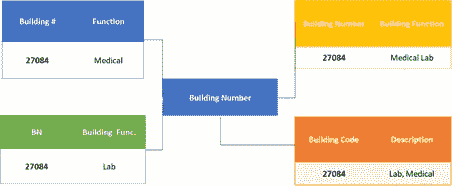
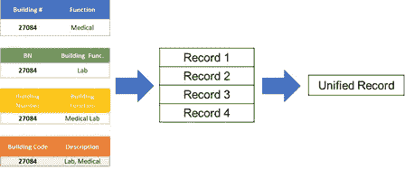
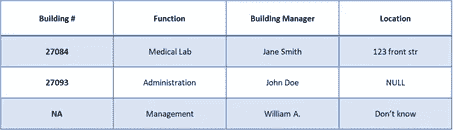
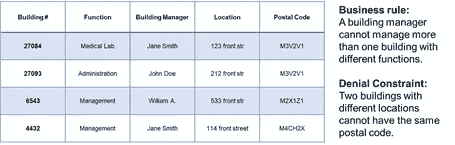
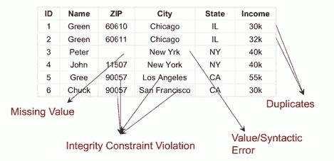
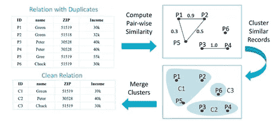
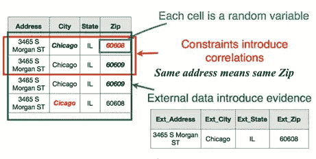

# 通过机器学习清理和统一您的数据

> 原文：<https://towardsdatascience.com/machine-learning-for-data-cleaning-and-unification-b3213bbd18e?source=collection_archive---------7----------------------->

Photo by [Mike Kononov](https://unsplash.com/@mikofilm?utm_source=medium&utm_medium=referral) on [Unsplash](https://unsplash.com?utm_source=medium&utm_medium=referral)

数据科学家今天面临的最大问题是脏数据。当涉及到真实世界的数据时，不准确和不完整的数据是常态而不是例外。问题的根源在于记录的数据不符合标准模式或违反完整性约束的来源。结果是脏数据被传送到下游的系统，如数据集市，在那里很难清理和统一，从而使其不可靠地用于分析。

如今，数据科学家在应用任何分析或机器学习之前，往往会花费 60%的时间清理和统一脏数据。数据清洗本质上是删除错误和异常，或者用数据中的真实值替换观察值，以在分析中获得更多价值的任务。有传统类型的数据清理，如输入缺失数据和数据转换，也有更复杂的数据统一问题，如重复数据删除和修复完整性约束违规。所有这些都是相互关联的，理解它们是什么很重要。

## **数据清理和统一问题**

模式映射查看多个结构化数据，并判断它们是否以相同的方式谈论同一件事情。在下面的例子中,“建筑#”和“建筑代码”都代表建筑编号吗？

Schema Mapping

记录关联是指在数据中多次提到同一个现实世界的实体。每个源的不同格式样式导致记录看起来不同，但实际上都指向同一个实体。在下面的例子中，所有四个表记录都指向同一个医学实验室。

Record Linkage & Deduplication

缺失数据是指数据集中缺失的值。缺失值插补是用替代值替换缺失数据的过程。实际上，问题更复杂，因为丢失的数据不是由空值表示，而是由垃圾表示，如下例所示。

Missing Data

完整性约束确保数据遵循功能依赖性和业务规则，这些规则规定了哪些值可以合法地共存。从数据中推导出约束可能非常困难，尤其是因为大多数数据关系并不明显。在下面的例子中，简·史密斯是医学实验室和管理大楼的大楼经理，这违反了业务规则。根据这条规则，要么简·史密斯不是这两栋楼的管理人员，要么医学实验室实际上是一栋管理大楼，要么管理大楼是一个医学实验室。

Integrity Constraint

上面我们已经看到了一些数据质量挑战。问题是，大多数数据科学家都在使用基于规则的工具和 ETL 脚本，它们孤立地处理每一个数据质量问题。然而事实是，大多数数据(如下图所示)通常都存在数据质量问题，并且它们以复杂的方式相互作用。问题不仅仅是工具不能处理数据质量问题之间的交互。由于高水平的计算，这些解决方案甚至不能在大型数据集上很好地扩展，并且在进行足够的校正之前需要多次通过。

Most datasets contain several data quality issues ([source](https://hazyresearch.github.io/snorkel/blog/holoclean.html))

## **用于数据清理和统一的机器学习**

考虑到当前解决方案的问题，科学界正在倡导用于数据清理的机器学习解决方案，这些解决方案以整体方式考虑所有类型的数据质量问题，并可扩展到大型数据集。

实体解析是数据统一任务的一个很好的例子，其中机器学习是有用的。实体解析中涉及的三个主要任务是重复数据删除、记录链接和规范化。重复数据消除的核心是消除重复数据的重复拷贝。通过记录链接，我们的目标是识别引用不同来源的相同实体的记录。规范化是指我们将具有多种表示形式的数据转换成标准形式。这些任务可以被描述为“分类”和“聚类”练习，通过足够的训练，我们可以开发模型来将记录对分类为匹配或不匹配，并将记录对聚类成组以选择最佳记录。

下图直观地展示了这一过程。

The deduplication process ([source](https://www.oreilly.com/ideas/three-enablers-for-machine-learning-in-data-unification-trust-legacy-and-scale))

python 重复数据删除库是可扩展 ML 解决方案的一个示例，用于跨不同的结构化数据集执行重复数据删除和记录链接。为了有效地工作，重复数据删除依靠领域专家将记录标记为匹配或不匹配。领域专家很重要，因为他们擅长识别哪些字段最有可能唯一地标识记录，并且他们可以判断记录的规范版本应该是什么样子。

记录修复是 ML 在数据清理中的另一个应用，也是统一项目的一个重要组成部分。修复记录主要是预测源数据记录中错误或缺失属性的正确值。关键是建立一个模型，结合完整性约束、外部知识和定量统计等信号，对缺失或错误值进行概率推断。

HoloClean 系统是 ML 解决方案的一个这样的例子，其中用户提供要被清理的数据集和一些高级域特定信息，例如参考数据集、可用的规则和约束以及数据库内类似条目的例子。然后，系统修复从冲突和拼写错误的值到离群值和空条目的错误。在下面的例子中，用户可以指定拒绝约束(捕获领域专业知识的一阶逻辑规则)，如**城市、州、地址- >邮政编码**，以确定行 1 与行 2 和行 3 中的信息冲突。

Repairing Integrity Constrain Violations ([source](https://cs.uwaterloo.ca/news/data-cleaning-machine-learning-problem-needs-data-systems))

## **提供可扩展的 ML 解决方案**

使用传统方法进行数据清理和统一的组织已经构建了许多遗留操作，包括带有业务规则和领域知识文档的 ETL 脚本。忽略所有这些工作是许多新解决方案在改进遗留操作方面不起作用的主要原因。一个大的 ML 挑战是如何从遗留操作中获取信息来指导 ML 解决方案的学习过程。一种选择是使用传统操作来构建训练数据，但是数据有可能是有偏差的和有噪声的。

由于数据清洗和统一通常在数据源执行，ML 解决方案需要能够在大规模数据集上进行推理和预测。采用前面提到的重复数据删除解决方案；分类本质上发生在发现记录对之间的相似性上，并且这是一个计算量大且慢的 n 平方问题。因此，设计使用采样和哈希等技术来降低复杂性的解决方案变得非常重要。

对于任何 ML 解决方案来说，让人们成为流程的一部分是非常重要的。像领域专家和 IT 专家这样的角色在将遗留操作转换为有用的特征和标签以生成用于 ML 解决方案的训练数据、验证 ML 预测对数据质量的结果以及评估 ML 清理和统一对下游分析的影响方面是必不可少的。

总之，在源头进行数据清理和统一对于为下游组织创建值得信赖的分析至关重要。重要的是要认识到，数据质量问题不能孤立地得到妥善解决，提供清理和统一数据的整体方法的机器学习解决方案可能是最佳解决方案。与此同时，我们必须明白，为了开发在组织层面上工作的可扩展的 ML 管道，我们必须确保这些解决方案建立在遗留操作的基础上，并将人带入循环中。

如果你需要帮助或者有更多关于基于 ML 的数据清理解决方案的问题，请通过 [LinkedIn](https://www.linkedin.com/in/abizer-jafferjee/) 联系我。