# 日内交易的机器学习

> 原文：<https://towardsdatascience.com/machine-learning-for-day-trading-27c08274df54?source=collection_archive---------2----------------------->

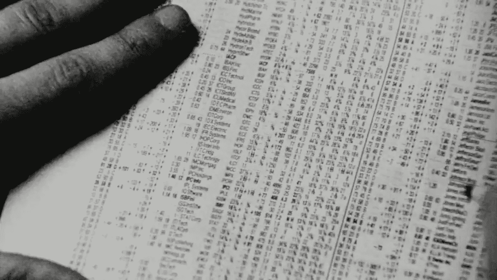

A scene from ‘Pi’

在这篇文章中，我将探索用于时间序列分析的机器学习算法，并解释为什么它们不适用于日内交易。如果你是这个领域的新手，你可能会被作者用惊人的结果愚弄，在这些结果中，测试数据与预测几乎完全匹配。一个常见的技巧是显示一个带有长时间数据预测值的图，这造成了一种滞后不明显或者根本看不到的错觉。滞后是让预测变得无用的原因，稍后我会给你一个例子。还有其他方法让预测看起来合理，其中一些我确信是错误的。但是不要气馁，记住模型可以和你的数据一样好，缺乏模型是你获得可靠结果的主要绊脚石。

# 日内交易的真相

日内交易是在一天内买卖股票的过程。它可以简单到在早上买入一家公司的股票，然后在一天结束时(准确地说是下午 4 点)卖出。虽然这一行为本身很简单，但它需要大量的经验和手头的信息来购买可能上涨的股票。日内交易风险很大，因为市场的短期行为反映了数十亿快速波动的价值，这些价值是对接近随机游走的不断变化的条件的反应。超过 95%的交易者亏损。

# 机器能打败人类吗？

Small Trading Setup

交易需要大量的注意力和对市场的敏感性。有经验的交易者依赖多种信息来源，如新闻、历史数据、收益报告和公司内部人士。风险很高，需要考虑许多变量。出于这个原因，一些金融机构完全依赖机器进行交易。这意味着一台高速互联网连接的电脑可以在一天内执行数千次交易，从微小的价格差异中获利。这叫高频交易。没有人能和这些算法竞争，它们非常快而且更准确。

这种方法的缺点是，普通人可能无法获得这种工具，或者它们太贵了。然而，通过 Robinhood 或 TD Ameritrade 等交易平台，任何个人都可以通过电脑或智能手机参与股市交易。而且你甚至不用付经纪费，这对新手来说很有吸引力。

作为一名数据科学学生，我非常热情地尝试了不同的机器学习算法，并回答了这样一个问题:机器学习可以用来预测股市运动吗？

# 我们开始吧

我最喜欢的获取市场和上市公司信息的地方之一是 finance.yahoo.com。你可以用技术指标查看历史数据，阅读公司财务报表，新闻等。

我从纳斯达克市场挑选了我个人感兴趣的科技公司。对于这个项目，我构建了几个技术指标，方式与你在雅虎财经上看到的类似。让我们看看特斯拉的历史数据，感受一下我们在处理什么。

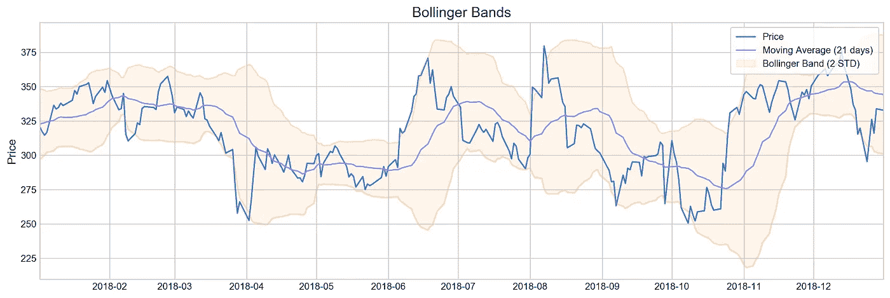

价格几乎没有离开布林线的空间。这告诉我们价格在两个标准差之间上下波动。我们可以用这个指标作为买卖股票的信号。

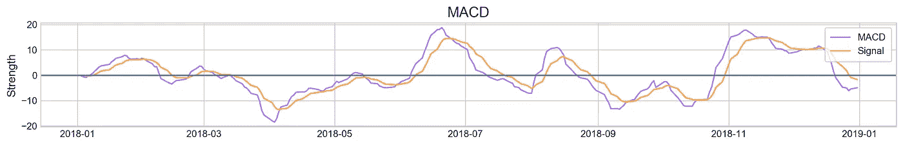

移动平均收敛发散(MACD)是一个动量指标，显示了证券价格的两条移动平均线之间的关系。通常，当 MACD(紫色线)超过信号(橙色线)时，意味着股票正在上涨，并将持续上涨一段时间。

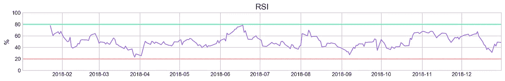

相对强度指数(RSI)是另一个动量指标，可以判断股票是超买还是超卖。它的范围从 0 到 100，但一般来说，当指数接近 20 时，我们会注意，这将是买入的信号。如果接近 80，最好快点卖掉。

可视化有助于理解技术指标是如何工作的，以及它们的优缺点。让我们转到机器学习部分，所有的神奇都发生在这里。

# 为什么 ARIMA 不起作用？

自回归综合移动平均(ARIMA)模型用于预测时间序列数据，它基于数据点彼此相关的假设。如果数据不相关，模型将无法做出预测。自相关函数(ACF)将显示数据点是否有这种关系。我们来看看剧情:

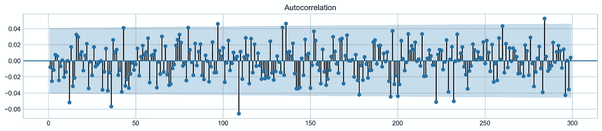

ACF

数据点确实不相关，因此使用 ARIMA 来预测未来值是不合理的。不显示著名的滞后预测将是一种犯罪，所以这里是:

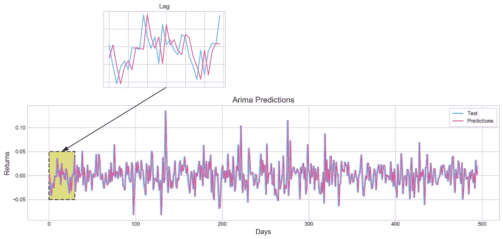

这就是我们在这里需要知道的一切，让我们转向更有前途的神经网络。

# 深度神经网络

当交易者使用历史数据和技术指标来预测股票走势时，他们会寻找熟悉的模式。一些类型的神经网络在寻找模式方面表现出色，并在图像识别或文本处理方面有多种应用。

首先，我尝试用卷积网络来识别历史数据中的模式。它可以接受任意数量的特征，并同时从中学习。在这个例子中，网络必须从 21 天的序列中学习并预测第二天的股票回报。我说的回报是指一天开始和结束时的价格差异。如果价格上涨，收益为正，下跌，收益为负。

那么它表现如何呢？网络容易过度拟合，这意味着它很好地学习了训练数据中的模式，但未能对测试数据做出任何有意义的预测。准确性和随机猜测一样好。

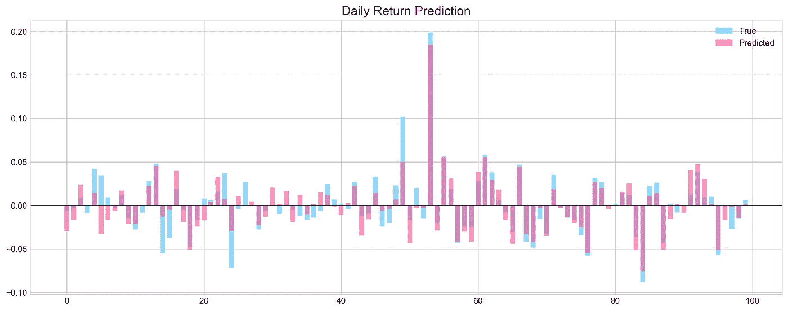

Overfitting (Accuracy: 80%)

递归网络(LSTM)也擅长从序列数据(即时间序列)中学习。在相同的序列长度和特征数量下，网络无法从数据中学习到任何东西。

让我们来看看预测。该网络采取了一条简单的路线，并决定每天的回报将是负的。它有 50%的正确率。

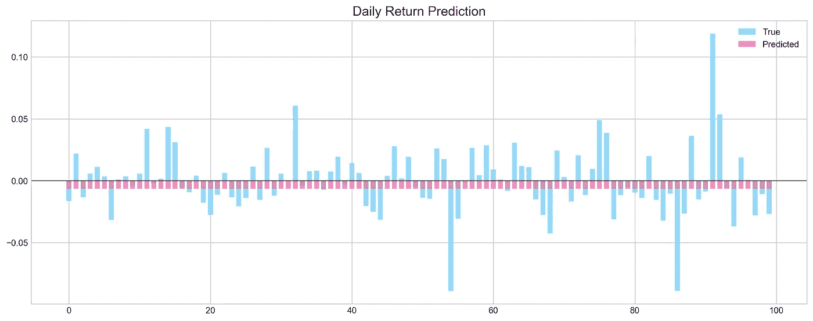

我已经尝试了数百种网络架构、功能数量、序列长度、超参数调整、预测第二天/周/月的组合。结果和随机猜测一样好。

显然，神经网络在这里也不起作用。

# 模式匹配

这种技术背后的想法是在测试集中取一个 9 天的序列，在训练集中找到相似的序列，并比较它们的第 10 天的回报。如果某个算法找到了多个序列，它会简单地对结果进行平均。让我们来看看这个过程:

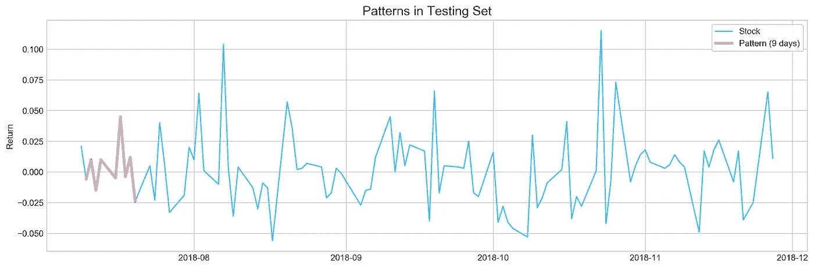

粉色线是来自训练集的 9 天序列。该算法找到了 5 个匹配，其中三个在第 10 天有正回报，两个是负回报。取平均值，我们得到了一个正的预期回报。与测试集的实际回报相同。它工作了。

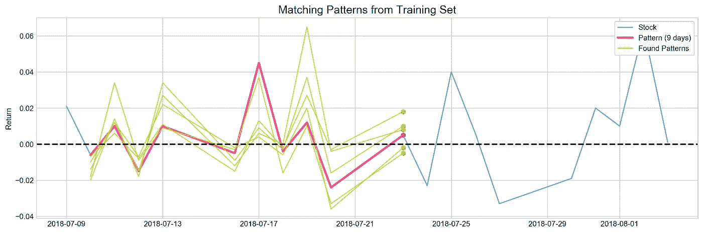

但是通过整个测试集匹配模式给了我大约 50%的准确率。魔法也没有在这里发生。

# 有希望

Photo by Kristopher Roller

我的技术都不起作用，但是如果你还想在股票市场上赚钱，有一个替代日交易的方法。使用技术指标的经典方法可以为短期投资提供良好的回报——从几天到大约一个月不等。它是这样工作的:我只用两个指标模拟了一个交易策略:布林线和 MACD。大多数指标都讲述了同样的故事，因为它们使用了同样的历史数据:价格或交易量。因为这个原因，我没有把它们组合在一起，而是分开使用。

我做了一个模拟，假设你在价格接近较低区间时买入股票，反之亦然。2018 年初，该算法有 15000 美元投资特斯拉。到年底，它仅通过 19 笔交易就获得了超过 100%的利润。

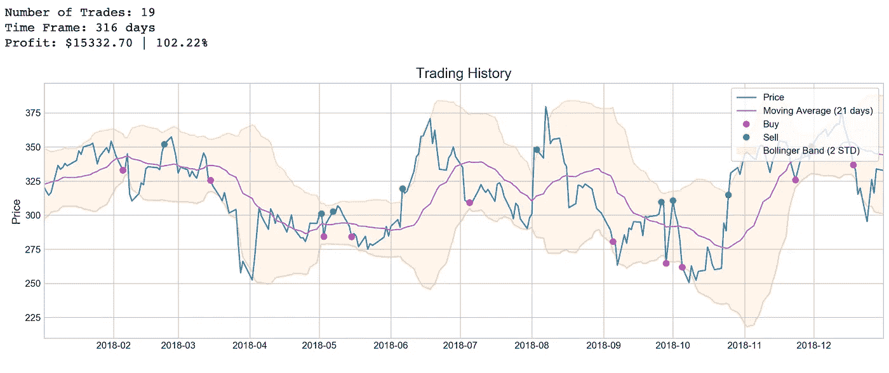

布林线对特斯拉很有效，但对其他股票就不那么有效了。例如，亚马逊的回报率为负。因此，它并不完美，但它对我尝试过的大多数股票都有效(总共 19 只)。

另一方面，MACD 的表现要差得多。这让我觉得它可能是布林线或其他指标的一个很好的补充，但它本身不是。

# 结论

这个项目的一大收获是，股票市场是一个非常复杂的系统，仅用历史数据来解释其行为是不够的。机器学习算法将其视为随机行走或白噪声。基本面分析、twitter 分析、新闻分析、本地/全球经济分析——诸如此类的东西有可能提高预测。

项目仓库住在这里。

感谢您的阅读，

阿瑟尼。

Picture made by Microsoft stock data