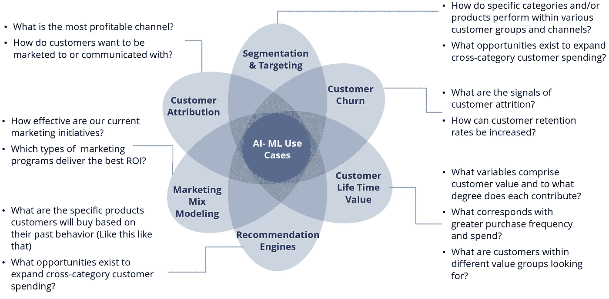
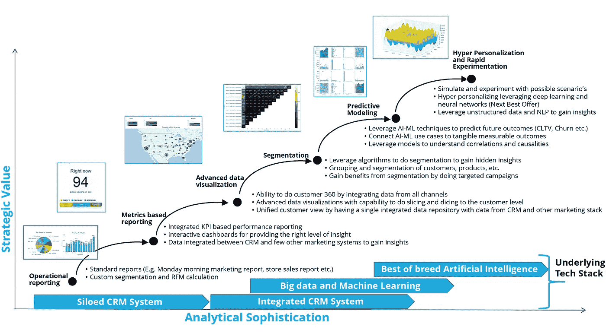

# 营销人员的机器学习

> 原文：<https://towardsdatascience.com/machine-learning-for-marketers-78bff070cbd6?source=collection_archive---------10----------------------->

# **简介**

随着电子商务、数字和移动技术的进步，以及消费者人口统计数据的变化，营销职能正在快速发展。Forrester 最近的一项研究[【1】](#_ftn1)表明，到 2022 年，电子商务将占零售总额的 17.0%，高于 2017 年预计的 12.9%。这一趋势表明，越来越多的人开始在网上购物，或者在店内购物时受到数字活动的严重影响。

随着拉美裔和千禧一代等消费群体的增长，美国的人口统计数据正在快速变化，因此充分了解这些客户群体以向受众提供个性化和有针对性的信息至关重要。最近的一项研究[【2】](#_ftn2)表明，将近一半(49%)的西班牙裔和拉丁裔消费者在购物过程中使用社交媒体，相比之下，所有种族的这一比例为 32%。因此，深入了解消费者并拥抱快速发展的技术进步以提供以客户为中心的全渠道体验至关重要。

营销人员的任务是成为首席执行官中客户的**代言人，并在为消费者提供深入的个性化体验方面发挥关键作用。营销组织的成长与三件事密切相关**

1.数据 2)营销技术栈和 3)人工智能/机器学习(AI-ML)

在本文中，我们将概述人工智能和机器学习(尤其是与客户分析相关的)将如何推动组织的增长。数据和人工智能/人工智能是推动营销人员推动组织创新的关键驱动力。做出高速数据驱动决策的组织将成为强大的营销先锋。

# **实现愿景的挑战**

在我们深入研究 AI-ML 之前，以集成的方式获得高质量的数据以执行分析是至关重要的。许多组织仍在处理 excel 数据湖、孤岛式数据集和陈旧数据(旧数据和非实时数据)。这阻碍了营销团队得出一致且准确的报告指标，因为每个营销分析师使用不同的业务规则并得出不同的数字。因此，无论是在 CRM、CDP(客户数据平台)[【3】](#_ftn3)还是在数据仓库/数据湖中，拥有一个整合的数据平台对任何组织来说都是至关重要的。重要的是不要迷失在这些系统中，而是理解营销用例，以确保正确的技术和基础设施到位。

在本文中，我们假设营销职能已经达到这一成熟水平，因此组织可以超越数据整合，寻求从高级分析中提取价值。整合的实时数据的基础是能够 360 度了解客户。

# **营销组织的 ML**

一旦高质量的数据以可消费的方式可用，下一步就是为组织识别 AI-ML 用例。这里是营销人员可以考虑的最常见的使用案例，以便为客户提供个性化的体验。

1.[细分和定位](https://medium.com/@yasimk_87248/customer-segmentation-and-targeting-for-marketers-33466127f067)

2.[客户流失](https://medium.com/@yasimk_87248/customer-churn-for-marketers-11a8d5e96948)

3.[客户生命周期价值](https://medium.com/@yasimk_87248/customer-life-time-value-cltv-for-marketers-393bd347f5ad)

4.[推荐引擎](https://medium.com/@yasimk_87248/recommendation-algorithms-for-marketers-9f5f262efc18)

5.[营销组合建模](https://medium.com/@yasimk_87248/marketing-mix-modeling-for-marketers-de406a988757)

6.[客户归属](https://medium.com/@yasimk_87248/customer-attribution-for-marketers-e53aa208301b)

**Common Machine Learning Use Cases for Marketers**

# **总结**

整合分析战略是首席营销官(CMO)刺激创新和增长的关键。大多数组织都会经历这一过程，最终实施高级分析，为客户实现超个性化。

Typical Analytics Journey of Organizations

这一切都从 CRM 数据库中的运营报告开始，然后发展到创建基于指标的报告，最终实现高级数据可视化。Tableau、Power BI 或 QlikView 等可视化工具是可视化类别[【4】](#_ftn1)的领导者。

随着组织转向预测分析和其他高级分析，可以使用各种工具，从开源工具到付费工具。最流行的开源工具是 Python[【5】](#_ftn2)和 R，并且有一个繁荣的社区[【6】](#_ftn3)为这个知识库做出了贡献。

底层数据基础需要支持这些用例，许多组织正在向数据湖[【7】](#_ftn4)转移。最流行的数据湖是由 AWS 提供的，使用了 AWS S3 和亚马逊红移[【8】](#_ftn5)。云数据湖为集成和整合的数据提供了基础架构，使分析和机器学习开发人员能够生成可用于为客户提供个性化体验的见解。

一旦数据基础到位，分析用例得到实施，一个伟大的营销组织应该建立实验来不断测试、迭代和学习，以尽可能避免猜测。从长远来看，拥有复杂的客户分析并与客户进行更多双向互动的公司最有可能胜出。

**注意**:完整的白皮书和相关的用例可以从这个链接下载——[https://www . element solutions . com/machine-learning-for-retail-markets-white-paper](https://www.elementsolutions.com/machine-learning-for-retail-marketers-white-paper)

**关于作者**

Yasim Kolathayil 是 Element Solutions 的数据科学总监。Yasim 对客户分析特别感兴趣，并且长期以来一直是客户分析的热心学生。

[1]https://www . Forrester . com/report/Forrester+数据+线上+零售+预测+2017+至+2022+US/-/E-RES139271

[2]https://www . prnewswire . com/news-releases/Deloitte-digital-study-digital-infected-sales-in-retail-brick-and-mortar-stores-to-reach-22 万亿-by-year-end-300082524.html

[3]https://www . element solutions . com/services/customer-data-platform

[4]https://power bi . Microsoft . com/en-us/blog/Gartner-positions-微软连续十年成为商务智能和分析平台的领导者/

[5]https://www . ka ggle . com/amberthomas/ka ggle-2017-调查-结果

[6]https://stackoverflow.blog/2017/10/10/impressive-growth-r/

[7]https://AWS . Amazon . com/big-data/data lakes-and-analytics/what-a-data-lake/

[8]https://aws.amazon.com/redshift/