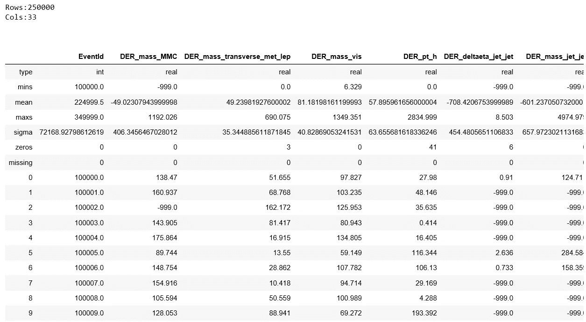
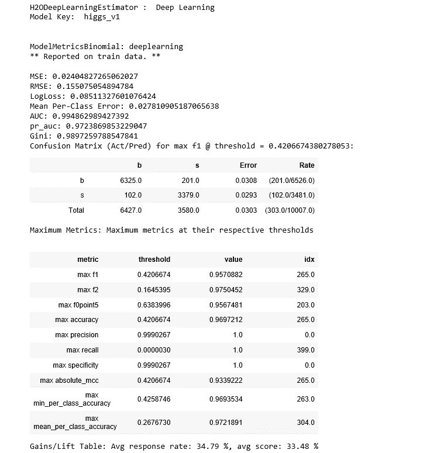
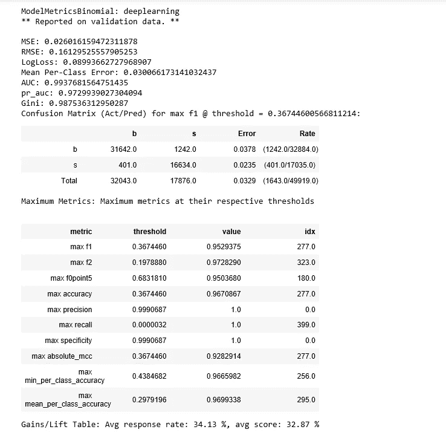
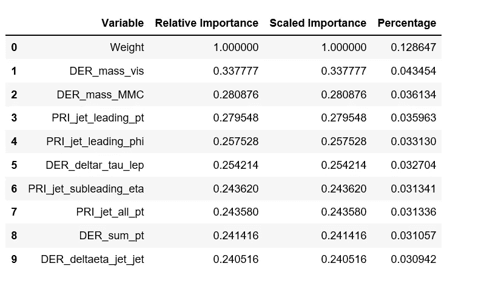
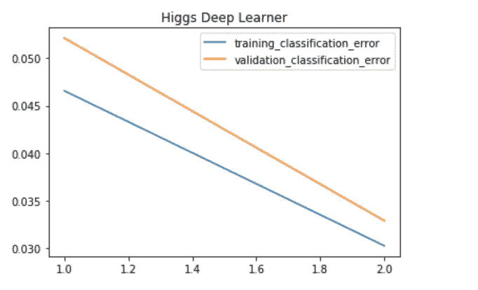
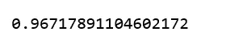
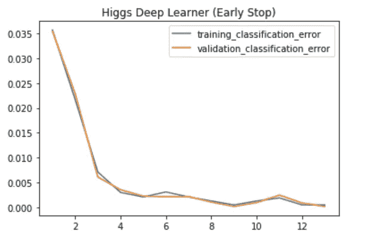
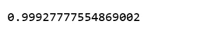
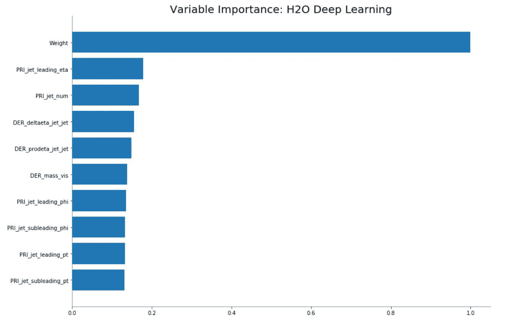
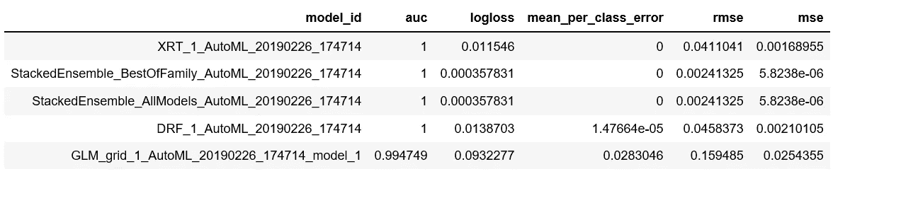

# 当你不是物理学家时，对粒子数据的机器学习

> 原文：<https://towardsdatascience.com/machine-learning-for-particle-data-when-you-are-not-a-physicist-dad77beb90e0?source=collection_archive---------13----------------------->


Photo credit: Pixabay

## 如何通过 Python 使用 H2O 深度学习模型进行监督分类

本文介绍了深度学习与 [H2O](https://en.wikipedia.org/wiki/H2O_(software)) 、 [H2O.ai](https://www.h2o.ai/) 的开源机器学习包，并展示了如何使用一个 [H2O 深度学习](http://docs.h2o.ai/h2o/latest-stable/h2o-docs/data-science/deep-learning.html)模型来解决监督分类问题，即使用 [ATLAS 实验来识别希格斯玻色子](https://www.kaggle.com/c/higgs-boson)。

我们没有粒子物理学的知识，但我们仍然希望应用先进的机器学习方法来看看我们是否可以准确地预测粒子碰撞事件是希格斯玻色子信号还是背景噪声。

请注意，将机器学习方法应用到你不熟悉的领域，并不是说，没有领域专业知识也能成为一名称职的数据科学家。它们是不同的东西。记住这一点，让我们开始吧。

# 安装 H2O

用 Python 安装 H2O 相当简单。我按照 H2O 官方文件上的说明:[下载&安装 H2O](http://docs.h2o.ai/h2o/latest-stable/h2o-docs/downloading.html) 。它就像一个魔咒！

# 初始化 H2O 并加载数据

数据集可以在这里找到。我们加载 H2O Python 模块。

*   在我的本地机器上启动一个单节点 H2O 云。
*   允许它使用所有 CPU 核心和高达 2GB 的内存。
*   在集群已经运行的情况下进行清理。
*   在 H2OFrame 上使用 CPU 构建深度神经网络模型。

```
import h2o
h2o.init(max_mem_size = 2)           
h2o.remove_all()
%matplotlib inline
import matplotlib.pyplot as plt
import numpy as np
import pandas as pd
from h2o.estimators.deeplearning import H2ODeepLearningEstimator
```

初始化完成后，我们可以将数据集上传到 H2O 集群。数据被导入 H2O 框架，其功能与熊猫数据框架类似。在我们的例子中，集群运行在我们的笔记本电脑上。

```
higgs = h2o.import_file('higgs_boston_train.csv')
```

我们可以快速浏览一下数据集。

```
higgs.describe()
```

describe()给出了很多信息。

*   数据集中的行数和列数。
*   数据集的汇总统计信息，如数据类型、最小值、平均值、最大值、标准偏差、列中零的数量、列中缺失值的数量以及数据集的前 10 行。



Figure 1

# 数据预处理

我们将数据分为以下几种方式:

*   60%用于培训
*   20%用于验证(超参数调整)
*   20%用于最终测试，将保留到最后
*   预测值是除“事件 Id”和“标签”之外的所有列。
*   响应列是最后一列“标签”。

```
train, valid, test = higgs.split_frame([0.6, 0.2], seed = 2019)
higgs_X = higgs.col_names[1: -1]
higgs_y = higgs.col_names[-1]
```

# 深度学习模型

## 模型 1

*   在希格斯玻色子数据集上运行我们的第一个深度学习模型。
*   我们需要预测“标签”列，这是一个具有两个级别的分类特征。
*   深度学习模型的任务将是执行二元分类。
*   深度学习模型使用了数据集除“EventId”之外的所有预测器，而且都是数值型的。
*   第一个深度学习模型将只是一个时代来感受模型的构建。

```
higgs_model_v1 = H2ODeepLearningEstimator(model_id = 'higgs_v1', epochs = 1, variable_importances = True)
higgs_model_v1.train(higgs_X, higgs_y, training_frame = train, validation_frame = valid)
print(higgs_model_v1)
```

我们打印出模型以进行更多研究:



Figure 2

有相当多的信息，但我们在过去已经看到了所有这些信息。

*   训练集的误差度量，如对数损失、平均每类误差、AUC、基尼系数、均方误差、RMSE
*   最大 F1 阈值的混淆矩阵
*   不同指标的阈值
*   增益/提升表

验证集也打印出来了:



Figure 3

训练集和验证集的结果非常接近。

因此，使用我们最简单的深度学习模型，我们在验证集上获得了大约 0.994 auc，在训练集上获得了 0.995 auc。并且 log loss 在验证集上是 0.09，在训练集上是 0.085。

**变量重要性**

在 H2O 构建分类模型时，我们将能够在 Python 中以重要性降序查看变量重要性表，如下所示:

```
var_df = pd.DataFrame(higgs_model_v1.varimp(), columns = ['Variable', 'Relative Importance', 'Scaled Importance', 'Percentage'])
var_df.head(10)
```



Figure 4

**进球历史**

要查看评分历史，我们可以使用 score_history 方法检索作为 pandas 数据框的数据，然后绘制分类错误。

```
higgs_v1_df = higgs_model_v1.score_history()
plt.plot(higgs_v1_df['training_classification_error'], label="training_classification_error")
plt.plot(higgs_v1_df['validation_classification_error'], label="validation_classification_error")
plt.title("Higgs Deep Learner")
plt.legend();
```



Figure 5

```
pred = higgs_model_v1.predict(test[1:-1]).as_data_frame(use_pandas=True)
test_actual = test.as_data_frame(use_pandas=True)['Label']
(test_actual == pred['predict']).mean()
```



Figure 6

这个简单的深度学习模型我们达到的准确率已经是 0.967 了。

## 模型 2

来提高成绩。现在，我们运行另一个更小的网络，一旦错误分类率收敛，我们让它自动停止(特别是如果长度为 2 的移动平均值在连续 2 次得分事件中没有提高至少 1%)。我们还将验证集采样为 10，000 行，以加快评分。

```
higgs_model_v2 = H2ODeepLearningEstimator(model_id = 'higgs_v2', hidden = [32, 32, 32], epochs = 1000000, score_validation_samples = 10000, stopping_rounds = 2, stopping_metric = 'misclassification', 
stopping_tolerance = 0.01)
higgs_model_v2.train(higgs_X, higgs_y, training_frame = train, validation_frame = valid)
```

**进球历史**

为了查看评分历史，我们绘制了第二个模型的分类误差。

```
higgs_v2_df = higgs_model_v2.score_history()
plt.plot(higgs_v2_df['training_classification_error'], label="training_classification_error")
plt.plot(higgs_v2_df['validation_classification_error'], label="validation_classification_error")
plt.title("Higgs Deep Learner (Early Stop)")
plt.legend();
```



Figure 7

好多了。

精度也有所提高。

```
pred = higgs_model_v2.predict(test[1:-1]).as_data_frame(use_pandas=True)
test_actual = test.as_data_frame(use_pandas=True)['Label']
(test_actual == pred['predict']).mean()
```



Figure 8

我们将从第二个模型中得到变量重要性图。

```
higgs_model_v2.varimp_plot();
```



Figure 9

# **AutoML:自动机器学习**

最后但同样重要的是，让我们试试 [H2O 的 AutoM](http://docs.h2o.ai/h2o/latest-stable/h2o-docs/automl.html) L. [H2O 的 AutoML](http://docs.h2o.ai/h2o/latest-stable/h2o-docs/automl.html) 可以用于自动化机器学习工作流，其中包括自动训练和调整许多模型，然后我们打印出来看看哪些模型将成为 AutoML 排行榜上表现最好的模型。

```
from h2o.automl import H2OAutoMLaml = H2OAutoML(max_models = 10, max_runtime_secs=100, seed = 1)
aml.train(higgs_X, higgs_y, training_frame = train, validation_frame = valid)
aml.leaderboard
```



Figure 10

AutoML 已经建立了 5 个模型，包括 GLM(广义线性模型)、DRF(分布式随机森林)和 XRT(极度随机化树)以及两个堆叠集合模型(第二和第三)，最好的模型是 XRT。

事实证明，我引以为傲的深度学习模型甚至不在排行榜上。

Jupyter 笔记本可以在 [Github](https://github.com/susanli2016/Machine-Learning-with-Python/blob/master/H2O%20Higgs%20Boson.ipynb) 上找到。享受这周剩下的时光。

参考: [H2O 深度学习 Doc](http://docs.h2o.ai/h2o/latest-stable/h2o-docs/data-science/deep-learning.html)