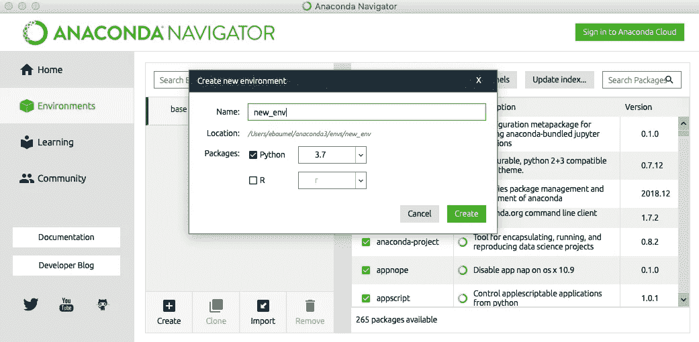

# 放射学的机器学习—从哪里开始

> 原文：<https://towardsdatascience.com/machine-learning-for-radiology-where-to-begin-3a205db8718f?source=collection_archive---------13----------------------->

## 磨刀霍霍:了解机器学习工具链，这样你就可以开始学习了。


Image by Eric M. Baumel, MD

您有兴趣开始学习放射学的机器学习吗？新术语的星座可能会让人不知所措:深度学习、TensorFlow、Scikit-Learn、Keras、Pandas、Python 和 Anaconda。在你开始之前，有一大堆令人头晕的新信息需要你掌握。

就我个人而言，我希望能够在我的一些使用苹果 CoreML 框架的 iOS 应用程序中使用机器学习(ML)功能。这意味着在你真正开始工作之前，还有一系列复杂的问题要处理。一旦我们正确配置了工具，工作将会更容易。

机器学习的主导语言是 Python。在你开始学习很多优秀的教程之前，你需要熟悉整个生态系统。

网上有无数的资源和书籍可以帮助你开始(另一篇文章的工作)。让我们看看迈出第一步需要做些什么。


由[马尔特·温根](https://unsplash.com/@maltewingen?utm_source=medium&utm_medium=referral)在 [Unsplash](https://unsplash.com?utm_source=medium&utm_medium=referral) 上拍摄的照片

> “给我六个小时砍树，我会用前四个小时磨利斧头。”
> 
> ——亚伯拉罕·林肯(可能从来没说过这话)

**我们来谈谈**

最常见的 ML 开发语言是 Python。如果你不了解 Python，许多 ML 初学者的参考资料都是从快速的 Python 介绍开始的。

这篇文章不是为了教 Python，而是为了展示一个开发人员如何开始使用庞大的 ML 工具链。

你要做的第一件事就是下载 Python 和机器学习所必需的 Python 工具。

**你好，Unix**

我们需要使用命令行界面来安装和管理我们的 Python 工具。

**足够的狂欢是危险的:**

在 Linux 或 Mac 中，我们使用终端。您可以在 Finder >应用程序>实用工具>终端中找到该程序。

在 Windows 中，我们使用命令提示符。你点击 Windows 图标> Windows 系统>命令提示符或者点击 Windows 图标并输入`cmd`。

在光标前，您会看到一个文本字符串，它指向:
*机器名:目录用户名$*

你在美元符号后面打字。

以下是一些常用命令:

列出当前目录中的文件:`ls`
同时显示隐藏文件:`ls -a`
导航到新目录:`cd <directory_path>`
转到主目录:`cd ~` 或直接键入:`cd`
向上导航一级:`cd ..`
转到您所在的上一个文件夹:`cd -`

显示当前工作目录:`pwd`

*向上箭头*重新输入最后一个命令。再次按下*向上箭头*可以回到之前的命令。

清除窗口:`clear`

在文本编辑器中打开一个文件，例如:`atom <filename>`

取消申请(例如 ping) Ctrl-C

**巨蟒**

Python 是一种解释型语言，所以它是逐行阅读的，而不是编译型语言，在编译型语言中，你必须在使用它之前烤好蛋糕。

目前有两个独立的 Python 版本，Python 2.7 和 Python 3。Python 2.7 将于 2020 年 1 月 1 日寿终正寝，而 Python 3.x 不是向后兼容的。那么，为什么要使用旧版本呢？不幸的是，一些框架只支持 2.7 版本，许多书籍和在线教程都是专门为该版本编写的。我们该如何应对？

幸运的是，您可以在计算机上安装两种版本的 Python，并在硬盘上的不同文件夹中运行不同的虚拟环境，因此您可以在 Python 3.7 中完成大部分 ML 工作，如果您的项目需要一个只能在 2.7 上运行的库，则可以在不同的文件夹中安装 2.7 版本。

使用 virtualenv、Python Environment Wrapper (pew)、venv、pyvenv，有几种方法可以管理不同的 Python 虚拟环境。最简单的是使用 Conda，使用 Anaconda 时随 Python 一起安装。


[https://imgs.xkcd.com/comics/python_environment.png](https://imgs.xkcd.com/comics/python_environment.png)

**蟒蛇**

Anaconda 是一个开源平台，可能是在 Linux、Mac OS X 和 Windows 上开始 Python 机器学习的最简单的方法。它帮助您管理编程环境，并包括数据科学中使用的常见 Python 包。您可以在[https://www.anaconda.com/distribution/](https://www.anaconda.com/distribution/)下载您平台的发行版。

一旦为您的系统安装了合适的 Python 版本，您将需要设置一些环境。

**康达**

Conda 是 Anaconda 使用的 Python 包管理器和环境管理系统。Conda 会安装您需要的大部分软件包，但不是全部。其余的可以使用`pip`通过命令行安装——稍后会详细介绍。

要查看当前环境中的包:

```
conda list env
```

您运行的是哪个版本的 Conda:

```
conda -version
```

(如果低于 4.1.0，那么您可以用`conda update conda`更新 Conda)

您可以使用 Anaconda Navigator 创建一个环境，方法是从左侧菜单中选择 Environments，然后单击 create 按钮。



Creating a new environment “new_env” using Anaconda Navigator

您也可以从命令行创建环境。例如，我们使用 Python 2.7 创建了一个名为“py27”的环境:

```
conda create -n py27 python=2.7
```

要激活环境:

```
conda activate <your_env_name>
```

要停用当前环境，请执行以下操作:

```
conda deactivate
```

要删除环境，请执行以下操作:

```
conda remove -name <your_env_name> -all
```

要列出您的所有 Conda 环境:

```
conda info --envs
```


List of Conda managed Python environments

带有星号的环境是当前的活动环境。

要查看当前环境中的包:

```
conda list env
```

您运行的是哪个版本的 Conda:

```
conda -version
```

(如果低于 4.1.0，那么您可以用`conda update conda`更新 Conda)

两个主要的机器学习包 **TensorFlow** 和 **Keras** 应该使用`pip`安装。对于苹果的机器学习框架，你也可以安装 **Turi Create** 。

**科学堆栈**

有一组被称为科学堆栈的 Python 包，可用于多个学科。其中包括:

**NumPy**
**Scikit-learn**[https://scikit-learn.org/stable/](https://scikit-learn.org/stable/)—机器学习算法库
**Jupyter**[https://jupyter.org/](https://jupyter.org/)—基于网络的笔记本中的交互式 Python shell
**Seaborn**[https://seaborn.pydata.org/index.html](https://seaborn.pydata.org/index.html)—统计数据可视化
**Bokeh**[https://bokeh.pydata.org/en/latest/](https://bokeh.pydata.org/en/latest/)—交互式数据可视化
**PyTables**

您可以使用 Anaconda 安装这些包及其依赖项。在新创建的环境中，搜索您想要的包。


Search Anaconda Navigator for the packages you want to install

然后，通过选中复选框并单击“应用”,从列表中选择它们。


Adding new packages and dependencies via Anacona Navigator

如前所述，你使用`pip`来安装 **TensorFlow** 和 **Keras** (以及 **Turi Create** 用于苹果的 CoreML)。

**pip**

pip 是 python 的标准包管理器[https://pypi.org/project/pip/](https://pypi.org/project/pip/)

```
pip install — upgrade pip
```

要使用 pip 安装软件包:

```
pip install <package_name>
```

**编辑 Python 文件**

您可以在 Mac 的终端或 Windows 的控制台中与 python 进行交互。为了编写代码，大多数人使用代码编辑器，比如 Atom[https://atom.io/](https://atom.io/)或者 Sublime Text[https://www.sublimetext.com/](https://www.sublimetext.com/)。有关于代码编辑器的宗教战争，但是生命太短暂了。

我最喜欢的(也是免费的)文本编辑器是 GitHub 的 Atom[https://atom.io/](https://atom.io/)。Atom 的一个很酷的功能是，你可以用集成终端窗口等功能来扩展应用程序。

安装后，您可以通过进入设置/安装包并搜索`platformio-ide-terminal`来添加此功能

**运行 Python 文件**

在命令提示符处($或>)键入`python <filename.py>`

要退出 python，使用`exit()`或 Ctrl-D(Windows 中的 Ctrl-Z)

要查看您当前使用的 python 版本，请输入:

```
python --version **or** python -V
```

要查看您正在使用的 Python 安装的位置，请输入:

```
which python
```

**环境文件**

环境文件是项目根目录中的一个文件，它列出了所有包含的包及其特定于项目环境的版本号。这允许您与其他人共享项目，并在其他项目中重用。

您可以使用以下方式创建文件:

```
conda env export -file environment.yaml
```

您可以使用以下命令重新创建 Conda 环境及其包:

```
conda env create -n <conda-env> -f environment.yaml
```

在一些项目或教程中，你会看到 **requirements.txt** ，它被 pip 用作包管理器，而不是 Conda 使用的 environment.yaml。

这些是由*冻结*环境造成的:

```
pip freeze > requirements.txt
```

要重建，请使用:

```
pip install -r requirements.txt
```

**Jupyter 笔记本**

jupyter Notebook[https://jupyter.org/](https://jupyter.org/)是一款基于开源网络浏览器的应用。这允许您在一个更加用户友好的环境中直接运行 python 代码，并逐步查看结果。它非常适合教学，因为您可以在标记单元格中的代码单元格之间添加文本和图像。该应用程序是可扩展的，因此您可以添加许多其他有用的功能。

你也可以用 Anaconda Navigator 安装 Jupyter 笔记本:


Install Jupyter Notebook with Anaconda Navigator

在提示符下键入以下内容，在浏览器中创建新的 Jupyter 笔记本应用程序:

```
jupyter notebook
```


Create a new notebook with Python 3

要启动特定的笔记本:

```
jupyter notebook <notebook-name>
```

顺便说一下，**不建议同时运行 Jupyter 笔记本应用程序的多个实例。**


Jupyter Notebook helps keep you organized!

要运行单元格，请单击 Jupyter 工具栏中的“运行”按钮或按 Shift + Enter。

关闭笔记本，关闭终端窗口或键入:

```
jupyter notebook stop
```

***或*** 按 Ctrl+C

好吧，现在该怎么办？

现在我们的斧子已经磨快了，你如何开始真正的放射信息学呢？

这里有几个链接可以让你注意到:

医学成像的机器学习【https://pubs.rsna.org/doi/10.1148/rg.2017160130T2
深度学习:放射科医生入门[https://pubs.rsna.org/doi/10.1148/rg.2017170077](https://pubs.rsna.org/doi/10.1148/rg.2017170077)

为了更深入的了解，这里有两期专门讨论这个主题的期刊:

March 2018 年 3 月第 15 卷第 3PB 期特刊数据科学:大数据、机器学习和人工智能

June 2018 年 6 月第 31 卷第 3 期特别关注开源软件

如果您现在仍然清醒，这里有一些有用的 GitHub 参考资料:

[https://github.com/ImagingInformatics/machine-learning](https://github.com/ImagingInformatics/machine-learning)

[https://github.com/slowvak/MachineLearningForMedicalImages](https://github.com/slowvak/MachineLearningForMedicalImages)

**我们开始吧！**

上面提到的 2018 年 6 月的《数字成像杂志》中有一篇非常精彩的介绍:

[Hello World Deep Learning in Medical Imaging](https://link.springer.com/article/10.1007/s10278-018-0079-6)JDI(2018)31:283–289 Lakhani、Paras、Gray、Daniel L .、Pett、Carl R .、Nagy、Paul、Shih、George

不是创建一个典型的猫对狗的分类器，而是创建一个胸部对腹部的 x 射线分类器(CXR 对 KUB)！这是开始你的人工智能之旅的好地方。

以上所有内容都很难解释，但我希望这篇介绍能帮助您开始。我不是专家，写这篇文章最初是为了帮助自己记忆。对流程有基本理解的从业者越多越好。

祝你好运！