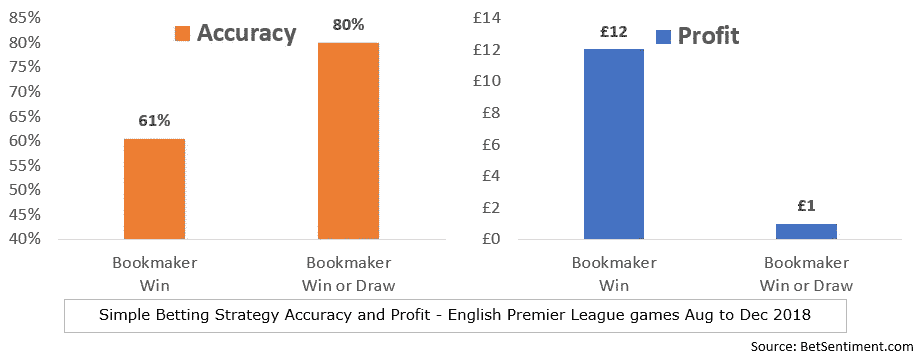
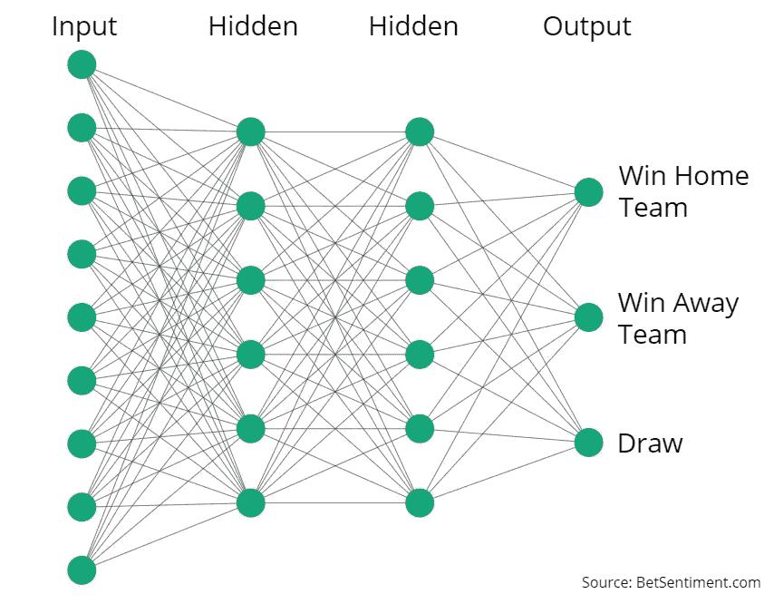
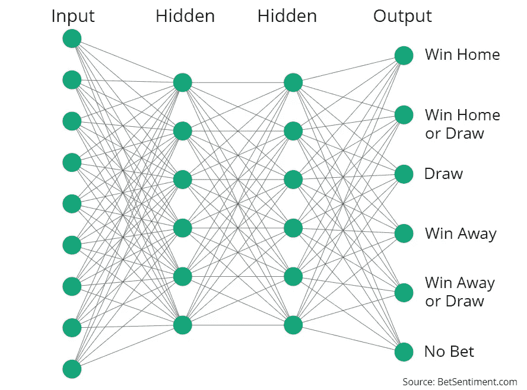

# 体育博彩的机器学习:这不是一个基本的分类问题。

> 原文：<https://towardsdatascience.com/machine-learning-for-sports-betting-not-a-basic-classification-problem-b42ae4900782?source=collection_archive---------2----------------------->

## 我们提出了一种使用自定义损失函数将 bets 损益包含到神经网络分类器中的方法。


Photo by [Christin Noelle](https://unsplash.com/photos/f4cqfNQOBkA?utm_source=unsplash&utm_medium=referral&utm_content=creditCopyText) on [Unsplash](https://unsplash.com/?utm_source=unsplash&utm_medium=referral&utm_content=creditCopyText)

体育博彩是机器学习算法，特别是**分类神经网络**的完美问题之一。大量可用的数据和明确的目标，挑选赢家！尽管如此，经典的分类模型并不太适合赌博策略，人们需要在他的神经网络中使用一个**定制损失函数**来实现更好的盈利能力。我们在下面解释原因。

# 英格兰超级联赛的简单赌博策略。

让我们根据博彩交易所的赔率来实施基本的博彩策略。小数赔率是全额支付与赌注的比率。例如，赔率为 2，意味着 1 美元的赌注可以赢得 2 美元(包括你的赌注)。请注意，赔率倒数给出了正确的隐含概率。赔率为 2 意味着有 50%的胜算(1/赔率)。因此，您希望押注于赔率最低的团队，即获胜概率最高的团队。

为了便于说明，我们设计了两个基本策略:

*   " ***赢*** ":赌赔率最低的一方，赢的概率最高。
*   " ***赢或平*** ":赌赔率值最低的队伍，赌平局。

假设伯恩茅斯对切尔西的赔率为 5.5-1.61。切尔西的赔率为 1.61。因此我们赌切尔西的胜利为“ ***赢*** ”策略，而一场胜利和平局为“ ***赢或平局*** ”策略。

# **预测准确性与总体利润。他们不相似。**

现在我们来比较一下两种投注策略，“**赢**vs .”**赢或平。**
对于数据，我们使用了**必发 API** 。Betfair 是最大的博彩交易所之一，其 API 包含交易所市场导航、赔率检索和下注操作。



上面的条形图显示了两种下注系统的准确性和利润。准确性是指我们下注正确的次数除以下注总数(在这种情况下是 200)。利润代表每次下注投资 1 英镑可以获得的金额。左边的第一个图表显示“赢”策略的准确率为 61%，而“赢或平”策略的准确率为 80%在这种情况下，“赢或平”似乎更好。然而，第二张图表显示，它产生的利润远低于“赢”策略。1 对 12。

因此，我们不应该以更准确地预测比赛结果为目标，相反，**我们应该专注于最大化我们的整体利润**。

# **用于博彩预测的神经网络。**

在决定把钱投给哪支球队时，会涉及到很多数据。出于这个原因，赌博是应用最流行的机器学习技术之一的理想主题，**神经网络**。

特别是，我们可以使用分类神经网络。当应用于有离散结果的问题时，分类神经网络是理想的，或者换句话说，当识别特定观察属于哪个类别时。作为例子，想想有趣的“ [**热狗，而不是热狗**](https://medium.com/@timanglade/how-hbos-silicon-valley-built-not-hotdog-with-mobile-tensorflow-keras-react-native-ef03260747f3) ”或[情感分析](https://betsentiment.com/aboutus)，它们试图将文本分为积极或消极的情感。

应用于体育博彩，我们可以设计一个具有三个简单类别的神经网络。下面是这样一个网络的架构。



然而，从我们之前的两个简单下注策略的例子来看，很明显我们不是在试图预测游戏的结果，而是**哪种下注最有利可图**。应用于分类神经网络，这将导致以下架构。注意，在这种情况下，我们甚至允许“*无赌注*”类别。



我们最终会遇到一个**多标签分类**问题(不要与多类别分类混淆)，因为游戏的结果可能会导致一两个预测是正确的。例如，主队获胜将导致两个获胜赌注:“*赢得主场*”和“*赢得主场或平局*”。

# 我们需要整合赌注的潜在利润。

并非所有的赌注都提供相同的回报。赔率为 2 的赌注可以产生 1 的利润，而赔率为 1.1 的赌注可以产生更低的 0.1 的利润。然而，如果不成功，这两个赌注都要承担 1 英镑的损失。因此它们是不平等的；拿 1 去冒险赚 1 和拿 1 去冒险赚 0.1 是不一样的。

为了在我们的神经网络中考虑到这一点，**我们需要使用一个定制的损失函数**。损失函数(或目标函数)是在给定训练样本和预期输出的情况下，神经网络“有多好”的度量。在标准分类神经网络中，我们使用损失函数，例如分类交叉熵。然而，这种函数会给所有赌注相似的权重，忽略盈利能力的差异。

在我们的例子中，我们希望模型能够最大化策略的整体收益。因此，我们的自定义损失函数的输入必须包含每次下注的潜在利润。

# **自定义损失功能**

我们在 TensorFlow 之上用 **Keras 建立了我们的自定义损失函数。**

在 Keras 中，损失函数有两个参数:

*   **y_true** :真标签向量(*赢主场，赢主场或平局，平局，赢客场，赢客场或平局，不下注*)。基于我们的神经网络架构，这采取 1 和 0 的向量的形式。例如，导致主队获胜的游戏具有以下 y_true 向量(1，1，0，0，0，0)。
*   **y_pred** :预测向量。它是我们的神经网络分类器的输出。

由于 Keras 的限制，我们不能在损失函数中传递游戏的赔率，所以我们必须将它们作为 y_true 向量的附加项来传递。

# **一点点 python 代码**

下面是我们用 Python 和 Keras 写的自定义损失函数。
简而言之，它衡量单位股份投入的平均**利润/损失**。每个观察(每个游戏)的步骤如下:

*   从 y_true 输入中获取赔率
*   使用赔率计算每笔赌注的潜在利润。
*   把赢的赌注和输的赌注连在一起。
*   我们以这个观察的预期 P&L 结束。我们将这个乘以-1，得到一个**最小化**的“损失”(而不是一个最大化的增益)。

```
def odds_loss(y_true, y_pred):
    """
    The function implements the custom loss function

    Inputs
    true : a vector of dimension batch_size, 7\. A label encoded version of the output and the backp1_a and backp1_b
    pred : a vector of probabilities of dimension batch_size , 5.

    Returns 
    the loss value
    """
    win_home_team = y_true[:, 0:1]
    win_home_or_draw = y_true[:, 1:2]
    win_away = y_true[:, 2:3]
    win_away_or_draw = y_true[:, 3:4]
    draw = y_true[:, 4:5]
    no_bet = y_true[:, 5:6]
    odds_a = y_true[:, 6:7]
    odds_b = y_true[:, 7:8]
    gain_loss_vector = K.concatenate([win_home_team * (odds_a - 1) + (1 - win_home_team) * -1,
      win_home_or_draw * (1/(1 -1/odds_b) - 1) + (1 - win_home_or_draw) * -1,
      win_away * (odds_b - 1) + (1 - win_away) * -1,
      win_away_or_draw * (1/(1 -1/odds_a) - 1) + (1 - win_away_or_draw) * -1,
      draw * (1/(1 - 1/odds_a - 1/odds_b) - 1) + (1 - draw) * -1,
      K.zeros_like(odds_a)], axis=1)
    return -1 * K.mean(K.sum(gain_loss_vector * y_pred, axis=1))
```

# **数据。**

对于我们的数据，我们从 2018 年 8 月至 12 月的 2018-2019 赛季英超联赛中选取了 200 场比赛。它包含描述性的游戏数据，如球队名称、Betfair 的赔率和情绪得分(表示正面推文占正面和负面推文的百分比)。**我的 [github 页面](https://github.com/charlesmalafosse/sports-betting-customloss)上有**数据和 Jupyter 笔记本。

# **从文件中加载数据，并在训练和测试数据中拆分。**

我们的数据以 1，2 或 3 的形式包含每场比赛的结果:

*   1:主场获胜
*   2:客场胜利
*   3:画

这需要被转换成代表我们的神经网络的输出层的独热编码向量。另外，我们把每个队的赔率加起来作为这个向量的元素。这正是我们下面要做的。

```
def get_data():
    data = pd.read_csv('extract-betsentiment-com.csv')
    X = data.values[:, 5:-5]
    y = data.values[:, -1]
    y_full = np.zeros((X.shape[0], 8))
    for i, y_i in enumerate(y):
        if y_i == 1:
            y_full[i, 0] = 1.0
            y_full[i, 1] = 1.0
        if y_i == 2:
            y_full[i, 2] = 1.0
            y_full[i, 3] = 1.0
        if y_i == 3:
            y_full[i, 1] = 1.0
            y_full[i, 3] = 1.0
            y_full[i, 4] = 1.0
        y_full[i, 6] = X[i, 1] # ADD ODDS OF HOME TEAM
        y_full[i, 7] = X[i, 2] # ADD ODDS OF AWAY TEAM
    return X, y_full, yX, y, outcome = get_data()# SPLIT THE DATA IN TRAIN AND TEST DATASET.
train_x, test_x, train_y, test_y, = train_test_split(X,  y)
```

# **模型的训练**

在训练模型之前，我们首先需要定义它。我们使用一个**全连接神经网络，有两个隐藏层**。我们使用 BatchNormalization 来归一化权重并消除消失梯度问题。

然后，我们使用一组任意参数来训练该模型。

```
def get_model(input_dim, output_dim, base=1000, multiplier=0.25, p=0.2):
    inputs = Input(shape=(input_dim,))
    l = BatchNormalization()(inputs)
    l = Dropout(p)(l)
    n = base
    l = Dense(n, activation='relu')(l)
    l = BatchNormalization()(l)
    l = Dropout(p)(l)
    n = int(n * multiplier)
    l = Dense(n, activation='relu')(l)
    l = BatchNormalization()(l)
    l = Dropout(p)(l)
    n = int(n * multiplier)
    l = Dense(n, activation='relu')(l)
    outputs = Dense(output_dim, activation='softmax')(l)
    model = Model(inputs=inputs, outputs=outputs)
    model.compile(optimizer='Nadam', loss=odds_loss)
    return modelmodel = get_model(21, 6, 1000, 0.9, 0.7)
history = model.fit(train_x, train_y, validation_data=(test_x, test_y),
          epochs=200, batch_size=5, callbacks=[EarlyStopping(patience=25),ModelCheckpoint('odds_loss.hdf5',save_best_only=True)])
```

训练完成后，我们使用以下 print 命令查看模型的性能:

```
print('Training Loss : {}\nValidation Loss : {}'.format(model.evaluate(train_x, train_y), model.evaluate(test_x, test_y)))150/150 [==============================] - 0s 271us/
step 50/50 [==============================] - 0s 318us/
step Training Loss : -0.05027060141166051
Validation Loss : -0.08301501810550689
```

如我们所见，我们最终的训练损失为-0.05。请记住，我们正在尝试最小化我们的损失函数，这与我们的损益相反。这个数字告诉我们，平均来说，每一次下注将为每 1 英镑的股份产生 0.05 英镑的利润。我们的验证数据集显示，每磅的平均利润为 0.08 英镑。考虑到我们刚刚向神经网络提供了基本数据，这还不错。在 200 多场比赛中，假设我们每场比赛下注 1，我们理论上的 NN 下注策略将产生 10 到 16.6。

# **结论。**

我们提出了一种使用自定义损失函数将赌注 p&l**包含到神经网络分类器中的方法。它超越了在设计投注系统时可能误导的准确率。我们相信这对任何希望在体育运动中使用机器学习的人都是有用的。**

如需更多信息或问题，请随时与我联系**。另外，请注意，如果您对我们的数据感兴趣，我们将很乐意与您分享。**

# **成为中等会员，在平台上支持我！**

**[https://medium.com/@charlesmalafosse/membership](https://medium.com/@charlesmalafosse/membership)**

# ****参考和代码。****

*   **[**Github**](https://github.com/charlesmalafosse/sports-betting-customloss) 页面带有**数据和笔记本**。使用 google colab 立即测试它。**
*   **[](https://keras.io/)**
*   ****[**多标签分类**](https://en.wikipedia.org/wiki/Multi-label_classification)****
*   ****[**必发 API**](https://docs.developer.betfair.com/display/1smk3cen4v3lu3yomq5qye0ni/API+Overview)****