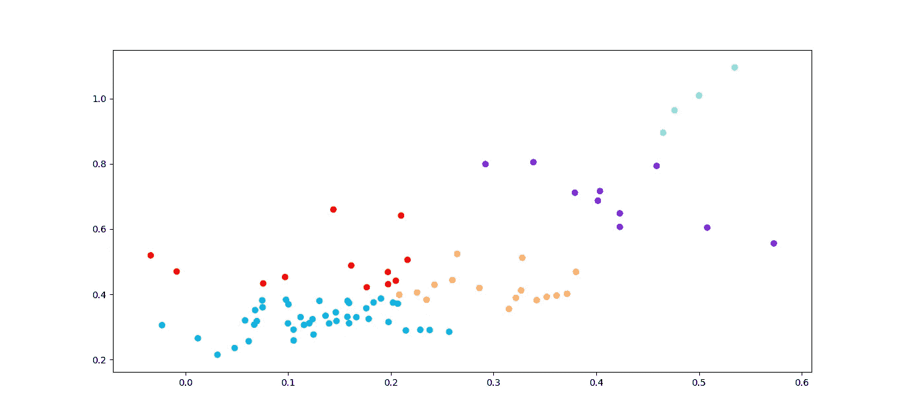
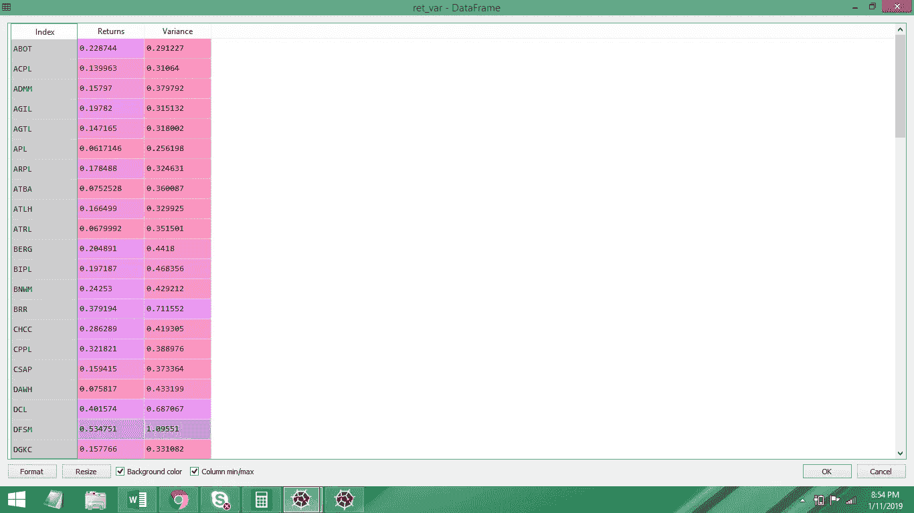
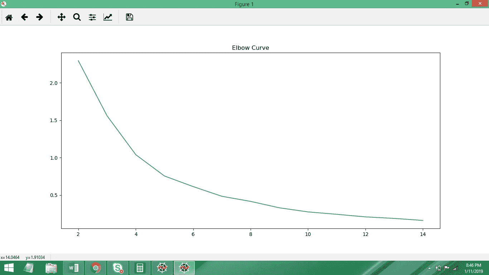
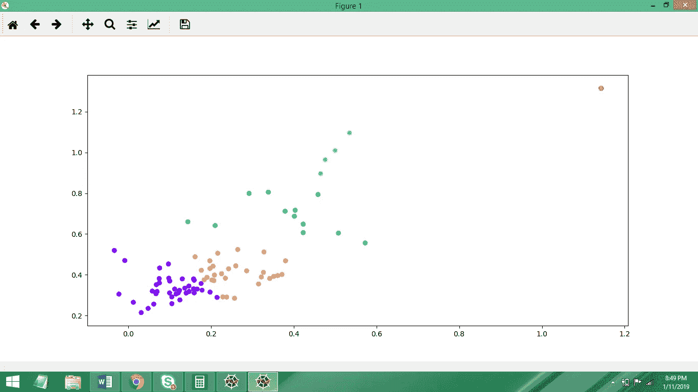
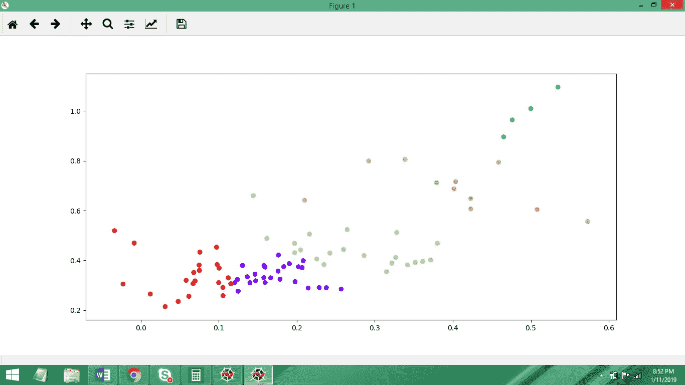

# 基于 K-Means 算法的股票聚类机器学习

> 原文：<https://towardsdatascience.com/machine-learning-for-stock-clustering-using-k-means-algorithm-126bc1ace4e1?source=collection_archive---------6----------------------->

## 了解如何使用聚类通过无监督的股票聚类使投资组合更加多样化。



多元化是构建投资组合的关键步骤，但真正的多元化是不可能的，因为投资每家公司都需要大量资本。除此之外，并不是所有的公司都值得投资，这可能是因为它们的流动性非常差。

所以现在你要做的是想出一个有效的策略，只选择那些表现不同的股票。这将有助于降低风险，一种方法是从不同的行业挑选股票，但一种更数据驱动的解决方案是对股票数据应用 K 均值聚类算法，以识别不同的股票聚类。

[参考:[https://www . python forfinance . net/2018/02/08/stock-clusters-using-k-means-algorithm-in-python/](https://www.pythonforfinance.net/2018/02/08/stock-clusters-using-k-means-algorithm-in-python/)]

在下面的帖子中，我将给出一个使用 Python 应用 K-Means 算法的例子。

首先，我们需要有组织结构的数据。对于这个任务，我将使用一个符合 Shariah 的股票列表，如这里的所列。名单已经更新，所以我选择的公司可能会有点不同。

下面的代码块从计算机中加载数据，并根据我们的需要构造数据

```
import pandas as pd
from sklearn.cluster import KMeans
from math import sqrt
import  pylab as pl
import numpy as np#Loading the data
data = pd.read_csv("SC Close Prices.csv", index_col = "date")
data.index = pd.to_datetime(data.index)start = "2010-01-01"data = data.loc[start:]#Calculating annual mean returns and variances
returns = data.pct_change().mean() * 252
variance = data.pct_change().std() * sqrt(252)returns.columns = ["Returns"]
variance.columns = ["Variance"]#Concatenating the returns and variances into a single data-frame
ret_var = pd.concat([returns, variance], axis = 1).dropna()
ret_var.columns = ["Returns","Variance"]
```



ret_var variable after running the code block above

现在，在将模型拟合到我们的数据之前，我们需要决定我们希望将数据分成多少个簇。决定这个数字可能很棘手，因此我们将使用“肘方法”来计算一系列不同集群的 SSE(误差平方和)。然后，我们将在 x 轴上绘制簇的数量，在 y 轴上绘制 SSE。

```
X =  ret_var.values #Converting ret_var into nummpy arraysse = []for k in range(2,15):

    kmeans = KMeans(n_clusters = k)
    kmeans.fit(X)

    sse.append(kmeans.inertia_) #SSE for each n_clusterspl.plot(range(2,15), sse)
pl.title("Elbow Curve")
pl.show()
```

下图显示了 5 个簇是一个很好的数字，因为我们不希望 n_clusters 太大，并且在 5 个簇之后错误率下降速度变慢，因此，我认为这是一个合理的选择。



因此，现在我们要将 K-Means 模型再次拟合到我们的数据集，n_clusters = 5，并绘制结果。

```
kmeans = KMeans(n_clusters = 5).fit(X)centroids = kmeans.cluster_centers_pl.scatter(X[:,0],X[:,1], c = kmeans.labels_, cmap ="rainbow")
pl.show()
```



就像任何其他数据科学问题一样，我们的数据中有一个离群值，我们需要通过确定它是哪家公司来消除它。下面的代码做了同样的事情。

```
print(returns.idxmax())ret_var.drop("HADC", inplace =True)
```

移除后，我们现在重新进行拟合模型和绘图的过程。

```
X = ret_var.values
kmeans =KMeans(n_clusters = 5).fit(X)centroids = kmeans.cluster_centers_pl.scatter(X[:,0],X[:,1], c = kmeans.labels_, cmap ="rainbow")
pl.show()
```



我们现在要做的就是获取数据集中每家公司的聚类数，这样我们就可以在构建多元化投资组合的同时区分不同的公司。

```
Company = pd.DataFrame(ret_var.index)
cluster_labels = pd.DataFrame(kmeans.labels_)df = pd.concat([Company, cluster_labels],axis = 1)
```


我更多关注的是算法在 python 中的实现，而不是解释理论。我希望这篇文章对你有用。如果你有任何问题或发现任何技术错误，请在下面的评论区告诉我。