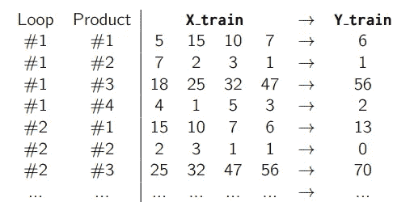

# 供应链预测的机器学习

> 原文：<https://towardsdatascience.com/machine-learning-for-supply-chain-forecast-66ef297f58f2?source=collection_archive---------5----------------------->

## 你如何使用机器学习来预测供应链中的需求？


Source: [https://www.vpnsrus.com/](https://www.vpnsrus.com/)

*下面这篇文章摘自我的《供应链预测的数据科学》一书，这里有*[](https://www.amazon.com/Data-Science-Supply-Chain-Forecasting/dp/3110671107)**。你可以在这里* *找到我的其他出版物* [*。我也活跃在*](https://medium.com/@nicolas.vandeput)[*LinkedIn*](https://www.linkedin.com/in/vandeputnicolas/)*。**

# *什么是机器学习？*

*供应链从业者通常使用老派的统计方法来预测需求。但随着最近机器学习算法的兴起，我们有了新的工具，可以轻松实现典型工业需求数据集预测准确性方面的出色表现。这些模型将能够学习许多关系，这些关系超出了传统统计模型的能力。例如，如何将外部信息(如天气)添加到预测模型。*

*传统的统计模型使用预定义的模型来根据历史需求进行预测。问题是这些模型不能适应历史需求。如果使用双指数平滑模型来预测季节性产品，它将无法解释季节性模式。另一方面，如果对非季节性需求使用三重指数平滑模型，它可能会过度拟合需求的噪声，并将其解释为季节性。*

*机器学习是不同的:在这里，算法(即机器)将从训练数据集(即我们的历史需求)中学习关系，然后能够将这些关系应用于新数据。传统的统计模型将使用预定义的关系(模型)来预测需求，而机器学习算法不会假定*先验*特定的关系(如季节性或线性趋势)；它将直接从历史需求中学习这些模式。*

*对于学习如何进行预测的机器学习算法，我们必须向它显示输入和期望的相应输出。然后它会自动理解这些输入和输出之间的关系。*

*使用机器学习和指数平滑模型预测我们的需求之间的另一个关键区别是，机器学习算法将从我们所有的数据集学习模式。指数平滑模型将单独处理每个项目，与其他项目无关。机器学习算法将从所有数据集中学习模式，并将最有效的方法应用于每种产品。人们可以通过增加每个时间序列的长度(即，为每个产品提供更多的历史周期)来提高指数平滑模型的准确性。有了机器学习，我们将能够通过提供更多产品来提高我们模型的准确性。*

*欢迎来到机器学习的世界。*

# *用于需求预测的机器学习*

*为了进行预测，我们将向机器学习算法提出以下问题:
**基于上 *n* 个需求周期，下一个周期的需求会是多少？**
我们将通过为模型提供特定布局的数据来训练模型:
- *n* 个连续的需求周期作为输入。
-作为输出的下一个周期的需求。
让我们看一个例子(用季度预测来简化表格):*

*[](https://www.amazon.com/Data-Science-Supply-Chain-Forecast/dp/1730969437)*

*对于我们的预测问题，我们将基本上向我们的机器学习算法显示我们的历史需求数据集的不同提取作为输入，并且每次显示下一次需求观察是什么。在我们上面的例子中，算法将学习上四个季度的需求和下一个季度的需求之间的关系。算法会**学习**如果我们有 5，15，10 & 7 作为最后四个需求观测值，那么下一个需求观测值就是 6，所以它的预测应该是 6。*

*大多数人对这个想法会有两种截然不同的想法。要么人们会认为“*计算机根本不可能观察需求并做出预测”*要么认为*“到目前为止，人类无事可做。”*两者都不对。*

*后面我们会看到，机器学习可以产生非常准确的预测。作为控制机器的人，我们仍然必须问自己许多问题:
——向算法提供哪些数据，让它理解正确的关系。
-用哪个机器学习算法(有很多不同的！).
-在我们的模型中使用哪些参数。正如你将看到的，每个机器学习算法都有一些设置，我们可以调整这些设置来提高其准确性。*

*和往常一样，没有确定的放之四海而皆准的答案。实验将帮助您找到最适合您的数据集的方法。*

***数据准备**
任何机器学习算法项目的第一步都是对数据进行正确的清理和格式化。在我们的例子中，我们需要格式化历史需求数据集，以获得一个类似于上表所示的数据集。*

***命名约定**在我们的数据清理过程中，我们将使用标准的数据科学符号，并将输入称为 **X** ，将输出称为 **Y** 。具体来说，数据集**X _ train**&**Y _ train**将包含我们将用来训练我们的算法的所有历史需求( **X_train** 作为输入， **Y_train** 作为输出)。数据集**X _ test**&**Y _ test**将用于**测试**我们的模型。*

*您可以在下表中看到一个典型的历史需求数据集示例，您应该在预测项目开始时拥有该数据集。*

*[](https://www.amazon.com/Data-Science-Supply-Chain-Forecast/dp/1730969437)*

*我们现在必须将这个数据集格式化为类似于第一个表的格式。现在让我们假设，我们希望根据某个产品在前四个季度的需求观察来预测该产品在一个季度的需求。我们将通过遍历我们拥有的不同产品来填充数据集**X _ train**&**Y _ train**，每次创建一个数据样本，其中连续四个季度为 **X_train** ，下一个季度为 **Y_train** 。这样，机器学习算法将学习四分之一的需求和之前四分之一的需求之间的关系。*

*您可以在下表中看到第一次迭代的图示。为了验证我们的模型，我们将把 Y3Q4 放在一边作为测试集。*

*[](https://www.amazon.com/Data-Science-Supply-Chain-Forecast/dp/1730969437)*

*这意味着我们的训练集不会持续到 Y3Q4，因为它是为测试集保留的:最后一个循环将被用作最终测试。*

*我们的 **X_train** 和 **Y_train** 数据集将如下表所示:*

*[](https://www.amazon.com/Data-Science-Supply-Chain-Forecast/dp/1730969437)*

*请记住，我们的算法将学习 X_train 中的关系，以预测 Y_train。所以我们可以写成 X_train -> Y_train。*

*最终测试将通过这些 X_test 和 Y_test 数据集提供给我们的工具:*

*[](https://www.amazon.com/Data-Science-Supply-Chain-Forecast/dp/1730969437)*

*这些是我们在 Y3Q4 之前(即 Y2Q4 到 Y3Q3)知道的每种产品的四个最新需求季度。这意味着我们的算法在训练阶段不会看到这些关系，因为它将测试它在这些特定预测练习中达到的准确性。我们将在这个测试集上测量它的准确性，并假设它在预测未来需求时的准确性是相似的。*

***数据集长度**
对于任何机器学习练习来说，关注有多少数据被输入到算法中是很重要的。越多越好。另一方面，我们用来做预测的周期越多(我们称之为 **x_len** ，我们就越不能遍历数据集。此外，如果我们想要一次预测更多的周期( **y_len** )，这将花费我们一部分数据集，因为我们需要更多的数据(Y_train 更长)来在我们的数据集中执行一次循环。*

*通常，如果我们有一个有 *n* 个周期的数据集，我们将能够使 *1+n-x_len-y_len* 贯穿它。*

**loops = 1 + n- x_len- y_len**

*最佳实践是至少保持足够的运行来循环两年，以便 *23 + x_len + y_len ≤ n* 。这意味着该算法将有两个完整的季节周期来学习任何可能的关系。如果它只有一个，你将面临过度拟合的高风险。*

***自己动手**
**数据收集**
数据集的创建和清理是任何数据科学项目必不可少的一部分。为了说明我们将在接下来的章节中创建的所有模型，我们将使用 2007 年 1 月至 2017 年 1 月挪威的历史汽车销售数据作为示例数据集。你可以在这里下载这个数据集:【www.supchains.com/download】T21你会得到一个 *csv* 文件，名为*Norway _ new _ car _ sales _ by _ make . CSV*。该数据集包含 65 家汽车制造商在 121 个月内的销售额。平均而言，挪威每年销售 140，000 多辆新车，因此，如果我们假设一辆新车在挪威的平均价格约为 30，000 美元，则市场价值可粗略估计为 40 亿美元。就规模而言，这个数据集是适度的，但它足够大，足以与新模型和想法的实验相关。然而，机器学习模型可能会在其他更大的数据集上显示出更好的结果。*

*[](https://www.amazon.com/Data-Science-Supply-Chain-Forecast/dp/1730969437)*

***自带数据集**在文章的第二部分，我们将讨论如何将机器学习模型应用于这个示例数据集。但是我们真正感兴趣的是**你自己的数据集**。不要浪费任何时间，已经开始收集一些历史需求数据，以便您可以在我们讨论不同主题时，根据您自己的历史需求数据来测试以下模型。建议您从拥有至少三年数据(5 年更好)和一百多种不同产品的数据集开始。越大越好。
**训练和测试集创建**
我们将编写第一个代码，从这个 *csv* 中提取数据，并将其格式化，以日期为列，以产品为行。*

```
*# Load the CSV file (should be in the same directory) 
data = pd.read_csv(“norway_new_car_sales_by_make.csv”) 

# Create a column “Period” with both the Year and the Month 
data[“Period”] = data[“Year”].astype(str) + “-” + data[“Month”].astype(str) 
# We use the datetime formatting to make sure format is consistent 
data[“Period”] = pd.to_datetime(data[“Period”]).dt.strftime(“%Y-%m”) 

# Create a pivot of the data to show the periods on columns and the car makers on rows 
df = pd.pivot_table(data=data, values=”Quantity”, index=”Make”, columns=”Period”, aggfunc=’sum’, fill_value=0) 

# Print data to Excel for reference 
df.to_excel(“Clean Demand.xlsx”)*
```

*请注意，我们将结果打印在一个 excel 文件中，供以后参考。直观地检查数据集的外观，以确保代码按预期运行，这始终是一种好的做法。*

*您还可以定义一个函数来存储这些步骤以备后用。*

```
*def import_data():
 data = pd.read_csv(“norway_new_car_sales_by_make.csv”)
 data[“Period”] = data[“Year”].astype(str) + “-” + data[“Month”].astype(str)
 data[“Period”] = pd.to_datetime(data[“Period”]).dt.strftime(“%Y-%m”)
 df = pd.pivot_table(data=data,values=”Quantity”,index=”Make”,columns=”Period”,aggfunc=’sum’,fill_value=0)
 return df*
```

*既然我们已经有了格式正确的数据集，我们就可以创建训练集和测试集了。为此，我们将创建一个函数**数据集**,它接受以下输入:*

***df** 我们最初的历史需求；
**x_len** 我们将用来进行预测的月数；
**y_len** 我们要预测的月数；
**y_test_len** 我们离开的月数作为最终测试；*

*并返回 X_train，Y_train，X_test & Y_test。*

```
*def datasets(df, x_len=12, y_len=1, y_test_len=12):D = df.values
 periods = D.shape[1]

 # Training set creation: run through all the possible time windows
 loops = periods + 1 — x_len — y_len — y_test_len 
 train = []
 for col in range(loops):
 train.append(D[:,col:col+x_len+y_len])
 train = np.vstack(train)
 X_train, Y_train = np.split(train,[x_len],axis=1)

 # Test set creation: unseen “future” data with the demand just before
 max_col_test = periods — x_len — y_len + 1
 test = []
 for col in range(loops,max_col_test):
 test.append(D[:,col:col+x_len+y_len])
 test = np.vstack(test)
 X_test, Y_test = np.split(test,[x_len],axis=1)

 # this data formatting is needed if we only predict a single period
 if y_len == 1:
 Y_train = Y_train.ravel()
 Y_test = Y_test.ravel()

 return X_train, Y_train, X_test, Y_test*
```

*在我们的函数中，我们必须使用**。在 Y_train 和 Y_test 上的 ravel()** 如果我们只想一次预测一个周期。
**array.ravel()** 将 NumPy 数组的维数减少到 1D。我们的函数总是将 Y_train 和 Y_test 创建为 2D 数组(即包含行和列的数组)。如果我们只想一次预测一个周期，那么这些数组将只有一列(和多行)。不幸的是，如果我们只想预测一个周期，我们稍后将使用的函数将需要 1D 数组。*

*我们现在可以轻松地调用我们的新函数 **datasets(df)** 以及 **import_data()** 。*

```
*import numpy as np
import pandas as pd
df = import_data()
X_train, Y_train, X_test, Y_test = datasets(df)*
```

*我们现在获得了为我们的机器学习算法(X_train & Y_train)提供数据所需的数据集，以及测试它所需的数据集(X_test & Y_test)。*

*注意我们取 y_test_len 为 12 期。这意味着我们将在 12 个不同的预测上测试我们的算法(因为我们一次只预测一个时期)。
**一次预测多个期间**如果想一次预测多个期间，可以更改 y_len。你需要注意保持*y _ test _ len≥y _ len；否则*，你就无法检验你算法的所有预测。*

# *回归树*

*作为第一个机器学习算法，我们将使用一个**决策树**。决策树是一类机器学习算法，它将创建一个问题地图(实际上是一棵树)来进行预测。如果我们想让这些树预测一个数字，我们称它们为**回归树**，如果我们想让它们预测一个类别或标签，我们称它们为**分类树**。*

*为了做出预测，该树将从其基础开始，首先提出是/否问题；基于这个答案，它将继续问新的是/否问题，直到它得到一个最终的预测。不知何故，你可以看到这些树就像一个大游戏*猜猜是谁？*(著名的 80 年代游戏):模型会连续问多个问题，直到得到正确答案。*

*[](https://www.amazon.com/Data-Science-Supply-Chain-Forecast/dp/1730969437)*

*在决策树中，每个问题被称为一个**节点**。例如，在上图中，'*这个人的鼻子大吗？'*是一个节点。每个可能的最终答案被称为**叶**。在上面的例子中，每片叶子只包含一个人。但是这不是强制性的。你可以想象很多人都有一张大嘴和一个大鼻子。在这种情况下，叶将包含多个值。*

*一棵树用来分割一个节点的不同信息被称为**特征**。例如，上图中的树可以在三个特征*嘴*、*鼻子、*和*眼镜*上分割一个节点。*

*它是如何工作的？
为了说明我们的树将如何增长，让我们拿回我们的季度虚拟数据集。*

*[](https://www.amazon.com/Data-Science-Supply-Chain-Forecast/dp/1730969437)*

*基于这个训练数据集，问自己一个**聪明**的问题来做一个预测:第一个需求观察>是 7 吗？*

*[](https://www.amazon.com/Data-Science-Supply-Chain-Forecast/dp/1730969437)*

*这是一个聪明的问题，因为您知道答案(是/否)将提供下一季度需求行为的有趣指示。如果答案是*是*，我们试图预测的需求很可能相当高(> 8)，如果答案是*否*，那么我们试图预测的需求很可能很低(≤7)。*

*下面是一个**不好的**问题的例子。*

*[](https://www.amazon.com/Data-Science-Supply-Chain-Forecast/dp/1730969437)*

*这没有帮助，因为这个问题没有将我们的数据集分成两个不同的子集(即，每个子集内仍然有很多变化)。如果问题*的答案是第三需求观察< 6？*是*是*，我们仍然有从 1 到 11 的需求范围，如果答案是*否，*范围从 4 到 13。这个问题对预测未来需求毫无帮助。*

*不必过多地探究树的数学内部工作的细节，生长我们的树的算法将在每个节点选择一个关于可用的**特征**(即先前的季度)之一的问题(即**分裂**)，这将最小化两个新数据子集的预测误差。
1963 年，Morgan 和 Sonquist 在他们的论文“*调查数据分析中的问题和建议”中，首次提出了创建决策树的算法关于如何生长决策树，有许多不同的算法(许多是从 60 年代开始开发的)。它们都遵循这样的目标，即询问关于数据集不同特征的最有意义的问题，以便将数据集分成不同的子集，直到达到某种标准。**

***参数**这是一个可怕的想法，因为即使你在训练集上有完美的准确性，你也不能在新数据上复制这些结果。我们将基于一些标准来限制我们的树的增长。让我们看看最重要的(我们已经在使用 **scikit-learn** 命名约定)。*

***最大深度**树可以询问的连续问题(节点)的最大数量。
**最小样本分割**节点中触发新分割所需的最小样本量。如果将此值设置为 6，则只剩下 5 个观测值的节点将不会被进一步分割。
**Min samples leaf** 一片叶子中需要的最小观察量。这是一个非常重要的参数。这越接近 0，过度拟合的风险就越高，因为你的树实际上会增长，直到它提出足够多的问题来分别处理每个观察。
**标准**这是算法将最小化的 KPI(MSE 或 MAE)。*

*当然，根据您的数据集，您可能希望为这些参数赋予不同的值。我们将在下一章讨论如何选择最佳参数。*

***自己动手**
我们将使用 **scikit-learn** Python 库([www.scikit-learn.org](http://www.scikit-learn.org))来种植我们的第一棵树。这是一个著名的开源库，世界各地的数据科学家都在使用它。它构建在 NumPy 的基础上，因此它可以很容易地与我们代码的其余部分进行交互。*

*第一步是调用 **scikit-learn** 并创建一个回归树的实例。一旦完成，我们必须根据 X_train 和 Y_train 数组来训练它。*

```
*from sklearn.tree import DecisionTreeRegressor 

# — Instantiate a Decision Tree Regressor 
tree = DecisionTreeRegressor(max_depth=5,min_samples_leaf=5) 

# — Fit the tree to the training data 
tree.fit(X_train,Y_train)*
```

*请注意，我们创建了一个最大深度为 5 的树(即，最多需要五个连续的是/否问题来对一个点进行分类)，其中每个树叶至少有 5 个样本。*

*现在，我们有了一个针对我们特定需求历史的树。我们已经可以在训练数据集上测量它的准确性。*

```
*# Create a prediction based on our model 
Y_train_pred = tree.predict(X_train) 

# Compute the Mean Absolute Error of the model 
import numpy as np
MAE_tree = np.mean(abs(Y_train — Y_train_pred))/np.mean(Y_train) 

# Print the results 
print(“Tree on train set MAE%:”,round(MAE_tree*100,1))*
```

*你应该获得 15.1%的平均收益率。现在，让我们根据测试集来衡量准确度:*

```
*Y_test_pred = tree.predict(X_test) 
MAE_test = np.mean(abs(Y_test — Y_test_pred))/np.mean(Y_test) 
print(“Tree on test set MAE%:”,round(MAE_test*100,1))*
```

*我们现在获得大约 21.1%。这意味着我们的回归树过度适应历史需求:与历史数据集相比，我们在测试集中损失了 6 个点的 MAE。*

# *更进一步*

*有很多方法可以进一步改善这个结果:
-优化树参数。
-使用更高级的模型(如森林、ETR、极端梯度推进)。
-优化输入数据。
-使用外部数据。*

*所有这些都在**供应链预测数据科学**一书中有解释(亚马逊上有售)*

# *关于作者*

*[](https://www.linkedin.com/in/vandeputnicolas/) [## Nicolas vande put——顾问，创始人——供应链| LinkedIn

### 查看 Nicolas Vandeput 在世界上最大的职业社区 LinkedIn 上的个人资料。尼古拉斯有 7 份工作列在…

www.linkedin.com](https://www.linkedin.com/in/vandeputnicolas/) 

icolas Vandeput 是一名供应链数据科学家，擅长需求预测和库存优化。他在 2016 年创立了他的咨询公司 [SupChains](http://www.supchains.com/) ，并在 2018 年共同创立了 [SKU 科学](https://bit.ly/3ozydFN)——一个快速、简单、实惠的需求预测平台。尼古拉斯对教育充满热情，他既是一个狂热的学习者，也喜欢在大学教学:自 2014 年以来，他一直在比利时布鲁塞尔为硕士学生教授预测和库存优化。自 2020 年以来，他还在法国巴黎的 CentraleSupelec 教授这两个科目。他于 2018 年出版了 [*供应链预测的数据科学*](https://www.amazon.com/Data-Science-Supply-Chain-Forecasting/dp/3110671107)(2021 年第 2 版)和 2020 年出版了 [*库存优化:模型与模拟*](https://www.amazon.com/Inventory-Optimization-Simulations-Nicolas-Vandeput/dp/3110673916) 。

*