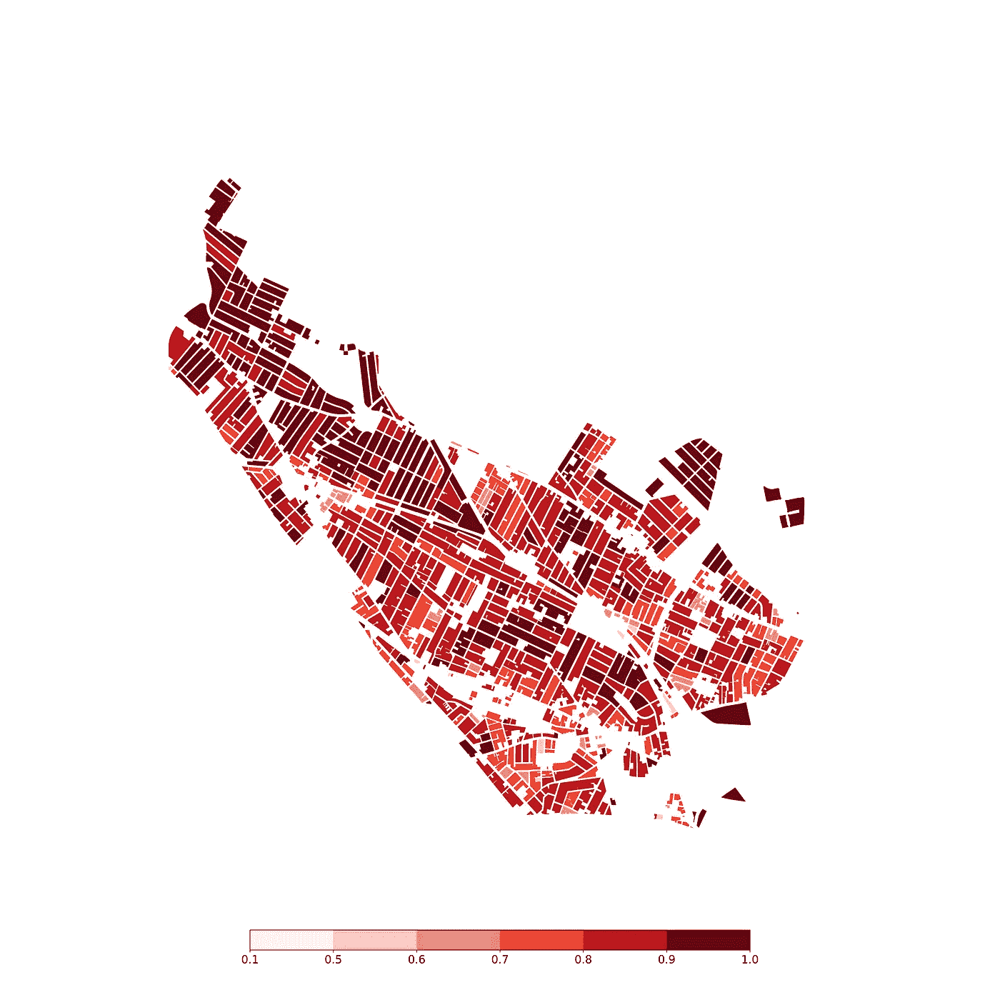
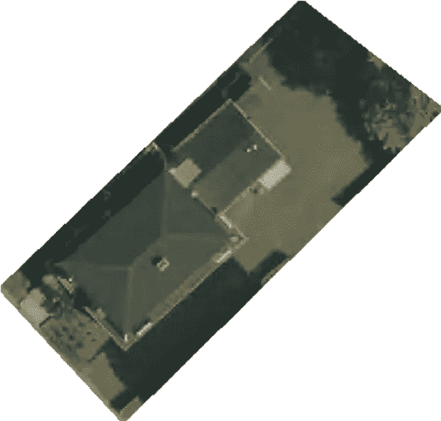
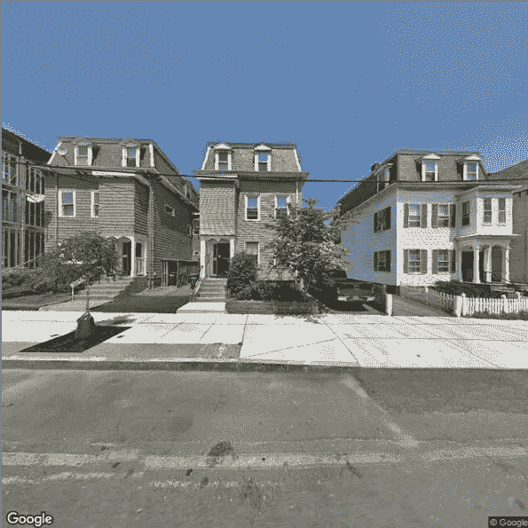
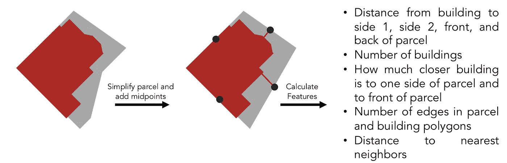
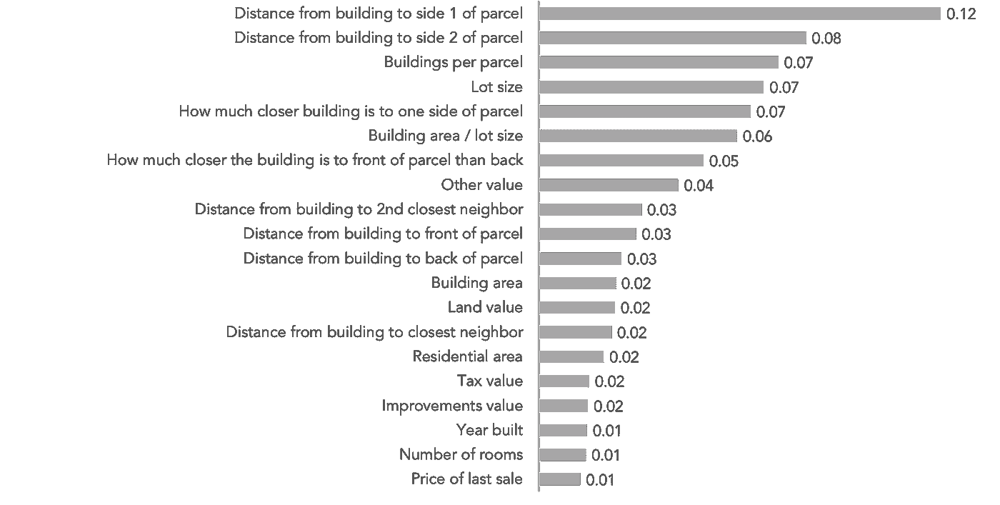
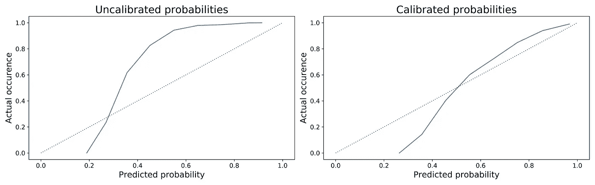
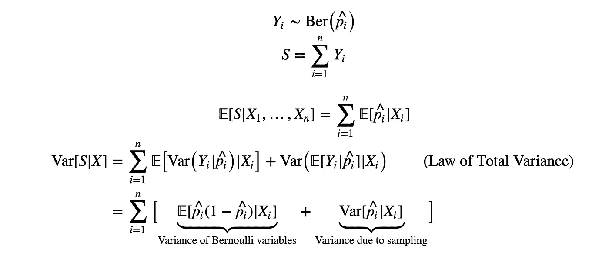

# 城市规划的机器学习:估算停车容量

> 原文：<https://towardsdatascience.com/machine-learning-for-urban-planning-estimating-parking-capacity-15aabd490cf8?source=collection_archive---------21----------------------->

## 哈佛数据科学顶点项目，2019 年秋季

*Figure 1\. Map of predicted proportion of driveways in Somerville by block*

*注:本文由 Josh Feldman、Lipika Ramaswamy 和 Anthony Rentsch 共同撰写。*

如果一切按计划进行，马萨诸塞州的萨默维尔——波士顿外围的一个城市——将在 2021 年获得一条新的地铁线。虽然这条新线路令人兴奋，但它可能会给现有的全市居民路边停车计划带来问题。如果居民开车到这些新车站，把车停在附近的街道上，住在这些街道上的人会失去停车位吗？还是可以停在他们的车道上？

为了解决像这样的交通规划问题，萨默维尔正在对他们的停车供应进行审计。他们对路内停车容量有很好的估计，但是他们关于路外停车的数据要少得多。他们的问题看似简单:萨默维尔有多少住宅单元有路外停车场？

对于我们哈佛大学数据科学硕士项目的顶点项目，我们与萨默维尔市合作回答了这个问题。我们的第一步是弄清楚计算车道数的确切含义。虽然我们可以为全市范围内的车道数量提供一个具有置信区间的单点估计，但萨默维尔的规划者可能需要在不同的粒度级别上合计车道数。我们希望为他们提供包裹级别的精确概率估计以及这些概率的不确定性。

首先，我们需要标签。萨默维尔市为我们提供了整个城市的光栅格式的航空卫星照片，我们使用 GIS 软件将这些照片分成每个地块的图像。接下来，我们编写了一个脚本来下载每个地块的 Google 街景图像。我们随机抽样了 600 多个地址，并根据我们在卫星和街景照片中看到的内容，手动标记它们是否有车道。我们在评估数据中注意到，还有数百个地块被标记为有车库，因此我们将这些地块添加到标记为有车道的地块中。

*Figure 2\. Examples of aerial and street view imagery*

**特色工程**

为了预测一个住宅单元是否有车道，我们从各种来源收集和设计特征，以输入到监督学习模型中。我们使用了萨默维尔的税收评估数据库来获取大量关于房屋的信息，从建造年份到屋顶风格。

两个非常有价值的信息来源是包裹和建筑足迹。我们使用这些多边形来测量房屋和地块边缘之间的空间以及房屋在地块上的中心位置。据推测，有车道的房子坐在一边，一侧有足够的空间来容纳一辆汽车。

除了这些几何和空间特征之外，我们还汇总了地块的街道停车许可，假设更多的停车许可将表明一个单元不能在车道或车库中停车。

*Figure 3\. Visualization of our feature engineering process with building and parcel footprints*

**建模**

生成特征后，我们尝试将各种二元分类器与我们的数据相匹配，结果变量是房子是否有车道。

最初，我们尝试使用卷积神经网络从我们的图像数据中提取特征并进行预测，但我们标记的照片非常少，而且它们的质量太低，无法使用，尽管我们进行了大量尝试来执行数据增强，合并迁移学习，并调整我们的网络架构。

相反，税务评估数据和手工设计的功能与传统的机器学习相结合，被证明比深度学习更有效。

我们将几个分类器用于该数据，包括逻辑回归(有和没有交互)、随机森林、AdaBoost、XGBoost 和前馈神经网络。我们还试验了这些模型的堆叠组合。

我们的问题也有很大的阶级不平衡。在我们手工标记的包裹中，代表了一个随机样本，82%有车道。为了弥补这一点，我们天真地在没有车道的情况下对宗地进行过采样，我们发现这种技术比合成少数过采样技术(SMOTE)和自适应合成采样(ADASYN)等更先进的技术更能提高性能。

逻辑回归和随机森林获得了可比的性能。我们选择随机森林，因为它能更好地捕捉特征和标签之间关系的非线性。这种基于树的模型还通过特征重要性提供了可解释性。

Figure 4\. Feature importances from random forest model

**后期造型**

由于我们的模型将被萨默维尔市用于交通规划，我们希望在宗地级别上进行概率估计。为此，我们需要精确校准的概率，即反映事件真实可能性的概率。

不幸的是，许多机器学习模型，如随机森林，默认情况下不会产生校准良好的概率。此外，我们对少数民族类的上采样将许多原始随机森林得分推向 0.5，尽管我们预计大多数地块都有车道。

为了解决这个问题，我们执行了一个校准步骤来调整我们的模型产生的概率。对于我们预测有 70%机会拥有车道的单元，我们希望这 70%是真的。

我们使用了一种叫做 Platt scaling 的技术，它涉及到对我们未校准的预测概率和标签进行逻辑回归拟合。需要注意的是，我们希望用于校准模型的数据分布反映出我们对萨默维尔市车道总体分布的预期。在拟合这个模型之前，我们重新平衡了我们的校准集，使得车道在这个集中的比例大约为 82%。

这种校准技术使许多概率更接近于 1，反映了我们有根据的信念，即萨默维尔的大多数地块都有车道。

*Figure 5\. Calibration curves for uncalibrated and calibrated predictions on labelled data*

**估算**

最后，由于我们希望萨默维尔市的分析师能够估算任何聚合级别(如街区或社区)的车道数，因此我们正式提出了一种方法来进行估算。

我们将每个地块中车道的存在 *Y* 建模为伯努利随机变量，其相应的概率 *p* 由两步分类器和校准模型估计。我们假设，根据我们的模型 *X* 中使用的特征，车道的存在以及车道在任何地块上存在的相关概率独立于其他地块。这一假设很重要，因为当我们考虑车道预期数量的变化时，它允许我们忽略任何空间相关性。

*Figure 6\. Variance derivation*

要获得车道的预期数量，我们可以合计所有感兴趣宗地的概率。为了获得方差，我们首先创建了许多训练数据的自举样本，并为每个样本拟合了一个新的随机森林模型。然后，我们为每个地块计算了一组概率，每个自举样本一个。为了获得宗地级别估计的方差，我们计算了每个宗地的 *p⋅* (1- *p* )的均值和 *p* 的方差，并将它们相加。最后，为了获得感兴趣的聚集级别的方差，我们可以对所有这些宗地级别的方差求和。

使用这种方法模拟车道的存在允许在任何地理水平上的统计上合理的聚集。如果我们添加任何一组地块的预测和方差，我们可以恢复有效的点估计和置信区间。

总体而言，我们估计在该市的 12，069 个住宅区中存在 10，288 条机动车道+/- 74 (2 个标准误差)，尽管不同的街区有不同的机动车道比例，这可以在街区级别预测的地图中看到。

**最终想法**

我们进入这个项目的目的是使用最先进的计算机视觉和深度学习技术从卫星和街道视图图像中提取信息，以确定它们是否有车道。我们发现这个策略对于问题和手头的数据既不合适也不有效。

相反，采取更传统的机器学习方法结合由领域知识和现实不确定性估计启发的智能特征工程是有效的。我们希望我们的工作为萨默维尔市的分析师提供价值，因为他们计划新的地铁站和更多。

有关哈佛数据科学峰会的更多信息，请访问:[capstone.iacs.seas.harvard.edu](http://capstone.iacs.seas.harvard.edu/)。