# 机器学习:从炒作到现实应用

> 原文：<https://towardsdatascience.com/machine-learning-from-hype-to-real-world-applications-69de7afb56b6?source=collection_archive---------10----------------------->

## 如何利用新兴技术推动商业价值？

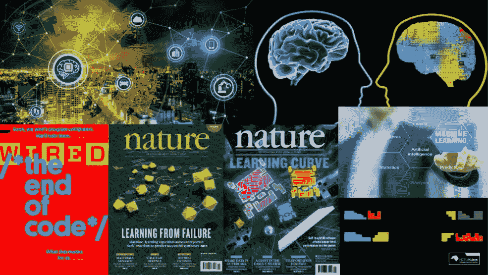

炒作是真实的。[人工智能(AI)](https://en.wikipedia.org/wiki/Artificial_intelligence)[机器学习(ML)](https://en.wikipedia.org/wiki/Machine_learning) 遍布媒体，每个人都想参与到技术竞赛中。过去几年的进步绝对是巨大的，你可能听说过诸如“人工智能是新的电力”和“人工智能将彻底改变我们的社会”之类的说法。我不会对这些言论发表评论，但我们都可以有把握地同意的是，肯定有很多人对这些技术感兴趣。然而，所有这些关注回避了一个重要的问题:它真的能不负众望吗？

在某些领域，技术已经赶上，甚至超过了宣传。例如，在[图像识别](https://en.wikipedia.org/wiki/Computer_vision)中，识别物体并从图像中提取信息的任务，人工智能现在正在超越人类水平的表现(即，机器在识别物体和图像方面实际上越来越好于人类)。

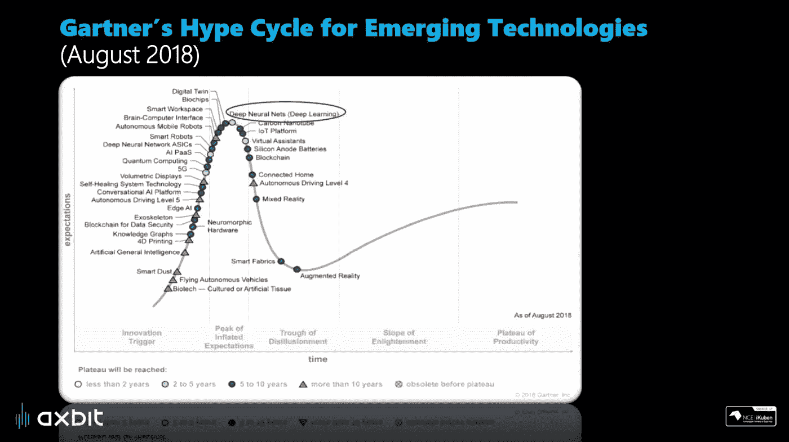

当在正确的用例中正确应用时，人工智能解决方案可以为您的业务提供巨大的价值。然而，随着围绕 AI 和 ML 的所有关注和炒作，清楚*如何*和*何时*应该使用这些技术变得非常重要。

参考上图中的“Gartner 新兴技术炒作周期”，我们看到“[AI/深度学习”](https://en.wikipedia.org/wiki/Deep_learning)一直位于炒作周期的顶端。关于这一点的好处是，有很多关于这些技术提供的可能性的关注。但是，与此同时，人们需要意识到，在某些情况下，期望和现实之间可能存在不匹配。这使得超越宣传并展示如何正确应用 AI/ML 和数据分析以解决业务相关案例并提供真正价值变得更加重要。

## **人工智能革命:为什么是现在？**

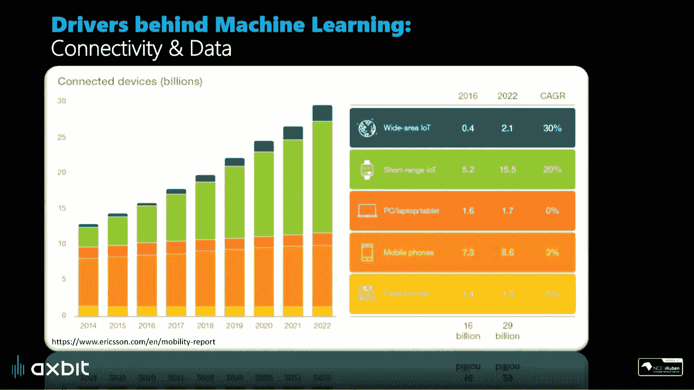

为什么我们突然有了这种围绕 AI 的炒作？人工智能和人工智能已经存在很长时间了，但有一些关键因素可以解释为什么这些技术在最近几年才真正开始起步。

一个至关重要的因素当然是可用数据的数量。访问大量数据是 ML 如此强大的关键因素之一。无论是记录数据的设备数量，还是它们之间通过[物联网(IOT)](https://en.wikipedia.org/wiki/Internet_of_things) 的连接性，可用数据量都在呈指数级增长。

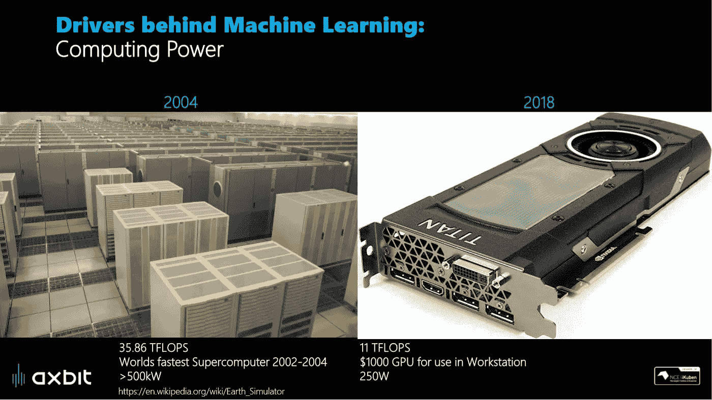

当然，访问大量数据是一回事。另一个是能够处理这些数据，以便提取有用的信息。获取廉价而强大的计算资源对于推动人工智能和人工智能的发展至关重要。作为计算能力巨大发展的直观例子，让我们看看上图。在左边，我们有一张大约 15 年前世界上最快的超级计算机 [NEC 地球模拟器](https://en.wikipedia.org/wiki/Earth_Simulator)的(部分)图像。而今天，你可以买一台普通的游戏电脑，并且基本上拥有相同的计算能力。

访问大数据和大规模计算能力的互补因素使得大规模处理数据成为可能，而这在几年前还是不可行的。随着谷歌和脸书等科技巨头开放大部分研究的额外好处，我们现在有了一个很好的起点来解决新的有趣的问题。

## **跨职能协作打造优质产品**

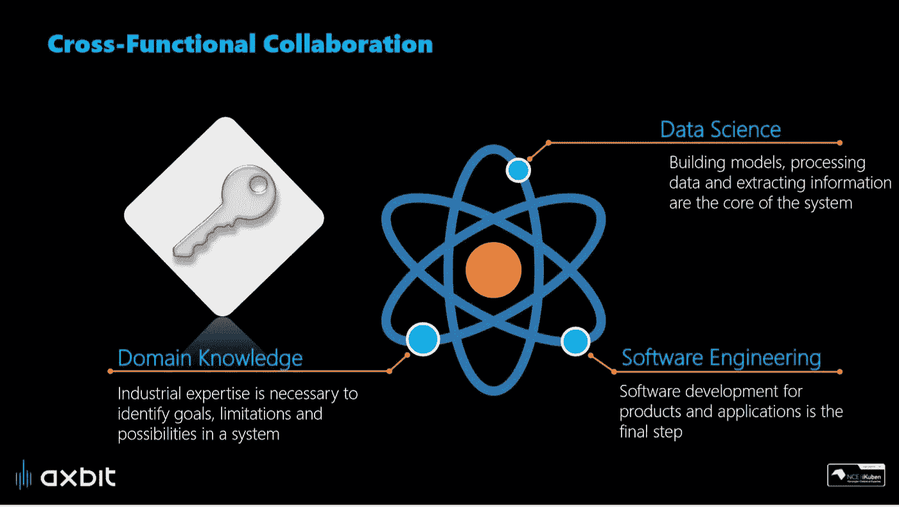

超越宣传，真正构建为您的业务提供真正价值的解决方案，有几个重要因素需要考虑。涉及算法、计算机和数据的技术方面是一回事，但为了构建好的解决方案，你需要跨职能的合作。

领域知识:一方面，你需要对你要解决的问题有领域知识的人。在一个系统中有哪些可能性和局限性，如何在实践中应用该解决方案？

**数据科学:**你还需要数据科学内部的能力，这涉及到与分析、统计、信号处理、机器学习、人工智能和深度学习相关的一切。本质上，提取和利用数据中的模式和信息的方法和技术

**软件工程:**软件工程技能对于构建良好的数据驱动解决方案至关重要。这包括建立基础设施，通过适当的管道收集和处理数据，管理对数据的访问，并最终为最终用户建立实用和用户友好的软件工具。

最重要的是，你需要成功地将所有这些因素结合起来，才能制造出好的产品。

# 什么是机器学习？

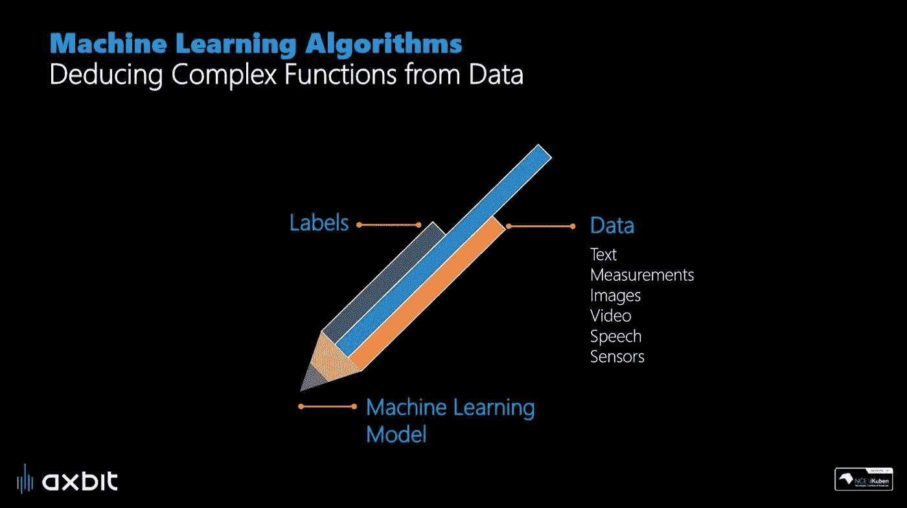

机器学习是人工智能的主要分支之一，也是目前在开发新的更好的解决方案方面取得很多进展的领域。不涉及技术细节，ML 本质上就是从数据中提取有价值的信息。在这个上下文中，数据可以是来自文本、视频、图像、声音、传感器数据等的任何东西。典型的人工智能解决方案包括对图像和视频进行分析和分类的模型，[通过传感器数据监控复杂工业设备的“健康状态”](/how-to-use-machine-learning-for-anomaly-detection-and-condition-monitoring-6742f82900d7?source=friends_link&sk=5ff4616a78388de1d738197da3f7a9d4)或者[预测您企业的未来销售预测](/artificial-intelligence-in-supply-chain-management-predictive-analytics-for-demand-forecasting-80d2d512f155?source=friends_link&sk=516c29da9ded89dd28634fcab4d04518)。(我们将在文章末尾回到一些具体的用例示例)

## 深度学习:从炒作到应用

重要的是要记住，深度学习不是魔法，而是基于处理图像等信息的数学模型(毕竟，图像只是计算机看到的数字集合)。

术语“[人工神经网络](https://en.wikipedia.org/wiki/Artificial_neural_network)”来自大脑处理信息的方式。人工神经网络模型并不试图复制人脑，但它们大致受到“神经元”数学模型的启发，神经元是神经信息处理的构建模块之一(因此得名神经网络)。

这些人工神经网络的分层结构(如上图所示)是我们将这种类型的建模称为“[深度学习](https://en.wikipedia.org/wiki/Deep_learning)”的原因。模型的较深层(图的左边部分)通常提取关于尖锐边缘和基本形状的信息，而上层(图的右边部分)检测更精细和更详细的结构。

学习这些模型如何正确分类图像是一个耗时且计算量大的过程。我们本质上用正确分类的图像的例子来呈现该模型，然后该模型尝试自己对新图像进行分类。最初，预测只是随机猜测，但通过向模型显示足够多的图像，并在每次做出错误猜测时进行纠正，它最终学会提取相关信息，以便正确分类。

令人惊讶的是，我们不必告诉模型要寻找什么——它通过经验自己学习这些特征(我们称之为“[机器学习](https://en.wikipedia.org/wiki/Machine_learning)”的原因)。

近年来，这一领域的进展令人惊讶，这主要是由于可以访问大量数据和廉价的计算能力。许多任务的性能现在已经超过了人类的水平(即，在识别和分类物体和图像方面，机器实际上正在变得比人更好)。当然，这有许多非常有趣和有用的应用，我们很快就会谈到。

## 人工智能和创造力

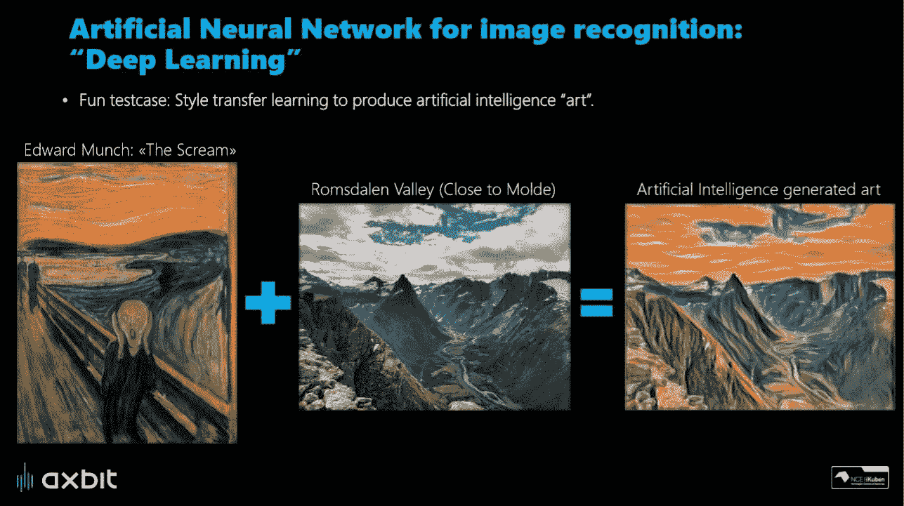

我们通常认为“智能”是执行任务的能力，我们通常将它与人类智能联系在一起。一个这样的任务例如可以是产生艺术或音乐的创造性能力。足够有趣的是，即使对于这些类型的创造性“人类”任务，我们现在也看到人工智能表现得惊人地好。

为了说明这一点，我展示了上面的一个例子，其中一个人工智能模型被训练成以挪威著名画家爱德华·蒙克的风格生成图像。给定一个训练有素的模型，我们就可以使用新风景的图片作为“人工智能艺术家”的“灵感”，并以人类艺术家的绘画风格复制它。效果出奇的好，你不觉得吗？

上面的例子也许不是很有用(虽然很有趣)。然而，它很好地说明了底层技术从图像中提取有意义信息的能力，这反过来对其他应用程序也非常有用。

# **机器学习的现实应用**

为了展示我们工作的主题的大跨度，我挑选了几个 ML 如何在现实世界中使用的例子。这些例子从使用数据分析和 ML 进行重型工业设备的状态监控，到使用计算机视觉进行质量保证以及各种图像识别和物体检测任务。[你也可以在这里阅读我们其他令人兴奋的项目](https://axbit.com/projects)。

## 利用传感器数据的质量保证

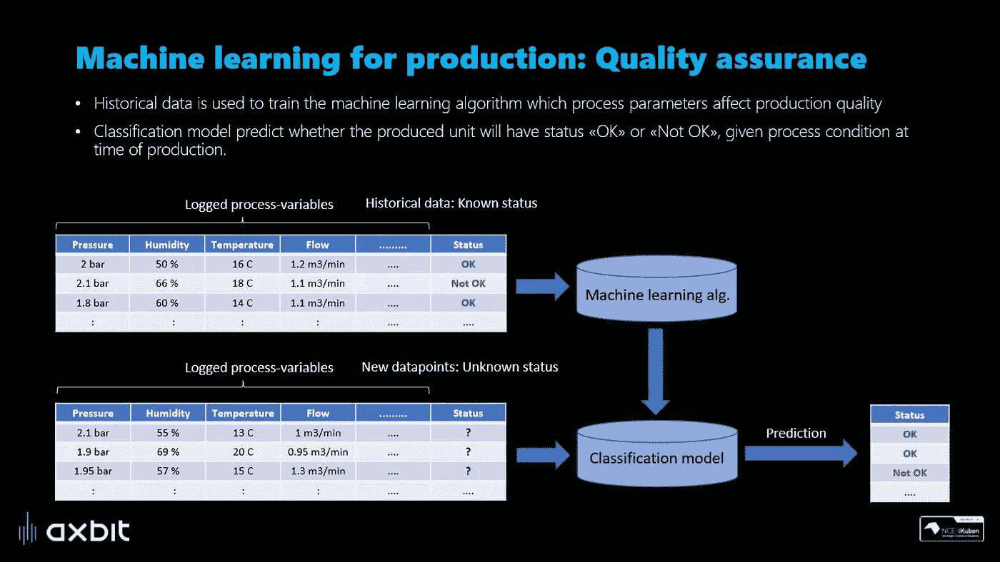

上述案例是一个典型的生产公司，例如，可能涉及复杂设备的制造或控制加工厂。一般来说，任何最终产品是某种生产单位的东西。

上图所示的简化视图旨在通过传感器数据利用所有可用信息，并揭示测量变量和生产质量之间的关系。变量 x 影响生产质量吗？在当前的操作条件下，我的产品出现缺陷的风险有多大？为了提高产品质量，生产的哪一部分最需要优化？这些是我们可以通过适当利用现有数据来回答的一些问题。

## 状态监控

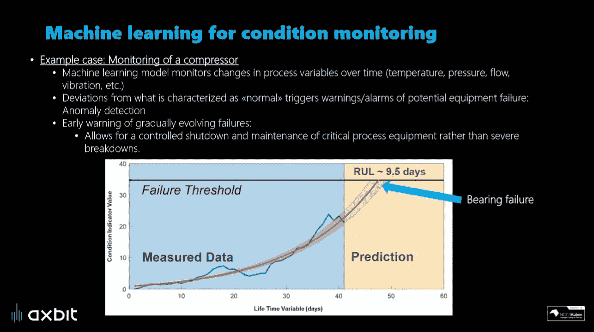

作为一个具体的例子，我们可以例如考虑将传感器数据用于压缩机的状态监控。在这种情况下，我们监控传感器数据(温度、压力、振动、++)，ML 模型根据积累的经验学习什么是“正常的”。该模型持续寻找记录数据中的异常和即将发生的故障/故障的迹象。如果根据测量的变量，行为看起来可疑，该模型可以生成警报或启动预防措施。

即将发生的故障的早期预警对于基于状态的维护和维修计划等具有重要价值。利用这种解决方案有助于避免由于早期预警导致的突然故障，从而允许采取预防措施并控制关键设备的关闭。如果您有兴趣了解更多关于如何使用 ML 进行状态监控的信息，您可以阅读下面的文章

## 用于质量保证的图像识别

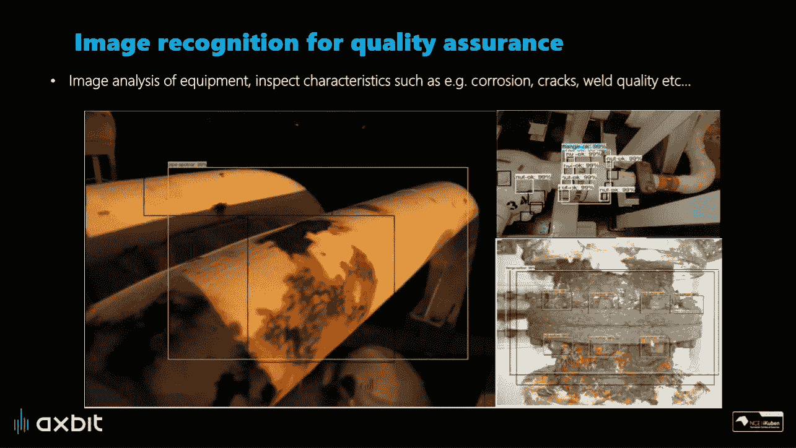

上图展示了这种技术在质量保证中应用的例子。在这种情况下，模型分析图像，寻找某些确定的特征，如腐蚀、损坏、裂纹、焊接不良等。也许不如创作艺术有趣，但对许多工业应用来说肯定非常有用。

## 水产养殖中的图像识别

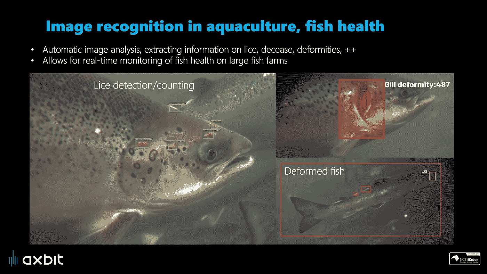

另一个例子是在渔场中应用对象检测来监控鱼的健康。这在今天是一项非常具有挑战性的任务，因为鱼在水下基本上无法直接目视检查。一个新的创新解决方案是利用水下摄像机和人工智能解决方案进行自动图像和视频分析。这允许实时提取关于鱼类健康和幸福的重要信息。这是一个好消息，无论是从动物福利的角度，还是从健康的鱼对养鱼场主来说更有利可图的事实来看。[在这里了解更多关于这个项目的信息](https://axbit.com/projects/Create%20view)

## 从技术到商业价值:主要收获

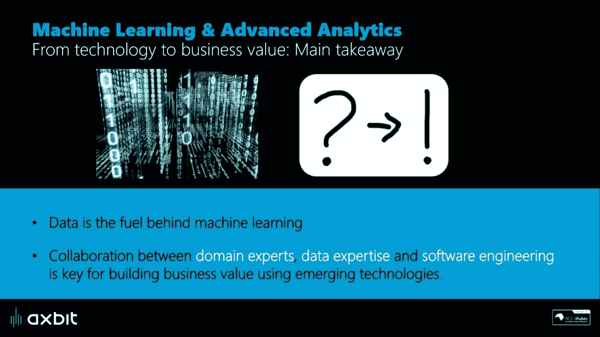

主要的信息是，一个人应该始终专注于带来商业价值的东西。新兴技术肯定可以成为实现这一目标的推动者，但专注于业务方面对于新计划和项目的成功至关重要。

要打造优秀的产品和创新的解决方案，不同专业领域之间的合作是关键。当领域专家和软件/分析专业知识合作，充分发挥新兴技术的优势时，最佳解决方案就会出现。

如果您对如何超越宣传进入现实生活的应用程序感到好奇，请随时与我们聊聊技术和软件解决方案如何帮助解决您的业务需求。

## 这篇文章最初出现在[axbit.com/blog](https://axbit.com/blog)

*你觉得这篇文章有趣吗？如果是这样的话，你可能也会喜欢我的其他一些关于人工智能、机器学习、物理等主题的文章。，你可以在下面的链接和我的中型作者简介中找到:*

 [## Vegard Flovik —中等

### 2018 年夏天我发表第一篇关于“走向数据科学”的文章时，数字背后的统计数据…

medium.com](https://medium.com/@vflovik) 

而且，如果你想成为一个媒体会员，免费访问平台上的所有资料，你也可以使用下面我的推荐链接。(注意:如果您使用此链接注册，我也会收到一部分会员费)

 [## 通过我的推荐链接加入 Medium—Vegard flo vik

### 作为一个媒体会员，你的会员费的一部分会给你阅读的作家，你可以完全接触到每一个故事…

medium.com](https://medium.com/@vflovik/membership) 

# 更多来自 Vegard Flovik 媒体:

1.  [蒙特卡洛方法简介](/a-gentle-introduction-to-monte-carlo-methods-98451674018d)
2.  [从物理学到数据科学的转变](/q-a-with-a-data-scientist-1f872518315f)
3.  [什么是图论，为什么要关心？](https://builtin.com/machine-learning/graph-theory)
4.  [用于图像分类的深度迁移学习](/deep-transfer-learning-for-image-classification-f3c7e0ec1a14)
5.  [建造一个能读懂你思想的人工智能](https://www.linkedin.com/pulse/building-ai-can-read-your-mind-vegard-flovik-phd/)
6.  [人工智能和大数据隐藏的风险](https://medium.com/me/stats/post/3332d77dfa6)
7.  [如何使用机器学习进行异常检测和状态监控](/how-to-use-machine-learning-for-anomaly-detection-and-condition-monitoring-6742f82900d7)
8.  [如何(不)使用机器学习进行时间序列预测:避免陷阱](/how-not-to-use-machine-learning-for-time-series-forecasting-avoiding-the-pitfalls-19f9d7adf424)
9.  [如何利用机器学习进行生产优化:利用数据提高绩效](/machine-learning-for-production-optimization-e460a0b82237)
10.  [你是怎么把物理教给 AI 系统的？](/how-do-you-combine-machine-learning-and-physics-based-modeling-3a3545d58ab9)
11.  我们能使用纳米级磁铁构建人工大脑网络吗？
12.  [供应链管理中的人工智能:利用数据推动运营绩效](/artificial-intelligence-in-supply-chain-management-predictive-analytics-for-demand-forecasting-80d2d512f155)

## 研讨会演示—从宣传到实际应用