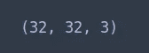

# Conv 网络-影像分类张量流 Keras 示例

> 原文：<https://towardsdatascience.com/machine-learning-image-classification-kaggle-competition-aerial-cactus-identification-3f720aa9e51c?source=collection_archive---------12----------------------->


Photo by [David Sola](https://unsplash.com/@davidsola?utm_source=medium&utm_medium=referral) on [Unsplash](https://unsplash.com?utm_source=medium&utm_medium=referral)

Kaggle 是一家公司，其商业模式是让来自世界各地的数据科学家竞争，为给定的问题建立最佳性能模型。换句话说，为了收费，Kaggle 为希望使用众包来解决数据问题的企业举办比赛。

在 Kaggle 比赛中，你会得到一套训练装备和一套测试装备。提供了测试集的功能，但隐藏了标签。目标是训练训练集，并使用它来预测测试集的目标标签。预测结果存储在*提交文件*中，并上传到 Kaggle 进行评估。参赛者可以看到他们的模型如何与其他竞争者相抗衡，并相应地调整他们的模型。当比赛结束时，第三套，其特征和标签的参赛者从来没有接触过，被用来确定赢家。通常情况下，这将惩罚那些模型倾向于过度拟合(即高方差)的团队。

有一个著名的例子，网飞提供了 100 万美元的奖金，但最终获胜的模型对他们来说太复杂了，无法投入生产。除此之外，Kaggle 的竞赛已经产生了一些好的结果。例如，保险公司好事达(Allstate)发布了一项挑战，在给定驾驶员属性的情况下，该模型近似于车祸的概率。202 名竞争者最终将好事达的模式提高了 271%。

在接下来的文章中，我们将通过一个 kaggle 竞赛来确定一个给定的图像是否包含一个 ***仙人掌。*** 比赛可以在这里找到[](https://www.kaggle.com/c/aerial-cactus-identification)**。**

# **密码**

**在机器学习中，每当你在处理图像时，你应该自动思考卷积神经网络。幸运的是，Keras，一个运行在 Tensorflow 之上的高级 API，抽象出了构建神经网络的大量复杂性。**

```
import cv2
import os
import pandas as pd
import numpy as np
from matplotlib import pyplot as plt
from keras.models import Sequential
from keras.layers import Flatten, Conv2D, MaxPool2D, Activation, Dense, Dropout
from keras.optimizers import Adam
from keras.preprocessing.image import ImageDataGenerator
```

**如果你想继续，继续从 [**Kaggle**](https://www.kaggle.com/c/aerial-cactus-identification) 下载训练和测试集，并将它们复制/解压缩到你的工作目录中。**

```
train_directory = 'train'
test_directory = 'test'
```

**此外，我们得到一个文件，其中包含每个图像的 id，以及它是否由仙人掌组成。**

```
df = pd.read_csv('train.csv')
df.head()
```

****

**让我们看看我们在做什么。**

```
img = cv2.imread('train/0004be2cfeaba1c0361d39e2b000257b.jpg')
plt.imshow(img)
```

****

**每个图像的高度和宽度分别为 32 像素和 32 像素。第三维度是指色彩。值 1 意味着它是灰度图像，其中每个像素的亮度范围从 0 到 255。值为 3 意味着它是一个 RGB 图像。在 RGB 图像中，每个像素都有红色、绿色和蓝色属性，每个属性的范围从 0 到 255。**

```
img.shape
```

****

**Keras ImageDataGenerator 对象可用于应用数据扩充。执行数据扩充是正则化的一种形式，使我们的模型能够更好地泛化。在训练阶段，根据提供给 ImageDataGenerator 的参数随机调整每批新数据。**

```
train_datagen = ImageDataGenerator(
    rescale=1./255,
    validation_split=0.15,
    shear_range=0.2,
    zoom_range=0.2,
    horizontal_flip=True
)
```

**让我们仔细分析一下这些论点的含义。**

*   ****重新缩放**:重新缩放像素，使其亮度范围从 0 到 1**
*   ****validation_split** :为验证而留出的图像部分**
*   ****shear_range** :在固定方向随机移动每个点**
*   ****zoom_range** :随机放大图片内部。如果你传递一个浮点数，那么`[lower, upper] = [1-zoom_range, 1+zoom_range]`**
*   ****horizontal _ flip**:随机水平翻转图像**

**通常情况下，您将要处理的图像要么放在具有各自类名的文件夹中，要么放在 CSV 或 JSON 文件中的一个文件夹中，该文件将每个图像映射到其标签。例如，在第一个场景中，所有包含仙人掌的图像都放在名为 ***cactus*** 的目录中，所有不包含仙人掌的图像都放在名为 ***no_cactus*** 的单独目录中。在这种情况下，我们会在图像旁边看到一个 CSV。我们可以使用`flow_from_dataframe`方法将每个图像与其标签关联起来。**

```
df['has_cactus'] = df['has_cactus'].astype(str)train_generator = train_datagen.flow_from_dataframe(
    df,
    directory = train_directory,
    subset = 'training',
    x_col = 'id',
    y_col = 'has_cactus',
    target_size = (32,32),
    class_mode = 'binary'
)
val_generator = train_datagen.flow_from_dataframe(
    df,
    directory = train_directory,
    subset = 'validation',
    x_col = 'id',
    y_col = 'has_cactus',
    target_size = (32,32),
    class_mode = 'binary'
)
```

**接下来，我们可以着手构建我们的模型。我们网络的最后一层只有一个神经元，因为我们正在执行二元分类。在隐藏层中使用卷积和最大池来尝试和学习底层模式(例如，仙人掌看起来像什么)。**

```
model = Sequential()model.add(Conv2D(32, (3,3) ,activation = 'relu', input_shape = (32,32,3)))
model.add(Conv2D(32, (3,3), activation = 'relu'))
model.add(MaxPool2D(2,2))
model.add(Conv2D(64, (3,3), activation='relu'))
model.add(Conv2D(64, (3,3), activation='relu'))
model.add(MaxPool2D(2,2))
model.add(Conv2D(128, (3,3), activation='relu'))
model.add(MaxPool2D(2,2))model.add(Flatten())
model.add(Dense(512, activation = 'relu'))
model.add(Dropout(0.2))
model.add(Dense(1, activation = 'sigmoid'))
```

**我们使用`binary_crossentropy`作为我们的损失函数，因为它是一个二进制分类问题，我们基于准确度来测量我们的模型的性能，并且我们使用`Adam`来最小化损失函数。**

```
model.compile(
    loss = 'binary_crossentropy',
    optimizer = Adam(), 
    metrics = ['accuracy']
)
```

**在机器学习的背景下，每个训练步骤我们都会计算梯度。如果我们使用小批量梯度下降，那么在一个步骤中， ***x*** 个例子被处理，其中 ***x*** 等于批量大小。例如，如果您有 2，000 个图像，并且批次大小为 10，则一个时期由 2，000 个图像/ (10 个图像/步骤)= 200 个步骤组成。**

**通常，我们会将批量大小作为参数传递给 ***fit*** 函数。然而，由于 Keras 数据发生器意味着无限循环，Keras 无法确定一个时期何时开始，另一个时期何时开始。因此，我们使用`steps_per_epoch`和`validation_steps`，它们简单地等于`ceil(num_samples / batch_size)`。**

```
history = model.fit_generator(
    train_generator,
    steps_per_epoch = 2000,
    epochs = 10,
    validation_data = val_generator,
    validation_steps = 64
)
```

****

**我们加载测试样本，确保标准化数据，使每个像素的亮度范围从 0 到 1。然后，我们使用我们的模型来预测图像是否包含仙人掌。**

```
ids = []
X_test = []for image in os.listdir(test_directory):
    ids.append(image.split('.')[0])
    path = os.path.join(test_directory, image)
    X_test.append(cv2.imread(path))

X_test = np.array(X_test)
X_test = X_test.astype('float32') / 255 predictions = model.predict(X_test)
```

**最后，我们创建提交文件。**

```
submission = pd.read_csv('sample_submission.csv')
submission['has_cactus'] = predictions
submission['id'] = idssubmission.head(10)
```

****

**我们将 ***index*** 设置为 false，否则，它将为每一行添加一个索引作为第一列。**

```
submission.to_csv('submission.csv', index = False)
```