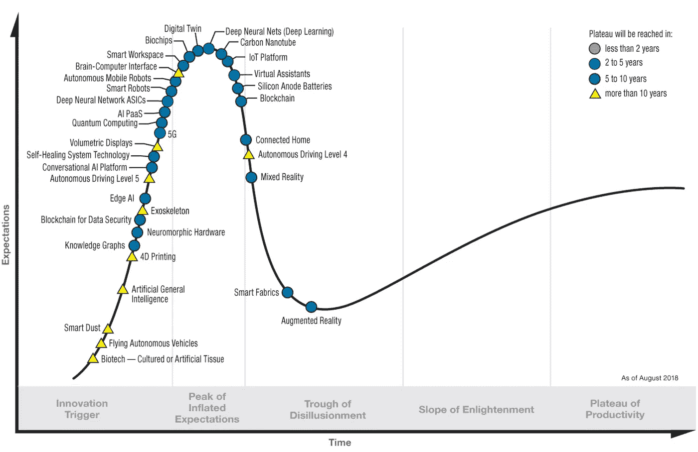
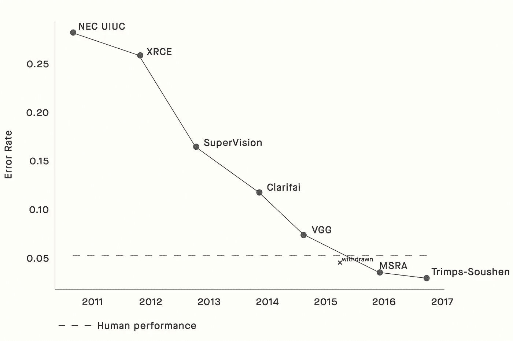
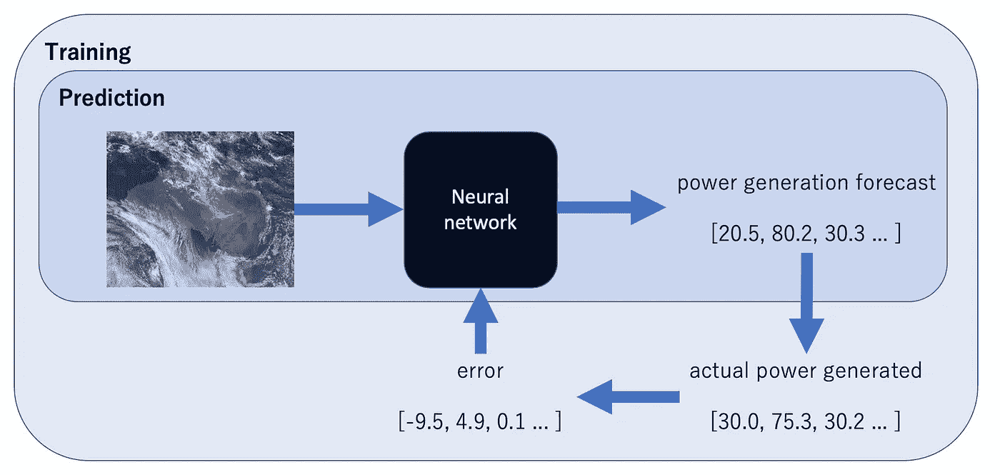
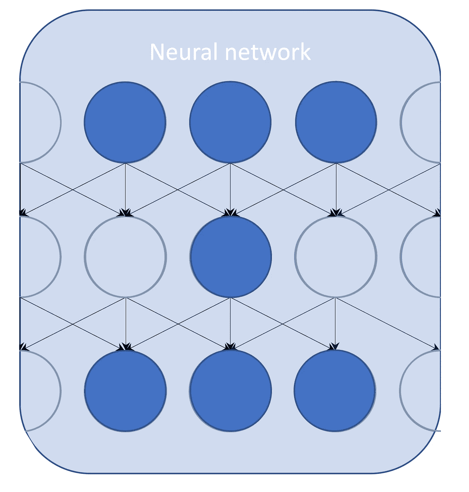
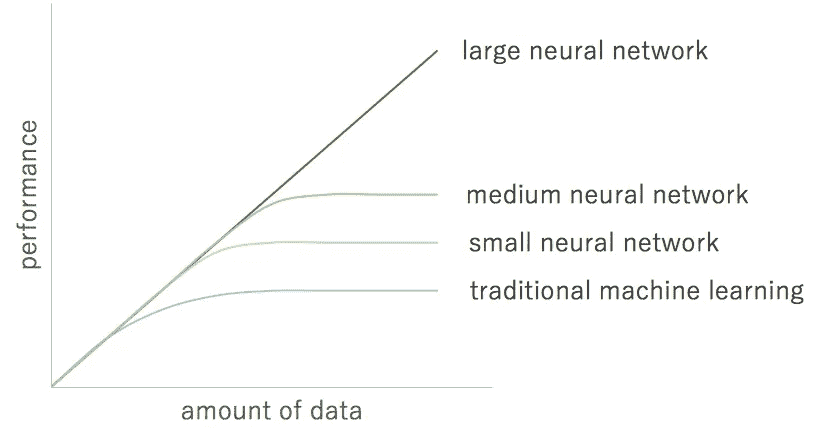
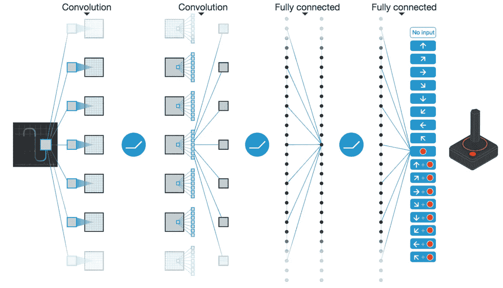
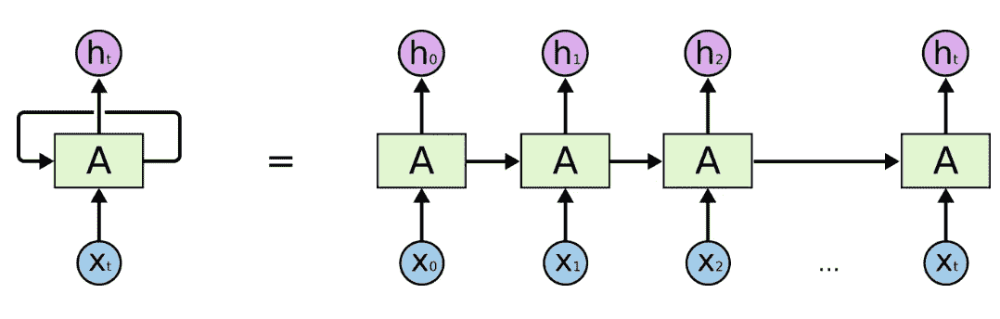
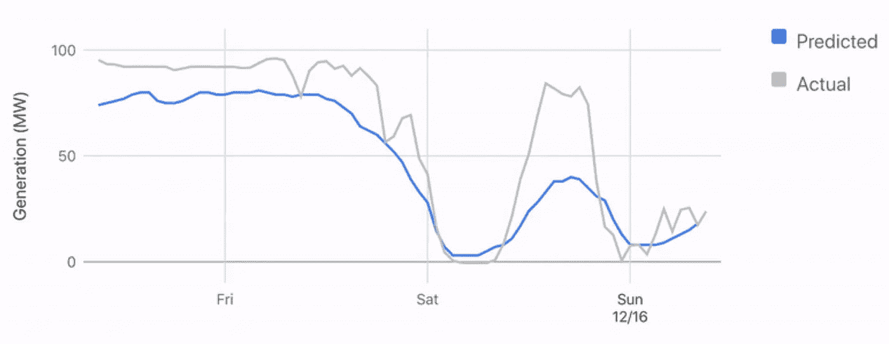
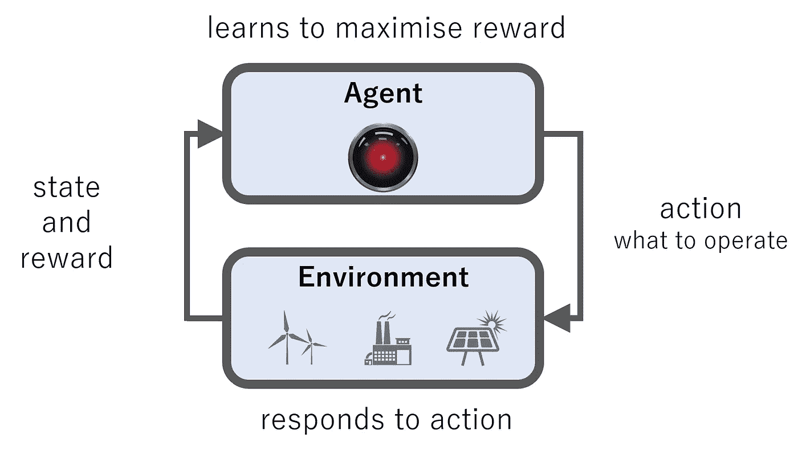
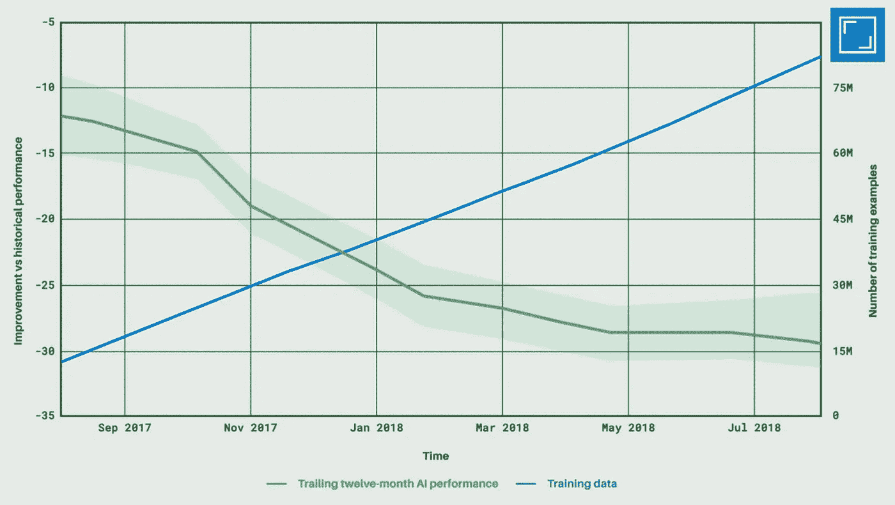

# 能源领域的机器学习

> 原文：<https://towardsdatascience.com/machine-learning-in-energy-c729c1af55c8?source=collection_archive---------14----------------------->

## 能源专家指南

在文章结束时，你将能够回答下列问题:

*   什么是机器学习？
*   为什么机器学习现在这么火？
*   什么是驾驶性能？
*   有哪些挑战？
*   今天的机器学习和能源是怎么回事？
*   能源和机器学习的未来会怎样？

# 词汇表

*人工智能=感知环境并采取行动实现目标的机器。*

*机器学习=人工智能的一个分支，赋予计算机从数据中学习高维模式的能力。*

*深度学习=一系列机器学习模型，使用多层神经网络来逼近函数。*

# 什么是机器学习？

> *下一万家创业公司的商业计划书很容易预测:*取 X 加 AI *—凯文·凯利*
> 
> *机器学习是自科学方法以来，我们在如何做工程方面取得的最大进步——Steve juventson*

炒作已经正式见顶——深度学习正处于膨胀的预期的顶峰。

[*2018 年 Gartner 炒作周期*](https://www.gartner.com/smarterwithgartner/5-trends-emerge-in-gartner-hype-cycle-for-emerging-technologies-2018/)

深度学习是现代机器学习炒作的基础。深度学习使用复杂的多层神经网络从大型数据集学习模式。这是机器学习的初级智能——模式识别。

机器学习已经在一系列困难问题上超越了先前的技术水平。它正在影响每个行业——这种能力源于神经网络从我们使用和学习的原始高维数据(如图像或文本)中学习的能力。

那么我们今天在哪里？目前，机器学习在计算机视觉和语言处理方面形成了突破性表现的核心部分。任务对象识别、图像分类、语音识别和语言翻译的最新技术都是由深度学习驱动的。

谷歌、亚马逊和脸书都拥有世界级的人工智能实验室，他们的大部分业务已经被机器学习所改变。机器学习的潜力在数字化程度较低的行业(如医疗保健、能源或教育)中更具潜力。

# 机器学习对人工智能

到目前为止，机器学习提供了狭义的人工智能(AI)。这些系统的能力通常是超人的，足以证明围绕机器学习的宣传是正确的。典型地，该任务涉及使用高维数据(即图像)的感知。这是机器学习的主要贡献——能够从原始的高维数据中创造商业价值。

这种狭隘的智能与许多人工智能研究人员的目标形成了鲜明对比——通用人工智能，即一台机器可以执行一台机器可以完成的各种任务。虽然几乎可以肯定，机器学习将成为通用人工智能的一部分，但要提供一台可以执行各种任务的智能机器，还需要更多的东西。

机器学习和人工智能不应该互换使用。机器学习只是更广泛的人工智能领域的一个子集。AI 包含多种不同的方法，超出了本文的范围。

机器学习经常与人工智能混淆的一个原因是现代机器学习的表现如何——一些研究人员甚至认为这是我们解决一般智能问题所需的全部。具体需要什么还不清楚，但我们离提供一般情报还有许多突破。狭义的超人类机器智能已经在这里了。

# 机器学习的三个分支

为了学习这些模式，机器学习利用三种不同的学习信号，这将机器学习分成三个分支。

第一个是**监督学习**，机器使用带标签的训练数据来学习如何预测看不见的数据的标签。例子包括时间序列预测、计算机视觉和语言翻译。监督学习是为什么脸书可以分辨出你的照片中是你的哪个朋友，或者为什么谷歌可以翻译你智能手机上照片的文本。

*ImageNet 上计算机视觉的最新进展基准—* [*人工智能的恶意使用:预测、预防和缓解*](https://arxiv.org/pdf/1802.07228.pdf)

第二个是**无监督学习**，机器能够在没有标签监督的情况下生成新数据。示例包括艺术风格转换和生成逼真的人脸。

生成对抗网络(GANs)学习使用两个竞争的神经网络来生成逼真的图像。一个网络生成图像(生成器)，第二个网络必须决定图像是真是假。这种对抗性学习是可以有效的。

*右边的所有图像都是机器生成的—* [*Karras et。al (2019)一种基于风格的生成式对抗网络生成器架构(NVIDIA)*](https://arxiv.org/pdf/1812.04948.pdf)

对抗性学习也可以用在我们机器学习的最后一个分支——**强化学习**。在强化学习中，机器在标量奖励信号的监督下学习选择动作。强化学习适用于各种带有奖励信号的决策问题，如成本或碳排放。

现代强化学习皇冠上的明珠是 2016 年 AlphaGo 战胜 Lee Sedol。围棋是人工智能在棋盘游戏中面临的最后一个巨大挑战——创造一台超人围棋计算机被认为是十年之后的事情。AlphaGo 使用深度神经网络从高维棋盘状态映射到最佳下一步棋。

*李·塞多尔最终以 4 比 1 输给了 AlphaGo —* [*AlphaGo 影片*](https://www.alphagomovie.com/)

AlphaGo 与 1996 年战胜 Garay Kasparov 解决国际象棋问题的计算机“深蓝”形成鲜明对比。深蓝的所有智能都源自一个程序员和国际象棋大师团队，他们手工将棋步输入机器。这与 AlphaGo 使用的监督形成了对比——通过在围棋比赛中玩自己来学习。

deep mind(alpha go 背后的伦敦实验室)随后推出了 AlphaZero，它以 100 比 0 击败了之前的版本。这个版本从不依赖于人类专家行动的数据集，完全从对抗性的自我游戏中学习。

# 为什么机器学习现在这么火？

这三个分支中的每一个都正在经历一个巨大的表现期、研究活动期和宣传期。所有这些改进的基础是深度学习——使用多层神经网络作为复杂函数逼近器。

这些人工神经网络的灵感来自于我们大脑中的生物神经网络。机器使用的人工神经网络要简单得多——但它们正在推动现代机器学习的性能。

神经网络就像任何其他功能一样，它接受一些输入并产生一个输出。将高维数据样本降维是机器学习的基本过程。例子包括从卫星图像预测太阳能发电，或从电网数据调度电池。

神经网络是通用的。如果神经网络只适用于计算机视觉，这仍然是一件大事。然而，神经网络正在向多个方向拓展。神经网络的这种普遍性使它们能够在广泛的问题上达到最先进水平，也使机器学习能够应用于广泛的行业。

神经网络的原子单元是感知器——一个简单的模型，它结合来自其他感知器的输入，通过非线性函数(如 sigmoid 或整流器)挤压它，并将输出发送给子感知器。这方面的数学问题超出了本文的范围——关键的要点是，将这些感知机堆叠到许多层中，可以让神经网络从大量数据中学习复杂的功能。

机器学习不仅仅是深度神经网络——像逻辑回归和随机森林这样的算法适用于许多商业问题。经典机器学习的问题是，它没有从海量数据中受益。因为神经网络的容量可以通过增加深度来增加，所以神经网络能够突破经典机器学习模型的限制。

*深度神经网络能够从海量数据中学习—* [*改编自《AI 是新电》(吴恩达)*](https://www.youtube.com/watch?v=21EiKfQYZXc)

选择图层是为了利用原始数据中的结构。三个常见层完全连接，卷积和递归。

*Deep mind Atari 作品*[*2015*](https://github.com/ADGEfficiency/dsr_rl/blob/master/literature/reinforcement_learning/2015_Minh_Atari_Nature.pdf)中使用的深度卷积神经网络

卷积层受到我们自己的视觉皮层的启发，是现代计算机视觉的动力。它们允许机器看到。它们可以用来对图像内容进行分类，识别人脸并为图像创建标题。

*一个展开的递归神经网络—* [*colah 的博客*](http://colah.github.io/posts/2015-08-Understanding-LSTMs/)

递归层处理输入并生成序列输出，为现代自然语言处理提供动力。递归网络允许机器理解数据中的时间结构，例如句子中的单词。

看到和理解语言的能力不仅能提高性能，还能让机器学习一般化。视觉和语言理解是低级技能，基本上用于人类生活的每个领域。掌握这些低级技能意味着机器可以在一系列行业中发挥作用。能量也不例外。

# 是什么驱动了现代机器学习的性能？

现代深度学习的性能是由两个过程的交互作用驱动的——数据可用性的增加和用大量数据训练大型模型的能力。

互联网和生成原始数据(传感器、图像和文本)的设备的兴起导致了对海量数据集的监管。这些海量数据集是深度神经网络的食物——没有数据，模型就无法学习。

训练大型模型的能力依赖于访问云中专门硬件的能力。在 21 世纪初，研究人员重新利用为视频游戏设计的硬件(图形处理器，或 GPU)来训练神经网络。这导致训练时间大幅加快，这很重要——我们对机器学习的所有理解都是经验性的(通过实验学习)。

第二个硬件趋势是云计算。云提供了在完全可变成本基础上进行计算的途径。亚马逊网络服务等平台允许按需访问大量支持 GPU 的计算能力，同时提供廉价的数据存储。这种对计算能力的获取在大型科技公司内部和小型公司中都有效。它使资产负债表受益于将资本支出(建设数据中心)转变为运营支出。

推动现代机器学习的最后一个趋势是获取算法和工具。几乎所有机器学习的相关文献都可以在 arXiv 这样的网站上免费获得。还可以在 GitHub 上访问机器学习工具的高质量实现。这种开放趋势与能源行业的付费墙和授权软件形成了鲜明的对比。

# 挑战

机器学习面临着广泛的挑战。检查所有这些问题超出了本文的范围——诸如可解释性、工人置换和滥用强大的狭义人工智能等问题是重要的问题，也是许多研究的焦点。将我们今天拥有的强大、狭隘的机器智能扩展为通用的人工智能，还有许多工作要做。相反，我们将专注于使用机器学习解决能源问题的具体挑战。

主要挑战是获取数据。能源行业仍处于数字化过程中——我在能源领域的所有工作都涉及建立基本的数据收集基础设施。我们已经看到了大量数据对机器学习的重要性——缺乏历史数据可能会阻碍许多能源和机器学习项目。

有远见的能源公司知道数据只能收集一次。它不仅仅是一个本地历史学家记录来自现场控制系统的数据。21 世纪能源公司拥有从传感器级数据到会计数据的一切数据，可供全球范围内需要这些数据的员工和机器接近实时地使用。

大型有趣数据集的管理是能源公司可以建立的少数可防御优势之一(另一个是品牌)。这些数据集很有价值，不仅因为我们今天可以如何使用它们，还因为明天可以产生的洞察力。

当考虑将机器学习应用于能源问题时，首先也是最重要的考虑因素是数据集。其实很多机器学习项目的第一步都是一样的——开始收集数据。用于监督机器学习的数据集有两个部分-特征(如图像或原始文本)和目标(您想要预测的内容)。用于强化学习的数据集是一个模拟器——学习算法可以与之交互的东西。

机器学习在能源领域的一些潜在应用包括(但不限于):

*   预测性维护
*   客户细分
*   流失预测和最小化

现在，我们将深入探讨当今机器学习在能源领域的一些应用细节。

# 时间数列预测法

能源的经济和环境影响取决于使用时间。预测一直是能源领域的一项重要实践——可变风能和太阳能的增加使用使得预测更有价值。DeepMind 声称，通过提前 36 小时预测，能源价值提高了 20 %。更好的预测可以增加可再生能源的价值，减少对备用化石燃料的需求。

特别令人兴奋的是使用卫星图像和深度卷积神经网络预测风力或太阳能的能力——参见[杰克·凯利和丹·特拉弗斯在开放气候修复](https://openclimatefix.github.io/)的工作。

# 控制

复杂能源系统的最优控制是困难的。强化学习是一个决策框架，可以应用于许多能源控制问题，奖励信号的可用性，模拟器

更好地控制我们的能源系统将使我们能够降低成本，减少环境影响和提高安全性。

[DeepMind 的数据中心优化是能源和机器学习最著名的例子](https://deepmind.com/blog/safety-first-ai-autonomous-data-centre-cooling-and-industrial-control/)。该算法使用数千个传感器在五分钟的基础上做出决策。这些传感器将数据输入深度神经网络，该网络预测不同的行动组合将如何影响未来的冷却发电效率。

这听起来像是 DQN 的一种形式——一种强化学习算法，可以预测每个可能行为的未来回报。

神经网络在云上执行计算，在本地控制系统进行安全验证之前，将建议的行动发送回数据中心。

*数据中心的性能使用每吨冷却能量输入(kW/tonC)来衡量，并随着数据的增加而提高，在九个月内从最初的 12%提高到 30%。*

# 关键要点

我们刚刚旋风般地介绍了机器学习。关键要点是:

*   机器学习是正在工作的人工智能的子集
*   机器学习有三大分支——监督学习、非监督学习和强化学习
*   深度学习正在推动现代机器学习
*   视觉卷积，序列递归
*   性能由数据、云计算和算法的可用性驱动

更多技术和非技术机器学习资源，请查看 [ml-resources](https://github.com/ADGEfficiency/ml-resources) 。对于强化学习资源，请查看 [rl-resources](https://github.com/ADGEfficiency/rl-resources) 。

感谢阅读！

*原载于 2019 年 4 月 25 日*[*https://adgefficiency.com*](https://adgefficiency.com/machine-learning-in-energy/)*。*