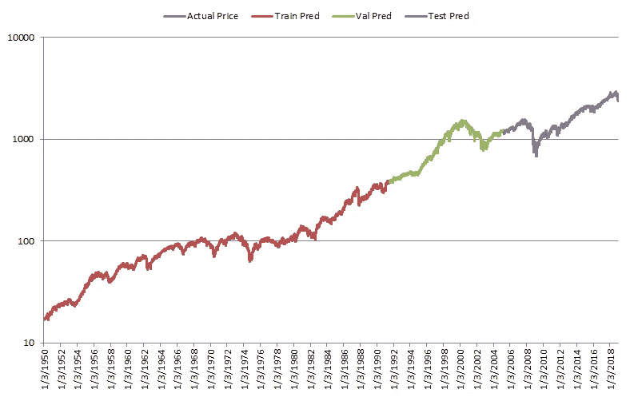

# 金融中的机器学习:为什么你不应该用 LSTM 的来预测股市

> 原文：<https://towardsdatascience.com/machine-learning-in-finance-why-you-should-not-use-lstms-to-predict-the-stock-market-3f7239b9832c?source=collection_archive---------14----------------------->

Photo by [Markus Winkler](https://unsplash.com/@markuswinkler?utm_source=medium&utm_medium=referral) on [Unsplash](https://unsplash.com?utm_source=medium&utm_medium=referral)

最近，机器学习有了很大的发展和兴趣，最有希望的成果是语音和图像识别。本文分析了一种深度学习方法——长短期记忆神经网络(LSTM 神经网络)在以标准普尔 500 为代表的美国股票市场上的应用效果。这篇论文表明，虽然这种技术在语音识别等其他领域可能取得了很好的成功，但在应用于金融数据时却表现不佳。事实上，它们的特点是高信噪比，这使得机器学习模型很难找到模式并预测未来的价格。

这篇研究文章的结构如下。第一部分介绍了 LSTM 和为什么他们可能适用于金融时间序列。第二节分析了 LSTM 应用于标准普尔 500 的性能。第三部分总结。

# 1.什么是 LSTM？

长短期记忆(LSTM)神经网络是一种特殊类型的深度学习模型。特别是，它是一种可以学习数据长期相关性的递归神经网络，因此通常用于时间序列预测。

图 1 显示了 LSTM 层的架构。

Figure 1 Architecture LSTM layer

如图所示，它由一个重复的核心模块组成。这种结构使得 LSTM 能够学习长期依赖性。第一 LSTM 块采用网络的初始状态和序列 X(1)的第一时间步长，并计算第一输出 h(1)和更新的小区状态 c(1)。在时间步长 t，该模块获取网络的当前状态(c(t 1)，h(t 1))和序列 X(t)的下一个时间步长，并计算输出 ht 和更新的单元状态 ct。

Figure 2 Architecture LSTM block

图 2 显示了 LSTM 模块的架构，它由 4 个主要组件组成:

*   **输入门**:控制单元状态更新的级别
*   **遗忘门**:控制电池状态复位的电平
*   **候选单元格**:添加单元格状态信息
*   **输出门**:控制添加到隐藏门的单元状态的级别。

为了学习建模任务的特征并能够预测，需要训练 LSTM。该过程包括通过一些优化算法最小化目标函数(通常为 RMSE)来计算 LSTM 的权重和偏差。一旦模型在初始训练数据集上得到训练，并在验证集上得到验证，它就会在真正的样本外测试中得到测试。这确保了模型确实学习了有用的特征，并且它不会在训练集上过度拟合，对新数据的预测能力较差。下一节分析应用于标准普尔 500 的 LSTM 的性能。

# 2.绩效 LSTM 应用于美国股票市场

使用的数据集由美国股票市场的每日收盘价格组成，以标准普尔 500 为代表，从 1950 年 1 月 3 日到 2019 年 1 月 4 日，共 17，364 次观察。数据分为 60%用于训练，20%用于验证，20%用于测试。

图 3 显示了用于对数级分析的数据。

Figure 3 S&P 500 close prices (log scale)

在我们的分析中，我们训练了由 1 个隐藏层、20 个神经元和 20 个值的时间序列长度组成的 LSTM 神经网络。我们尝试了神经网络参数和架构的不同组合，发现了类似的结果。

图 4 显示了实际价格与训练有素的 LSTM 预测的第二天价格的比较。

Figure 4 LSTM predicted vs actual price for the S&P 500 (log scale)

从图中可以看出，预测值与实际价格非常接近，因此无法正确看到潜在的实际价格。因此，看起来 LSTM 在预测所考虑的时间序列的下一个值方面做得很好。

表 1 报告了预测第二天价格的 LSTM 准确度的性能统计。

Table 1 LSTM prediction accuracy stats

该数据证实了我们从图 4 中看到的情况。RMSE 中的低值和 R2 中的适当值表明，LSTM 可能擅长预测所考虑的时间序列的下一个值。

图 5 显示了从 2018 年 8 月 13 日到 2019 年 1 月 4 日，100 个实际价格与预测价格相比的样本。

Figure 5 LSTM predicted vs S&P 500 price for 100 days

这个数字让我们得出了不同的结论。总的来说，LSTM 似乎可以有效地预测第二天的值，但实际上，第二天的预测值与前一天的实际值非常接近。这可以从图 6 中进一步看出，该图显示实际价格比预测价格滞后 1 天。

Figure 6 LSTM predicted vs 1-day lagged S&P 500 price for 100 days

如图所示，2 系列几乎相同，证实了我们之前的结论。

这些结果表明，LSTM 无法预测股票市场第二天的价值。事实上，该模型能够做出的最佳猜测是一个与当天价格几乎相同的值。

# 3.结论

诚然，新的机器学习算法，尤其是深度学习，在不同领域都相当成功，但它们无法预测美国股市。如前面的分析所示，LSTM 只是使用非常接近前一天收盘价的值作为第二天的预测值。这是一个没有预测能力的模型所期望的。

这也突显出，尽管一些机器学习技术可能在金融领域有用，但[量化对冲基金](https://www.blueskycapitalmanagement.com/?utm_source=quantitativeResearch&utm_medium=pdf&utm_campaign=LSTMSP500)必须另辟蹊径，想出能够为客户带来阿尔法的策略。

如果您想了解我们投资产品的更多信息，请发送电子邮件至[info@blueskycapitalmanagement.com](mailto:info@blueskycapitalmanagement.com)或填写我们的[信息请求](https://www.blueskycapitalmanagement.com/invest/)表格。

*最初发表于* [*蓝天资本*](https://www.blueskycapitalmanagement.com/machine-learning-in-finance-why-you-should-not-use-lstms-to-predict-the-stock-market/) *。*

# 放弃

本文旨在学术和教育目的，而不是投资建议。我们提供的或来自我们网站的信息不应替代投资专业人士的建议。本文讨论的假设模型并不反映测试期间存在的任何实际产品或策略的投资业绩，也不能保证如果存在这种产品或策略，它会表现出类似的业绩特征。投资任何产品或策略的决定不应基于本文包含的信息或结论。这既不是出售要约，也不是购买证券权益的邀约。