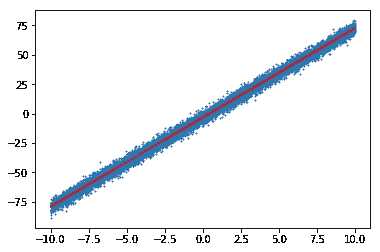
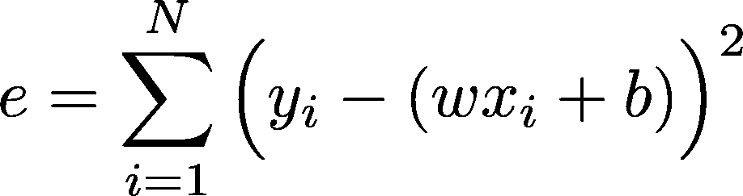

# 三步线性回归

> 原文：<https://towardsdatascience.com/machine-learning-in-python-numpy-part-2-linear-regression-in-3-steps-cad77bd92717?source=collection_archive---------26----------------------->

## 引入梯度下降


Photo by [Charlie Foster](https://unsplash.com/@charliefoster?utm_source=medium&utm_medium=referral) on [Unsplash](https://unsplash.com?utm_source=medium&utm_medium=referral)

# 动机

我们在本系列的第一部分[](/machine-learning-in-python-numpy-neural-network-in-9-steps-eafd0db25906)**中的 ***9 步*** 中演示了如何使用 Python NumPy 构建神经网络，但是对于初学者来说可能太难理解了。在这种情况下，我们将使用 NumPy 库来实现最简单的机器学习模型之一的**线性回归**。最好对微积分和 Python 语法有基本的了解(但不是必须的，因为你可以随时学习)。**

***代码在*[*GitHub*](https://github.com/edenau/ML-in-NumPy/blob/master/linear-regression.ipynb)*上有。最初发布于*[*edenau . github . io*](https://edenau.github.io/)*。***

# **1.初始化**

**第一步。导入 NumPy。说真的。**

# **2.生成数据**

**我们为标量输入`X`及其对应的高斯`noise`生成一万个点，这样对于一些固定的斜率`w_true=7.6`和截距`b_true=-3.3`，我们可以通过下面的线性关系生成`y`。`w_true`和`b_true`的值完全是任意的。**

```
y = w_true * X + b_true + noise
```

**添加零均值高斯噪声使我们的数据更加真实。**

****

**Data points (blue) and linear relationship without noise (red)**

# **3.梯度下降**

**实际上，我们不知道线性函数参数`w`和`b`的值，这就是梯度下降的由来。我们将误差函数`e`定义为某些`(w,b)`的实际`y`和预测`y=wx+b`之间的平方差的和**。****

****

**该误差函数惩罚实际值和预测值`y`之间的不匹配。使用平方差代替绝对差`||.||`，这样我们可以解析地计算 **∂e/∂w** 和 **∂e/∂b** ，这留给读者作为练习。 ***这些渐变分别代表了*** `***w***` ***和*** `***b***` ***增加的方向。*** 因此，如果我们想 ***减少*** 的误差`e`，我们应该通过去导数的 ***负方向*** 来更新参数。这可以表示为**

```
w ← w - learning_rate * ∂e/∂w
b ← b - learning_rate * ∂e/∂b
# The key is the minus signs
```

****

**Photo by [Bernard Hermant](https://unsplash.com/@bernardhermant?utm_source=medium&utm_medium=referral) on [Unsplash](https://unsplash.com?utm_source=medium&utm_medium=referral)**

**如果我们迭代地进行这些更新，直到`(w,b)`收敛，我们将得到一组最佳的参数，可以表示`X`和`y`之间的线性关系。**

# **外卖**

**这是在 ***3 步*** 中使用 NumPy 库的线性回归算法的最小实现。如果你想测试你对线性回归的理解，以下是你可能想尝试的事情:**

*   **使用其他库实现线性回归(在 [GitHub](https://github.com/edenau/ML-in-NumPy/blob/master/linear-regression.ipynb) 和*上)***
*   **训练测试数据集拆分**
*   **多输入特征**
*   **非高斯分布噪声**
*   **不同的误差函数**

****

**Photo by [Ameen Fahmy](https://unsplash.com/@ameenfahmy_?utm_source=medium&utm_medium=referral) on [Unsplash](https://unsplash.com?utm_source=medium&utm_medium=referral)**

**代码可在 [Github](https://github.com/edenau/ML-in-NumPy/blob/master/neural-net.ipynb) 上获得。编码快乐！**

## **相关文章**

**感谢您的阅读！如果您对机器学习或 Python 感兴趣，请查看以下文章:**

**[](/5-python-features-i-wish-i-had-known-earlier-bc16e4a13bf4) [## 我希望我能早点知道的 5 个 Python 特性

### 超越 lambda、map 和 filter 的 Python 技巧

towardsdatascience.com](/5-python-features-i-wish-i-had-known-earlier-bc16e4a13bf4) [](/visualizing-bike-mobility-in-london-using-interactive-maps-for-absolute-beginners-3b9f55ccb59) [## 使用交互式地图和动画可视化伦敦的自行车移动性

### 探索 Python 中的数据可视化工具

towardsdatascience.com](/visualizing-bike-mobility-in-london-using-interactive-maps-for-absolute-beginners-3b9f55ccb59) [](/machine-learning-in-python-numpy-neural-network-in-9-steps-eafd0db25906) [## Python NumPy 中的机器学习(第 1 部分):9 步神经网络

### 通过编码理解神经网络

towardsdatascience.com](/machine-learning-in-python-numpy-neural-network-in-9-steps-eafd0db25906) 

*最初发表于*[*edenau . github . io*](https://edenau.github.io/)*。***