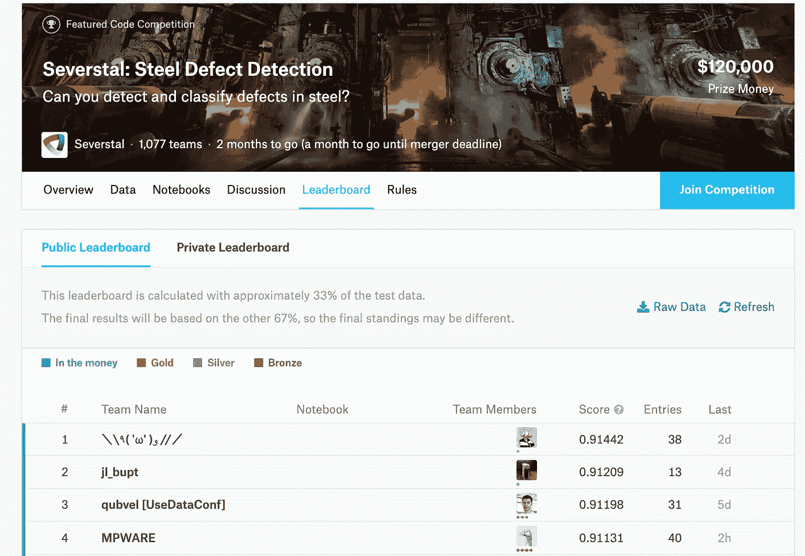

# 现实生活中的机器学习

> 原文：<https://towardsdatascience.com/machine-learning-in-real-life-eebcb08f099c?source=collection_archive---------13----------------------->

## 为现实世界的商业案例开发一个模型到底是什么样的

Photo by [Ben White](https://unsplash.com/@benwhitephotography?utm_source=unsplash&utm_medium=referral&utm_content=creditCopyText) on [Unsplash](https://unsplash.com/search/photos/world?utm_source=unsplash&utm_medium=referral&utm_content=creditCopyText)

你曾经参加过纸牌游戏比赛吗？如果你正在学习，或者已经学习了机器学习，很有可能在某个时候你会进入其中。这绝对是将你的建模技能付诸实践的好方法，我在学习的时候花了相当多的时间在 Kaggle 上。

如果你以前参加过机器学习竞赛，那么你的工作流程可能看起来有点像我的工作流程:

1.  下载一些数据(可能是一个或几个 CSV 文件)。
2.  或许做一点清理，或者数据集可能已经足够干净了。
3.  执行一些预处理，例如将分类数据转换为数字数据。
4.  通过各种合适的模型运行数据，直到找到最佳模型。
5.  花很长时间在超参数调整、特征工程和模型选择上，因为一个很小的改进可能意味着你在排行榜上上升几个名次。
6.  结束了

然而，如果你正在为一个真实世界的商业应用开发一个机器学习模型，这个过程看起来会非常不同。我第一次在业务场景中部署模型时，这些差异非常令人惊讶，特别是在工作流的某些阶段花费了多少时间。在下面的帖子中，我想描述在商业环境中开发模型的过程，详细讨论这些差异，并解释它们存在的原因。

在商业案例中，工作流将有更多的步骤，可能看起来有点像这样。

1.  将业务问题转化为数据问题。
2.  考虑机器学习模型如何连接到现有的技术栈。
3.  花费大量时间提取、转换和清理数据。
4.  花大量时间进行探索性分析、预处理和特征提取。
5.  建立模型。
6.  选择能够以最少的工程工作量集成到现有技术体系中的最佳模型。
7.  考虑到商业价值，优化模型，直到它“足够好”。
8.  部署模型。
9.  在生产中监控模型。
10.  必要时再培训。
11.  构建版本 2。
12.  继续，直到模型不再有商业用途。

在这篇文章的剩余部分，我将会更详细地介绍每一个步骤。

## 你需要把一个商业问题转化成一个数据问题

在 Kaggle 竞赛中，要解决的问题将在前面明确定义。例如，在一个名为“ [Severstal:钢缺陷检测](https://www.kaggle.com/c/severstal-steel-defect-detection/overview)的最新比赛中，你得到了一些经过策划的数据，问题以数据问题的形式清楚地陈述出来。

> 如今，谢韦尔钢铁公司使用来自高频摄像机的图像来驱动缺陷检测算法。在这场比赛中，你将通过定位和分类钢板表面缺陷来帮助工程师改进算法。

在真实的业务问题中，不太可能要求您构建特定类型的模型。更有可能是团队或产品经理带着业务问题来找你。这可能看起来像这样，有时问题甚至可能没有被很好地定义。

> 客户服务团队希望减少企业回复客户电子邮件、实时聊天和电话的时间，以便为客户创造更好的体验并提高客户满意度。

根据这个业务请求，在开始构建实际的模型之前，您需要与团队一起规划和设计这个问题的最佳解决方案。

## 数据不会是干净的

您处理的数据几乎肯定不是干净的。通常会有丢失的值需要处理。日期格式可能不正确。值中可能有错别字、不正确的数据和异常值。在实际构建模型之前，可能会花费大量时间来删除错误数据、异常值和处理缺失值。

## 你可能不得不从不同的来源获取数据

同样，您需要的所有数据可能都不是来自一个简单的来源。对于数据科学项目，您可能需要从以下任意组合中获取数据:SQL 查询(有时跨多个数据库)、第三方系统、web 抓取、API 或来自合作伙伴的数据。与数据清理类似，这部分通常是项目中非常耗时的部分。

## 特征选择非常重要

一般来说，在机器学习比赛中，你有一个给定的数据集，其中包含有限数量的变量，可以在你的模型中使用。特征选择和工程仍然是必要的，但是首先你可以选择的变量数量有限。在处理现实世界的问题时，你很可能会接触到大量的变量。作为一名数据科学家，您必须选择可能会产生解决问题的好模型的数据点。因此，您需要结合使用探索性数据分析、直觉和领域知识来选择构建模型所需的正确数据。

## 建立模型是这个过程中最小的部分

花了这么多时间来选择、提取和清理数据，相比之下，你实际花在构建模型上的时间将会非常少。特别是对于模型的版本 1，您可能想要使用模型作为基线测试，那么您可能在第一个实例中只花费少量的时间在模型选择和调整上。一旦商业价值被证明，你就可以投入更多的时间来优化模型。

## 您将花费比您想象的更少的时间来调整模型

在 Kaggle 比赛中，花费数周时间来调整模型以获得模型分数的微小提高并不罕见。因为这个小小的改进可能会让你在排行榜上上升不少。例如，在当前的 Severstal 比赛中，排行榜上位置 1 和位置 2 之间的分数差目前仅为 0.002。花时间稍微提高你的分数肯定是值得的，因为这可能会让你获得最高奖项。

[Kaggle.com](https://www.kaggle.com/c/severstal-steel-defect-detection/leaderboard)

在商业中，你花在调整模型上的时间是一种成本。公司必须根据你完成这项任务的天数或周数支付你的工资。与任何事情一样，这种投资需要有商业价值形式的回报。一个模型的业务用例不太可能提供足够的价值来证明花费几天来提高一个 0.002 增量的模型的准确性是合理的。实际上，您将调整模型，直到它“足够好”而不是“最好”。

## 你不一定要用最好的模型

这让我想到了我的下一个观点，即你不会总是使用最好的模型或最新的深度学习方法。通常情况下，您将能够通过更简单的模型(如线性回归)交付更多的业务价值。这需要更少的时间(因此构建成本更低)并且更容易解释。

您的模型必须连接到某种端点，比如网站。此端点的现有技术体系将对您将部署的模型类型有很大影响。数据科学家和软件工程师经常会在最小化两端的工程工作上达成妥协。如果您有一个新模型，这将意味着对现有部署流程或大量工程工作的更改，那么您必须有一个非常好的业务案例来部署它。

## 工作不止于此

一旦投入生产，就需要对模型进行监控，以确保它像在培训和验证期间一样运行良好，并检查模型是否退化。由于多种原因，模型的性能通常会随着时间的推移而降低。这是因为数据会随着时间的推移而变化，例如客户行为的变化，因此您的模型可能会在新数据上表现不佳。出于这个原因，模型也需要定期重新培训，以保持业务绩效。

此外，大多数企业将有一个部署机器学习模型的测试和学习周期。因此，您的第一个模型通常是版本 1，以形成性能基线。之后，您将对模型进行改进，可能会更改特性或调整模型，以部署更好的版本并根据原始模型进行测试。

这两个过程可能会一直持续下去，直到该模型的业务案例不再存在。

## 结论

这篇文章的部分灵感来自 Chip Huyen 的这条推文。

机器学习角色很难招聘的部分原因是，我在这里讨论的许多在商业中部署机器学习的现实并没有在这些课程中教授。这就是为什么我如此热衷于实践优先的学习方法，也是为什么我认为工业实习、实习和初级数据科学角色如此重要。

然而，随着该领域技术的快速发展，隧道尽头有了光明，这有助于数据清理和模型部署等流程的自动化。然而，我们仍有一段路要走，因此，对于数据科学家来说，除了典型的数据科学家技能组合之外，开发软件工程技能、提高沟通技能以及拥有弹性和坚持不懈的心态仍然至关重要。

感谢阅读！