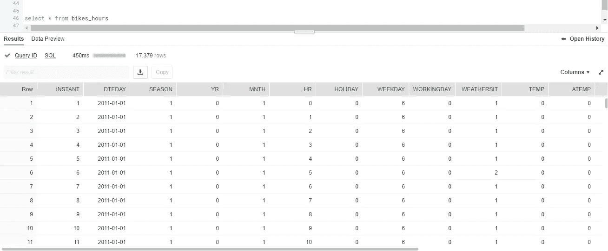
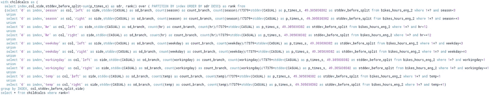

# 雪花中的机器学习

> 原文：<https://towardsdatascience.com/machine-learning-in-snowflake-fdcff3bdc1a7?source=collection_archive---------6----------------------->

更新:截止 2021 年年中，这篇文章现在已经 2.5 岁左右了！在这段时间里，Snowflake 有了很大的发展，包括推出了 [Snowpark](https://docs.snowflake.com/en/developer-guide/snowpark/index.html) ，这是将繁重的定制处理移入其引擎的最佳方式。
所以，如果你是从搜索引擎登陆到这里的，那是因为历史受欢迎程度比内容的有用性更高😁
如果你对一个有趣的实验感兴趣，这个实验采用基于集合的方法来研究最大似然算法，请继续读下去，希望你会喜欢这篇文章。
但是如果你正在寻找在生产中在雪花引擎中实际运行机器学习训练算法的最佳方式，有许多官方雪花合作伙伴已经修改了他们的产品，通过 Snowpark 推动处理。

如果你在雪花做机器学习，你需要有一个计划来操作它！自这篇文章以来，另一件事发生了变化，那就是我已经启动了一个名为 [Omnata](http://omnata.com/) 的初创公司，它允许你 1)将你的 CRM 直接连接到 Snowflake 以获取实时的上下文数据，以及 2)将数据从 Snowflake 推送至你的 SaaS 应用。一定要来看看我们！

[雪花](https://www.snowflake.com/)目前正在全球掀起波澜，因为它是为云从零开始构建的令人兴奋的新数据仓库。

它已经拥有数量惊人的传统统计类型的[聚合](https://docs.snowflake.net/manuals/sql-reference/functions-aggregation.html)和[分析](https://docs.snowflake.net/manuals/sql-reference/functions-analytic.html)函数，但是[即将发布的](https://docs.snowflake.net/manuals/LIMITEDACCESS/stored-procedures-usage.html)Javascript 存储过程允许您将其高效、灵活的分布式计算引擎用于 SQL 方言之外的更一般的任务。

我认为 ML 工作负载将是路测该特性的一个很好的方式，事实证明它真的很擅长！


# 我们应该吗？

数据库引擎是训练模型的好地方吗？

在数据库内处理和属于外部世界的计算之间有一条不断变化的界线。

随着 20 世纪 90 年代“数据挖掘”一词的流行，DBMS 供应商在其 SQL 方言中增加了统计建模功能，例如 IBM 推出了“[智能挖掘器](https://www.ibm.com/support/knowledgecenter/en/SSEPGG_10.5.0/com.ibm.im.model.doc/c_modeling_training.html)”，Oracle 推出了“ [Oracle 数据挖掘](https://www.oracle.com/technetwork/database/options/advanced-analytics/odm/overview/index.html)”。

然后按照。随着 com 的繁荣，数据集增长到我们开始称之为“大”的程度，Hadoop 作为一种扩展处理的方式越来越受欢迎，随后是 Spark。数据挖掘工作负载已经转移到传统数据库管理系统之外。

但是就在许多人宣称 SQL 已死的时候，2010 年 Hive 发布了，突然间这些大量的数据又被称为数据仓库。快进到 2019 年，现在所有主要的云供应商都在其对象存储中的结构化和半结构化数据上提供了某种形式的 SQL 接口。

2018 年年中，谷歌宣布了 [BigQueryML](https://cloud.google.com/bigquery/docs/bigqueryml-intro) 的测试版，现在我们又回来使用 SQL 作为机器学习的抽象，尽管是在更大的数据集上，处理能力更强(也更有弹性)。截至 2019 年 2 月，BigQueryML 仍处于测试阶段，它目前相当基础，仅限于线性回归和逻辑回归。

只要算法能够适当地伸缩，就有很多很好的理由将您的数据仓库引擎用于 ML:

*   简单性—无需管理另一个计算平台、在系统间集成以及提取/分析/加载数据
*   安全性—数据保存在安全的地方，无需在外部系统中配置雪花凭据，也无需担心数据拷贝的最终位置
*   性能——一个好的数据仓库引擎将维护大量用于优化查询的元数据，这些元数据可以在 ML 过程中重用，从而使其比通用计算平台更具优势

# 在雪花中

因此，让我们看看我们是否可以仅使用雪花引擎来实现一个适度、最小但合法的机器学习算法。

决策树可用于通过将数据集分解成越来越小的子集来构建回归或分类模型，这些子集被组织成一棵树。

为了最大限度地减少我需要实现的逻辑量，我将使用 ID3 算法进行一个[回归树](https://www.saedsayad.com/decision_tree_reg.htm)练习，主要是为了在构建树时可以重用 Snowflake 现有的标准差函数。

雪花并不像 Spark 那样是一个通用的集群计算框架，但是它非常擅长并行分析查询。

出于这个原因，也因为 javascript 是单线程的，我的目标是将尽可能多的计算交给查询引擎，让存储过程执行更多的协调任务。

# 场景

我选择了华盛顿特区的[自行车共享](https://www.kaggle.com/marklvl/bike-sharing-dataset)数据集，使用每小时一次的频率。

我们可以把它存储在一个像这样的表中:

```
create table bikes_hours(instant numeric, dteday date, season numeric, yr numeric, mnth numeric, hr numeric, holiday numeric, weekday numeric, workingday numeric, weathersit numeric, temp numeric, atemp numeric, hum numeric, windspeed numeric, casual numeric, registered numeric, cnt numeric)
```

并使用 SnowSql 命令行工具上传 csv 文件。



Here’s the example data set in a Snowflake table

# 培养

首先，我们将创建一个表来存储我们的训练跑步和完成的模型，这只是在我们证明概念时的一些简单的事情:

```
create or replace sequence ml_model_runs_sequence start = 1 increment = 1;create or replace table ml_model_runs(run_id integer,
                                      table_name varchar(256),
                                      algorithm varchar(100),
                                      training_parameters variant,
                                      start_time timestamp, 
                                      end_time timestamp,
                                      model_object variant);
```

现在在 javascript 存储过程中实现 ID3 决策树算法。数学上，它看起来像这样:


我们在每个分支点应用该公式，以便选择下一个要拆分属性。

我不是一个沉迷于复杂性的人，这只是一种正式的说法，即我们将根据最好地“分组”其子代中的值(即具有最相似的值)的属性进行拆分。为此，我们将比较父母和子女之间的标准偏差(一个群体的成员与平均值的差异程度)。

我们的存储过程将接受四个参数:一个表名、一个目标变量(包含我们要预测的值的列的名称)、在树中用作属性的列的名称以及训练参数。

从树的顶部(根节点)开始，我们将在每个分支点运行两个查询。

第一个查询给了我们:

1)从该节点向下的所有目标值的标准偏差，因为我们将挑选减少该值最多的分支
2)从该节点向下的所有目标值的平均值，因为当我们到达叶子时，最终平均值被用作预测值
3)变异系数，当它变得太小时可以用于停止构建
4)从该节点向下的目标值的数量， 当它变得太小时，可用于停止构建
5)对于下面的每个潜在分支(来自剩余列的列表)，中值。 如果选择了该属性，这将用于拆分数据。

在树的顶部，它看起来像这样:


但是随着树变得越来越宽，它开始看起来像这样:


heavily abbreviated

第二个查询有两个部分:

*   一个子查询，用于测量每个子分支下目标的标准偏差(每个子分支乘以其相对于整体的大小)
*   计算标准偏差减少的封闭查询，从最高到最低排序，以便我们可以轻松选择最大值

这两个查询都使用 WHERE 子句向下筛选到它们在树中的位置。

复杂的地方在于，我们不仅将分支选择卸载给雪花，还要求它使用 UNION 语句计算当前深度的每个分支。这使我们不必遍历整个树。

在树的顶部，有一个要计算的树分割和 5 个要评估的可能属性，查询如下所示:



在底部，当它评估每个分支的每个可能的分割时，它看起来像这样:


even more heavily abbreviated

在可用属性的总数(9)中，使用配置参数，我将它限制为一次评估其中的 5 个。

在第一次拆分时，第二个查询的查询计划如下所示(拆分每列所依据的值由第一个查询提供):


当您深入到一定深度时，查询计划开始看起来像这样:


内联发布所有这些的完整代码有点长，这里有一个[链接](https://github.com/jamesweakley/snowflake-ml/blob/master/decision_tree_train.sql)。

在运行之前，我们将选择变量。这不是一个如何进行数据科学的练习，所以我将只挑选一些看起来有用的。

首先，让我们向数据集添加一个分数列:

```
alter table bikes_hours add column score numeric
```

然后，使用雪花的样本函数，将源表拆分为 training (90%):

```
create temporary table bikes_hours_training as
select * from bikes_hours sample (90)
```

…剩下的 10%用于测试(10%):

```
create temporary table bikes_hours_testing as
select * from bikes_hours where instant not in (select instant from bikes_hours_training)
```

现在我们调用 decision_tree_train proc 来预测‘休闲’列(每小时休闲乘客的数量),使用其中的 9 列。

```
call decision_tree_train('bikes_hours_training', 'CASUAL', 'season,hr,weekday,workingday,temp,atemp,weathersit,hum,holiday');
```

ml_model_runs 表中的结果模型如下所示:


下面是模型对象的一个片段:


# 得分

为了生成对数据库记录的预测，我们需要一种方法来使用列中的值向下导航树。

最初我认为一个用户定义的表函数(UDTF)将会是完美的(代码[这里](https://github.com/jamesweakley/snowflake-ml/blob/master/decision_tree_score_table_function.sql)，因为它应该利用你从雪花引擎得到的并行性。我构建了一个深入模型(作为一个 javascript 对象)直到到达叶子的模型。实际上，UDF 时间限制(大约一分钟？)似乎堆积在桌子上，我经常撞到它。

然后我发现决策树可以很容易地转换成庞大的 CASE 语句，并作为普通的 SQL 运行。所以我编写了一个存储过程(代码[，这里是](https://github.com/jamesweakley/snowflake-ml/blob/master/decision_tree_score_proc.sql))来生成 case 语句，并对选择的表执行更新查询，将预测值放入其中一列。

所以我们运行它，传入决策树 json 对象和要放入分数的列的名称:

```
call decision_tree_score('bikes_hours_testing',(select model_object from ml_model_runs where run_id=1),'SCORE');
```

# 评价

评估模型的常用方法是[均方根误差](https://en.wikipedia.org/wiki/Root-mean-square_deviation)。我们可以在雪花中这样做:

```
select sqrt(sum(square(casual-score))/count(*) ) from bikes_hours_testing
```

结果是 25.49340847

考虑到值的范围从 0 到 367，这还不算太尴尬。

# 表演

## 培养

Snowflake 的一大优点是查询性能反馈内置在产品中。因此，在运行我的训练程序后，我只需切换到历史选项卡来查看个人资料。

我使用了 9 个属性，但是将培训限制为:

*   一次最多比较 5 个属性
*   变异系数下限为 10

这就产生了一棵有 33 片叶子的二叉树。

总的来说，在一个中型集群上训练需要 128 秒。

在根节点处，第一次查询(每个深度处每个节点的摘要)耗时约 200ms，在最终深度 10 处逐渐增加到 10 秒。

第二个查询(评估每个深度的每个节点的分支分裂候选)从 1.3 秒开始，在深度为 7 时逐渐增加到 23.8 秒，然后在最终深度为 10 时缩回到 14.8 秒(这是因为分支终止，所以树不会一直向下散开)。

## 得分

当然，得分几乎是瞬间的。将 CASE 语句传递给 Snowflake 查询引擎(即使是这么大的引擎)是一个很好的优化。

# 结论

这是一个有趣的练习，也是测试新存储过程特性的好方法。但最重要的是，它有效！

在这个实验的开始，我不确定它是否会表现得很好，但是到最后，我对结果感到非常兴奋。

# 接下来呢？

对这个基本实现有许多改进，包括不同的分裂方法(gini，entropy)以及对分类值的更好支持(而不仅仅是在中间值上分裂)。

但更重要的是，决策树构建形成了结构化数据最流行的 ML 算法(random forests，XGBoost)的基础，因此这种方法没有理由不能进一步扩展。

可能让数据科学家完全在雪花内部赢得 Kaggle 竞赛的其他难题是:

## 特征工程

雪花在这里也应该出类拔萃。用现有的函数库构建像 hot encoding 这样的函数应该很简单，并且已经支持值的分桶。

## 抽样

对于像构建随机森林这样的任务，数据集的随机采样变得非常重要。雪花似乎有很大的灵活性与内置的采样方法-另一个优点。