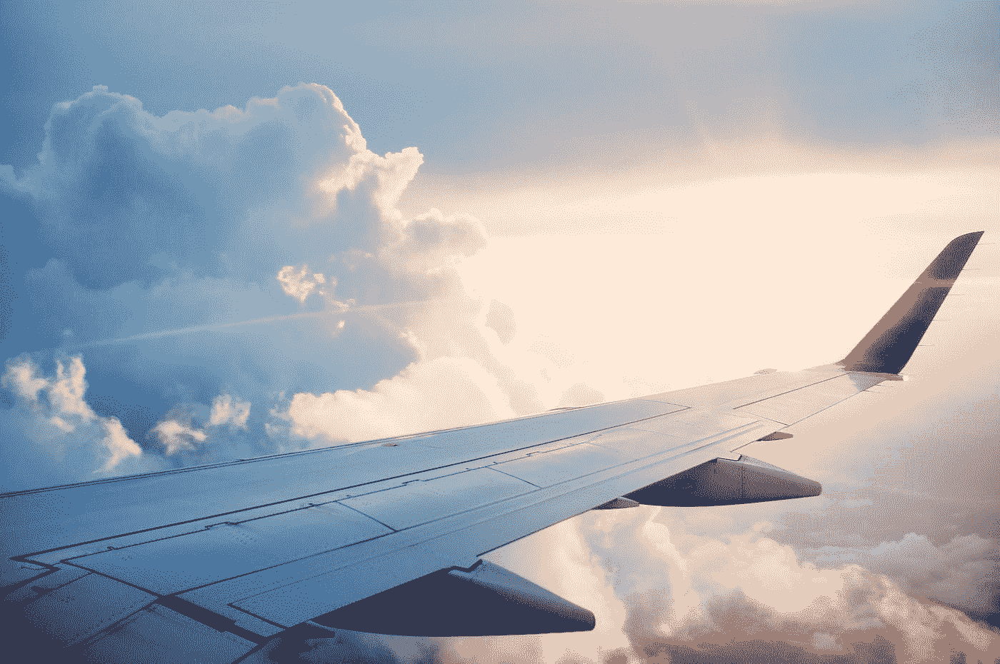
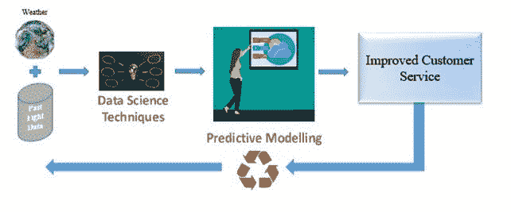
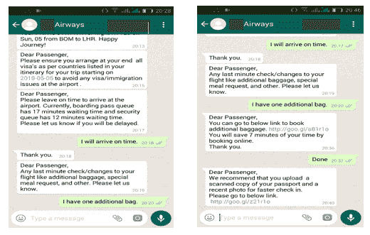

# 航空业的机器学习:下一步

> 原文：<https://towardsdatascience.com/machine-learning-in-the-airline-industry-the-next-step-f6e64080abf2?source=collection_archive---------12----------------------->

Photo by [Ross Parmly](https://unsplash.com/@rparmly?utm_source=medium&utm_medium=referral) on [Unsplash](https://unsplash.com?utm_source=medium&utm_medium=referral)

## 这篇文章谈到了航空公司利用人工智能提高利润的机会

“必要性是创新之母”这句话可以很好地描述航空业的重大变化。在过去的 20 年里，航空公司的运营为世界提供了无数创新的想法，这些想法可以应用于大多数面向消费者的行业。其中一些想法包括动态定价、收入管理系统、优化成本的运营计划。像动态定价这样的概念在 10 到 15 年前是不可想象的。它引入了不同的顾客为同一产品支付不同的价格，而同时所有顾客都能获利的理念。

这种创新背后的必要性是，航空公司是整个旅行和旅游链中最令人苦恼的行业之一。这个行业的参与者的利润率非常低。因此，对他们来说，制定策略来赚取最大利润，同时帮助他们赢得价格战变得非常重要。

根据麦肯锡的一份报告，特别是旅游公司和航空公司，如果他们有强大的数据战略，获得客户的可能性增加 23 倍，保持客户的可能性增加 6 倍，盈利的可能性增加 19 倍。

在这篇文章中，我将讨论一些这样的策略，它们可以利用航空公司收集的大量数据来提高他们的底线。

> 中断和恢复

航空公司拥有大量关于航班延误的历史数据，可以很容易地从各种其他门户网站获取天气数据。结合这两组数据源可以帮助公司更好地计划即将到来的延误(如果有的话)，即飞行中的出发或到达。

得益于此类信息的一个例子是，爱尔兰西部的风暴预计将在一两天内穿过英国，根据其强度，可能会扰乱世界上最繁忙的机场之一伦敦希思罗机场的航班时刻表。航空公司可以提前一两天通知乘客由于风暴即将到来的延误，以便乘客可以根据他们的旅行目的做出必要的安排。主管可能会提前重新安排会议，从而避免失去商业机会，或者游客可能会推迟预订目的地的酒店。结果是顾客非常满意，并因此获得了回头客。

以上是使用天气数据做好准备以防中断的一个例子。这也可以通过结合其他数据源来实现，如旅行目的地的动荡、旅行日期和时间。从而提供增强的客户体验。

Image by Author

> 重新安排机会

一项研究表明，获得一个新客户的成本是留住一个客户的成本的 7 倍。此外，该行业面临巨大的竞争，每个玩家都在惨淡的利润率上生存。因此，对于航空公司来说，在价格是大多数客户转换服务提供商的最重要参数的市场中，减少客户流失是非常重要的。

目前，对于提前预订航班以节省一些额外费用的客户来说，取消或重新安排航班的费用相当高。提前 30 天预订其航班的用户比预订接近出发日期的用户更有可能在接近旅行日期时重新安排航班。大多数提前预订的用户都希望通过提前预订来利用低成本优势。目前，改期的价格几乎等于用户最初购买机票的价格(参考文献 1)。下图就是一个这样的例子)。这阻碍了用户在行程有任何变化的情况下重新安排航班。

相反，航空公司可以保持较低的重新安排费用，从而抓住机会并在客户服务上获得高分。其工作方式是，重新安排费用而不是一个固定的数额应该是可变的，并与空缺席位被另一个客户填补的概率成比例。这可以通过使用诸如目的地的消费者需求、航班过去的预订趋势、航班中的空位数量、航班的始发地、目的地城市即将发生的事件等参数来容易地预测。

空位被另一个乘客占据的高概率会导致相同的座位被高价卖给新的乘客，因为航班需求高且更接近旅行日期。现有乘客为另一个航班的新座位支付少量费用，因为它更接近旅行日期。该航空公司从这两个客户那里获得收入。在一个票价占运营收入 75%的行业中，额外门票的销售对总收入贡献巨大。此外，它为航空公司和客户带来了双赢的局面。

> 无障碍程序

客户在机场办理登机手续和退房手续所花费的时间增加了旅行时间，有时可能会超过旅行时间。航空公司可以通过提供平稳过渡和减少在始发地和目的地机场的等待时间来大幅改善客户体验。

例如，使用面部识别的人工智能技术可以通过比较护照上的照片和客户的实际图像来帮助简化登记过程。该数据还可以与托运行李相关联，从而使在目的地机场领取行李变得更加简单。这也消除了顾客在结账时拿错行李的可能性。如果行李中有任何违禁物品，它还可以通过将行李映射到客户来提高机场的安全性。

由于便利是当今世界的王道，由人工智能(AI)驱动的智能礼宾服务已成为增强客户体验的必要条件。目前，只有当传单到达航空公司柜台时，才是追踪该传单登机的时候。在智能系统的帮助下，航空公司甚至可以在乘客到达机场登机之前就成为乘客旅程的一部分。传单可以在登机牌领取柜台或安检柜台收到关于排队的动态更新。如果愿意，客户还可以在最后一刻检查并更改航班。其中的一部分可能是-

托运和购买额外行李限额

在飞机上点一份特别餐

如果到达机场有延误，通知航空公司

正在检查登机门号码

Image by Author

> 根据个人选择量身定制

对于一家航空公司来说，顾客之旅不应该随着旅客到达目的地而结束。旅行结束后还会继续。根据一项研究，90%的旅行者在一个或另一个社交媒体平台上发布他们的旅行经历。这为航空公司提供了一个分析其品牌忠诚度的好机会。从社交媒体平台收集的数据的情感分析可以帮助航空公司改善他们的整体客户体验。

更进一步，对客户体验的实时分析有助于航空公司即时改进服务。例如，如果客户对其第一段旅程的整体旅行体验不满意，可以通过为其下一次转机航班提供免费的商务舱升级来获得补偿。这种补充将需要实时收集数据，并向传单提供定制的包。

同样，实时行李跟踪服务也很有帮助，可以让乘客知道他们的行李是否放错了地方或延误了。这些数据策略将对航空公司建立客户忠诚度和提高整体品牌价值大有帮助。