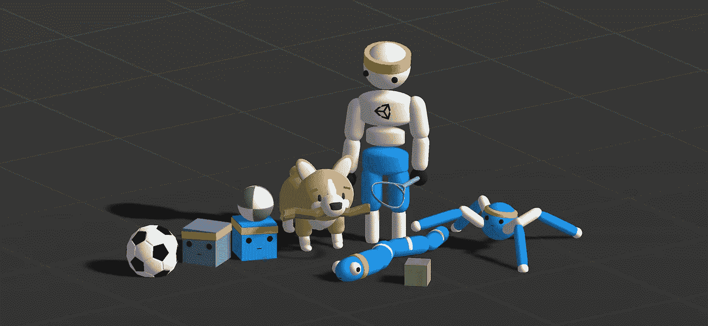
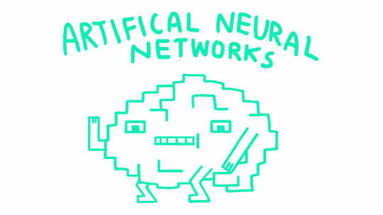

# Unity 中的机器学习

> 原文：<https://towardsdatascience.com/machine-learning-in-unity-b87318a2fd16?source=collection_archive---------20----------------------->

你对强化学习或机器学习感兴趣，并对构建定制环境感兴趣？然后，我认为 Unity 的 ML-Agents 框架是适合你的工具。在过去的一年里，它已经成为一个相当稳定和广泛的实验平台。

机器学习很好玩！

Machine Learning is fun!

# Unity3D 是什么？

Unity 是一个游戏引擎，试图将 3D 和 2D 游戏开发民主化。这是一个非常强大的工具，它允许你为许多平台(从 PC 到移动到控制台)创建具有尖端图形的复杂游戏。在过去的几年里，引擎的能力不断增长，增长到了难以跟踪的程度。但是现在，你不用担心这个。当使用 ML-Agents 时，我们可以忽略许多这些特性而不会感觉不好。

由于开发定制引擎是一项非常昂贵的工作，难怪许多游戏工作室都在使用 Unity 开发他们的游戏，如 Cuphead、Gwent、Monument Valley 和[等等](https://unity.com/madewith)。

# 为什么要把 Unity 和机器学习结合起来？

在我看来，Unity 在机器学习上投入巨资是一个非常明智的想法。作为一个游戏引擎，它已经提供了你构建环境所需的所有工具。此外，游戏中的人工智能大多使用寻路和决策树等技术，这些技术无法像机器学习那样动态适应玩家的行为。Unity 正在设想一个 NPC 不再被严格硬编码的未来。

想看视频吗？看看这个:

# 从哪里开始？

如果你认为:“好吧，你得到了我。这听起来很有趣，但我该从哪里开始呢？”。这是我们现在要解决的问题。如前所述，统一是一种野兽，它可以在一开始非常势不可挡。在进入机器学习之前，我建议先学习基础知识。这方面有很多不错的教程系列，像这个[一个](https://www.youtube.com/watch?v=j48LtUkZRjU&list=PLPV2KyIb3jR5QFsefuO2RlAgWEz6EvVi6)。

在学习 Unity 的基础知识时，您需要记住以下几个提示:

*   不要为灯光、着色器和图形而烦恼。让你的场景看起来很棒，感觉很真实，对于机器学习来说不是必须的。人工智能不在乎环境是否美丽。
*   关注逻辑和脚本。你将在这里呆很长时间。好消息是:这并不复杂。Unity 为你做了大部分工作。

当你掌握了基础知识，你就可以开始机器学习了。你可以在这里找到 ML-Agents 工具包。如果您仍然对发动机的许多方面感到困惑，请不要担心。**这是意料之中的！！**

## ML 代理——一些提示

首先[文档](https://github.com/Unity-Technologies/ml-agents/blob/master/docs/Readme.md)是你最好的朋友。请务必仔细阅读，细节决定成败。本文的目标不是一步一步的分解。但是我想给你一些建议，在开始之前我会很感激的。

*   **先看看例子**。我的意思是真的检查他们。查看代码，尝试理解每一个细节。您可以在这里找到许多最佳实践，它可以帮助您构建自己的环境。
*   **开始尽可能简单**。如果你觉得:“哦这个环境太轻松了，真没意思”。完美，只有这样你的环境才足够简单。当你的特工训练成功后，你可以随时增加复杂性。但是它减少了你犯错的机会。强化学习中的小错误会导致灾难。
*   **工作认真**。在编程中，我们习惯于先按 play，再修复错误。对于机器学习来说，这是一个坏主意，因为迭代时间取决于训练时间。训练时间从几个小时到几天不等。
*   **与人工输入一起工作，直到一切正常**。通过使用所谓的“玩家大脑”,你可以控制代理。它允许更快的测试和迭代，并且您可以在培训代理之前确保您的环境的基础是稳固的。
*   **如果一切正常，切换到独立版本**。在使用您的输入测试所有核心功能后，您可以切换到实际培训。首先在编辑器中这样做。如果一切似乎都很好，切换到一个独立的版本。编辑器有很多开销，不必要地减缓了你的训练时间。
*   **人类示范是你的朋友。当我开始的时候，我高估了代理人的能力。看似简单的环境可能极具挑战性。记录你的游戏可以极大地加快学习过程。用它！**
*   **奖励塑形危险，适量使用**。很多时候，奖励都是在一个关卡结束才给的。因此，要获得任何奖励都需要一系列复杂的步骤。当你看着代理人努力获得任何奖励时，即使经过几个小时的培训，给予一些中介奖励也是非常诱人的。这很容易导致**剥削**或者以你可能不喜欢的方式塑造游戏。在你塑造奖励之前，试着利用好奇心或人类示范。

我希望这有所帮助！如果你感兴趣的话，我正在经营一个 youtube 频道，里面有关于强化学习的内容。查看 [**这里**](https://www.youtube.com/channel/UCf5Rzk7DofjZctBGDzcRVRA?view_as=subscriber) ！