# 亚马逊 SageMaker 和 Terraform 的机器学习基础设施——欺诈检测案例

> 原文：<https://towardsdatascience.com/machine-learning-infrastructure-with-amazon-sagemaker-and-terraform-a-case-of-fraud-detection-ab6896144781?source=collection_archive---------11----------------------->


Image by [krzysztof-m](https://pixabay.com/users/krzysztof-m-1363864/?utm_source=link-attribution&utm_medium=referral&utm_campaign=image&utm_content=3442529) from [Pixabay](https://pixabay.com/?utm_source=link-attribution&utm_medium=referral&utm_campaign=image&utm_content=3442529)

想到机器学习和它的“深度”孩子，深度学习，人们会立即想象出一个只有通过巨大的计算能力才能解决的复杂网络。大数据的出现，特别是**云机器学习平台**，极大地简化了更广泛人群对这些计算能力的访问。

一个**云机器学习平台**提供了一个完全托管的基础设施，它可以自动扩展，与最新的数据技术集成，并配备了许多内置算法。这使得任何开发人员和数据科学家都能够快速构建和部署模型，而无需担心底层复杂的基础设施。

[**亚马逊 SageMaker**](https://aws.amazon.com/sagemaker/) 是**亚马逊 Web Services (AWS)** 提供的云端机器学习平台。

**AWS 解决方案构建团队**分享了许多基于亚马逊 SageMaker 构建的不同[解决方案](https://aws.amazon.com/solutions/?solutions-all.sort-by=item.additionalFields.sortDate&solutions-all.sort-order=desc&awsf.AWS-Product%20Category=categories%23ai-ml)，涵盖了电信预测分析或预测性列车设备维护等主题。

**在这篇文章中，我将以** [**信用卡欺诈检测解决方案**](https://aws.amazon.com/solutions/fraud-detection-using-machine-learning/) **为例，解释如何使用 Terraform 建立支持基础设施，同时将解决方案分解成更小的块。**

*这篇文章的目标读者是对学习支持机器学习的云基础设施和快速浏览机器学习工作流程感兴趣的读者。*

***免责声明*** *:我不自称任何机器学习方面的专业知识。这篇文章中所有的机器学习工作都来自 AWS 网站。我主要关注云基础设施和开发运维。我确实有数据分析的背景，使用过 R 进行金融预测和风险管理计算，但这不是这里的主要目的。*

# A.介绍

这个解决方案的目标是预测给定的信用卡交易是否是欺诈性的。

这是一个二元(是/否)分类，通常需要逻辑回归算法，在 Amazon SageMaker 的上下文中，该算法相当于带有二元分类器预测器类型的内置线性学习器算法。

*本文的完整项目托管在* [*Github*](https://github.com/qtangs/tf-fraud-detection-using-machine-learning) *上。*

# B.解决方案概述

该解决方案有 3 个主要部分:

1.  基于示例信用卡交易数据集训练模型。
2.  将模型存储在可访问的界面中。
3.  使用该模型来预测生成的交易是否是欺诈性的。

这些是典型的机器学习过程，看起来像这样:

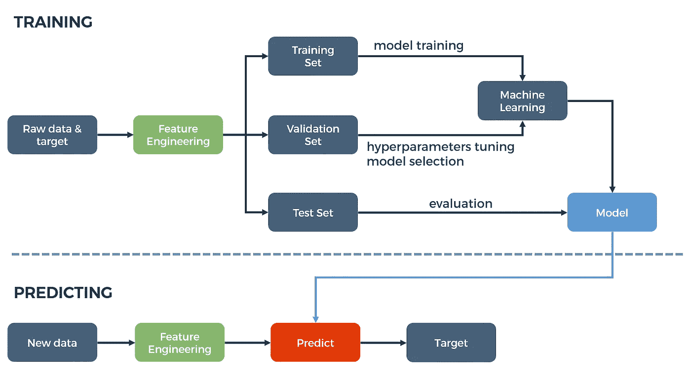

Source: [https://hackernoon.com/a-brief-overview-of-automatic-machine-learning-solutions-automl-2826c7807a2a](https://hackernoon.com/a-brief-overview-of-automatic-machine-learning-solutions-automl-2826c7807a2a)

# C.实施演练

让我们根据以上 3 个部分来实现。

## 1.基于示例信用卡交易数据集训练模型。

要训练模型，需要以下组件:

**我**。信用卡交易**数据集**，其中欺诈交易已经被识别(也称为标记)。

**二**。存储为 Docker 映像的机器学习**算法**(对于外行来说相当于 CD-ROM)。

**三**。一个**服务器**，带有预加载的机器学习库，供数据科学家准备、可视化和增强训练数据，然后设置算法的参数(通俗地说；机器学习中的超参数说话)。

**四世**。**服务器**使用特定算法训练模型，这本质上是机器学习的“**学习**”部分，也是需要最多计算能力的部分。

**亚马逊 SageMaker** 提供 **ii** 、 **iii** 和 **iv** 作为托管服务，而 **i** 取自公共数据源。

## 1a。基础设施

这是它开始变得技术性的地方。如果对基础设施不感兴趣，可以跳过这个。

就这部分解决方案的基础设施而言，我们只需要设置 **iii** (称为 notebook 实例)，其中包含了所有必要的库和一个[**Jupyter notebook**](https://jupyter.org/)，基本上就是数据科学家的工具代码(cum 文档)。位于源代码库中`source/notebooks/sagemaker_fraud_detection.ipynb`的 **Jupyter 笔记本**，包括使用 Amazon SageMaker 的库检索 **ii** (算法)和交付 **iv** (训练实例)的代码。

> 在 AWS 世界中，一个实例通常是指一个服务器，它可以是一个虚拟机或一个容器。

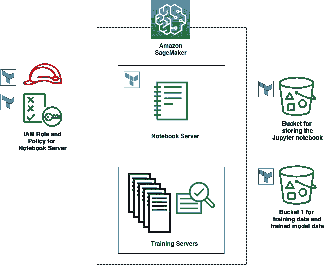

如上所述，笔记本实例需要一些支持资源，包括:

*   笔记本实例的 IAM 角色和策略:

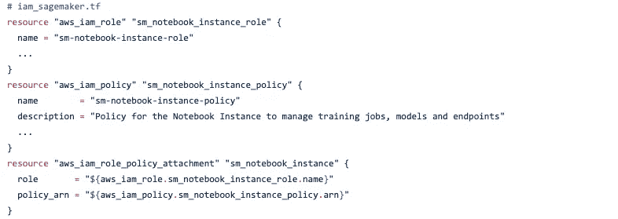

Complete code: [https://github.com/qtangs/tf-fraud-detection-using-machine-learning/blob/master/terraform/iam_sagemaker.tf](https://github.com/qtangs/tf-fraud-detection-using-machine-learning/blob/master/terraform/iam_sagemaker.tf)

*   用于存放 Jupyter 笔记本的 S3 桶:

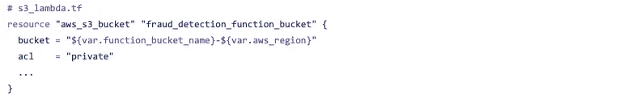

Complete code: [https://github.com/qtangs/tf-fraud-detection-using-machine-learning/blob/master/terraform/s3_lambda.tf](https://github.com/qtangs/tf-fraud-detection-using-machine-learning/blob/master/terraform/s3_lambda.tf)

*   用于存储训练数据以及生成的模型数据的 S3 存储桶:

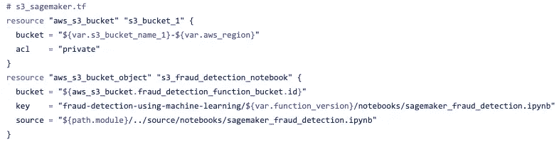

Complete code: [https://github.com/qtangs/tf-fraud-detection-using-machine-learning/blob/master/terraform/s3_sagemaker.tf](https://github.com/qtangs/tf-fraud-detection-using-machine-learning/blob/master/terraform/s3_sagemaker.tf)

*   SageMaker 笔记本实例:

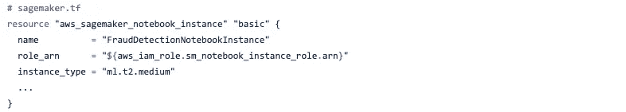

Complete code: [https://github.com/qtangs/tf-fraud-detection-using-machine-learning/blob/master/terraform/sagemaker.tf](https://github.com/qtangs/tf-fraud-detection-using-machine-learning/blob/master/terraform/sagemaker.tf)

## 1b。笔记本实例初始化脚本

为了让 notebook 实例获得位于我们源代码中的 Jupyter 笔记本，我们必须添加一个 init 脚本，从上面的**AWS _ S3 _ bucket . fraud _ detection _ function _ bucket**(我们使用 **aws_s3_bucket_object** 上传)下载笔记本。这是使用笔记本实例的生命周期配置完成的:

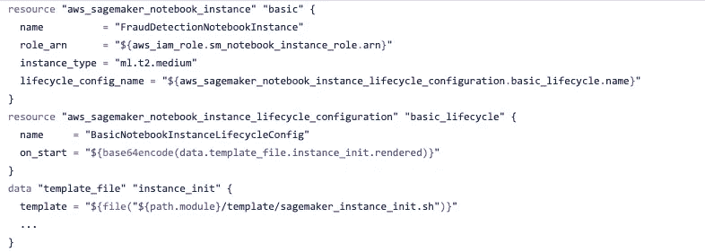

Complete code: [https://github.com/qtangs/tf-fraud-detection-using-machine-learning/blob/master/terraform/sagemaker.tf](https://github.com/qtangs/tf-fraud-detection-using-machine-learning/blob/master/terraform/sagemaker.tf)

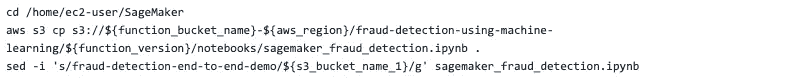

sagemaker_instance_init.sh

## 1c。培训用 Jupyter 笔记本逻辑

以下是 Jupyter 笔记本中的主要步骤:

I .下载样本数据并提取特征和标签(欺诈/非欺诈)。

二。将 n 维数组转换为 RecordIO 格式(一种高效的数据格式)。

```
import sagemaker.amazon.common as smac
buf = io.BytesIO()
smac.write_numpy_to_dense_tensor(buf, features, labels)
```

**三**。将记录数据存储到 S3 桶中。

```
bucket = "fraud-detection-end-to-end-demo"
prefix = 'linear-learner'
key = 'recordio-pb-data'boto3.resource('s3').Bucket(bucket).Object(os.path.join(prefix, 'train', key)).upload_fileobj(buf)
```

**四**。为线性学习算法检索 Docker 图像。

```
container = get_image_uri(boto3.Session().region_name, 'linear-learner')
```

**v** 。使用所需的实例类型和实例数量创建一个训练作业，更改算法的(超级)参数，并使用之前上传到 S3 的训练数据开始训练。您可以看到，建立一个服务器集群来训练一个模型是多么简单，并且只需为训练花费的时间付费，这是一个主要的成本节约。

```
import sagemaker
s3_train_data = 's3://{}/{}/train/{}'.format(bucket, prefix, key)
output_location = 's3://{}/{}/output'.format(bucket, prefix)linear = sagemaker.estimator.Estimator(container,                                              
                                 get_execution_role(),                                       
                                 train_instance_count=1,                                       
                                 train_instance_type='ml.c4.xlarge',                                       
                                 output_path=output_location,                                       
                                 sagemaker_session=session)linear.set_hyperparameters(feature_dim=features.shape[1],                                              
                           predictor_type='binary_classifier',                           
                           mini_batch_size=200)linear.fit({'train': s3_train_data})
```

*完整代码:*[*https://github . com/q tangs/TF-fraud-detection-using-machine-learning/blob/master/source/notebooks/sage maker _ fraud _ detection . ipynb*](https://github.com/qtangs/tf-fraud-detection-using-machine-learning/blob/master/source/notebooks/sagemaker_fraud_detection.ipynb)

## 2.将模型存储在可访问的界面中。

要存储模型并将其呈现给外部世界以便以后进行预测，需要以下组件:

**我**。模型数据

**二世**。其他模型元数据(容器、培训作业等)

**三**。端点(接口)配置

**四**。实际端点(按需运行预测的一组服务器)

Amazon Sagemaker 托管 **ii** 、 **iii** 和 **iv** ，而 **i** (模型数据)存储在 S3，正如我们在前面的代码(`output_location`)中看到的。 **i** 和 **ii** (型号规格)均在调用`linear.fit(...)`结束时创建。

端点配置( **iii** )和实际端点( **iv** )由 Jupyter 笔记本的这一部分创建:

```
linear_predictor = linear.deploy(initial_instance_count=1,                                 
                           endpoint_name="fraud-detection-endpoint",                                 
                           instance_type='ml.m4.xlarge')
```

*完整代码:*[*https://github . com/q tangs/TF-fraud-detection-using-machine-learning/blob/master/source/notebooks/sage maker _ fraud _ detection . ipynb*](https://github.com/qtangs/tf-fraud-detection-using-machine-learning/blob/master/source/notebooks/sagemaker_fraud_detection.ipynb)

## 3.使用该模型来预测生成的交易是否是欺诈性的。

有了创建的端点，我们现在可以在任何生成的事务上使用它。

为了模拟即将进行预测的事务，我们需要:

*   创建一个 CloudWatch 事件，每 1 分钟触发一次 Lambda 函数。
*   AWS Lambda 函数是使用代码库中位于`source/fraud_detection/index.py`的代码创建的。它遵循以下步骤:随机选择预定义的欺诈或非欺诈交易，将交易发送到端点以获得欺诈预测，在进行一些小的处理后，将结果发送到 Kinesis Data Firehose。
*   将流式结果存储到 S3 的 Kinesis 数据消防软管。
*   最后，S3 桶。

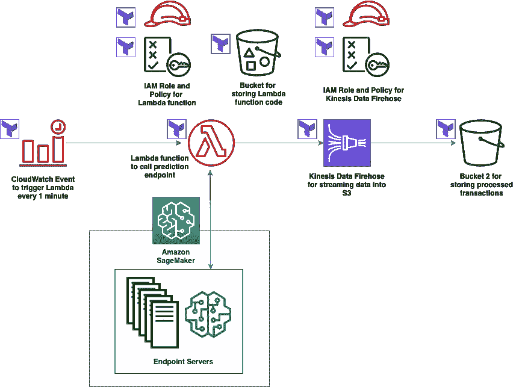

如上所述，带有蓝色 Terraform 徽标的资源是必需的:

*   云观察事件:

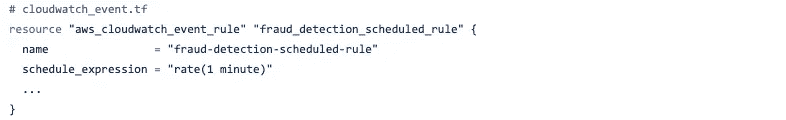

Complete code: [https://github.com/qtangs/tf-fraud-detection-using-machine-learning/blob/master/terraform/cloudwatch_event.tf](https://github.com/qtangs/tf-fraud-detection-using-machine-learning/blob/master/terraform/cloudwatch_event.tf)

*   Lambda 预测函数的 IAM 角色和策略:

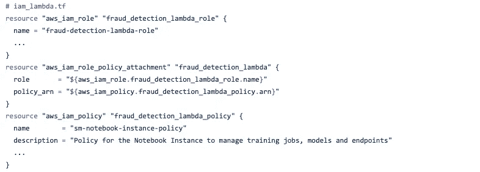

Complete code: [https://github.com/qtangs/tf-fraud-detection-using-machine-learning/blob/master/terraform/iam_lambda.tf](https://github.com/qtangs/tf-fraud-detection-using-machine-learning/blob/master/terraform/iam_lambda.tf)

*   用于存储函数代码的 S3 存储桶，取自我们代码库中的`source/fraud_detection/index.py`

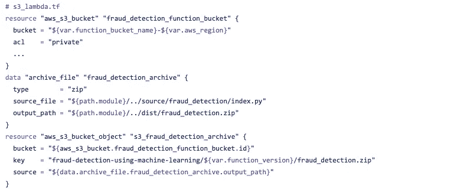

Complete code: [https://github.com/qtangs/tf-fraud-detection-using-machine-learning/blob/master/terraform/s3_lambda.tf](https://github.com/qtangs/tf-fraud-detection-using-machine-learning/blob/master/terraform/s3_lambda.tf)

*   处理新事务的 Lambda 函数:

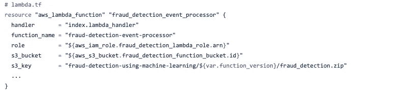

Complete code: [https://github.com/qtangs/tf-fraud-detection-using-machine-learning/blob/master/terraform/lambda.tf](https://github.com/qtangs/tf-fraud-detection-using-machine-learning/blob/master/terraform/lambda.tf)

*   用于 Kinesis 数据消防软管的 IAM 角色和策略:

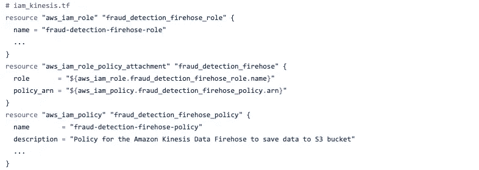

Complete code: [https://github.com/qtangs/tf-fraud-detection-using-machine-learning/blob/master/terraform/iam_kinesis.tf](https://github.com/qtangs/tf-fraud-detection-using-machine-learning/blob/master/terraform/iam_kinesis.tf)

*   存储来自 Kinesis 数据消防软管的已处理事务的 S3 存储桶:

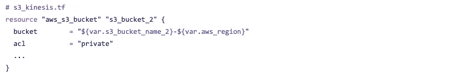

Complete code: [https://github.com/qtangs/tf-fraud-detection-using-machine-learning/blob/master/terraform/s3_kinesis.tf](https://github.com/qtangs/tf-fraud-detection-using-machine-learning/blob/master/terraform/s3_kinesis.tf)

*   最后，Kinesis 数据消防软管:

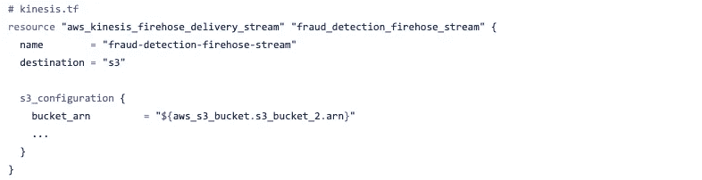

Complete code: [https://github.com/qtangs/tf-fraud-detection-using-machine-learning/blob/master/terraform/kinesis.tf](https://github.com/qtangs/tf-fraud-detection-using-machine-learning/blob/master/terraform/kinesis.tf)

# D.部署

Terraform 代码位于`terraform`文件夹中(原始云信息可在`cloudformation`中找到)。

在运行`terraform apply`之前，需要进行一些设置:

**我**。将`terraform_backend.tf.template`复制到`terraform_backend.tf`并相应修改数值。您需要手动创建一个 S3 存储桶或使用现有的存储桶来存储 Terraform 状态文件。

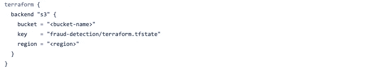

terraform_backend.tf.template

> 对 Terraform 状态使用远程后端是一个很好的实践。即使像这样简单的场景也应该这样做。

**二**。将`terraform.tfvars.template`复制到`terraform.tfvars`，并相应修改数值。您不需要创建此处指定的任何存储桶；它们是由`terraform apply`创造的。

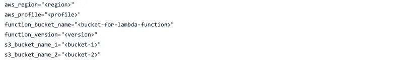

`terraform.tfvars.template`

**iii** 。一旦创建了以上文件，只需运行以下 terraform 命令。记住确保所有命令返回 ok，并在应用前查看地形图。

```
# Set default AWS profile,
# use 'set' instead of 'export' for Windows.
export AWS_PROFILE=<your desired profile>terraform init
terraform validate
terraform plan -out=tfplan
terraform apply --auto-approve tfplan
```

Terraform 平面图的输出应该如下所示:

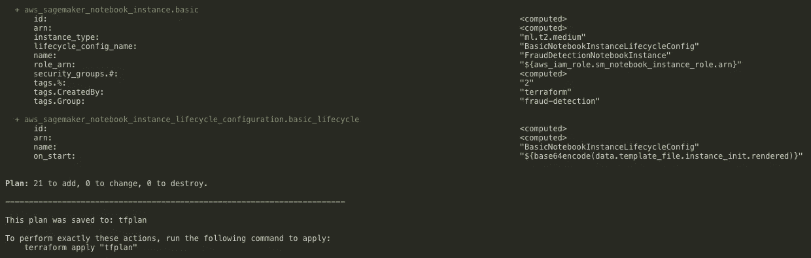

而`terraform apply`的结果:

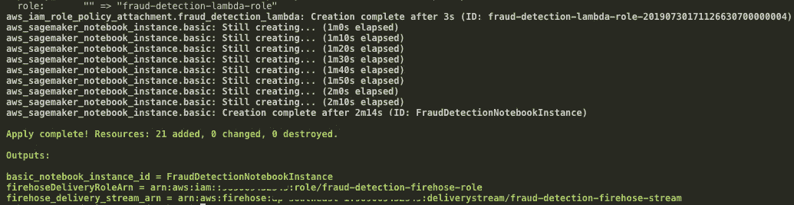

## 最终手动步骤

一旦所有的 Terraform 资源都设置好了，你需要按照 AWS 站点[记录的这些手动步骤](https://docs.aws.amazon.com/solutions/latest/fraud-detection-using-machine-learning/deployment.html#step2):

**运行笔记本**

1.  导航到[亚马逊 SageMaker 控制台](https://console.aws.amazon.com/sagemaker/)。
2.  在导航窗格中，选择**笔记本实例**。
3.  选择**frauddetectionnotebook instance**。
4.  笔记本实例应该已经在运行。
5.  选择**打开 Jupyter** 。
6.  在 Jupyter 笔记本界面，打开`sagemaker_fraud_detection.ipynb`文件。
7.  在**单元格**下拉菜单中，选择**运行全部**运行文件。

**启用云观察事件规则**

1.  导航到 [AWS Lambda 控制台](https://console.aws.amazon.com/lambda/)。
2.  在导航窗格中，选择**功能**。
3.  选择`fraud_detection_event_processor` λ功能。
4.  在**设计器**选项卡的图中，选择 **CloudWatch 事件**。
5.  在 **CloudWatch 事件**选项卡中，选择`*<stackname>*-ScheduleRule-*<id>*`。
6.  选择**动作**动作>动作**启用**。
7.  选择**启用**。

**验证 Lambda 函数正在处理事务**

1.  导航到[AWSλ控制台](https://console.aws.amazon.com/lambda/)。
2.  在导航窗格中，选择**功能**。
3.  选择`fraud_detection_event_processor` λ功能。
4.  选择**监控**并验证**调用**图显示活动。
5.  几分钟后，检查已处理事务的结果亚马逊 S3 桶。

# E.清除

完成实验后，只需执行以下操作即可删除所有资源并节省成本。再次提醒，记得在应用之前**检查地形图。**

```
terraform plan -destroy -out=tfplan
terraform apply tfplan
```

您应该能够看到如下输出:

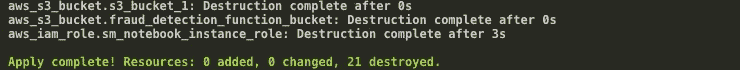

# F.摘要

亚马逊 SageMaker 是一个强大的平台，我们刚刚触及它的表面。

感谢 AWS Solution Builders 团队，我们有许多关于如何利用 Amazon SageMaker 的精彩例子。

与此同时，Terraform 简化了企业的基础设施设置，开发运维及持续交付变得越来越重要。

在未来的帖子中，我将研究 AWS 团队提供的更复杂的示例，并探索如何设计 Terraform 基础设施，以适应机器学习设置中的 CI/CD 管道。

*感谢您的阅读。请在下面评论分享你的想法。*

*本文的完整项目托管在* [*Github*](https://github.com/qtangs/tf-fraud-detection-using-machine-learning) *上。*