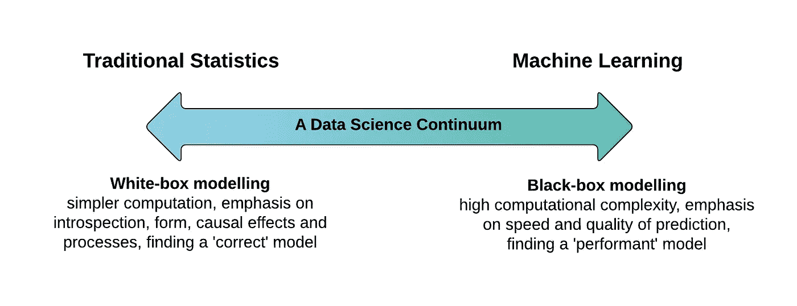
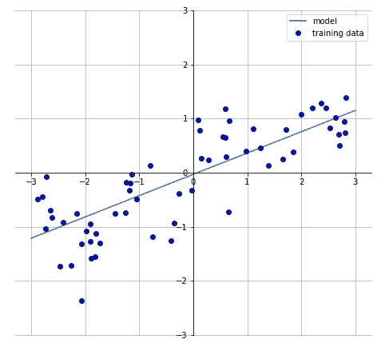
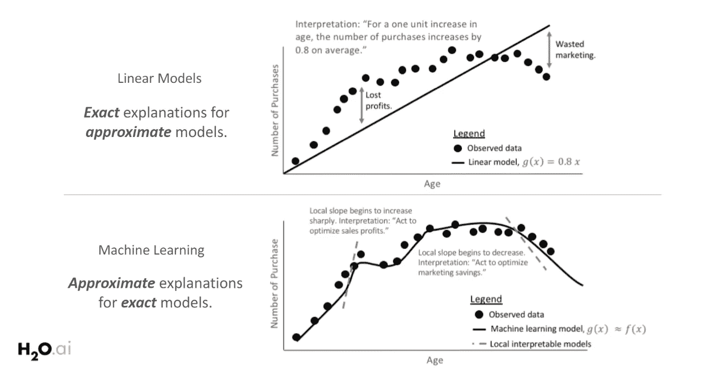
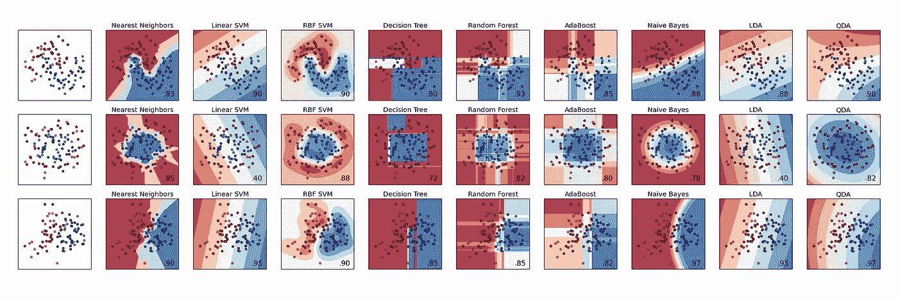

# 黑盒与白盒模型

> 原文：<https://towardsdatascience.com/machine-learning-interpretability-techniques-662c723454f3?source=collection_archive---------4----------------------->

大多数机器学习系统需要能够*向利益相关者解释*为什么做出某些预测。在选择合适的机器学习模型时，我们通常会在准确性和可解释性之间进行权衡:

*   **精确和“黑箱”:**
    神经网络、梯度推进模型或复杂集成等黑箱模型通常可以提供很高的精确度。这些模型的内部工作更难理解，它们不能提供对模型预测中每个特征的重要性的估计，也不容易理解不同特征如何相互作用。
*   **较弱的“白盒”:**
    另一方面，线性回归和决策树等较简单的模型提供的预测能力较低，并且不总是能够模拟数据集的内在复杂性(即特征相互作用)。然而，它们更容易解释和诠释。

Image from [Applied.AI](https://blog.applied.ai/bayesian-inference-with-pymc3-part-1/)

准确性与可解释性的权衡基于一个重要的假设，即*[*‘可解释性是模型的固有属性’*](https://www.inference.vc/accuracy-vs-explainability-in-machine-learning-models-nips-workshop-poster-review/)*。然而，我坚信，通过正确的“可解释性技术”，任何机器学习模型都可以变得更具可解释性，尽管有些模型的复杂性和成本要高于其他模型。**

*在这篇博文中，我将讨论一些可用于解释机器学习模型的不同技术。这篇博文的结构和内容高度基于 [H20.ai 关于机器学习可解释性的小册子](http://docs.h2o.ai/driverless-ai/latest-stable/docs/booklets/MLIBooklet.pdf)。如果你想了解更多，我强烈推荐大家阅读帕特里克·霍尔的 H20.ai 小册子或其他材料！*

# *模型属性*

*模型的可解释程度通常与响应函数的两个属性有关。模型的响应函数 *f(x)* 定义了模型的输入(特征 *x* )和输出(目标 *f(x)* )之间的输入输出关系。根据机器学习模型，该函数具有以下特征:*

*   *线性:在线性响应函数中，特征和目标之间的关联表现为线性。如果一个特性线性变化，我们也期望目标以相似的速率线性变化。*
*   *单调性:在单调响应函数中，特征和目标之间的关系在特征上总是在一个方向上(增加或减少)。更重要的是，这种关系适用于整个特征域，并且独立于其他特征变量。*

**

*An example of a simple linear and monotic response function (1 input variable x, 1 response variable y)*

*线性和单调函数的例子是例如线性回归模型，而例如随机森林和神经网络是展示高度非线性和非单调响应函数的模型的例子。*

*由 Patrick Hall 制作的下一张幻灯片说明了为什么在需要清晰简单的模型解释时，白盒模型(具有线性和单调函数)通常是首选。顶部的图显示，随着年龄的增长，购买次数也在增加。响应函数在全局水平上具有线性和单调的关系，容易被所有利益相关者解释。*

**

*然而，由于白盒模型的线性和单调约束，错过了趋势的很大一部分。通过探索更复杂的机器学习模型，有可能更好地拟合观察到的数据，尽管响应函数在局部水平上只是线性和单调的。为了解释模型的行为，有必要在本地级别研究模型。*

*模型可解释性的范围，即在全球或地方一级，与模型的复杂性有内在联系。线性模型在整个特征空间表现出相同的行为(如顶部图所示)，因此它们是全局可解释的。输入和输出之间的关系通常受限于复杂性和局部解释(即，为什么一个模型在某个数据点做出某个预测？)默认为全局解释。*

*对于更复杂的模型，模型的全局行为更难定义，需要对响应函数的小区域进行局部解释。这些小区域更有可能表现为线性和单调的，从而实现更准确的解释。*

**

*ML libraries (e.g. sk-learn) allow quick comparisons between different classifiers. When the dataset is limited in size and dimensionality, it is possible to interpret the results. In most real-life problems this is not the case anymore.*

*在这篇博文的剩余部分，我将关注两个模型无关的技术，它们提供了全局和局部的解释。这些技术可以应用于任何机器学习算法，并且它们通过分析机器学习模型的响应函数来实现可解释性。*

# *可解释性技术*

## *代理模型*

*代理模型是(通常更简单的)模型，用于解释更复杂的模型。线性模型和决策树模型由于其简单的解释而经常被使用。创建代理模型是为了表示复杂模型(响应函数)的决策过程，并且是基于输入和模型预测而不是输入和目标训练的模型。代理模型在非线性和非单调模型之上提供了一层全局可解释性，但不应完全依赖它们。代理模型不能完美地表示潜在的响应函数，也不能捕捉复杂的特征关系。它们主要作为一个模型的“全局总结”。以下步骤说明了如何为任何黑盒模型构建代理模型。*

1.  *训练一个黑盒模型。*
2.  *评估数据集上的黑盒模型。*
3.  *选择一个可解释的代理模型(通常是线性模型或决策树)。*
4.  *对数据集及其预测训练可解释的模型。*
5.  *确定代理模型误差度量并解释代理模型。*

## *石灰*

*LIME 背后的一般思想与代理模型相同。然而，LIME 并不构建代表整个数据集的全局代理模型，而仅构建解释局部区域预测的局部代理模型(线性模型)。关于 LIME 更深入的解释可以在这篇关于 LIME 的[博文中找到。](/understanding-model-predictions-with-lime-a582fdff3a3b)
LIME 提供了一种直观的方式来解释给定数据点的模型预测。*

*以下步骤说明了如何为任何黑盒模型构建 LIME 模型。*

1.  *训练一个黑盒模型。*
2.  *感兴趣的局部区域的样本点。可以从数据集中检索点，也可以生成人工点。*
3.  *根据新样本与感兴趣区域的接近程度对其进行加权。将加权的、可解释的(替代)模型拟合到有变化的数据集上。*
4.  *解释本地代理模型。*

## *结论*

*有几种不同的技术可以用来提高机器学习模型的可解释性。尽管随着该领域的发展，这些技术变得越来越强大，但始终比较不同的技术是很重要的。我没有讨论的一个技巧是 Shapley 值。看看 [Christoph Molnar 关于“可解释机器学习”的书](https://christophm.github.io/interpretable-ml-book/)，了解更多关于这方面(以及其他)的技术！*

*如果你对机器学习的可解释性有任何问题，我很乐意在评论中阅读。如果你想收到我博客上的更新，请在 [Medium](https://medium.com/@lars.hulstaert) 或 [Twitter](https://twitter.com/LarsHulstaert) 上关注我！*