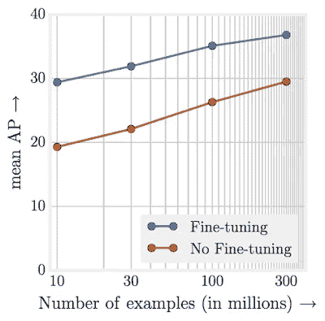

# 机器学习:介绍、巨大的失败和希望

> 原文：<https://towardsdatascience.com/machine-learning-introduction-monumental-failure-and-hope-65a8c6098a92?source=collection_archive---------17----------------------->

Photo by [Ahmed Hasan](https://unsplash.com/@carsive?utm_source=medium&utm_medium=referral) on [Unsplash](https://unsplash.com?utm_source=medium&utm_medium=referral)

# 什么是机器学习？

维基百科告诉我们，机器学习是“计算机科学的一个领域，它赋予计算机**无需明确编程就能学习的能力**”它接着说，“机器学习探索研究和构建可以从数据中学习并对数据进行预测的算法——这种算法通过进行数据驱动的预测或决策，通过**从样本输入建立模型**，克服了严格静态的程序指令。”

# 从输入中学习

在没有明确编程的情况下从输入中学习意味着什么？让我们考虑一个经典的机器学习问题:垃圾邮件过滤。

想象一下，我们对机器学习一无所知，但我们的任务是确定一封电子邮件是否包含垃圾邮件。我们如何做到这一点？以下是我的一些想法:

*   分析 IP 地址。根据 IP 地址，我们通常可以确定发件人的位置，垃圾邮件可能更多地来自离收件人不近的位置。
*   看邮件的正文。有提到尼日利亚王子的吗？
*   寻找不常见的电子邮件地址模式。例如，电子邮件地址的末尾是否有大量的数字？

这些只是一些想法，但希望你还能想到更多。

现在想象我们有一个黑匣子，如果给它大量垃圾邮件和非垃圾邮件的例子，它可以从这些例子中学习垃圾邮件的样子。我们将称之为黑盒机器学习。通常我们提供给它的数据被称为**特性**。

想要一个更直观的从输入中学习的例子吗？看看这个程序使用机器学习来学习如何玩 Flappy Bird。

# 为什么是机器学习？

看完上面的垃圾邮件例子后，你可能会想:为什么我们需要机器学习来检测垃圾邮件？似乎人类或基于规则的程序可以很好地完成这项任务。以下是一些好处:

*   **刻度**。与人类相比，扩展机器学习算法要容易得多。一台机器可以在一分钟内分析数千封(如果不是更多)邮件中的垃圾邮件。
*   **成本**。虽然开发机器学习的前期成本较高，但如果你成功开发了一种有效的算法，则终生成本会显著降低。
*   **健壮**。机器学习的好处之一是它可以更容易地适应新趋势。如果您开发了数千行规则来检测垃圾邮件，然后发布了一种新的垃圾邮件(可能是一封说您中了彩票的电子邮件)，则很难在不违反先前规则的情况下更新您的规则。使用机器学习算法，你需要的只是新趋势的数据，然后重新训练你的算法——它会根据趋势进行调整。
*   **聪明**。人类和基于规则的程序经常会努力开发方法来检测具有挑战性的案例。例如，为垃圾邮件中可能存在的所有基于文本的模式编写规则是很困难的。随着更复杂的模型(如深度学习)的出现，通常模型可以更好地捕捉模式。

# 机器学习问题的类型

现在我们已经有了什么是机器学习以及为什么它会有价值的基础，让我们看看机器学习可以解决的一些类型的问题。

**有监督的**机器学习问题是那些你已经标注了数据的问题。带标签的数据意味着你用数据给算法解，这些解叫做标签。例如，对于垃圾邮件分类，标签可能是“垃圾邮件”或“非垃圾邮件”[线性回归](https://github.com/tfolkman/byu_econ_applied_machine_learning/blob/master/lectures/Lecture_4_Linear_Regression_and_Evaluation.ipynb)被认为是解决监督问题的算法。

**无监督**机器学习则相反。它没有任何标签。这些算法通常没有标签那么强大，但当获取标签数据非常昂贵或不可能时，它们会非常有价值。一个例子是[聚类](https://github.com/tfolkman/byu_econ_applied_machine_learning/blob/master/lectures/Lecture_6_K_Nearest_Neighbors.ipynb)。

**回归**问题是一类你试图预测一个实数的问题。例如，线性回归输出一个实数，可以用来预测房价。

**分类**问题是你要预测其类别标签的问题。例如，垃圾邮件预测是一个分类问题，因为您想知道您的输入是属于两类之一:“垃圾邮件”还是“非垃圾邮件”。[逻辑回归](https://github.com/tfolkman/byu_econ_applied_machine_learning/blob/master/lectures/Lecture_5_Logistic_Regression_and_Evaluation.ipynb)是一种用于分类的算法。

排名问题在电子商务中非常普遍。这些模型试图根据项目对用户的价值进行排序。比如网飞的电影推荐。一个示例模型是[协同过滤](https://github.com/tfolkman/byu_econ_applied_machine_learning/blob/master/lectures/Lecture_17_Recommender_Systems.ipynb)。

**强化学习**是指在一个环境中，有一个代理人开始执行行动并获得行动奖励。这里的模型学习采取最佳行动以获得最大回报。flappy bird 视频就是强化学习的一个例子。一个示例模型是[深度 Q 网络](/qrash-course-deep-q-networks-from-the-ground-up-1bbda41d3677)。

Photo by [Nathan Dumlao](https://unsplash.com/@nate_dumlao?utm_source=medium&utm_medium=referral) on [Unsplash](https://unsplash.com?utm_source=medium&utm_medium=referral)

# 未能交付

也许我最喜欢维基百科页面上关于机器学习的部分是，“截至 2016 年，**机器学习是一个时髦词**，根据 Gartner 2016 年的炒作周期，处于膨胀预期的顶峰。有效的机器学习是困难的，因为发现模式是困难的，并且通常没有足够的训练数据可用；因此，**机器学习程序经常无法交付**。

以下是我对机器学习问题为何无法传递价值的一些思考。

没有明确的问题需要解决。

该公司的一名高管听说机器学习是下一件大事，所以他们聘请了一个数据科学团队。不幸的是，对于要解决什么问题没有一个清晰的想法，所以团队纠结了一年。

**标记数据对于构建机器学习模型可能极其重要，但也可能极其昂贵。**

首先，你经常需要大量的数据。 [Google](https://research.googleblog.com/2017/07/revisiting-unreasonable-effectiveness.html) 发现，对于表示学习，性能会根据训练数据量以对数方式增长:

其次，您需要获得代表您试图解决的问题的完整分布的数据。例如，对于我们的垃圾邮件分类问题，我们可能想要收集哪些类型的电子邮件？如果我们只有来自美国 IP 地址的邮件会怎么样？

最后，光是标记数据就很费时，而且要花很多钱。如果你还没有垃圾邮件分类的数据，谁来给数百万封邮件贴上垃圾邮件或者不是垃圾邮件的标签呢？

**数据可能会很乱**

现实世界中的数据通常有错误、异常值、缺失数据和噪声。如何处理这些会极大地影响模型的结果，并且需要时间和经验来做好。

**特色工程**

一旦有了数据和标注，决定如何在模型中表示数据可能会非常具有挑战性。例如，对于垃圾邮件分类，你会给它输入原始文本吗？IP 地址的来源呢？时间戳呢？从数据中创建的特征通常比选择的算法更重要。

**你的模型可能无法概括**

在所有这些之后，您可能仍然会得到一个过于简单而无效(欠拟合)或者过于复杂而不能很好地概括(过拟合)的模型。你必须开发一个恰到好处的模型。:)

**评价非同小可**

假设我们开发了一个垃圾邮件分类的机器学习模型。我们如何评价？我们更关心[精度还是召回](https://en.wikipedia.org/wiki/Precision_and_recall)？我们如何将科学指标与业务指标联系起来？大多数新数据科学家习惯于处理评估指标已经确定的问题。在行业中，确定您想要优化什么，以及设计一个算法来适当地最大化(或最小化)该指标，可能是非常具有挑战性的。

**投入生产可能会很困难**

您有一个内置 Python 的漂亮模型，却发现您不知道如何将它投入生产。后端是 Java，模型必须在 5 毫秒内运行。你没有 Java 经验，不确定如何加速你的模型。通常，公司试图通过让工程师将科学家的代码转化为产品来解决这个问题，但这种移交方法可能会由于过程中的信息丢失而导致严重的延迟甚至错误。

Photo by [bruce mars](https://unsplash.com/@brucemars?utm_source=medium&utm_medium=referral) on [Unsplash](https://unsplash.com?utm_source=medium&utm_medium=referral)

# 希望

**虽然许多机器学习计划确实失败了，但也有许多获得了成功，并经营着一些世界上最有价值的公司。像谷歌、脸书、亚马逊、Airbnb 和网飞这样的公司都已经找到了利用机器学习的成功方法，并获得了巨大的回报。**

谷歌首席执行官桑德尔·皮帅最近甚至说“从移动优先的世界到人工智能优先的世界有一个重要的转变”

马克·库班[对](https://bothsidesofthetable.com/mark-cuban-on-why-you-need-to-study-artificial-intelligence-or-youll-be-a-dinosaur-in-3-years-db3447bea1b4)说，“人工智能、深度学习、机器学习——不管你在做什么，如果你不懂，就去学。因为否则你会在三年内变成恐龙。”

最后，哈佛商业评论发现

> 在使用数据驱动的决策方面，行业排名前三分之一的公司比其竞争对手的生产率和利润平均高出 5%和 6%

我希望这篇文章已经很好地向您介绍了机器学习的世界、一些挑战以及它为什么如此有价值。现在取决于你在你的公司执行机器学习并释放潜在价值。如果你正在寻找一些关于如何开始的想法，看看我的另一篇文章:

 [## 兑现人工智能的承诺

### 为了你的创业

towardsdatascience.com](/delivering-on-the-promise-of-artificial-intelligence-f6424a75d61c) 

这篇文章也可以在这里找到[。](https://learningwithdata.com/posts/tylerfolkman/machine-learning-introduction-monumental-failure-and-hope-65a8c6098a92/)