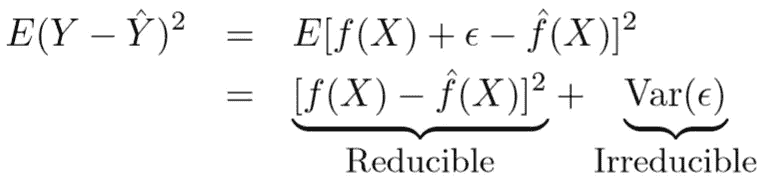
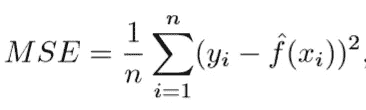
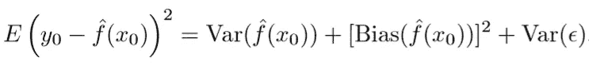

# 初学者机器学习入门

> 原文：<https://towardsdatascience.com/machine-learning-intuition-for-beginners-ba07a640d928?source=collection_archive---------18----------------------->

*“追求数据科学的简单性。真正的创造力不会让事情变得更复杂。相反，它会简化它们。”*
― **达米安·杜菲语重心长**

我们想通过广告来提高产品的销量。所以，让我们看看我们的广告渠道:电视、广播、社交媒体、报纸等。
因此，广告预算(Y)被称为因变量或反应，电视(X1)、广播(X2)、社交媒体(X3)、报纸(X4)被称为自变量或预测因素。

## 预言；预测；预告

**关系:- Y = *f* (X) + *e*** 是我们真实的观测值。 ***f*** 是将输入变量(X)最佳映射到输出变量(Y)的目标函数。
我们对 **Y** 的预测将取决于 ***y`(y`=f`(X))、*** 的精度，而后者又取决于另外两个量:**可约误差**和**不可约误差**。一般来说， ***f`*** 想成为*f 的完美估计量，但可约误差以不精确的形式存在。这个误差是可以减少的，因为我们可以通过使用最合适的统计学习方法来提高 ***f`*** 的精度。然而，即使有可能为 ***f、*** 形成完美的估计量，使得 ***y`=f(X)*** ，我们的预测仍然会有一些误差，称为不可约误差。这个误差的存在是因为 ***y*** 也是 ***e、*** 的一个函数，它不能由 ***X 预测。我们不测量它们，因此， ***f*** 不能用它们进行预测。****

**

*我们的主要焦点应该是如何减少可约误差。预测问题就像:给定这个人的特征，你会把他归入哪一类？这个问题是关于当你已经给定了输入变量 X 时，如何预测 Y。*

## *推理*

*当我们想了解反应(Y)和预测因素(X)之间的关系时，就称为推论。我们不能把 ***f`*** 当作一个黑盒，因为我们想知道它的确切形式。我们希望了解预测因素和反应之间存在的关系，无论是正相关还是负相关。
这将回答诸如“哪种媒体对销售贡献最大？”等等。这些问题的要点是**单个输入变量(X)对输出变量(Y)** 的影响有多大。*

*线性模型将帮助我们进行简单和可解释的推断，但可能不会像其他一些统计方法那样产生准确的预测。*

## *参数模型*

*它是一个分布族，可以很容易地用有限数量的参数来定义。在这种模型中，您知道哪个模型适合您的数据。
举例:- **yi=β0+β1xi+ei** 是线性回归。
它与您“假设”的数据遵循的特定概率分布相关联。这种方法将估计 ***f*** 的问题减少到几组参数。
参数模型示例:-线性回归、逻辑回归和 SVM。
唯一的缺点就是我们选择的模型可能和 ***f*** 的真未知形式不匹配。如果选择的模型离真实的 ***f、*** 太远，那么我们从那个模型得到的估计就会很差。
为了解决这个问题，我们可以为 ***f.*** 选择一些可以适应多种不同功能形式的灵活模型*

## *非参数模型*

*它基于无分布或者具有指定的分布，但是分布的参数未指定。这些数据会告诉你‘回归’应该是什么样子。
**Y =*f*(X)+*e，*** 其中 ***f()*** 可以是任意函数。
数据会告诉你函数会是什么样子。在训练模型 ***之前，我们不推测任何关于我们试图学习的 ***f*** 的函数形式的假设。*** 模型将由数据决定。参数模型的示例:- KNN、决策树和 RBF 核 SVM。
唯一的缺点是，我们需要非常大量的观测数据来获得对真 ***f.*** 的准确估计，这导致模型的复杂性和灵活性增加。*

## *限制性与灵活性方法*

*如果我们主要对推理感兴趣，那么我们应该选择限制性模型。这是因为它的简单性和可解释性。
举例:线性回归有助于我们理解 **Y** 和 **X1，X2 的关系，..Xp。** 假设，我们没有选择一个更简单、限制性更强的模型，而是选择了一个像 KNN 那样复杂、灵活的模型。我们将无法理解个体预测因子是如何与反应变量相关联的。当我们只对预测感兴趣而对可解释性不感兴趣时，我们应该使用灵活的模型。
例子:预测股票价格。
此外，由于在高度灵活的方法中过度拟合，有时我们可能使用不太灵活的方法获得更准确的预测。*

## *监督与非监督学习*

*如果给定了响应( **Y** )变量，则采用**监督学习**方法。在学习中，我们使用标注有正确答案的数据来训练机器。
监督学习分为两部分:回归或分类。有定量反应的问题称为回归问题，有定性反应的问题称为分类问题。定量反应意味着真实值，如身高、价格等。定性意味着绝对。
例子:-线性回归、逻辑回归、KNN 等。*

*如果没有给出响应( **Y** )变量，则采用**无监督学习**方法。我们希望了解数据的底层结构，而不需要提供任何明确的标签。
它有聚类，帮助我们进行细分。*

## *均方误差*

**

*它是使用训练数据 ie 计算的。用于拟合模型。我们应该不是真的对 ***f`(xi) = Yi*** 感兴趣；相反我们想知道 ***f`(x0)*** 是否约等于***y0；*** 其中 ***(x0，y0)*** 是一个看不见的测试观测。
随着模型灵活性的增加，模型可能会产生较小的训练 MSE，但由于过度拟合，可能会导致较大的测试 MSE。这是因为我们的统计学习方法过于努力地在训练数据中寻找模式，这导致它拾取随机噪声，而不是未知函数 ***f*** 的真实属性。*

## *偏差-方差权衡*

*这个期望测试 MSE 是***f `( x0)****f `( x0)的方差和**误差的方差 ***(e)之和。*******

****

**这个等式告诉我们要降低偏差和方差。
**方差**指的是 ***f`*** 变化的量，如果我们使用一个看不见的训练数据集来估计的话。这是一种通过拟合高度灵活的模型来学习随机事物的趋势，这些模型过于接近地学习数据中的误差/噪声。导致**过拟合。**由于训练数据符合统计学习方法，不同的训练数据集会产生不同的 ***f`。f`*** 应该变化不大，理想情况下。但是具有高方差的方法将随着训练数据的改变而保持改变 ***f`*** 。一般来说，灵活的方法更倾向于较高的方差。
**偏差**是该方法由于没有考虑数据中的所有信息而不断学习错误的东西的倾向。它很少关注训练数据，并且过于简化模型。这导致**装配不足。**如果我们用一个非常简单的模型来近似一个非常复杂的问题，会导致偏差。
参数或线性机器学习算法往往偏高但方差低，非参数算法偏低但方差高。
理想的拟合应该是捕捉数据集中的规律性，足以能够推广到来自同一来源的看不见的数据点。不幸的是，在实践中，同时做到这两点几乎是不可能的。因此，我们在游戏中有一个权衡。**

**[*如果你想在 5 分钟内看懂统计。*](/statistics-for-data-scientists-f2456d26c5a5)**

**[了解 Python 中的特征工程。](/feature-engineering-in-python-part-i-the-most-powerful-way-of-dealing-with-data-8e2447e7c69e)**

***感谢阅读！* **这里也可以给支持:**https**://**[buymeacoffee.com/divadugar](http://buymeacoffee.com/divadugar)**