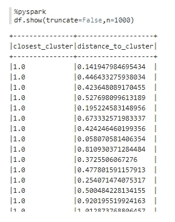
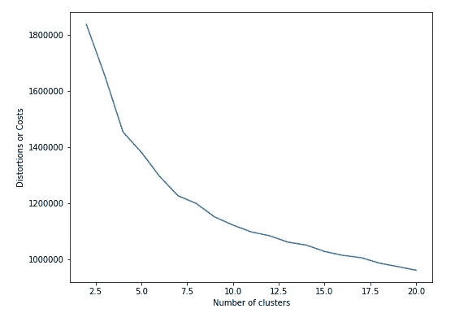
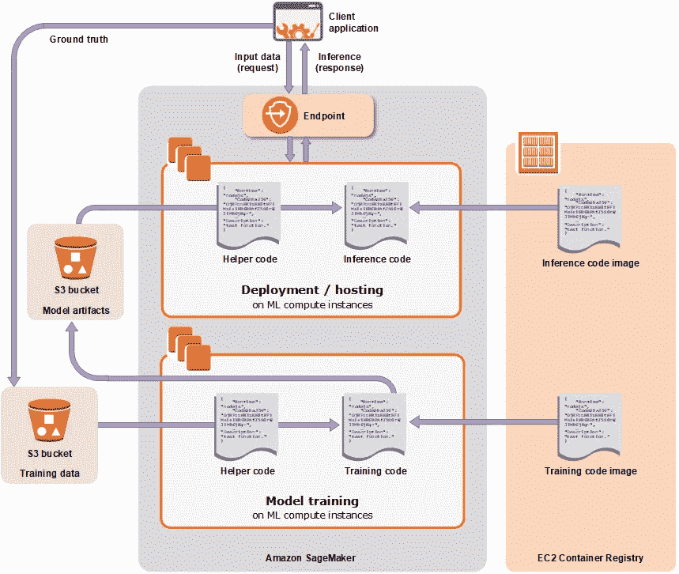

# SparkML 与 AWS SageMaker 中的机器学习(kmeans 聚类)——我的两分钱

> 原文：<https://towardsdatascience.com/machine-learning-kmeans-clustering-in-sparkml-vs-aws-sagemaker-my-two-cents-3310693c00bb?source=collection_archive---------21----------------------->


机器学习，即从数据中学习的能力，一直是大数据最成功和最具颠覆性的用例之一。在数据和分析领域，人们可以使用无数的工具集来承担不同性质和复杂性的机器学习任务。

然而，当一个人在大规模数据上操作时，R 和 Python 等常用语言中的传统机器学习库(如 pandas、scikit-learn)通常会有所不足，因为这些库原本在单个机器上运行，其中要分析的数据应该在内存中(虽然有一些方法，如核外学习，可用于绕过这一点，但它有自己的一套警告)。因此，对于真正的大规模机器学习来说，分布式训练和推理管道变得至关重要。这本身不是一个简单的任务，但是框架和库的可用性极大地促进了这个过程。像 Mahout(运行在旧的 MapReduce 上)和 SparkMLLIB (Spark 基于 RDD 的机器学习库)这样的库是这一类别中的第一批玩家，从那以后我们看到了许多其他类似的出现。这一趋势有如下几个方面:

1.Spark 的机器学习库(SparkML)已经成熟，现在支持通用的数据框架/数据集 API，并覆盖了许多算法和功能工程转换
2。与 Spark 无缝协作的库的可用性，例如 Sparkling Water、DeepLearning4J、XgBoost4J、Stanford Core NLP Wrapper for Spark，因为 Spark 是领先的分布式计算框架
3。深度学习库如 TensorFlow 与其他分布式计算框架如 Apache Beam 的集成和兼容性(如 TensorFlow Transform，在 Google 云平台中得到很好的支持)
4 .云本机机器学习框架和库的可用性，例如 AWS 的 SageMaker

在所有这些趋势中，核心驱动力一直是支持和普及可扩展的机器学习，以便组织可以更加专注于实际工作，而不是陷入如何在引擎盖下运行的底层复杂性。

# 在 SparkML 和 SageMaker 上使用 kmeans

最近，我有机会在一个无监督的机器学习任务环境中使用 SparkML 和 AWS SageMaker，其核心目标是分析海量数据以执行聚类。鉴于机器学习问题的性质，kmeans(一种广泛使用的基于划分的聚类算法)被认为是合适的。


kmeans in action (source: [https://commons.wikimedia.org/wiki/File:K-means_convergence.gif](https://commons.wikimedia.org/wiki/File:K-means_convergence.gif))

[SparkML](https://spark.apache.org/docs/latest/ml-clustering.html) 和 [SageMaker](https://aws.amazon.com/sagemaker/) 都提供了 kmeans 算法，使用这两种算法的体验有很大的不同，有很多注意事项，因此这篇文章重点关注这一点。如果您打算使用 kmeans 算法(或者其他算法),并且您需要在 SparkML 和 AWS SageMaker 之间做出设计决策，这篇文章也可能在这方面对您有所帮助。

# 距质心的距离度量:

假设聚类主要是一种无监督的机器学习活动，其中训练实例的真实标签事先不可用，应用聚类算法得到的主要见解是聚类标签与训练实例的关联，即训练实例被分组为聚类，其中启发是聚类中的实例彼此相似，而不是不同聚类中的实例。SparkML 和 SageMaker kmeans 都在运行 kmeans 算法时提供聚类标签。然而，一个显著的区别是离质心的距离，即特定实例离聚类中心有多远。这种洞察力对于检测内聚性和潜在的离群值非常有用。
在这种情况下，除了聚类标签之外，SageMaker 还方便地为每个训练实例提供距质心的距离。



An example of how distance from centroid insight is made available against each training instance in SageMaker

这大大减少了将输出与输入相关联的预处理步骤。
然而，在 SparkML 的情况下，它不是作为输出提供给每个训练实例的。相反，它是作为模型的一个属性提供的。例如，对于虹膜数据，如果使用 4 个特征执行聚类，并且 k=3，则作为训练模型的属性可访问的聚类中心(或质心)将是大小为 3 的数组(相当于聚类的数量)，其中每个元素将是 4 个浮点数的数组(对应于 4 维特征空间中的 4 个坐标)。

这就需要额外的预处理步骤来将输出与输入相关联。

# 确定最佳聚类数:

k 均值要求在运行算法之前提供聚类数(指定为 k)。虽然手头问题的领域知识通常有助于构思聚类的数量，但是我们数据科学家采用数据驱动的方法来确定 k 的正确值。在这种情况下使用肘形曲线和剪影方法等方法。我们采用肘曲线法来确定 k 的最佳数量，这涉及使用不同的 k 值在数据集上多次运行 kmeans 算法，并基于评估度量来确定拟合优度。Spark ML 在设定的误差平方和(WSSSE)内使用。对于 k 的每个值，使用该度量，然后绘制成图。基于此，曲线上发生弯曲的点(从统计角度来说，梯度变小的地方)通常是正确的 k 值。直观地说，这意味着进一步增加 k 值不会导致度量的显著降低。



An example of Elbow curve plotted using matplotlib after running kmeans algorithm for a range of k values (on x-axis) and distortion/cost (on y-axis)

在 SparkML 中使用肘曲线方法非常简单，因为需要指定范围，只需在这些值上训练模型。运行 Spark 的同一个集群用来运行 kmeans 的不同 k 值的多次运行，并且不需要额外的开销。我们使用一个 r 5.12 x 大型实例和大约 35 万个实例以及不同数量的特性(从 4 到 100)进行了测试，每次运行大约需要一分钟。

```
from pyspark.ml.clustering import KMeans
import numpy as np
cost = np.zeros(50)for k in range(3,50):
   kmeans = KMeans().setK(k).setSeed(1).setFeaturesCol("scaled_features")
   model = kmeans.fit(spark_dataframe)
   cost[k] = model.computeCost(spark_dataframe)
```

如果使用 Python，可以通过 matplotlib 绘制它。

然而，在 SageMaker 中做同样的事情有它自己的一套注意事项。SageMaker 中的机器学习管道可以形象地表示如下:



Machine Learning workflow using SageMaker (source: [https://docs.aws.amazon.com/sagemaker/latest/dg/how-it-works-hosting.html](https://docs.aws.amazon.com/sagemaker/latest/dg/how-it-works-hosting.html))

在 SageMaker 的情况下，为每个训练或推理作业启动实例，也就是说，如果您想要运行一个具有一组特定超参数(如 k=10)的模型(如 kmeans ),那么您将需要运行一个训练作业来启动一个实例(或多个实例，如果您指定了多个实例)。该训练实例将生成一个名为“模型”的工件，该工件将被存储在一个 S3 存储桶位置(可配置)。仅仅通过运行训练作业并不能得到推论，即集群标签。相反，培训工作的输出是一个模型工件。

为了通过 SageMaker 获得实际的推理，需要运行两种形式的推理作业:
**部署一个端点—** 推理是通过以 API 调用的形式将测试数据(或无监督算法情况下的训练数据)发送到端点来获得的。SageMaker SDK 对这一点进行了重要的抽象。此外，相同的端点可用于从 SageMaker 生态系统中获取推理，如果有下游应用程序希望以接近实时的方式获取推理，该端点尤其有用

**批量转换作业—** 如果没有这样的要求来提供一个端点以便于生成如上所述的洞察，那么用户可以使用批量转换作业功能来启动一个实例，下载位于 S3 上的训练数据(这里可以有两种模式，即文件或管道。当使用文件模式时，数据在训练实例上下载，而当使用管道模式时，如果算法支持，则数据是“流”的)，生成推理，然后存储回 S3(格式可以是 CSV、JSON 或 recordIO，具体取决于所使用的算法)。

因此，简而言之，使用肘曲线这样的方法将需要相当于你想要的“k”范围的训练实例。由于成本与每次实例启动相关联，因此这是需要小心的事情。此外，每个实例类型都有一个启动时间(可以从 1 分钟到 7 分钟不等，甚至更长)，因此仅运行肘形曲线在这方面也会花费大量时间。

# Kmeans 参数的默认值:

SparkML 和 SageMaker 中 kmeans 的默认值大不相同。虽然一个好习惯是彻底检查默认值是什么，并根据要求设置它们，但我已经看到人们只是依赖默认值并运行算法。特别是在 SparkML kmeans 的情况下，默认值为:

*距离度量:欧几里德
init 方法:kmeans||(这是 kmeans++的增强形式，解决了初始质心初始化的方式)
Init 步骤:2*

而在 SageMaker 中:
*距离度量:msd(均方距离)
初始化方法:随机
历元(相当于 SparkML 中的初始化步骤):1*

在这些差异中，init 方法参数尤其重要，因为与随机方法相比，使用 kmeans++已经证明可以提供更好的结果。

此外，根据我们的分析，通过 SparkML 或 SageMaker 运行 kmeans 时获得的集群的组成有很大不同。因此，如果您在管道中使用这些技术堆栈，这是需要考虑的事情。

简而言之，如果想要加速大规模执行分布式机器学习，这两种方法都是强有力的选择。SageMaker 是一个完整的生态系统，提供了许多其他功能，如笔记本、模型注册等，大大简化了端到端的流程；如果使用 SparkML，这将需要定制的实现。有趣的是，像 Databricks 这样的供应商推出了提供类似功能的 MLFlow 框架，这是社区对这一领域的强烈关注的另一个标志。

如果你有兴趣提升自己在这些技术方面的技能，一定要看看我的关于 Spark 的最畅销课程和我的关于大数据分析的书