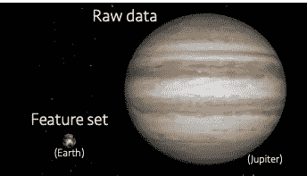
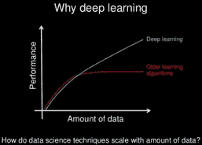
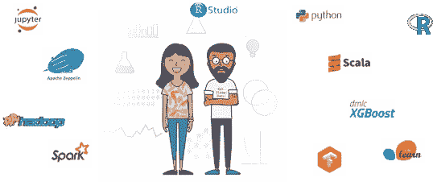

# 机器学习:从企业中吸取的教训

> 原文：<https://towardsdatascience.com/machine-learning-lessons-learned-from-the-enterprise-d8588f3d3060?source=collection_archive---------15----------------------->

Photo by IBM

训练机器学习(ML)模型的纯学术练习与构建真实企业问题的端到端数据科学解决方案之间存在巨大差异。这篇文章总结了我们的团队在与来自不同行业的数十家企业客户打交道的两年中所学到的经验，这些行业包括制造、金融服务、零售、娱乐和医疗保健等。企业面临的最常见的 ML 问题是什么？训练一个 ML 模型之外还有什么？如何解决数据准备？如何扩展到大型数据集？为什么特征工程如此重要？如何在生产中从一个模型变成一个完全有能力的系统？如果每个数据科学工具都是开源的，我还需要一个数据科学平台吗？这些是将要解决的一些问题，通过具体的行业示例揭示了一些挑战、陷阱和最佳实践。

# 0。ML 不仅仅是训练模特

我意识到这是一个普遍的误解。当我采访有抱负的数据科学家时，我通常会问:

> “假设给你一个具有某些特征的数据集，目标是预测某个变量，你会怎么做？”

令我沮丧的是，他们的回答通常是这样的:

> “我会将数据集分成训练/测试，运行逻辑回归、随机森林、SVM、深度学习、XGBoost……(以及其他一些闻所未闻的算法)，然后计算精度、召回率、F1 分数……(以及其他一些闻所未闻的指标)，最终选择最佳模型”。

但是，我问他们:

> “你看过数据了吗？如果你有缺失值怎么办？如果你有错误的值/坏的数据怎么办？你如何映射你的分类变量？你是怎么做特征工程的？”

在[这篇文章](/seven-steps-to-machine-learning-afb9f71f2a97)中，我回顾了成功创建端到端机器学习系统所需的七个步骤，包括*数据收集、数据监管、数据探索、特征提取、模型训练、评估、*和*部署。*

# **1。给我一些数据！**

作为数据科学家，*数据*显然是我们的主要资源。但有时，即使是获取数据也很困难，数据科学团队可能需要几周甚至几个月的时间才能获得正确的数据资产。一些挑战包括:

*   **访问:**大多数企业数据都非常敏感，尤其是在涉及政府、医疗保健和金融行业时。就共享数据资产而言，保密协议(NDA)是标准程序。
*   **数据分散:**数据分散在组织内的不同单位，需要得到不同方面的批准，这种情况并不少见。
*   **专业知识:**访问数据通常是不够的，因为可能有太多的来源，只有*的主题专家* (SME)知道如何浏览数据湖，并为数据科学团队提供正确的数据资产。中小型企业也可能成为数据科学项目的瓶颈，因为他们通常忙于核心企业运营。
*   **隐私:** *混淆*和*匿名*已经成为它们自己的研究领域，并且在处理敏感数据时必不可少。
*   **标签:**拥有基础事实或*标签*通常是有帮助的，因为它允许应用广泛的监督学习算法。然而，在某些情况下，标记数据可能过于昂贵，或者由于法律限制，标签可能不可用。像*聚类*这样的无监督方法在这些情况下很有用。
*   **数据生成器:**当数据或标签不可用时，另一种方法是模拟它们。在实现数据生成器时，了解一些关于数据模式、数字变量的概率分布和名义变量的类别分布的信息是很有用的。如果数据是非结构化的， [Tumblr](http://www.tumblr.com) 是标签图片的绝佳来源，而 [Twitter](http://www.twitter.com) 可能是自由文本的绝佳来源。Kaggle 还提供许多领域和行业的各种数据集和解决方案。

# **2。大数据往往没那么大**

这是一个有争议的问题，尤其是在过去十年大数据供应商大肆宣传，强调可扩展性和性能的必要性之后。尽管如此，我们需要区分*原始数据*(即所有可能与手头问题相关或不相关的部分)和*特征集*(即 ML 算法的输入矩阵)。从原始数据到特性集的过程称为*数据准备*，通常包括:

1.  丢弃无效/不完整/脏的数据，根据我们的经验，这些数据可能多达记录的一半。
2.  聚合一个或多个数据集，包括连接和组聚合器等操作。
3.  特征选择/提取，例如，移除可能不相关的特征，如唯一 ID，并应用其他维度缩减技术，如*主成分分析* (PCA)。
4.  使用稀疏数据表示或特征散列来减少具有许多零值的数据集的内存占用。

在所有的数据准备步骤完成后，不难意识到最终的特征集——将是机器学习模型的输入——将会小得多；而且，内存框架如 *R* 或 *scikit-learn* 足以训练模型的情况并不少见。在特征集非常庞大的情况下，像 Apache Spark 这样的大数据工具会派上用场，但它们可能只有有限的算法集可用。

# 3.你这肮脏的数据！

Data are often dirty

是的，我最好告诉你一些你不知道的事情，但是我怎么强调都不为过。数据是脏的。在我们的大多数项目中，客户都自豪而兴奋地谈论他们的*数据湖*，他们的数据湖有多美，以及他们迫不及待地想从中获得多少见解。所以，作为数据科学家，这变成了我们的大脑图像:

尽管如此，当他们真正分享他们的数据时，它实际上看起来更像这样:

这就是像 Apache Spark 这样的可扩展框架至关重要的地方，因为所有的数据监管转换都需要在整个原始数据上执行。一些典型的策展任务是:

*   **异常值检测:**负年龄、浮点邮政编码或信用评分为零只是无效数据的几个例子。不更正这些值可能会在训练模型时引入高偏差。
*   **缺失/不正确的值插补:**解决不正确/缺失值的明显方法是简单地丢弃它们。另一种方法是*插补*，即用相应属性的*平均值*、*中值*或*模式*替换缺失/错误值。另一种选择是*插值*，即建立一个模型来预测缺失值的属性。最后，领域知识也可以用于插补。假设我们正在处理*患者*的数据，并且有一个属性表明患者是否患有癌症。如果缺少这样的信息，可以查看*预约*数据集，并找出患者是否与肿瘤学家有任何预约。
*   **虚拟编码和特征散列:**这有助于将分类数据转化为数字，尤其是对于基于系数的算法。假设有一个属性 *state* 表示美国的州(例如 *FL* ， *CA* ， *AZ* )。映射 *FL* 到 1， *CA* 到 2， *AZ* 到 3 引入了一个感测顺序和幅度，意味着 *AZ* 将大于 *FL* ，CA 将是 *FL* 的两倍。*一次性编码—* 也称为*虚拟编码—* 通过将一个分类列映射到多个二进制列来解决这个问题，每个二进制列对应一个类别值。
*   **缩放:**当特征处于不同的缩放比例时，基于系数的算法会出现偏差。比方说*年龄*在【0，100】以内以年为单位，而*薪水*在【0，100，000】以内以美元为单位。优化算法可以向*薪金、*分配更多的权重，因为它具有更高的绝对幅度。因此，标准化通常是可取的，常见的方法包括 *z 评分*或*标准化*(当数据正常时)和*最小-最大*特征缩放。
*   **宁滨:**将一个实值列映射到不同的类别会很有用，例如，将一个回归问题转化为一个分类问题。假设您对预测以分钟为单位的航班到达延迟感兴趣。另一种方法是预测航班是提前*、*准时*还是晚点*，*为每个类别定义范围。*

# *4.这都是关于特征工程的*

**

*简而言之，*特征*是 ML 算法将要学习的特征。正如预期的那样，噪声或不相关的特征会影响模型的质量，因此拥有良好的特征至关重要。特征工程的一些策略是:*

*   *定义你想预测什么。每个*实例*代表什么？一个顾客？一笔交易？一个病人？一张票？确保功能集的每一行都对应于一个实例。*
*   *避免唯一的 id。它们不仅在大多数情况下不相关，而且会导致严重的*过拟合*，尤其是在应用 XGBoost 等算法时。*
*   *利用领域知识衍生出有助于衡量成功/失败的新特性。*医院就诊*的*号*可能是*患者风险的一个指标；*过去*个月*的*对外交易*的*总额*可能是*欺诈*的指标；*要求贷款金额*与*年收入*的比例*可能是*信用风险*的一个指标。**
*   *使用自然语言处理技术从非结构化自由文本中获取特征。例如 LDA、TF-IDF、 *word2vec* 和 *doc2vec* 。*
*   *如果有非常多的特征，使用降维，例如 PCA 和 *t 分布随机邻居嵌入* (t-SNE)。*

# *5.异常检测无处不在*

**

*Photo by feature.fm.*

*如果我要在企业中挑选一个最常见的 ML 用例，那就是异常检测。无论我们指的是*欺诈检测、生产测试、客户流失、患者风险、客户违约、系统崩溃预测、*等。，问题永远是:*我们能大海捞针吗？*这引出了我们的下一个话题，与不平衡数据集有关。*

*一些常见的异常检测算法有:*

1.  **自动编码器**
2.  **单类分类*算法，如*单类 SVM* 。*
3.  **置信区间**
4.  **聚类**
5.  **分类*使用*过采样*和*欠采样。**

# *6.数据经常是不平衡的*

**

*Unbalanced data*

*假设您有一个带有标签的信用卡交易的数据集。其中 0.1%的交易被证明是欺诈性的，而 99.9%的交易是正常的。如果我们创造一个模型，说没有欺诈，猜猜会发生什么？该模型将在 99.9%的情况下给出正确答案，因此其准确性将为 99.9%！这种常见的*精度谬误*可以通过考虑*精度*和*召回*等不同的度量来避免。这些是根据*真阳性* (TP) *、真阴性* (TN) *、假阳性* (FP) *、*和*假阴性* (FN)来定义的:*

*TP =正确预测为*阳性*的*实例总数**

*TN =正确预测为*阴性*的实例总数*

**FP =被错误地预测为*阳性*的实例总数**

***FN =被错误预测为*负*的*实例总数****

**在一个典型的异常检测场景中，我们的目标是最大限度地减少*假阴性——例如，*忽略欺诈性交易，没有识别出有缺陷的芯片，或者将生病的病人诊断为健康的——同时不招致大量的*假阳性*。**

**精度= TP/(TP+FP)**

**召回= TP/(TP+FN)**

**注意精确惩罚 FP，而回忆惩罚 FN。从不预测欺诈的模型将具有零召回率和未定义的精确度。相反，总是预测欺诈的模型将具有 100%的召回率，但精确度非常低，这是由于大量的假阳性。**

**我强烈反对在异常检测中使用*接收器工作特性* (ROC)曲线。这是因为 ROC 曲线所依赖的*假阳性率* (FPR)严重偏向于数据集中的阴性实例数量(即 FP+TN)，导致即使存在大量 FP，FPR 也可能很小。**

**FPR = FP/(FP + TN)**

**相反，*错误发现率* (FDR)有助于更好地理解 FP 在异常检测模型中的影响:**

**FDR = 1 -精度= FP/(TP+FP)**

# ****7。不要预测。告诉我为什么！****

**我遇到过几个项目，它们的目标不是创建一个实时预测的模型，而是解释一个假设或分析哪些因素解释了某种行为——鉴于大多数机器学习算法是基于相关性而不是因果关系，这一点要持保留态度。一些例子是:**

*   **哪些因素使病人陷入高风险？**
*   **哪种药物对验血结果的影响最大？**
*   **哪些保险计划参数值使利润最大化？**
*   **客户的哪些特征使他更容易拖欠？**
*   **搅拌者的特征是什么？**

**解决这些问题的一种方法是计算*特征重要性，*特征重要性由算法给出，如*随机森林*、*决策树*和 *XGBoost。*此外，诸如莱姆或 SHAP 等算法有助于解释模型和预测，即使它们来自神经网络或其他“黑箱”模型。**

# **8.调整你的超参数**

**机器学习算法既有*参数*又有*超参数*。它们的不同之处在于，前者是由算法直接估计的——例如，回归的*系数*或神经网络的*权重*——而后者不是并且需要由用户设置——例如，随机森林中的*树的数量*，神经网络中的*正则化*方法，或者支持向量机(SVM)分类器的*核*函数。**

**为您的 ML 模型设置正确的超参数值可以产生巨大的差异。例如，SVM 的线性核无法对不可线性分离的数据进行分类。如果最大深度或分割数量设置得太高，基于树的分类器可能会过拟合，或者如果最大特征数量设置得太低，基于树的分类器可能会欠拟合。**

**寻找超参数的最佳值是一个非常复杂的优化问题。一些提示是:**

1.  **了解超参数的优先级。在随机森林中，树的数量和*最大深度*可能是最相关的，而对于深度学习，*学习速率*和*层数*可能是优先的。**
2.  **使用一种搜索策略: [*网格搜索*](https://www.coursera.org/lecture/data-analysis-with-python/grid-search-e4fyg) 或 [*随机搜索*](http://www.jmlr.org/papers/volume13/bergstra12a/bergstra12a.pdf) *。*后者优先。**
3.  **使用 [*交叉验证*](https://www.kaggle.com/dansbecker/cross-validation) :设置一个单独的测试集，将剩余的数据分成 *k* 个折叠，迭代 *k* 次，每个折叠用于*验证*(即调整超参数)，剩余的用于*训练*。最后，计算所有折叠的平均质量度量。**

# **9.深度学习:灵丹妙药？**

**在过去几年中，*深度学习*已经成为研究和行业发展的巨大焦点。诸如 *TensorFlow* 、 *Keras* 和 *Caffe* 等框架现在能够通过高级 API 快速实现复杂的神经网络。应用不计其数，包括计算机视觉、聊天机器人、自动驾驶汽车、机器翻译，甚至游戏——击败了世界上最顶尖的围棋人类棋手和最顶尖的国际象棋计算机！**

**深度学习背后的一个主要前提是它能够随着数据量的增加而持续学习，这在大数据时代尤其有用(见下图)。这与硬件(即 GPU)的最新发展相结合，允许执行大型深度学习作业，这在过去由于资源限制而被禁止。**

****

**Picture by machinelearningmastery.com**

**那么……这是否意味着 DL 永远是解决任何机器学习问题的方法？不完全是。原因如下:**

## **简单**

**神经网络模型的结果非常依赖于网络的结构和超参数。在大多数情况下，您需要一些网络架构方面的专业知识来正确地调整模型。在这方面也有一个重要的试错成分。**

## **可解释性**

**正如我们前面看到的，许多用例不仅需要预测，还需要解释预测背后的原因:*为什么贷款被拒绝？*或*为什么保险价格会上涨？*虽然基于树和基于系数的算法直接考虑到了可解释性，但神经网络并非如此。在[这篇文章](https://ieeexplore.ieee.org/document/8397411)中，介绍了一些解释深度学习模型的技术。**

## **质量**

**根据我们的经验，对于大多数结构化数据集，神经网络模型的质量不一定比随机森林和 XGBoost 好。当涉及到非结构化数据时，即图像、文本或音频时，DL 实际上表现出色。底线:不要用猎枪打死一只苍蝇。像 Random Forest 和 XGBoost 这样的 ML 算法对于大多数结构化的监督问题来说已经足够了，并且更容易调整、运行和解释。让 DL 在非结构化数据问题或者强化学习中自己说话。**

# **10。不要让数据泄露**

**在做一个预测航班到达延误的项目时，我意识到当我使用数据集中所有可用的特征时，我的模型突然达到了 99%的准确率。我悲哀地意识到我在用*出发延迟*作为*到达延迟的预测器。*这是一个典型的*数据泄漏*的例子，当用于创建模型的任何特征在预测时不可用或未知时，就会发生这种情况。小心，伙计们！**

****

**Photo by the Kini group.**

# **11.开源给了我一切。为什么我需要一个平台？**

**构建机器学习模型从未如此简单。几行 R 或 Python 代码就足够了，网上有很多资源和教程甚至可以训练一个复杂的神经网络。现在，对于数据准备，Apache Spark 非常有用，甚至可以扩展到大型数据集。最后，像 *docker* 和 *plumbr* 这样的工具通过 HTTP 请求简化了机器学习模型的部署。因此，看起来人们可以完全使用开源栈来构建一个端到端的 ML 系统。对吗？**

**嗯，对于构建概念证明来说，这可能是真的。一个正在写论文的研究生肯定会受到开源软件的保护。然而，对于企业来说，情况有所不同。**

****

**不要误解我。我本人是开源的忠实粉丝，有许多奇妙的工具，但同时，也有相当多的差距。以下是企业选择数据科学平台的一些原因:**

****a .开源集成:**几分钟启动运行，支持多种环境，透明版本更新。**

****b .协作:**轻松共享数据集、数据连接、代码、模型、环境、部署。**

****c .治理和安全:**不仅针对数据，还针对所有分析资产。**

****d .模型管理、部署和再培训。****

****f .模型偏差:**检测并纠正因性别或年龄而产生偏差的模型。**

****e .辅助数据管理:**解决数据科学中最棘手任务的可视化工具。**

****g . GPU:**深度学习框架(如 TensorFlow)的最佳性能的即时供应和配置。**

****h .无代码建模:**针对统计人员、主题专家，甚至不编码但想可视化建模的高管。**

**寻找数据科学平台？考虑免费试用[沃森工作室](https://www.ibm.com/cloud/watson-studio)！**

****关于作者****

> **scar D. Lara Yejas 是高级数据科学家，也是 IBM 机器学习中心的创始成员之一。他与世界上一些最大的企业密切合作，将 ML 应用于他们的特定用例，包括医疗保健、金融、制造、政府和零售。他还为 IBM 大数据产品组合做出了贡献，特别是在大规模机器学习领域，是 Apache Spark 和 Apache SystemML 的贡献者。**
> 
> **scar 拥有南佛罗里达大学的计算机科学和工程博士学位。他是《人类活动识别:使用可穿戴传感器和智能手机》一书的作者，并发表了大量关于大数据、机器学习、以人为中心的传感和组合优化的研究/技术论文。**