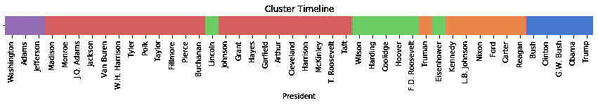

# 机器学习:林肯领先于他的时代

> 原文：<https://towardsdatascience.com/machine-learning-lincoln-was-ahead-of-his-time-134fcd7f0590?source=collection_archive---------39----------------------->

Photo by [Jp Valery](https://unsplash.com/@jpvalery?utm_source=unsplash&utm_medium=referral&utm_content=creditCopyText) on [Unsplash](https://unsplash.com/s/photos/president?utm_source=unsplash&utm_medium=referral&utm_content=creditCopyText)

在第 45 届总统任期内，有很多关于什么是总统语言的讨论。但它并不总是“[假新闻](https://twitter.com/realdonaldtrump/status/1184579045138337794?lang=en)、“[憎恨者和失败者](https://twitter.com/realdonaldtrump/status/377947866641485824?lang=en)、“[科菲](https://twitter.com/realdonaldtrump/status/869858333477523458?lang=en)”美国有着悠久的总统语言遗产，机器学习可以帮助我们获得对这个非常具有历史意义的话题的新见解。

在过去的一个月左右的时间里，我一直在做一个[项目](https://github.com/ebpalmer17/capstone-presidential-language)，目的是利用数据科学来学习总统语言。在我到目前为止的探索中，我比较并跟踪了单词的用法，创建了总统的聚类，按总统对演讲摘录进行了分类，并根据上下文生成了缺失的单词。在这篇文章中，我想分享我根据单词选择对总统进行分类的发现。

我的完整数据集包括所有 44 位美国总统的所有官方演讲。总的来说，在 223 年的 945 次演讲中有将近 350 万个单词。(数据来源于弗吉尼亚大学米勒中心语法实验室的总统演讲语料库和总统演讲网站。)

我组织了一个数据框架，其中有 44 行，每行包含一个字符串，包含了每位总统所有演讲中的所有单词。由于聚类是一种无监督的学习方法，所以我剥离了标签的数据。从这一点出发，我对数据应用 CountVectorizer，对其进行缩放，然后将其输入 k-means 聚类模型。对于聚类模型，我选择 k=5 个聚类，这产生了最好的[轮廓分数](https://en.wikipedia.org/wiki/Silhouette_(clustering))。

结果令人兴奋！该模型按时间顺序将总统分组。这一发现非同寻常，因为该模型的唯一输入是每位总统演讲中使用的词汇，而不是任何关于日期的信息。

在分类时间线中，每个分类都由单词选择最相关的总统组成，用不同的颜色表示。在左边，紫色集群包含开国元勋，在右边，蓝色集群包含现代总统。绿色聚类大致从一战到二战，橙色聚类包含从二战到几十年前的总统。红色星团的时间跨度最长，超过 100 年。

随着时间的推移，集群几乎完全不间断地运行——只有一个主要的例外:林肯。当他的绿色方块在红色的海洋中脱颖而出时，聚类模型断言林肯的用词选择使他从他那个时代的其他总统中脱颖而出。

林肯发表了一些美国最令人难忘的演讲，甚至机器学习也同意林肯走在了他的时代的前面！

要了解更多关于机器学习和总统语言的见解，请访问我的 GitHub 页面:

 [## ebpalmer 17/capstone-总统语言

### 机器学习和总统语言:(1)用可视化和假设得出关于单词使用的结论…

github.com](https://github.com/ebpalmer17/capstone-presidential-language)