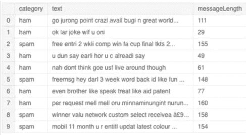
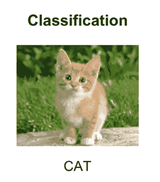
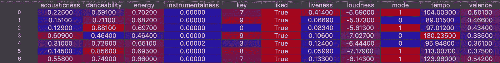
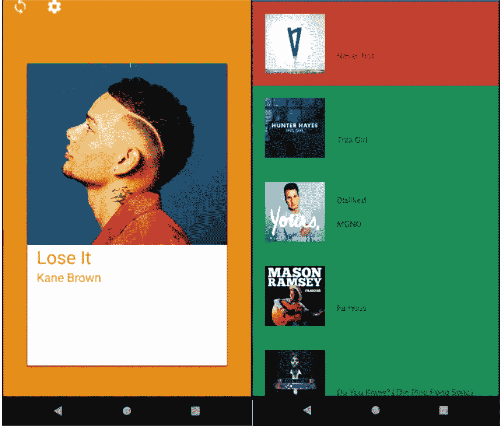
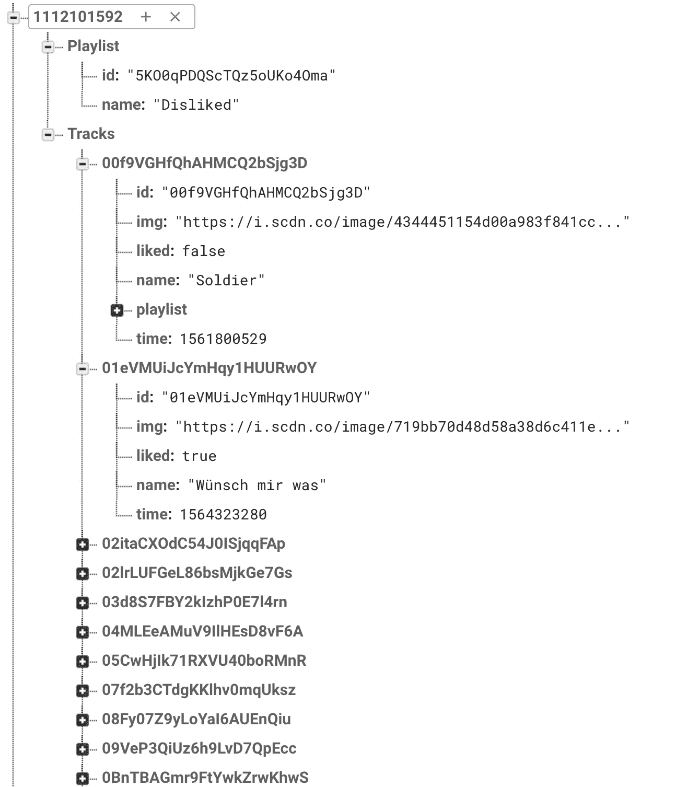

# 机器学习:让二进制注释不那么无聊

> 原文：<https://towardsdatascience.com/machine-learning-making-binary-annotations-a-little-less-boring-51537497af3b?source=collection_archive---------39----------------------->

# 概观

对于一个大学项目，我正在开发一个基于 Spotify API 的音乐推荐分类器。**广大的想法是根据用户个人喜欢或不喜欢的歌曲，根据歌曲的音乐成分(速度、调性、工具性等等)，向用户推荐新的音乐。**

数据集的准备通常是任何机器学习项目中最耗时的部分。这通常包括收集数据、清理数据、可选地标记数据、特征提取、将数据分成测试和训练数据。在本帖中，我们将讨论标签部分。

# 什么是标注(注解)？

标记或注释是评估单个数据点并为机器学习模型学习提供基础事实的行为。它主要用于监督机器学习应用。如果你有一个动物图片的数据集，你想让你的模型学会识别猫。然后你必须给所有的图片贴上相应的动物标签。如果只有两个可用的类，它被称为**二元分类**。例如，如果您有一个垃圾邮件过滤器模型，并且您想要决定它是垃圾邮件(1)还是垃圾邮件(0)。

永远不要低估正确标注数据集的重要性。**如果你为你的机器学习算法提供的基本事实是错误的，你不能指望该算法胜过人类注释者。**因此，您在注释过程早期犯的错误将会在以后的模型评估中被发现。

Annotation of a email dataset, weather it’s spam or not (ham)

Image labeling of a cute cat :D

在我的例子中，我必须给我的数据集贴上标签，决定我是喜欢这首歌(1)还是不喜欢这首歌(0)。因此，我的数据集将由不同的特征(能量、可跳舞性等)组成。)和我手动赋给数据集的标签 **(liked={True，False})** 。

The first 5 rows of my dataset containing the different features

# 应用程序

现在，为了让这个无聊的任务变得有趣一点，我开发了一个用于二进制分类的 android 应用程序。原因是我无法激励自己坐下来给最近听的歌曲贴上标签。有了这个应用程序，当我有一些空闲时间可以消磨的时候，比如我在排队，或者在公共交通工具上，我就可以给一些歌曲贴上标签。这不仅让它变得更有趣，而且效率更高，我能够在更短的时间内标记更大的数据集。

# 偷窃

那么它是如何工作的呢？首先，你必须用你的 Spotify 账户登录，然后应用程序会调出你最近听过的 30 首歌曲，并以卡片形式显示出来。从这一点来看，它与 Tinder**非常相似**如果你向左刷卡，你不喜欢这首歌，如果你向右刷卡，你喜欢它。如果你按下该卡，它将在你的手机上启动 Spotify 并播放歌曲(仅在安装了 Spotify 的情况下有效)。我提供这个功能是因为我总是忘记这首歌听起来是什么样的，所以我可以很快地检查一下。

此外，您还有一个概览，在这里您可以看到您滑动的歌曲，并通过点击相应的歌曲来更改歌曲的当前状态(喜欢或不喜欢)。

Swipe screen (LEFT) and the overview screen (RIGHT)

还有一个屏幕，你可以选择你的 Spotify 播放列表。向左滑动的歌曲将自动添加到您的播放列表中。我删除了这个功能，因为我不确定我是否想在应用程序中使用这个功能。现在它真正关注的是标签。

# Spotify API

我使用 Spotify API，因为我认为他们对不同歌曲的音频分析非常准确，还因为我每天都使用 Spotify，觉得用它来玩真的很有趣。稍后在我的机器学习项目中，我将使用另一个名为 [**MusicBrainz**](https://musicbrainz.org/) 的音乐数据库。但是我会在另一篇文章中讨论这个问题。

要使用我的应用程序，**你需要一个 Spotify 账户**来登录，因为我们不能对 API 进行未授权的调用。此外，如果我们不能从你的帐户中取出你最后听的歌曲来滑动，这就没有意义了。

我认为这个 API 使用起来非常简单有趣。你真的可以摆弄数据库和音乐。

为了试验一下，我在我的应用程序中添加了一些额外的特性。如果您向右或向左推送，您可以自动将它们添加到播放列表(左)或资料库中您喜欢的歌曲(右)。因此，该应用程序还可以用来快速将歌曲添加到播放列表中，甚至通过概览屏幕删除它们。你可以在下面找到关于 Spotify API 的更多信息

 [## 主页|面向开发者的 Spotify

### 音乐，遇见代码。简单和高级应用程序的强大 API、SDK 和小部件。

developer.spotify.com](https://developer.spotify.com/) 

# 作为后端的 Firebase

现在，如果你刷一首歌，数据去了哪里？我使用 firebase 作为应用程序的后端，因为它非常简单，并且不需要很多时间来建立数据库。

A snippet of the firebase database structure I’m using

如果你不知道 Firebase 实时数据库，它基本上是一个 NoSQL 云数据库。数据存储为 JSON，并实时同步到每个连接的客户端。目前，我只保存最相关的数据，即 Spotify 曲目 ID、我是否喜欢它、我滑动歌曲的时间以及一些附加信息，如名称和在应用程序中显示的图像。否则，我不得不再次调用 Spotify API，我认为这样做会更有办法。

# 摘要

对我来说，这是一个有趣的小项目，让我更熟悉 Spotify API，我后来在我的机器学习项目中使用了它。

该应用程序可以进一步开发，使通用标签或二进制分类成为可能。目前，用例非常具体和狭窄。

此外，该应用程序可以开发成类似于 Spotify 播放列表添加应用程序的东西，在那里您可以操作您的播放列表，并快速将最近收听的歌曲添加到播放列表中。

这篇文章介绍了我在 Spotify API 上的标签应用。在下一篇博文中，我们将讨论技术问题，我将向您详细展示我是如何开发该应用程序的，以及应该避免的陷阱。

我没有在 Appstore 或其他地方发布应用程序，因为我认为对公众来说，用例太窄了。如果你有任何可以让更多人从中受益的用例的想法，我会考虑发表它。所以，如果你有任何想法让我知道。

此外，如果你愿意通过提供你自己的标记数据集来帮助我改进我的机器学习模型，并在应用程序完成后尽快获得个性化推荐。请与我联系，我很乐意向你发送申请，这样你就可以开始刷卡！

如果你想创建自己的分类应用，我的项目在我的 [**Github**](https://github.com/Hyferion/SpotifyRecLabelingAndroid) 上是公开的。放心用吧！

 [## hyferion/SpotifyRecLabelingAndroid

### 这个应用程序是基于机器学习的应用程序的一部分，用于歌曲的分类和制作…

github.com](https://github.com/Hyferion/SpotifyRecLabelingAndroid)