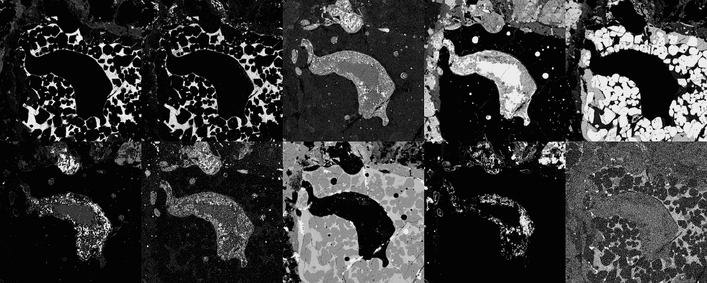
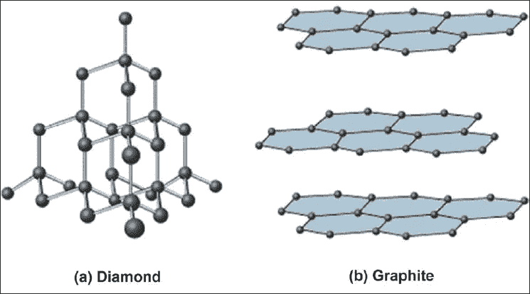
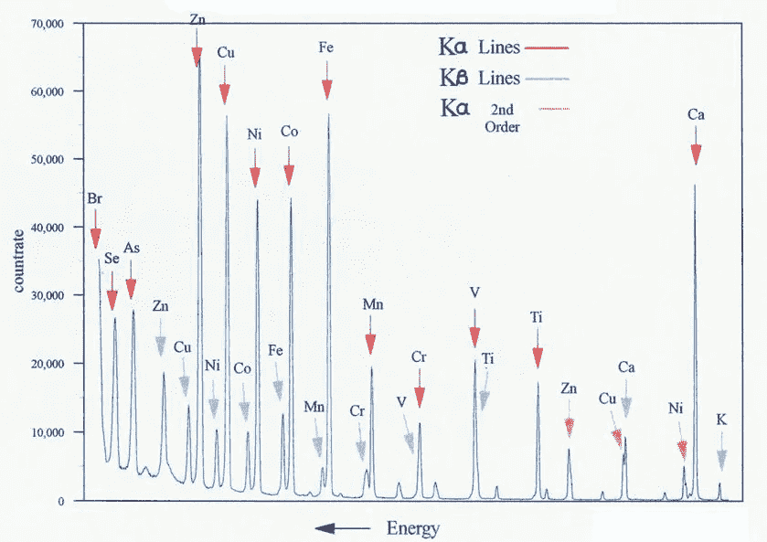
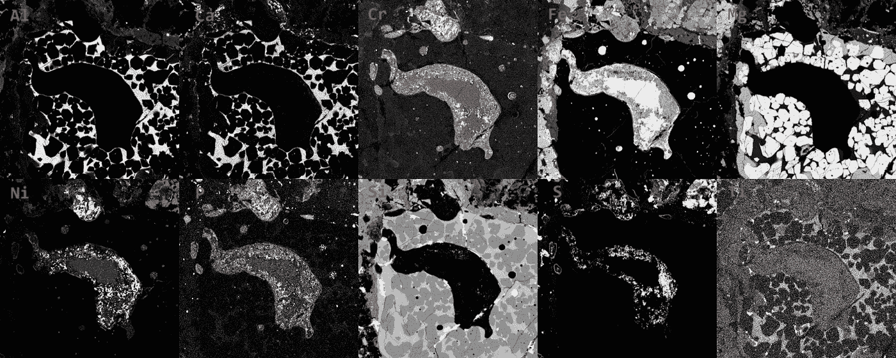
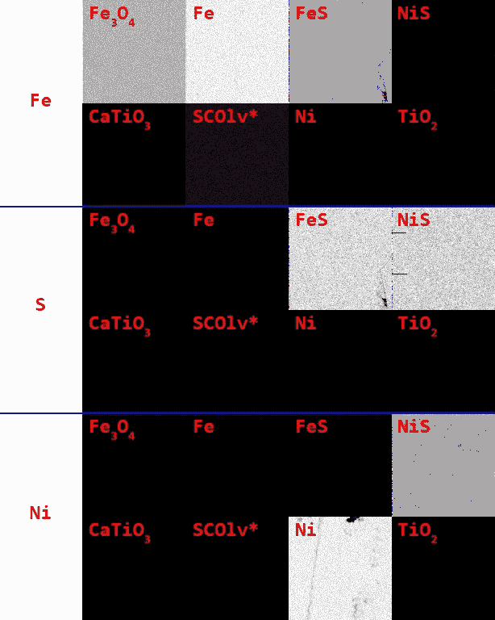
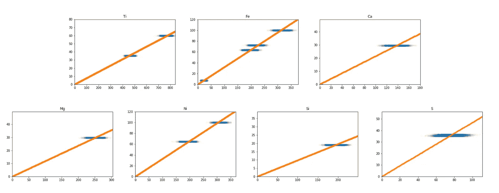
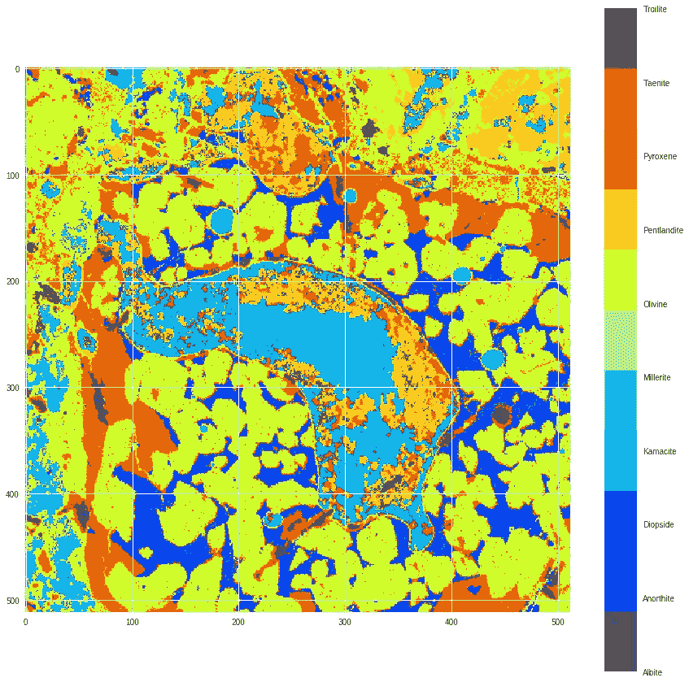
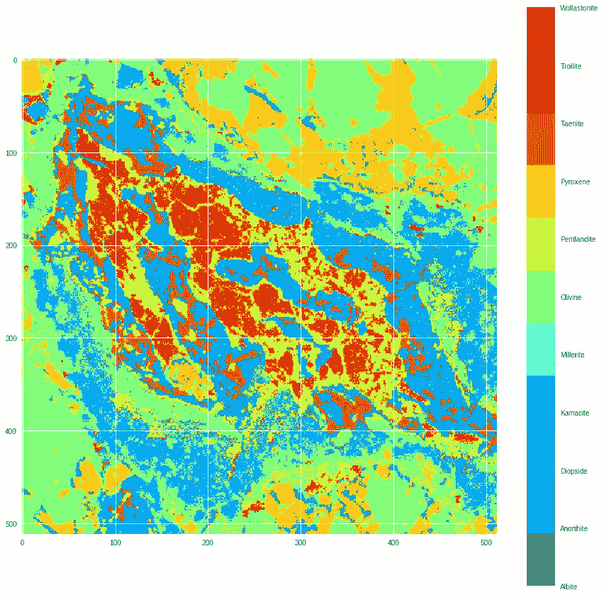

# 利用机器学习识别陨石中的矿物

> 原文：<https://towardsdatascience.com/machine-learning-meteorites-fcd8f6859ed7?source=collection_archive---------16----------------------->

上周末，美国自然历史博物馆(AMNH)举办了第五届年度黑客马拉松。今年的主题是“黑掉太阳系”我的团队致力于一个项目，以确定和绘制陨石的矿物成分。

了解陨石的矿物成分可以让我们了解太阳系。当它们来自行星际天体(如小行星)时，我们可以了解 45 亿年前太阳系是如何形成的。陨石甚至可以来自其他星球，这给了我们一种从几百万公里外研究它们的方法。

# 化学 101

原子是构成物质的微小物体。原子由中心的质子和中子组成，周围是电子。原子核中质子的数量决定了那个原子是什么 T2 元素。比如最轻的元素氢，有 1 个质子；氧有 8 个，铁有 26 个。

*分子*由多个原子结合在一起组成。例如，一个水分子由两个氢原子和一个氧原子组成。这可以写成 H₂O.的化学式

*矿物*是一组固体分子，如钻石、石英或黄玉。原子可以以无数种方式聚集在一起，形成非常不同的矿物。已知的元素只有 118 种，但它们合在一起构成了 [3800 种矿物](http://www.minsocam.org/MSA/collectors_corner/faq/faqmingen.htm)。

有些矿物配方可能相当复杂，例如黄玉:al₂sio₄(oh,f)₂——2 个铝、1 个硅、4 个氧和 2 个氧+氢或 2 个氟。而其他人的公式可能非常简单。钻石的分子式是 C——仅仅是碳。但是，原子的结构也很重要。钻石和石墨(你铅笔里的东西)都是由碳组成的，但它们如此不同是因为碳原子以不同的方式结合。

The chemical structure of diamonds vs graphite. ([http://www.jidonline.com/viewimage.asp?img=JInterdiscipDentistry_2011_1_2_93_85026_f3.jpg](http://www.jidonline.com/viewimage.asp?img=JInterdiscipDentistry_2011_1_2_93_85026_f3.jpg))

# 陨石是如何被研究的

科学家使用电子微探针(EMP)扫描陨石。电磁脉冲向陨石发射一束电子。当电子束与陨石中的原子碰撞时，原子会发出 x 射线。每个*元件*具有不同的特征频率。

A graph of characteristic frequencies of different elements. ([https://commons.wikimedia.org/wiki/File:XRFScan.jpg](https://commons.wikimedia.org/wiki/File:XRFScan.jpg))

在开始扫描之前，科学家们设置电磁脉冲来检测一组特定的元素。当所需元素的特征 x 射线发射时，探测器记录强度。EMP 产生一系列灰度图像，每个元素一个，其中每个像素代表该元素在该位置的比例。

The 10 images produced by the EMP when scanning a meteorite for 10 different elements. Brighter means that more of that element is present at that location. The 10 elements are: Aluminum (Al), Calcium (Ca), Chromium (Cr), Iron (Fe), Magnesium (Mg), Nickel (Ni), Phosphorus (P), Silicon (Si), Sulfur (S) and Titanium (Ti).

这可以告诉我们存在什么元素。**但是我们如何确定矿物质呢？**

来自不同元素的 x 射线的相对强度对应于该元素在不同矿物中的相对比例。一种元素存在的越多，撞击该元素原子的电子就越多，从而发射出特有的 x 射线。例如，矿物硫铁矿大约 2/3 是铁，1/3 是硫，这意味着我们预计发射的 x 射线的 2/3 是铁的 x 射线特征，1/3 是硫的特征。

但是有几个问题使这变得困难。首先，结果可能非常嘈杂，这意味着 EMP 很少会给出与矿物中理论元素比例相匹配的结果。第二，每个元件的传感器的比例不同。例如，铁读数 400 可能意味着 50%的铁，而硫读数 200 可能意味着 100%的硫。

为了控制这些，陨石和“标准”一起被扫描。标准是已知的矿物，被扫描以了解电磁脉冲的行为。我们有 8 种标准矿物，排列成 4x2 网格，如下图所示。每个方块都标有放在那里的已知矿物。顶部是铁(Fe)扫描的图像，中间是硫(S)扫描的图像，底部是镍(Ni)扫描的图像。

Scans from 3 of the 10 elements for the known standard minerals. Each square is the labeled with the known mineral that was placed there. The top is the image from the iron (Fe) scan, the middle is from the sulfur (S) scan and the bottom from the nickle (Ni) scan. *SCOlv stands for San Carlos Olivine, which doesn’t have one distinct chemical formula.

这应该给你一种感觉，我们如何从矿物的组成元素中找出矿物。例如，只有铁的正方形在铁扫描中是亮的，而在其余时间是暗的，这表明那里只存在铁。Fe₃O4 和 FeS 在 Fe 扫描中看起来都很相似，但是 FeS 在 s 扫描中也会变亮。同样，FeS 和 NiS 在 S 扫描中看起来相似，但是 Ni 扫描可以帮助区分它们。还要注意图像中的所有斑点。即使我们正在扫描已知的矿物，他们也不会给出完全一致的读数。当我们试图识别陨石中的未知矿物时，我们必须记住这一点。

# 机器学习

现在我们有了尝试解决这个问题所需的所有要素。概括地说，我们的最终目标是识别陨石内部的**矿物**。为了做到这一点，我们在电子探针中扫描陨石，这可以告诉我们陨石中每个位置的*元素*的相对比例。与此同时，我们扫描了一组称为标准的已知矿物，这样我们就可以正确地解释电磁脉冲的结果。

我的目标是为我们的陨石中的不明矿物创建一个分类器，但是到目前为止，我们只有标记为*的*数据作为标准。我们不能直接从标准中建立一个分类器，因为如果陨石含有标准中没有的矿物，我们就不能对它进行正确的分类。但是，如果我们猜测陨石中可能有什么矿物，我们可以模拟这些矿物(目标矿物)，并在此基础上建立一个分类器。这些标准可以帮助我们进行模拟。

第一步是使用标准来找到将元素的重量比例转换成 EMP 强度的系数。我们期望重量比例和强度之间的线性关系。例如，如果一种矿物含有 50%的铁，我们预计其强度是含有 25%铁的矿物的两倍。这意味着我们可以使用线性回归来找到系数。

下面显示了每个元素的回归结果。每个蓝色斑点来自不同的标准。理论上，每个蓝色斑点应该是一个点，但由于读数中的噪声，它们被拉长了。即使有噪声，你也可以看到一个相当清晰的线性关系。但是，在预期比例接近的情况下，例如在 Fe 图中，事情可能是不明确的。

The linear regression results for each element. The x-axis is the intensity from the EMP results and the y-axis is the theoretical weight-proportion of that element in the mineral.

我可以用这些结果来模拟我们要找的目标矿物。为了模拟一种矿物，我们计算每种矿物元素的理论重量比例，使用回归结果将它们转换为预期强度，并根据我们在标准中发现的噪声添加随机噪声。

我对每种目标矿物模拟了 10，000 次，并将样本分成 80%的训练集/20%的测试集。我在训练集上训练了一个随机森林分类器，得到的模型在测试集上达到了 96.8%的准确率。

# **结果**

将该模型应用于陨石扫描，结果如下:

The predicted mineral composition of a meteorite. Each color represents a different mineral.

在第二颗陨石中:

The predicted mineral composition of a meteorite. Each color represents a different mineral.

我们没有这些陨石的地面真相，所以我们不知道它有多准确。但是和我们一起工作的科学家说最初的结果是有希望的！

# 结论和后续步骤

这种方法的一个大问题是，它要求科学家提前知道他们在寻找什么矿物。因此，它在识别已知-未知方面似乎很有前途，但会对未知-未知给出错误的分类。

我的团队采用的另一种识别矿物的方法是用 [DBSCAN](https://en.wikipedia.org/wiki/DBSCAN) 进行无监督聚类。它不会告诉你具体是什么矿物，但它可以告诉你陨石中有类似元素成分的矿物，可能代表一种独特的矿物。我们认为可能有一种方法可以将这些方法结合起来，两全其美。

我们正在继续这项工作，并希望它不仅仅是一个有趣的黑客马拉松项目，并且[成为科学家工具箱](https://twitter.com/mik3caprio/status/1095105448980762624)中有用的一部分。

*我们所有的代码都可以在*[*github*](https://github.com/HackTheSolarSystem/MineralMapping)*上找到。我们仍在努力，所以事情可能会有所改变。*

*本页更详细的描述了原挑战:*[*https://github . com/amnh/HackTheSolarSystem/wiki/陨石-矿物-测绘*](https://github.com/amnh/HackTheSolarSystem/wiki/Meteorite-Mineral-Mapping)

*团队的其他成员包括:凯蒂·艾伯特、梅雷特·戈特舍、彼得·康、、塞西娜·巴比奇·莫罗和约翰·安德伍德。塞缪尔·阿尔珀特和玛丽娜·杰玛给了我们建议。感谢 Abigail Pope-Brooks 编辑这篇文章。*

*Cecina 还写了一篇关于周末的* [*博文*](https://babichmorrowc.github.io/post/2019-02-14-hackathon/) *。*